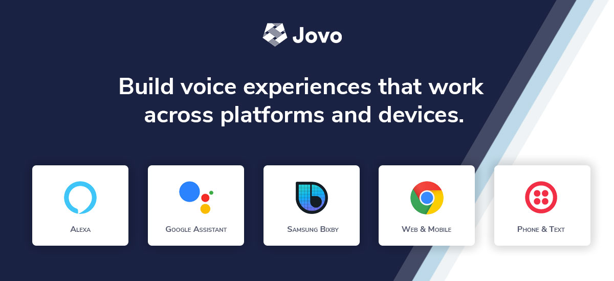

# Jovo Framework

> [**We're working heavily on Jovo `v4`! Check out the `v4dev` branch for more information**](https://github.com/jovotech/jovo-framework/tree/v4dev)

[](https://www.jovo.tech)

<p>
<a href="https://travis-ci.org/jovotech/jovo-framework" target="_blank"></a>
<a href="https://www.npmjs.com/package/jovo-framework" target="_blank"></a>      
<a href="./.github/CONTRIBUTING.md"></a>
<a href="https://opencollective.com/jovo-framework" target="_blank"></a>
<a href="https://twitter.com/intent/tweet?text=🔈 The Voice Layer. Build cross-platform voice apps for Alexa, Google Assistant, and more with @jovotech https://github.com/jovotech/jovo-framework/" target="_blank"></a>
</p>

## The Open Source Voice Layer: Build Voice Experiences for Alexa, Google Assistant, Samsung Bixby, Web Apps, and much more


```javascript
app.setHandler({
    LAUNCH() {
        return this.toIntent('HelloWorldIntent');
    },

    HelloWorldIntent() {
        this.ask('Hello World! What\'s your name?', 'Please tell me your name.');
    },

    MyNameIsIntent() {
        this.tell('Hey ' + this.$inputs.name.value + ', nice to meet you!');
    },
});
```

The main features of the Jovo ecosystem are:
* [**Jovo Framework**](https://www.jovo.tech): Build cross-platform apps for voice and chat
   * Build on top of platforms like [Alexa](https://www.jovo.tech/marketplace/jovo-platform-alexa), [Google Assistant](https://www.jovo.tech/marketplace/jovo-platform-googleassistant), [Samsung Bixby](https://www.jovo.tech/marketplace/jovo-platform-bixby), and [Facebook Messenger](https://www.jovo.tech/marketplace/jovo-platform-facebookmessenger)
   * Build voice-enabled apps for web and mobile
   * Build voice interactions into custom hardware like Raspberry Pi
* [**Jovo CLI**](https://www.jovo.tech/marketplace/jovo-cli): Create, build, and deploy Jovo projects (including [staging](https://www.jovo.tech/docs/staging))
* [**Jovo Marketplace**](https://www.jovo.tech/marketplace): Large variety of integrations like ASR, NLU, databases, analytics, CMS, and TTS
* [**Jovo Webhook**](https://www.jovo.tech/docs/webhook) and [**Jovo Debugger**](https://www.jovo.tech/marketplace/jovo-plugin-debugger) for efficient local development and debugging in the browser
* [**Jovo Language Model**](https://www.jovo.tech/docs/model): A consolidated language model that can be converted into Alexa Interaction Models and Dialogflow Agents

> 🚀 Join our newsletter for free courses on voice app development: www.jovo.tech/newsletter

## Table of Contents

* [Usage](#usage)
* [Benefits](#benefits)
* [Learn more](#learn-more)
* [Contributing](#contributing)

---
We're glad to be supported by respected companies and individuals in the voice-first industry. [See our Open Collective to learn more](https://opencollective.com/jovo-framework).

**Gold Sponsors**

<a href="https://opencollective.com/jovo-framework#section-contributors"></a>


**Silver Sponsors**

<a href="https://opencollective.com/jovo-framework#section-contributors"></a>


**Bronze Sponsors**

<a href="https://opencollective.com/jovo-framework#section-contributors"></a>


Find all supporters in our [`BACKERS.md`](./BACKERS.md) file.

> [Support Jovo on Open Collective](https://opencollective.com/jovo-framework)

---


## Usage

> Learn more in our [Quickstart Guide](https://www.jovo.tech/docs/quickstart).

Install the Jovo CLI:

```sh
$ npm install -g jovo-cli
```

Create a new Jovo project:

```sh
# Default: Create new JavaScript project
$ jovo new <directory>

# Alternative: Create new TypeScript project
$ jovo new <directory> --language typescript
```

Go into project directory and run the Jovo development server:

```sh
# Go into project directory (replace <directory> with your folder)
$ cd <directory>

# Run local development server
$ jovo run

# Press "." to open the Jovo Debugger
```


## Benefits

* Flexible: Easily extend the Jovo Framework with integrations and plugins. Learn more in the [Jovo Marketplace](https://www.jovo.tech/marketplace)
   * [Automatic Speech Recognition (ASR)](https://www.jovo.tech/marketplace/tag/asr)
   * [Natural Language Understanding (NLU)](https://www.jovo.tech/marketplace/tag/nlu)
   * [Databases](https://www.jovo.tech/marketplace/tag/databases)
   * [Monitoring & Analytics](https://www.jovo.tech/marketplace/tag/monitoring)
   * [Content Management](https://www.jovo.tech/marketplace/tag/cms)
   * [Text to Speech (TTS)](https://www.jovo.tech/marketplace/tag/tts)
* Starter friendly: [Templates](https://github.com/jovotech/jovo-templates) and [community support](https://community.jovo.tech/)
* Efficient: [Local development](https://www.jovo.tech/docs/local-development) and [staging](https://www.jovo.tech/docs/staging)
* Modular: Reusable [conversational components](https://www.jovo.tech/docs/components)
* Robust: [Unit testing](jovo.tech/docs/unit-testing) and [debugging](https://www.jovo.tech/docs/debugging) tools
* You're in full control: [Host](https://www.jovo.tech/docs/hosting) your app anywhere


## Learn more

* Jovo Docs (https://www.jovo.tech/docs/)
* Jovo Tutorials (https://www.jovo.tech/tutorials)
   * [Build an Alexa Skill in Node.js with Jovo](https://www.jovo.tech/tutorials/alexa-skill-tutorial-nodejs)
   * [Build a Google Action in Node.js with Jovo](https://www.jovo.tech/tutorials/google-action-tutorial-nodejs)
   * [Build your first Samsung Bixby Capsule with Jovo](https://www.jovo.tech/tutorials/samsung-bixby-hello-world)
   * [Build your first Twilio Autopilot IVR with Jovo](https://www.jovo.tech/tutorials/twilio-autopilot-hello-world)
* Jovo Courses (https://www.jovo.tech/courses)
* Jovo Youtube Channel (https://www.youtube.com/c/jovotech)


## Contributing
   
We strongly encourage everyone who wants to help the Jovo development take a look at the following resources:
* [CONTRIBUTING.md](./.github/CONTRIBUTING.md) 
* [Step by step process](https://www.jovo.tech/docs/contributing) 
* Take a look at our [issues](https://github.com/jovotech/jovo-framework/issues)
* [Support us on Open Collective](https://opencollective.com/jovo-framework)

