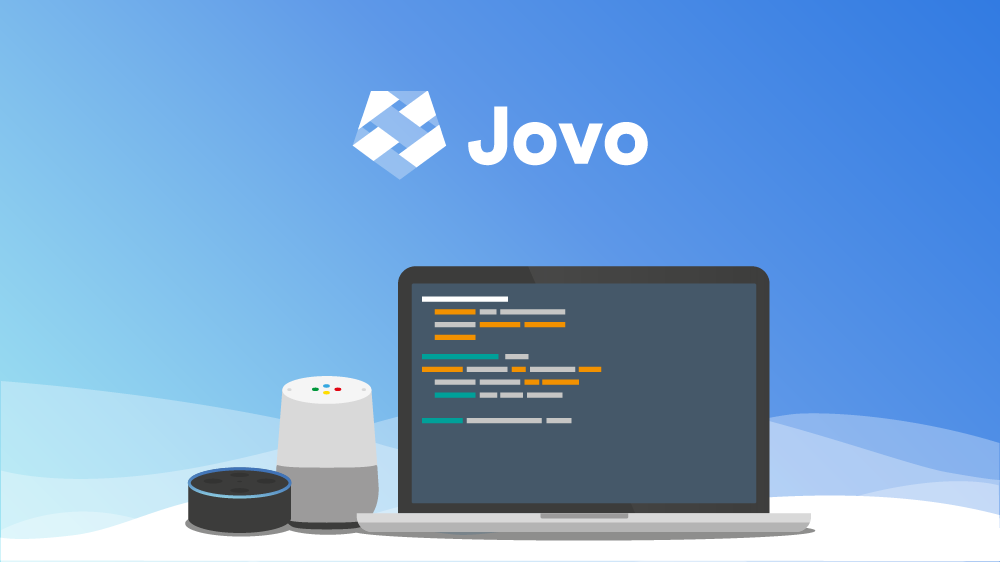

[](https://www.jovo.tech)

<p align="center">The development framework for cross-platform voice apps</p>

<p align="center">
<a href="https://www.jovo.tech/framework/docs/"><strong>Documentation</strong></a> -
<a href="https://github.com/jovotech/jovo-cli"><strong>CLI </strong></a> -
<a href="https://github.com/jovotech/jovo-sample-voice-app-nodejs"><strong>Sample App </strong></a> - <a href="https://github.com/jovotech/jovo-framework-nodejs/tree/master/.github/CONTRIBUTING.md"><strong>Contributing</strong></a> - <a href="https://twitter.com/jovotech"><strong>Twitter</strong></a></p>
<br/>

<p align="center">
<a href="https://travis-ci.org/jovotech/jovo-framework-nodejs" target="_blank"></a>
<a href="https://www.npmjs.com/package/jovo-framework" target="_blank"></a>
<a href="./CONTRIBUTING.md"></a>
<a href="https://slackin-uwinbxqkfx.now.sh" target="_blank"></a>
<a href="https://twitter.com/intent/tweet?text=🔈 Build cross-platform voice apps for Alexa and Google Assistant with @jovotech https://github.com/jovotech/jovo-framework-nodejs/" target="_blank"></a>
</p>
<br/>

```javascript
app.setHandler({
    'LAUNCH': function() {
        this.toIntent('HelloWorldIntent');
    },

    'HelloWorldIntent': function() {
        this.ask('Hello World! What\'s your name?', 'Please tell me your name.');
    },

    'MyNameIsIntent': function(name) {
        this.tell('Hey ' + name.value + ', nice to meet you!');
    },
});
```

Jovo is the first open source framework that lets you build voice apps for both Amazon Alexa and Google Assistant with only one code base. Besides cross-platform development, Jovo also offers a variety of integrations and easy prototyping capabilities.

The main features of the Jovo ecosystem are:
* [**Jovo Framework**](https://github.com/jovotech/jovo-framework-nodejs#features): Build voice apps for both Amazon Alexa and Google Assistant
* [**Jovo CLI**](https://github.com/jovotech/jovo-framework-nodejs/blob/master/docs/02_cli): Create, build, and deploy Jovo projects (including [staging](https://github.com/jovotech/jovo-framework-nodejs/tree/master/docs/07_advanced#stagin))
* [**Jovo Webhook**](https://github.com/jovotech/jovo-framework-nodejs/blob/master/docs/03_app-configuration/02_server/webhook.md#jovo-webhook): Develop and debug voice apps on your local computer
* [**Jovo Debugger**](https://www.jovo.tech/debugger): Test and debug voice apps in your browser
* [**Jovo Language Model**](https://github.com/jovotech/jovo-framework-nodejs/tree/master/docs/03_app-configuration#models---language-model): A consolidated language model that can be converted into Alexa Interaction Models and Dialogflow Agents

> 🚀 Join our newsletter for free courses on voice app development: www.jovo.tech/newsletter


## Table of Contents

* [Installation](#installation)
* [Features](#features)
  * [General](#general)
  * [Platform Specific Features](#platform-specific-features)
  * [Integrations](#integrations)
* [Getting Started](./docs/01_getting-started)
  * [Jovo CLI](./docs/01_getting-started#getting-started)
  * [Jovo Framework](./docs/01_getting-started#jovo-framework-npm-package)
  * [Jovo Sample App](./docs/01_getting-started#jovo-sample-voice-app)
* [Tutorials](#tutorials)
* [Contributing](#contributing)


## Installation

> Read more in our [Getting Started Guide](./docs/01_getting-started).

Install the Jovo CLI:

```sh
$ npm install -g jovo-cli
```

Create a new Jovo project:

```sh
$ jovo new <directory>
```

## Features

### General

#### Basic Concepts

Name | Description | Docs
:--- | :--- | :---
Command Line Tools | Create and run Jovo projects from your command line | [📝](./docs/02_cli)
Routing | Easy routing capabilities for intents and states | [📝](./docs/04_app-logic/01_routing)
Data input | Deal with user specific data and request parameters (slots and entities) easily| [📝](./docs/04_app-logic/02_data)
Speech and visual output &nbsp; | Craft your responses, including speech an visual elements | [📝](./docs/04_app-logic/03_output)


#### Advanced Features

Name | Description | Docs
:--- | :--- | :---
User object | Create contextual experiences with user specific data and services | [📝](./docs/04_app-logic/02_data/user.md)
Speech Builder | Helpful class to create speech output and add variety to your responses | [📝](./docs/04_app-logic/03_output/speechbuilder.md)
i18n | Create multilingual voice apps | [📝](./docs/04_app-logic/03_output/i18n.md)
Jovo Persistence Layer &nbsp; &nbsp; &nbsp;| Persist user specific data | [📝](./docs/06_integrations/databases)
Jovo Analytics Layer | Get usage statistics and logging with analytics integrations | [📝](./docs/06_integrations/analytics)
Staging | Create and maintain different environments | [📝](./docs/07_advanced/README.md#staging)
Plugins | Extend the Jovo Framework without having to mess with its core code and architecture | [📝](./docs/07_advanced/README.md#plugins)
Testing | Use the Jovo TestSuite to integrate unit tests into your voice app project | [📝](./docs/07_advanced/README.md#testing)


### Platform Specific Features

Jovo is not a common denominator solution. You can access platform specific features for Amazon Alexa and Google Assistant. See a list of supported features below.

#### General

Name | Description | Docs
:--- | :--- | :---
Multi-platform handler &nbsp; &nbsp; &nbsp; &nbsp; | Add or overwrite specific intents and states for platform specific app logic | [📝](./docs/04_app-logic#handler)


#### Amazon Alexa

Name | Description | Docs
:--- | :--- | :---
Audioplayer | Build Alexa Audioplayer Skills | [📝](./docs/05_platform-specifics/amazon-alexa/audioplayer.md)
VideoApp | Build Alexa VideoApp Skills | [📝](./docs/05_platform-specifics/amazon-alexa/visual.md#video)
Alexa Cards | Create visual output with home cards for Alexa Skills  | [📝](./docs/05_platform-specifics/amazon-alexa/visual.md#cards)
Alexa Device Address | Access users' device location | [📝](./docs/05_platform-specifics/amazon-alexa/data.md#location)
Alexa Lists | Access users' To Do and Shopping Lists | [📝](././docs/05_platform-specifics/amazon-alexa/list.md)
Alexa Verifier | Makes it possible to host your Alexa skill on your own server instead of AWS Lambda | [📝](./docs/03_app-configuration/server/webhook.md#deploy-to-a-server)
Alexa Dialog Interface | Use Alexa's Dialog Directives for multi-turn conversations | [📝](./docs/05_platform-specifics/amazon-alexa/dialog.md)
Echo Show Render Templates | Display visual elements on Echo Show | [📝](./docs/05_platform-specifics/amazon-alexa/visual.md#display-templates)
Progressive Responses | Keep your users engaged while processing a longer request | [📝](./docs/05_platform-specifics/amazon-alexa#progressive-responses)
Skill Events | Get notified when an event (e.g. Skill enabled/disabled) occurs | [📝](./docs/05_platform-specifics/amazon-alexa/skillevents.md)
CanFulfillIntentRequest | Add name-free interaction to your skill and increase your skill's discoverability | [📝](./docs/05_platform-specifics/amazon-alexa/canfulfill.md)
Game Engine | Provides the toolset to receive Echo Button events | [📝](./docs/05_platform-specifics/amazon-alexa/game-engine.md)
Gadget Controller | Allows you to control the user's Echo Buttons | [📝](./docs/05_platform-specifics/amazon-alexa/gadget-controller.md)


#### Google Assistant

Name | Description | Docs
:--- | :--- | :---
Google Assistant Cards &nbsp; &nbsp; &nbsp; | Create visual Output for the Google Assistant mobile app | [📝](./docs/05_platform-specifics/google-assistant/visual.md#basic-card)
Suggestion Chips | Display buttons to allow your users to quickly reply on mobile phones | [📝](./docs/05_platform-specifics/google-assistant/visual.md#suggestion-chips)
Location | Access your user's location data | [📝](./docs/05_platform-specifics/google-assistant/data.md#location)
Media Response | Play longform audio | [📝](./docs/05_platform-specifics/google-assistant/media-response.md)


#### Missing

The following features are **not** implemented yet. We appreciate any kind of help and are also happy to assist you, if you have any questions about the core code. You can reach us on [Slack](https://slackin-uwinbxqkfx.now.sh/).

Platform | Feature | Docs
:--- | :--- | :---
**Amazon Alexa** | PlaybackController Interface | [📝](https://developer.amazon.com/docs/custom-skills/playback-controller-interface-reference.html)
&nbsp; | Notifications | [📝](https://developer.amazon.com/docs/alexa-voice-service/notifications-overview.html)
**Google Action** | Table Card | [📝](https://developers.google.com/actions/assistant/responses#table_card)
&nbsp; | Transactions | [📝](https://developers.google.com/actions/transactions/)
&nbsp; | Push Notifications | [📝](https://developers.google.com/actions/assistant/updates/notifications)
&nbsp; | Android Link | [📝](https://developers.google.com/actions/assistant/helpers#android_link)

### Integrations

#### Database Integrations

See the [Jovo Persistence Layer](./docs/06_integrations/databases) for more information on storing user specific data.

Name | Description | Docs
:--- | :--- | :---
File Persistence &nbsp; &nbsp; &nbsp; &nbsp; | Saves user specific data in JSON file for fast prototyping and development (default) | [📝](./docs/06_integrations/databases/#filepersistence)
Dynamo DB | Saves user specific data in AWS DynamoDB table | [📝](./docs/06_integrations/databases/#dynamodb)

#### Analytics Integrations

See the [Jovo Analytics Layer](./docs/06_integrations/analytics) for more information on analytics features.

Name | Description | Docs
:--- | :--- | :---
Dashbot | Chatbot and Voice App Analytics including Usage Metrics, Behavior Flows, and Live Interaction Transcripts | [📝](./docs/06_integrations/analytics/#dashbot)
Bespoken Analytics | Voice App Analytics including Usage Metrics, Logging, and Monitoring | [📝](./docs/06_integrations/analytics/#bespoken)
Chatbase | Voice App Analytics including Usage Metrics, Session Flows and Link Tracking | [📝](./docs/06_integrations/analytics/#chatbase)
Botanalytics | AI powered Chatbot Analytics and Voice Analytics | [📝](./docs/06_integrations/analytics/#botanalytics)

#### CLI Integrations

See the [Jovo CLI Docs](./docs/02_cli/) for more information on CLI features.

Name | Description | Docs
:--- | :--- | :---
bst proxy &nbsp; &nbsp; &nbsp; &nbsp; | Proxy service that creates a webhook link for local prototyping, with additional logging and analytics features | [📝](./docs/02_cli#bst-proxy)
nodemon | Monitor changes and automatically restart the server | [📝](./docs/02_cli#watch)


## Tutorials

Find a quickstart guide and comprehensive tutorials here:
* General:
    * [Build a cross-platform voice app in 5 simple steps](https://www.jovo.tech/get-started)
    * [Build an Alexa Skill with Jovo](https://www.jovo.tech/blog/alexa-skill-tutorial-nodejs/)
    * [Build a Google Action with Jovo](https://www.jovo.tech/blog/google-action-tutorial-nodejs/)
* Account Linking:
    * [Amazon Alexa with Auth0](https://www.jovo.tech/blog/alexa-account-linking-auth0/)
    * [Google Action with Auth0](https://www.jovo.tech/blog/google-action-account-linking-auth0/)
    * [Login with Amazon](https://www.jovo.tech/blog/alexa-login-with-amazon-email/)
* Amazon Alexa:
    * [Skill Events](https://www.jovo.tech/blog/alexa-skill-events/)
* Google Action:
    * [Suggestion Chips](https://www.jovo.tech/blog/google-assistant-suggestion-chips/)


## Contributing
<a href="https://www.codetriage.com/jovotech/jovo-framework-nodejs" target="_blank"></a>

We strongly encourage everyone who wants to help the Jovo development take a look at the following resources:
* [CONTRIBUTING.md](./.github/CONTRIBUTING.md)
* Take a look at our [issues](https://github.com/jovotech/jovo-framework-nodejs/issues)
* Add your project to [jovotech/builtwithjovo](https://github.com/jovotech/builtwithjovo)


## We need your help

Jovo is a free, open source framework for voice developers. We're improving it every day and appreciate any feedback. How to support us? Just go ahead and build something cool with the framework and let us know at feedback@jovo.tech. Thanks!
