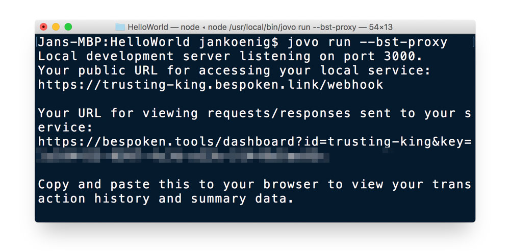
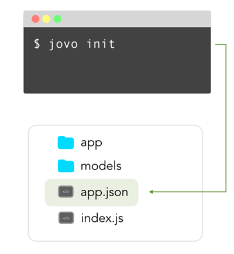

# Jovo CLI

The Jovo Command Line Tools offer the ability to create, prototype, test, and deploy your voice app quickly.

* [Introduction](#introduction)
* [Installation](#installation)
    * [Troubleshooting](#troubleshooting)
* [Commands](#commands)
    * [Basic Commands](#basic-commands)
      * [jovo new](#jovo-new)
      * [jovo run](#jovo-run)
    * [Platform Commands](#platform-commands)
      * [jovo init](#jovo-init)
      * [jovo build](#jovo-build)
      * [jovo get](#jovo-get)
      * [jovo deploy](#jovo-deploy)


## Introduction

The Jovo CLI (GitHub Repository: [jovotech/jovo-cli](https://github.com/jovotech/jovo-cli)) is the center of voice app development with the Jovo Framework. With it, you can quickly create new Jovo projects, create language models and deploy them to the voice platforms, and run your voice apps locally for easy prototyping and testing.

## Installation

To make best use of the Jovo CLI, install it globally via npm:

```sh
$ npm install -g jovo-cli
```

After successful installation, you should be able to see the jovo menu by just typing the following into your command line:

```sh
$ jovo
```

You can check the version number (and compare it to the [jovo-cli npm package](https://www.npmjs.com/package/jovo-cli) version) with this command:

```sh
$ jovo -V
```

### Troubleshooting

Find out more about technical requirements here: [Getting Started > Installation](../01_getting-started#technical-requirements './installation#technical-requirements').

If you had the CLI installed before the release of `v1.0`, and are running into problems after updating it to the newest version, please try to uninstall it globally before you install it again:

```sh
$ npm uninstall -g jovo-cli
```

If you run into other problems, please submit an issue here: [jovotech/jovo-cli](https://github.com/jovotech/jovo-cli). Thank you! 

## Commands

Jovo CLI commands can be divided into [basic commands](#basic-commands) (to create and run projects) and [platform commands](#platform-commands) (to interact with a voice platform).

| | Command | Description 
------------ | ------------ | ------------- 
[Basic Commands](#basic-commands) | [`jovo new`](#jovo-new) | Creates a new Jovo project 
| | [`jovo run`](#jovo-run) | Runs a local development server (webhook)
[Platform Commands](#platform-commands) | [`jovo init`](#jovo-init) | Initializes platform-specific projects in `app.json`
| | [`jovo build`](#jovo-build) | Builds platform-specific language model files into `/platforms` based on  `/models` folder
| | [`jovo get`](#jovo-get) | Downloads an existing platform project into the `/platforms` folder
| | [`jovo deploy`](#jovo-deploy) | Deploys the `/platforms` project files to the voice platforms


### Basic Commands

These are the basic commands that help you develop Jovo voice apps faster, without interacting with the voice platforms (see [platform commands](#platform-commands) for features that are language model specific).

#### jovo new


You can create a Jovo project into a new directory with the following command:

```sh
## Default
$ jovo new <directory>

## Options
$ jovo new <directory> [-t | --template <template-name>] [-l | --locale <locale>] [--invocation <name>]
  [-i | --init <platform>] [-b | --build] [-d | --deploy] [--ff <platform>] [--skip-npminstall]
  [--ask-profile <profileName>] [--endpoint <endpoint>]
```
**Options**

`--template`, `-t`: Used to specify which template should be used. Get a list of all the templates below, or on GitHub: [jovotech/jovo-templates](https://github.com/jovotech/jovo-templates). Default: `helloworld`.

`--locale`, `-l`: Choose the language of the interaction models in the `/models` folder. Arguments: `en-US`, `de-DE`, et cetera. Default: `en-US`.

`--invocation`: Set's the invocation name for the Alexa Skill.

`--init`, `-i`: This is a shortcut to the [`jovo init`](#jovo-init) command. Speed up the creation of your voice application by creating the `app.json` file right at the beginning. Arguments: `alexaSkill` or `googleAction`.

`--build`, `-b`: This is a shortcut to the [`jovo build`](#jovo-build) command. Speed up the creation of your voice application by building the platform specific files into the `/platforms` folder right at the beginning. Requires `--init` before.

`--deploy`, `-d`: This is a shortcut to the [`jovo deploy`](#jovo-deploy) command. Deploy the platform files to their respective developer console. It will deploy to the platform you specified with the `--init` and `--build` options.

`--ff`: Used to fast forward run `--init <platform> --build --deploy`.

`--skip-npminstall`: Skips installation of the npm packages.

`--ask-profile`: Choose the ask profile to use for the deployment. Default: the profile set as default in your ASK-CLI settings.

`--endpoint`: Choose the type of endpoint for `--init`: `jovo-webhook`, `bst-proxy`, `ngrok` or `none`. Default: `jovo-webhook`


**Templates**

Below is a list of templates that can currently be used with the `jovo new` command.

You can find the complete repository on GitHub: [jovotech/jovo-templates](https://github.com/jovotech/jovo-templates).

Name | Description 
:--- | :---
[`helloworld`](https://github.com/jovotech/jovo-templates/tree/master/01_helloworld) | `Default`. Jovo Sample Voice App with a simple "Hello World!" + asking for the user's name 
[`trivia-game`](https://github.com/jovotech/jovo-templates/tree/master/02_trivia-game) | Trivia game voice app that makes use of states, helper functions, and i18n
[`unit-testing`](https://github.com/jovotech/jovo-templates/tree/master/03_unit-testing) | Template for the Jovo built-in unit testing feature.
[`alexa/audioplayer`](https://github.com/jovotech/jovo-templates/tree/master/alexa/audioplayer) | Sample Alexa Audioplayer Skill that plays a longform audio file with the Audioplayer directive
[`alexa/dialoginterface`](https://github.com/jovotech/jovo-templates/tree/master/alexa/dialoginterface) | Sample implementation of the Alexa Dialog Interface
[`alexa/skillevents`](https://github.com/jovotech/jovo-templates/tree/master/alexa/skillevents) | Sample implementation of the Alexa Skill Events.
[`alexa/isp`](https://github.com/jovotech/jovo-templates/tree/master/alexa/isp) | Sample implementation of the Alexa in-skill purchases feature.
[`google/mediaresponse`](https://github.com/jovotech/jovo-templates/tree/master/google/mediaresponse) | Sample Google Action media response app that plays longform audio file


#### jovo run


You can use the `jovo run` command to start the development server in your `index.js` file, and then add the [Jovo Webhook](../03_app-configuration/02_server/webhook#jovo-webhook './server/webhook#jovo-webhook') as an endpoint to the respective developer consoles.

Learn more here: [App Configuration > Server Configuration](../03_app-configuration/server './server').

```sh
# Default
$ jovo run

# Options
$ jovo run [-b | --bst-proxy] [-w | --watch] [-p, --port <port>] [--inspect] [--stage <stage>] [--webhook-only]
  [--disable-jovo-debugger] [--model-test] [--timeout <timeout>] [-r | --record <name>]
```

You can also specify the file you want to run:
```sh
$ jovo run <file>

# Example
$ jovo run index.js

# Alternative
$ node index.js --webhook
```

You can also use other tools like [bst proxy](#bst-proxy) to tunnel to your local server.

**Options**

`--port`, `-p`: Defines the port that will be used to run the local development server. Default: `3000`.

`--inspect`: Run debugging mode.

`--stage`: Specify the stage where the configuration will be taken from.

`--webhook-only`: Starts the Jovo webhook proxy without executing the code.

`--disable-jovo-debugger`: Disables the Jovo debugger.

`--model-test`: Activates the language model test.

`--timeout`: Sets timeout in milliseconds.

`--record`, `-r`: Can be used to record requests and responses of your Jovo app for testing purposes.


**Integrations**

> If you want to see another integration, please feel free to [submit an issue](https://github.com/jovotech/jovo-cli/issues). Thanks!

Here is a list of integrations that work with `jovo run`:

Command | Description 
------------ | ------------- 
[`--bst-proxy`](#bst-proxy) | Creates a webhook URL for local testing and integrates with [Bespoken Analytics](../06_integrations/analytics)
[`--watch`](#watch) | Uses `nodemon` to monitor changes and automatically restart the server


##### bst proxy

You can use the bst proxy to create a webhook URL easily:

```sh
$ jovo run --bst-proxy
```

The result should look like this:



The URL also comes with logging and analytics capabilities for prototyping and testing.

##### watch

With this integration, you don't have to manually restart your server with every change you make to the application:

```sh
$ jovo run --watch
```

For this, we're using [`nodemon`](https://github.com/remy/nodemon), a neat package that monitors your app files and automatically restarts the server.


### Platform Commands

Platform commands are used to interact with the voice platforms (Amazon Alexa or Google Assistant/Dialogflow). You don't have to use these commands if you just want to maintain the language/interaction models on the respective developer platforms.

See the following tutorials for alternative ways to create language models on the respective developer platforms:

* [Alexa Skill Beginner Tutorial](https://www.jovo.tech/blog/alexa-skill-tutorial-nodejs/) 
* [Google Action Beginner Tutorial](https://www.jovo.tech/blog/google-action-tutorial-nodejs/)

#### jovo init



`jovo init` is the command to initialize a voice platform project to use with the Jovo Framework. This will create or update a file `app.json` with all the information needed to later [`build`](#jovo-build) the language models.

To create it, use the following command: 

```sh
# Default
$ jovo init <alexaSkill | googleAction>

# Options
$ jovo init <alexaSkill | googleAction> [-l | --locale <locale>] [--endpoint <endpoint>] [-t | --target <target>]  
  [--ask-profile <profileName>] [-b | --build] [-d | --deploy]
```
The resulting `app.json` file looks like this:

```javascript
{
  "alexaSkill": {
    "nlu": "alexa"
  },
  "googleAction": {
    "nlu": {
      "name": "dialogflow"
    }
  },
  "endpoint": "https://webhook.jovo.cloud/[jovo-endpoint-id]"
}
```
Currently, the platform `nlu` (natural language understanding) services are:
* Amazon Alexa: The built-in `alexa` interaction model
* Google Assistant: `dialogflow` API versions `1` or `2` (Jovo supports boths)

The default `endpoint` uri is automatically generated and provides a simple solution to run a local webserver for easy debugging. Learn more here: [App Configuration > Server Configuration > Webhook](../03_app-configuration/02_server/webhook.md './server/webhook'). For more options, see below.

**Options**

`--locale`, `-l`: Locale of the language model <`en-us` | `de-DE` | etc.>. Default: `en-US`.

`--endpoint`: This specifies which endpoint you want to include in the `app.json` file. Arguments: `jovo-webhook`, `bst-proxy`, `ngrok` or `none`. Default: `jovo-webhook`.

`--build`, `-b`: This is a shortcut to the [`jovo build`](#jovo-build) command. Speed up the creation of your voice application by building the platform specific files into the `/platforms` folder right at the beginning.

`--deploy`, `-d`: This is a shortcut to the [`jovo deploy`](#jovo-deploy) command. Deploy the platform files to their respective developer console. Only works in combination with `--build`.

`--target`, `-t`: Used in combination with `--build --deploy`. Target of build and deployment: <`info` | `model` | `all`>.

`--ask-profile`: Used in combination with `--build --deploy`. Choose the ask profile (ASK-CLI). Default: the profile set as default in your ASK-CLI settings.


#### jovo build


`jovo build` is the command to create and update the platform specific interaction models using the Jovo model. Using the files in the `/models` folder and converting them into files in the `/platforms` folder.

To learn more about Jovo Language Models, take a look at [App Configuration > Models](../03_app-configuration/models './model').

After the initial [`init`](#jovo-init) process, you can either run `build`  separately for each platform, or just let the CLI fetch the right information from the `app.json` file.

```sh
# Default
$ jovo build

# Options
$ jovo build [-p | --platform <platform>] [-r | --reverse] [-l | --locale <locale>] [-d | --deploy]
  [-t | --target <target>] [-s | --src <src>] [--stage <stage>] [--endpoint <endpoint>] [--ask-profile <profileName>]
```
**Options**

`--platform`, `-p`: If you want to update your platform folders, you can leave it out and it will update the ones listed in `app.json`. If you want to update a specific platform folder you can parse the platform name as an argument: `alexaSkill` or `googleAction`. If you haven't  initialized a platform yet, this will trigger the [`jovo init`](#jovo-init) command.

`--reverse`, `-r`: In this reverse process, you can create a [Jovo Language Model](../03_app-configuration/01_models './model') from an existing `/platforms` folder, e.g. after you fetched the files with [`jovo get`](#jovo-get).

`--locale`, `-l`: Specify the locale, which should be created/updated. Arguments: `en-US`, `de-DE`, et cetera. Default: `en-US`.

`--deploy`, `-d`: This is a shortcut to the [`jovo deploy`](#jovo-deploy) command. Deploy the platform files to their respective developer console.

`--target`, `-t`: Used works in combination with `--deploy` to specify target of deployment. Arguments: `info` (Skill Information), `model` (Interaction Model), `all`. Default: `all`.

`--src`, `-s`: Used works in combination with `--deploy`. Path to source files. Default: project directory. 

`--stage`: Specify the stage where the configuration will be taken from.

`--endpoint`: Type of endpoint: <`jovo-webhook` | `bst-proxy` | `ngrok` | `none`>. Default: `jovo-webhook`.

`--ask-profile`: Used in combination with `--deploy`. Specifies which profile set up in [ASK CLI](https://developer.amazon.com/docs/smapi/quick-start-alexa-skills-kit-command-line-interface.html) should be used to deploy. Default: `default`.

```sh
# Alexa Skill
$ jovo build -p alexaSkill --reverse

# Google Action
$ jovo build -p googleAction --reverse
```


#### jovo get


`jovo get` will import an existing Alexa Skill (Skill Information and Interaction Model) or Dialogflow agent (work in progress) into the `/platforms` folder. 

To get the Skill from the Amazon developer console, you have to set up [ASK CLI](https://developer.amazon.com/docs/smapi/quick-start-alexa-skills-kit-command-line-interface.html) first.

```sh
# Choose from list of Skills
$ jovo get <alexaSkill|googleAction>

# Get specific Alexa Skill using the Skill ID
$ jovo get alexaSkill --skill-id <skill ID>

# Get specific Dialogflow agent using the Project ID
# Coming soon
$ jovo get googleAction --project-id <project ID>

# Options
$ jovo get alexaSkill [-s | --skill-id <skill ID>] [--project-id <project ID>] [-l | --locale] [--list-skills] [--ask-profile] [-t | --target <target>] [--stage <stage>] [-r | --reverse] [-b | --build]
```

**Options**

`--skill-id`, `-s`: Get specific Alexa Skill using the Skill ID.

`--project-id`: Get a specific Dialogflow agent using the Project ID.

`--locale`, `-l`: Specify the locale, which should be created/updated. Default: all languages available for the Skill.

`--list-skills`: Shows a list of all available Skill projects for the specific ASK Profile.

`--ask-profile`: Specifies which profile set up in [ASK CLI](https://developer.amazon.com/docs/smapi/quick-start-alexa-skills-kit-command-line-interface.html) should be used to get the information. Default: `default`.

`--target`, `-t`: Specifies which information should be fetched from the Skill. Arguments: `info` (Skill Information), `model` (Interaction Model), `all`. Default: `all`.

`--stage`: Specify the stage where the configuration will be taken from.

`--reverse`, `-r`: Builds the Jovo language model out of the platform's language model.

`--build`, `-b`: Only works in combination with `--reverse`. Will run `jovo build` after reversing the platform's language model.


#### jovo deploy


`jovo deploy` is used to upload the platform folders to their respective developer consoles. 

To deploy to the Amazon developer console, you have to set up [ASK CLI](https://developer.amazon.com/docs/smapi/quick-start-alexa-skills-kit-command-line-interface.html) first.

To deploy a Dialogflow agent you have 2 options:
* Import the dialogflow_agent.zip file into your Dialogflow agent (we recommend using the option RESTORE)
* If you're using the Dialogflow v2 API (default since April 17, 2018), you can also deploy the agent directly to the platform. Learn more here: [Deploy a Dialogflow Agent with the Jovo CLI](../knowledge-base/deploy-dialogflow-agent.md './kb/deploy-dialogflow-agent')

To learn more about how to deploy your app to AWS Lambda, take a look here: [Deploy your Voice App to AWS Lambda with the Jovo CLI](../knowledge-base/deploy-lambda-cli.md './kb/deploy-lambda-cli').

```sh
# Default
$ jovo deploy

# Deploy Dialogflow agent
$ jovo deploy --project-id <project ID>

# Options
$ jovo deploy --platform <platform> [--project-id <project ID>] [-l | --locale <locale>] [-t | --target <target>] [--stage <stage>] [-s | --src <src>] [--endpoint <endpoint>] [--ask-profile <profileName>]
```
**Options**:

`--platform`, `-p`: Specify the platform that should be deployed. Arguments: `googleAction` or `alexaSkill` Default: Every platform found in the `/platforms` folder.

`--project-id`: Determine, which project to deploy to.

`--locale`, `-l`: Specify the locale that should be deployed. Default: Every locale found for each platform.

`--target`, `-t`: Specify, what type of information to deploy. Arguments: `info` (for Skill or Agent information), `model` (for language models), `lambda` (for AWS Lambda deployment), `all`. Default: all.

`--stage`: Specify the stage where the configuration will be taken from.

`--src`, `-s`: Path to source files. Default: project directory.

`--endpoint`: Type of endpoint. Arguments: `jovo-webhook`, `bst-proxy`, `ngrok` or `none`. Default: `jovo-webhook`.

`--ask-profile`: Specifies which profile set up in [ASK CLI](https://developer.amazon.com/docs/smapi/quick-start-alexa-skills-kit-command-line-interface.html) should be used to deploy. Default: `default`.

<!--[metadata]: {"title": "Jovo CLI", 
                "description": "Learn how to use the Jovo CLI to create, prototype, test, and deploy your voice app quickly.",
                "activeSections": ["cli", "cli_index"],
                "expandedSections": "cli",
                "inSections": "cli",
                "breadCrumbs": {"Docs": "docs/",
                                "CLI": ""
                                },
		"commentsID": "framework/docs/cli",
		"route": "docs/cli"
                }-->
