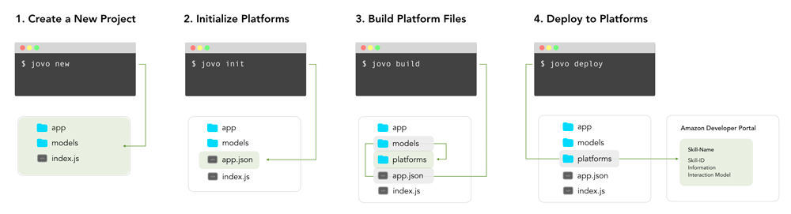
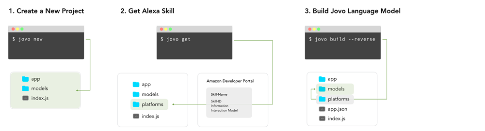

# [Jovo CLI](./) > Workflows

This section shows workflows and step by step guides that can be used with the Jovo CLI to create and update projects.

* [Introduction](#introduction)
* [Create and Deploy a New Project](#create-and-deploy-a-new-project)
* [Import an Existing Project](#import-an-existing-project)


## Introduction

The Jovo CLI ([see overview of features here](../)) offers a variety of features to help you build a voice app project faster. As it offers support for the full lifecycle of voice app development, the amount of features can be overwhelming at the beginning. This is why we offer this growing list of workflows which you can use to go through your voice app development process.

## Create and Deploy a New Project



There are several steps in the process of building a voice application, which you need to do during the development. Let's go through all of them quickly:

**1. Create a New Project**: First, create a new project with the [`jovo new`](../#jovo-new '../cli#jovo-new') command. You can then start building your [App Logic](../../04_app-logic '../app-logic') in the `/app` folder, or work on the [Language Model](../../03_app-configuration/01_models '../model') in the `/models` folder.

**2. Initialize Platforms**: If you want to deploy to language model to one of the platforms Amazon Alexa or Google Assistant, you first need to initialize the platforms with the [`jovo init`](../#jovo-init '../cli#jovo-init') command. This will create a file called `app.json` with the necessary information to create platform specific files. For example, `$ jovo init alexaSkill` will add the following to your `app.json`:

```javascript
{
  "alexaSkill": {
    "nlu": "alexa"
  },
  "endpoint": "https://webhook.jovo.cloud/[jovo-endpoint-id]"
}
```
The `endpoint` (a [`jovo-webhook`](../../03_app-configuration/02_server/webhook.md '../server/webhook')) is later used to point to your local server created with the [`jovo run`](../#jovo-run '../cli#jovo-run') command.

**3. Build Platform Files**: After the initialization, you can use the [`jovo build`](../#jovo-build '../cli#jovo-build') command to create platform specific project files into the `/platforms` folder. This will take the files in `/models` to create platform information and language models for each platform provided in the `app.json`.

**4. Deploy to Platforms**: After creating/updating the files, you can upload them to the voice platforms by using the [`jovo deploy`](../#jovo-deploy '../cli#jovo-deploy') command. For Amazon Alexa, you need to first install [ASK CLI](https://developer.amazon.com/docs/smapi/quick-start-alexa-skills-kit-command-line-interface.html). For Google Assistant, you need to use the newly created file `dialogflow_agent.zip` and import it into an agent on Dialogflow.

**Done!** You should now be able to test your voice application. Just do `$ jovo run` to start the local development server.


## Import an Existing Project



Chances are you already have an existing Alexa Skill project on the Developer Portal. This workflow shows how to work with platform specific projects.

**1. Create a New Project**: First, create a new project with the [`jovo new`](../#jovo-new '../cli#jovo-new') command. 

**2. Get Alexa Skill**: You can use the [`jovo get`](../#jovo-get '../cli#jovo-get') command to import an already existing Alexa Skill (functionality is currently limited to Alexa). This will add all the necessary files into the `/platforms` folder.

Usually, the [Jovo Language Model](../../03_app-configuration/01_models '../model') is used as an abstraction layer for cross-platform language models. You now have 2 options:
* If you only want to keep building for Alexa, stick to the `/platforms` folder, update the files there, and use the [`jovo deploy`](../#jovo-deploy '../cli#jovo-deploy') command to update the Alexa Skill
* Convert the Alexa Skill Interaction Model into a Jovo Language Model (see next step)

**3. Build Jovo Language Model**: Converting an Alexa Interaction Model into a [Jovo Language Model](../../03_app-configuration/01_models '../model') by hand can be quite a task for complex models. This is why Jovo offers a reverse version of the [`jovo build`](../#jovo-build '../cli#jovo-build') command, which acts as a converter that uses the files in the `/platforms` folder to create/update the files in the `/models` folder. Just use `$ jovo build -p alexaSkill --reverse`.

After this, you can start updating the files in the `/models` folder and use the [`jovo init`](../#jovo-init '../cli#jovo-init') and [`jovo build`](../#jovo-build '../cli#jovo-build') commands to update the `/platforms` files, before you use the [`jovo deploy`](../#jovo-deploy '../cli#jovo-deploy') command.


<!--[metadata]: {"title": "Jovo CLI Workflows", 
                "description": "Learn more about workflows you can use with the Jovo CLI for Alexa Skills and Google Actions.",
                "activeSections": ["cli", "cli_workflows"],
                "expandedSections": "cli",
                "inSections": "cli",
                "breadCrumbs": {"Docs": "docs",
				"CLI": "docs/cli",
                                "Workflows": ""
                                },
		"commentsID": "framework/docs/cli/workflows",
		"route": "docs/cli/workflows"
                }-->
