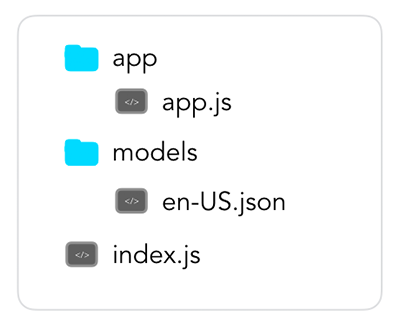

# App Configuration

In this section, you will learn more about the essential configurations of a Jovo Voice App.

* [Jovo App Structure](#jovo-app-structure)
  * [index.js - Server Configuration](#indexjs---server-configuration)
  * [app.json - Project Configuration](#appjson---project-configuration)
  * [/app - Application Logic](#app---application-logic)
  * [/models - Language Model](#models---language-model)
* [How to Add Configurations](#how-to-add-configurations)
  * [Available Configurations](#available-configurations)


## Jovo App Structure
A Jovo voice app is divided into four main building blocks: `index.js` ([server configuration](./02_server './server')), `app.json` ([project configuration](./app-json.md './app-json')), `/app` (app configuration and [logic](../04_app-logic './logic')), and `/models` ([Jovo Language Model](./01_models './model')).





### index.js - Server Configuration
Everything related to running your voice application, either in Lambda or using a webhook (recommended for local prototyping), is dealt with in [`index.js`](https://github.com/jovotech/jovo-patterns/blob/master/hello-world/hello-world/index.js). 

```javascript
'use strict';

const {Webhook} = require('jovo-framework');
const {app} = require('./app/app.js');

// =================================================================================
// Server Configuration
// =================================================================================

if (app.isWebhook()) {
    const port = process.env.PORT || 3000;
    Webhook.listen(port, () => {
        console.log(`Example server listening on port ${port}!`);
    });
    Webhook.post('/webhook', (req, res) => {
        app.handleWebhook(req, res);
    });
}

exports.handler = (event, context, callback) => {
    app.handleLambda(event, context, callback);
};
```
You can find all the information regarding server configuration in this section: [App Configuration > Server](./02_server './server').

### app.json - Project Configuration

The `app.json` file stores all the necessary information for your Jovo project and is automatically created with the first [`jovo init` command](../02_cli#jovo-init './cli#jovo-init').

Learn more about everything that can go into the `app.json` here: [App Configuration > app.json](./app-json.md './app-json').

### /app - Application Logic
The `/app` folder, and specifically `app.js` is used for the logic of your voice application, which contains handlers, intents and the configuration of your voice app (we will get to that shortly). 

```javascript
'use strict';

// =================================================================================
// App Configuration
// =================================================================================

const {App} = require('jovo-framework');

const config = {
    logging: true,
};

const app = new App(config);


// =================================================================================
// App Logic
// =================================================================================

app.setHandler({
    'LAUNCH': function() {
        this.toIntent('HelloWorldIntent');
    },

    'HelloWorldIntent': function() {
        this.ask('Hello World! What\'s your name?', 'Please tell me your name.');
    },

    'MyNameIsIntent': function(name) {
        this.tell('Hey ' + name + ', nice to meet you!');
    },
});

module.exports.app = app;
```

You can find everything related to the app logic here: [App Logic](../04_app-logic './logic').

### /models - Language Model
The models folder contains the [Jovo Language Model](./01_models './model'), which can be used to create and update platform specific language models using the [`Jovo CLI`](https://github.com/jovotech/jovo-cli). 

The idea is to maintain a single language model locally instead of having to go to the platform developer consoles independently.

In the `/models` folder, every language gets a file. For example, here's how a file `en-US.json` could look like:

```javascript
{  
    "invocation": "my test app",
    "intents":[  
        {  
            "name":"HelloWorldIntent",
            "phrases":[  
                "hello",
                "say hello",
                "say hello world"
            ]
        },
        {  
            "name":"MyNameIsIntent",
            "phrases":[  
                "{name}",
                "my name is {name}",
                "i am {name}",
                "you can call me {name}"
            ],
            "inputs":[  
                {  
                    "name":"name",
                    "type":{  
                        "alexa":"AMAZON.US_FIRST_NAME",
                        "dialogflow":"@sys.given-name"
                    }
                }
            ]
        }
    ],
    "alexa":{  
        "interactionModel":{  
            "languageModel":{  
                "intents":[  
                    {  
                        "name":"AMAZON.CancelIntent",
                        "samples":[  

                        ]
                    },
                    {  
                        "name":"AMAZON.HelpIntent",
                        "samples":[  

                        ]
                    },
                    {  
                        "name":"AMAZON.StopIntent",
                        "samples":[  

                        ]
                    }
                ]
            }
        }
    }
}
```

You can find out more about that here [App Configuration > Models](../03_app-configuration/01_models './model').

## How to Add Configurations
To add configurations, you have two options: You can either add them at the beginning of [`app.js`](#app.js) in the constructor or you use the setter function of each configuration.

You can find a list of all [available configurations below](#available-configurations).

To add them with the constructor you simply change the content of the config object at the beginning of [`app.js`](#app.js):

```javascript
const config = {
    logging: true,
    // Add other configurations
};

const app = new App(config);
```

The other possibility is to use one of the setter functions:

```javascript
// Enable logging with setters
app.enableLogging();
```

This is the default configuration:

```javascript
const config = {
    logging: false,
    requestLogging: false,
    responseLogging: false,
    requestLoggingObjects: [],
    responseLoggingObjects: [],
    saveUserOnResponseEnabled: true,
    userDataCol: 'userData',
    inputMap: {},
    intentMap: {},
    intentsToSkipUnhandled: [],
    saveBeforeResponseEnabled: false,
    allowedApplicationIds: [],
    db: {
        type: 'file',
        localDbFilename: 'db',
    },
    userMetaData: {
        lastUsedAt: true,
        sessionsCount: true,
        createdAt: true,
        requestHistorySize: 0,
        devices: false,
    },
    context: {
        prevLevel: 1,
        prev: {
            request: {
                intent: true,
                state: true,
                timestamp: true,
            },
            response: {
                speech: true,
                reprompt: true,
                state: true,
                timestamp: true,
            },
        },
    },
    i18n: {
        overloadTranslationOptionHandler: sprintf.overloadTranslationOptionHandler,
        load: 'all',
        returnObjects: true,
    },
    analytics: {
        intentsToSkip: [],
        usersToSkip: [],
        services: {},
    },
    alexaSkill: {},
    googleAction: {},
};
```


### Available Configurations

Below is a list of all configurations:

Category | Name | Description
:--- | :--- | :---
Routing | [intentMap](../04_app-logic/01_routing#intentmap './logic#intentmap') | Maps incoming intents to specified intent names
 | | [intentsToSkipUnhandled](../04_app-logic/01_routing#intentstoskipunhandled './routing#intentstoskipunhandled') | Intents which should not be mapped to 'Unhandled' when not found in a certain state
Data | [inputMap](../04_app-logic/02_data#inputmap './data#inputmap') | Maps incoming input (slots and parameters) to specified input names
 | | [logging](../04_app-logic/02_data#logging './data#logging') | Logs both requests and responses
 | | [requestLogging](../04_app-logic/02_data#log-requests './data#log-requests') | Logs incoming requests
 | | [responseLogging](../04_app-logic/02_data#log-responses './data#log-responses') | Logs outgoing responses
 | | [requestLoggingObjects](../04_app-logic/02_data#request-logging-objects './data#request-logging-objects') | Limits request logs to the provided objects
 | | [responseLoggingObjects](../04_app-logic/02_data#response-logging-objects './data#response-logging-objects') | Limits response logs to the provided objects
User | [userDataCol](../04_app-logic/02_data/user.md#user-data './data/user#user-data') | Changes the name of the user data column in the database
 | | [userMetaData](../04_app-logic/02_data/user.md#meta-data './data/user#user-meta-data') | Change the default configurations for storing user meta data
 | | [userContext](../04_app-logic/02_data/user.md#context './data/user#context') | Change the default configurations for storing context data
Output | [i18n](../04_app-logic/i18n.md#configuration './output/i18n#configuration') | Enable multilingual output for your voice app
Integrations | [Databases](../06_integrations/databases './databases') | Switch between supported database integrations
 | | [Analytics](../06_integrations/analytics './analytics') | Enable analytics integrations


<!--[metadata]: {"title": "App Configuration", 
                "description": "Learn how to configure your Jovo Voice App for Amazon Alexa and Google Assistant",
                "activeSections": ["configuration", "configuration_index"],
                "expandedSections": "configuration",
                "inSections": "configuration",
                "breadCrumbs": {"Docs": "docs/",
                                "App Configuration": ""
                                },
		"commentsID": "framework/docs/app-configuration",
		"route": "docs/configuration"
                }-->
