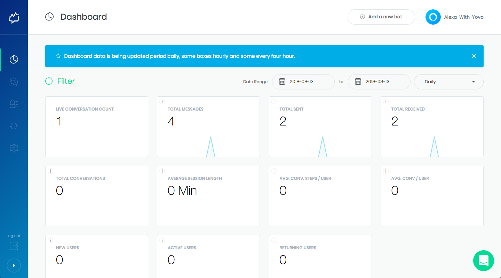

# [Integrations](../) > [Analytics](./README.md) > Botanalytics

Learn how to use Botanalytics for your Alexa Skills and Google Actions built with Jovo.

* [About Botanalytics](#about-botanalytics)
* [Installation](#installation)
   * [Add a New Bot](#add-a-new-bot)
   * [Enable Botanalytics in Jovo](#enable-botanalytics-in-jovo)
   * [Download the Botanalytics Package](#download-the-botanalytics-package)
   * [Check Your App](#check-your-app)

## About Botanalytics


[Botanalytics](https://botanalytics.co/) is a conversational analytics platform that supports a variety of channels, like Facebook Messenger, Slack, Kik, Twitter, Telegram, and more.

[Botanalytics Voice Analytics](https://botanalytics.co/voice-analytics) offering allows you to see live transcopts, track performance across channels, and do intent analysis for your voice apps on Amazon Alexa and Google Assistant. 

## Installation

To use Botanalytics for your voice app, you need to complete the following steps:

1. Add a New Bot
2. Enable Bot in Your Voice App
3. Download the 'botanalytics' npm Package
4. Check Your App

### Add a New Bot

1. Create a Botanalytics account or log in at https://www.botanalytics.co.

2. Click "Add a New Bot" and fill in the information:


3. Scroll down and copy the API Key


### Enable Botanalytics in Jovo

You have to options to add Botanalytics to your voice app:

* Use the Jovo app config
* Use the add commands

Below is an example for both:

```javascript
// Option 1: Use the Jovo app config
const config = {
    /**
     * Other settings
     */
    analytics: {
        services: {
            BotanalyticsAlexa: {
                key: '<token>',
            },
            BotanalyticsGoogleAction: {
                key: '<token>',
            },
        },
    },
};

// Option 2: Use the add commands
app.addBotanalyticsAlexa('<token>');
app.addBotanalyticsGoogleAction('<token>');
```

### Download the Botanalytics Package

In your terminal, use the following command to download the package via npm:

```bash
 npm install botanalytics --save
```

### Check Your App

Test your voice app, after sending couple of messages, click the 'Check connection' button




<!--[metadata]: {"title": "Botanalytics Integration", "description": "Add Botanalytics to your Alexa Skills and Google Actions with Jovo", "activeSections": ["integrations", "analytics"], "expandedSections": "integrations", "inSections": "integrations", "breadCrumbs": {"Docs": "docs/", "Integrations": "docs/integrations", "Analytics": "docs/analytics", "Botanalytics": "" }, "commentsID": "docs/analytics/botanalytics",
"route": "docs/analytics/botanalytics" }-->
