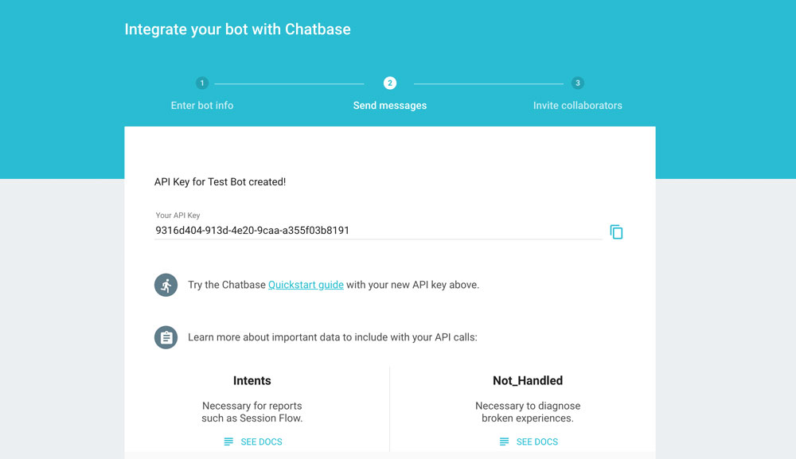

# [Integrations](../) > [Analytics](./README.md) > Chatbase

Learn how to use Chatbase Analytics for your Alexa Skills and Google Actions built with Jovo.

* [About Chatbase](#about-chatbase)
* [Installation](#installation)
   * [Create a Chatbase Account](#create-a-chatbase-account)
   * [Enable Chatbase Analytics in Jovo](#enable-chatbase-analytics-in-jovo)
   * [Test Chatbase](#test-chatbase)

## About Chatbase


[Chatbase](https://chatbase.com/) is an analytics offering for conversational products that is built by Area 120, an incubator by Google.

With Chatbase Analytics, you can measure bot metrics, analyze user behavior, and optimize the experience with transcripts and suggested intents.

## Installation

To use Chatbase Analytics for your voice app, you need to complete the following steps:

1. Create a Chatbase Bot
2. Enable Chatbase Anaytics in your voice app
3. Test your app

### Create a Chatbase Account

1. Create a Chatbase account or log in at https://chatbase.com/

2. Create a new bot by clicking the "add your bot" button


3. Fill in information like your bot's name, industry, and region


4. Copy API Key



### Enable Chatbase Analytics in Jovo

You have to options to add Chatbase Analytics to your voice app:

* Use the Jovo app config
* Use the add commands

Below is an example for both. Note: You can use the same API key for both platforms:

```javascript
// Option 1: Use the Jovo app config
const config = {
    /**
     * Other settings
     */
    analytics: {
        services: {
            ChatbaseAlexa: {
                key: '<key>',
                version: 'version', // Optional
            },
            ChatbaseGoogleAction: {
                key: '<key>',
                version: 'version', // Optional
            },
        },
    },
};

// Option 2: Use the add command (version is optional)
app.addChatbaseAnalytics('<key>', 'version');
```

### Test Chatbase

Test you voice app. It can take up to 6 hours until all the data can be seen in the Chatbase dashboard:


<!--[metadata]: {"title": "Chatbase Analytics Integration", "description": "Add Chatbase Analytics to your Alexa Skills and Google Actions with Jovo", "activeSections": ["integrations", "analytics"], "expandedSections": "integrations", "inSections": "integrations", "breadCrumbs": {"Docs": "docs/", "Integrations": "docs/integrations", "Analytics": "docs/analytics", "Chatbase": "" }, "commentsID": "docs/analytics/chatbase",
"route": "docs/analytics/chatbase" }-->
