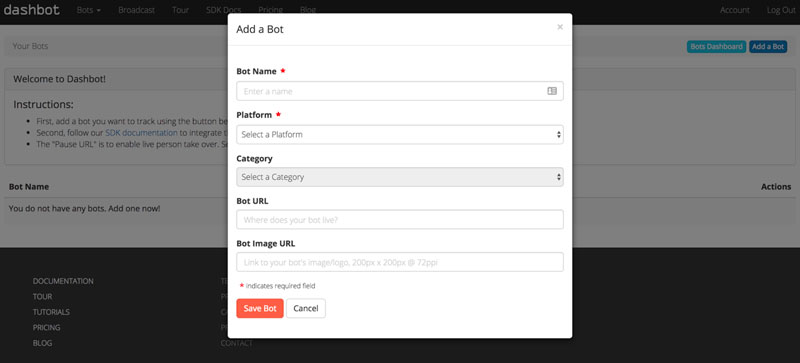

# [Integrations](../) > [Analytics](./README.md) > Dashbot

Learn how to use Dashbot Analytics for your Alexa Skills and Google Actions built with Jovo.

* [About Dashbot](#about-dashbot)
* [Installation](#installation)
   * [Create a Dashbot Bot](#create-a-dashbot-bot)
   * [Enable Dashbot in Jovo](#enable-dashbot-in-jovo)
   * [Download the Dashbot Package](#download-the-dashbot-package)


## About Dashbot


[Dashbot](https://www.dashbot.io/) is an analytics tool for both text-based bots (Facebook Messenger, Slack, Kik, Twitter) and voice apps (Amazon Alexa, Google Assistant).

The [Dashbot Voice Analytics](https://www.dashbot.io/voice) offering enables voice app developers to compare usage across Alexa Skills and Google Actions and see interaction flows and live transcripts.

## Installation

To use Dashbot Analytics for your voice app, you need to complete the following steps:

1. Create a Dashbot Bot
2. Enable Dashbot Analytics in your Jovo voice app
3. Download the dashbot npm package
4. Test your app

### Create a Dashbot Bot

1. Create a Dashbot account or log in at https://www.dashbot.io.

2. Click "Add a Bot" in the Admin panel:




3. Select the right Platform: Alexa for Alexa Skills, or Google for Google Actions (if you are developing for both Amazon Alexa and Google Assistant, please create 2 distinct Dashbot Bots):


4. Copy API Key


### Enable Dashbot in Jovo

You have to options to add Dashbot Analytics to your voice app:

* Use the Jovo app config
* Use the add commands

Below is an example for both:

```javascript
// Option 1: Use the Jovo app config
const config = {
    /**
     * Other settings
     */
    analytics: {
        services: {
            DashbotAlexa: {
                key: '<key>',
            },
            DashbotGoogleAction: {
                key: '<key>',
            },
        },
    },
};

// Option 2: Use the add commands
app.addDashbotAlexa('<key>');
app.addDashbotGoogleAction('<key>');
```

### Download the Dashbot Package

In your terminal, use the following command to download the package via npm:

```sh
$ npm install dashbot --save
```

### Test Dashbot

Test your voice app, after a bit your session should appear in the Report section (data is updated hourly):


<!--[metadata]: {"title": "Dashbot Analytics Integration", "description": "Add Dashbot Analytics to your Alexa Skills and Google Actions with Jovo", "activeSections": ["integrations", "analytics"], "expandedSections": "integrations", "inSections": "integrations", "breadCrumbs": {"Docs": "docs/", "Integrations": "docs/integrations", "Analytics": "docs/analytics", "Dashbot": "" }, "commentsID": "docs/analytics/dashbot",
"route": "docs/analytics/dashbot" }-->
