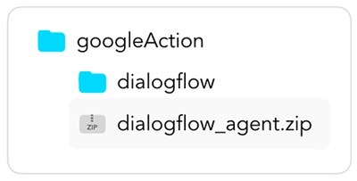
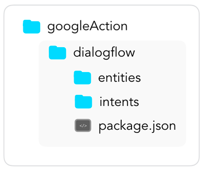

# Platforms

Learn more about the `platforms` folder, which represents the voice platform projects, including information and language models. Usually, this folder is just used for deployment.

* [Introduction](#introduction)
* [Alexa Skill](#alexa-skill)
    * [.ask](#.ask)
    * [interactionModels](#interactionmodels)
    * [skill.json](#skilljson)
    * [ask-resources.json](#ask-resourcesjson)
* [Google Action](#google-action)
    * [Dialogflow](#dialogflow)


## Introduction

The `platforms` folder includes all the information you need to deploy the project to the respective developer platforms Amazon Alexa and Google Assistant.


At the beginning of a new project, the folder doesn't exist until you either import an existing Alexa Skill project with [`jovo get`](../../../tools/cli/get.md '../cli/get'), or create the files from the Jovo Language Model with [`jovo build`](../../../tools/cli/build.md '../cli/build') (see [Workflows](../../../workflows '../workflows') for examples).

If you only want to work with a platform specific model, for example, you want to create just an Alexa Skill, you don't necessarily need the `/models` folder: The `/platforms` folder and the [`jovo deploy`](../../../tools/cli/deploy.md '../cli/deploy') command are enough. Go to [Jovo CLI Commands](../../../tools/cli '../cli') to learn more about all commands.

## Alexa Skill

The `alexaSkill` folder contains all the information of your Alexa Skill needed to deploy the skill to the Amazon Developer Portal using the [`Jovo CLI`](../../../tools/cli '../cli'). The `Jovo CLI` supports both `ASK CLI v2` and `ASK CLI v1`, each requiring a slightly different project structure. Read more about the migration [here](https://developer.amazon.com/en-US/docs/alexa/smapi/ask-cli-v1-to-v2-migration-guide.html).

#### .ask

The `.ask` folder contains the basic deploy settings of your skill, such as your project's `skillId`, inside a single file, `ask-states.json` for v2 of the `ASK CLI`, `config` for v1. We recommend you to not make any changes to these files.

##### `ask-cli@v2`:
```js
// ask-states.json
{
	"askcliStatesVersion": "2020-03-31",
	"profiles": {
		"default": {
			"skillId": "[Your Skill ID]",
			"skillMetadata": {
				"lastDeployHash": ""
			},
			"code": {}
		}
	}
}
```

##### `ask-cli@v1`:
```javascript
// config
{
	"deploy_settings": {
		"default": {
			"skill_id": "[Your Skill ID]",
			"was_cloned": false
		}
	}
}
```

#### interactionModels

Since version 2 of the `ask-cli` integrates an implementation of the [SMAPI](https://developer.amazon.com/en-US/docs/alexa/smapi/smapi-overview.html), most of the skill's data is organized in the `skill-package` folder. A skill package might consist of your skill's manifest, interaction models and optional account-linking information.

The Alexa Interaction Models are stored inside `alexaSkill/skill-package/interactionModels/custom/`. For v1 of the ASK CLI, the models are located at `alexaSkill/models/`. They can either be built by the [`jovo build`](../../../tools/cli/build.md '../cli/build') command (if you're making use of the [Jovo Language Model](../ '../')), updated manually, or updated in the Amazon Developer Portal and then imported with [`jovo get`](../../../tools/cli/get.md '../cli/get').

For more information about Alexa Interaction Models, please see the official reference by Amazon: [Custom Interaction Model Reference (Intents, Slots, Sample Utterances)](https://developer.amazon.com/docs/custom-skills/custom-interaction-model-reference.html).

```javascript
{
	"interactionModel": {
		"languageModel": {
			"invocationName": "my test app",
			"types": [],
			"intents": [
				{
					"name": "HelloWorldIntent",
					"samples": [
						"hello",
						"say hello",
						"say hello world"
					]
				},
				{
					"name": "MyNameIsIntent",
					"samples": [
						"{name}",
						"my name is {name}",
						"i am {name}",
						"you can call me {name}"
					],
					"slots": [
						{
							"name": "name",
							"type": "AMAZON.US_FIRST_NAME"
						}
					]
				},
				{
					"name": "AMAZON.CancelIntent",
					"samples": []
				},
				{
					"name": "AMAZON.HelpIntent",
					"samples": []
				},
				{
					"name": "AMAZON.StopIntent",
					"samples": []
				}
			]
		}
	}
}
```

#### skill.json

`skill.json` contains the publication and configuration information of your Skill. This can be either updated manually or in the Amazon Developer Portal (and then imported with the [`jovo get`](../../../tools/cli/get.md '../cli/get') command). If you have v2 of the `ASK CLI` installed, the file's location is `alexaSkill/skill-package/`, else it's located inside `alexaSkill/`.

```javascript
{
	"skillManifest": {
		"publishingInformation": {
			"locales": {
				"en-US": {
					"summary": "Jovo Sample App",
					"examplePhrases": [
						"Alexa open my test app"
					],
					"name": "hello-world",
					"description": "Sample Full Description"
				}
			},
			"isAvailableWorldwide": true,
			"testingInstructions": "Sample Testing Instructions.",
			"category": "EDUCATION_AND_REFERENCE",
			"distributionCountries": []
		},
		"apis": {
			"custom": {}
		},
		"manifestVersion": "1.0"
	}
}
```

#### ask-resources.json

V2 of the `ASK CLI` requires an additional file, `ask-resources.json`. This file contains your project's configuration for use with the Skill Management API.

```js
{
	"askcliResourcesVersion": "2020-03-31",
	"profiles": {
		"default": {
			"skillMetadata": {
				"src": "./skill-package"
			}
		}
	}
}
```

## Google Action

The `googleAction` folder currently contains the `dialogflow` (as supported natural language understanding tool) folder with all the files needed to  deploy the agent to Dialogflow Console using the [`Jovo CLI`](../../../tools/cli '../cli').


Please note that Jovo currently supports **Dialogflow v1**, which means that you can't programmatically create or update your agent. However, the [`jovo deploy`](../../../tools/cli/deploy.md '../cli/deploy') command will create a `zip` which you can then import into Dialogflow.

It will be stored inside the `googleAction` folder:



### Dialogflow

The `dialogflow` folder contains the following folders:



#### Intents

All the `intents` are saved in separate files and look like this:

```javascript
{
	"name": "MyNameIsIntent",
	"auto": true,
	"webhookUsed": true,
	"responses": [
		{
			"parameters": [
				{
					"isList": false,
					"name": "name",
					"value": "$name",
					"dataType": "@sys.given-name"
				}
			]
		}
	]
}
```

It is important that `"webhookUsed"` is set to `true` for your Jovo code to be triggered when this intent is called.

The user phrases are added to a different file for each language, e.g. `MyNameIsIntent_usersays_en-us.json`, and look like this:

```javascript
[
	{
		"data": [
			{
				"text": "name",
				"userDefined": true,
				"alias": "name",
				"meta": "@sys.given-name"
			}
		],
		"isTemplate": false,
		"count": 0
	},
	{
		"data": [
			{
				"text": "my name is ",
				"userDefined": false
			},
			{
				"text": "name",
				"userDefined": true,
				"alias": "name",
				"meta": "@sys.given-name"
			}
		],
		"isTemplate": false,
		"count": 0
	},
	{
		"data": [
			{
				"text": "i am ",
				"userDefined": false
			},
			{
				"text": "name",
				"userDefined": true,
				"alias": "name",
				"meta": "@sys.given-name"
			}
		],
		"isTemplate": false,
		"count": 0
	},
	{
		"data": [
			{
				"text": "you can call me ",
				"userDefined": false
			},
			{
				"text": "name",
				"userDefined": true,
				"alias": "name",
				"meta": "@sys.given-name"
			}
		],
		"isTemplate": false,
		"count": 0
	}
```

#### Entities

If you have defined input types, you will find the `entities` in separate folders as well.

#### package.json

This includes some agent specific information. We recommend to not change this file unless you know what you're doing.

<!--[metadata]: {"description": "Convert your Jovo Language Model to both Amazon Alexa and Dialogflow (for Google Assistant).",
				"route": "model/platforms"}-->

