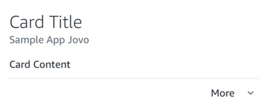
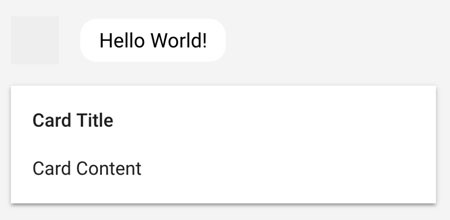
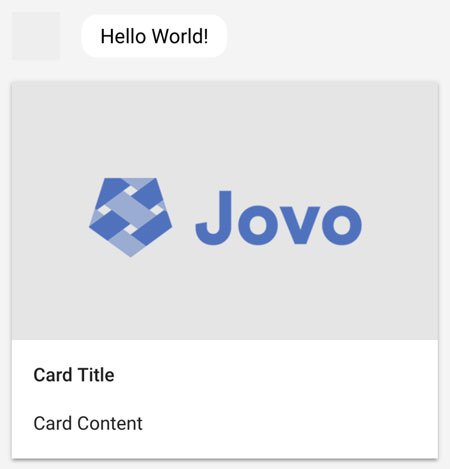

# Visual Output

> To view this page on the Jovo website, visit https://v3.jovo.tech/docs/output/visual-output

In this section, you will learn about the different ways to add visual output to your voice application.

- [Quick-Replies](#quick-replies)
- [Cards](#cards)
- [Alexa Specific Visual Output](#alexa-specific-visual-output)
- [Google Assistant Specific Visual Output](#google-assistant-specific-visual-output)

## Quick-Replies

It is possible to set quick-replies for every platform that supports them by using `showQuickReplies`.

```javascript
this.showQuickReplies(['Yes', 'No']);
```

Additionally, it is also possible to pass a `QuickReply`-object:

```javascript
this.showQuickReplies([
	{
		label: 'Tea',
		value: 'prod-123',
	},
	{
		label: 'Coffee',
		value: 'prod-311',
	},
]);
```

This is useful for platforms that support quick-replies with label that is different from the payload.

## Cards

With both Amazon Alexa and Google Assistant, developers have the ability to display visual information in the respective companion app. These visual elements are sometimes called cards, or home cards.

You can find detailed documentation provided by the platforms here:

- Amazon Alexa: [Including a Card in Your Skill's Response](https://developer.amazon.com/public/solutions/alexa/alexa-skills-kit/docs/providing-home-cards-for-the-amazon-alexa-app), and [Best Practices for Skill Card Design](https://developer.amazon.com/public/solutions/alexa/alexa-skills-kit/docs/best-practices-for-skill-card-design)
- Google Assistant: [Surface Capabilities](https://developers.google.com/actions/assistant/surface-capabilities), and [Basic Card](https://developers.google.com/actions/assistant/responses#basic_card)

### SimpleCard

A `SimpleCard` contains a title and body content. You can use the method `showSimpleCard` to display it.

```javascript
let title = 'Card Title';
let content = 'Card Content';

this.showSimpleCard(title, content).tell('Hello World!');
```

Result in Alexa app:



Result in the Actions on Google simulator:



### Image Card

An `ImageCard` (`StandardCard` in Alexa terms) contains an additional image for more visual information. It can be added with the method `showImageCard`:

```javascript
let title = 'Card Title';
let content = 'Card Content';
let imageUrl = 'https://s3.amazonaws.com/jovocards/SampleImageCardSmall.png';

this.showImageCard(title, content, imageUrl).tell('Hello World!');
```

Result in Alexa app:


Result in the Actions on Google simulator:



You can also pass an object as `imageUrl` to provide a `smallImageUrl`and `largeImageUrl` (for Alexa Skills):

```javascript
this.$alexaSkill
	.showStandardCard('Card Title', ' Card Content', {
		smallImageUrl: 'https://via.placeholder.com/720x480',
		largeImageUrl: 'https://via.placeholder.com/1200x800',
	})
	.tell('Hello World!');
```

Image dimensions:

- Amazon Alexa: Small images (`720px x 480px`) and large images (`1200px x 800px`)
- Google Assistant: Height is fixed to `192dp` ([see here](https://developers.google.com/actions/reference/rest/Shared.Types/AppResponse#basiccard))

Important: Image files must be accessible by the public and support CORS (cross-origin resource sharing). For example, if you're hosting the file with the wrong permissions on AWS S3, and try to access it, the response could look like this:

```json
(
	<Error>
		<Code>AccessDenied</Code>
		<Message>Access Denied</Message>
		<RequestId>DDDE88511DSGS6S86</RequestId>
		<HostId>g0asd6dEdsd6X8sdSSD234P9sSsw60SDSDeSdwsdE+sV4b=</HostId>
	</Error>
)
```

You can find a troubleshooting guide by Amazon [here](https://developer.amazon.com/public/solutions/alexa/alexa-skills-kit/docs/providing-home-cards-for-the-amazon-alexa-app#common-issues-when-including-images-in-standard-cards).

## Platform Specific Visual Output

Each platform might support other kinds of visual output besides the ones listed above. You can find the detailed list in each platform's documentation [here](../../platforms/README.md '../platforms/').

<!--[metadata]: {"description": "Learn how to create visual output for Alexa Skills and Google Actions with the Jovo Framework", "route": "output/visual-output"}-->
