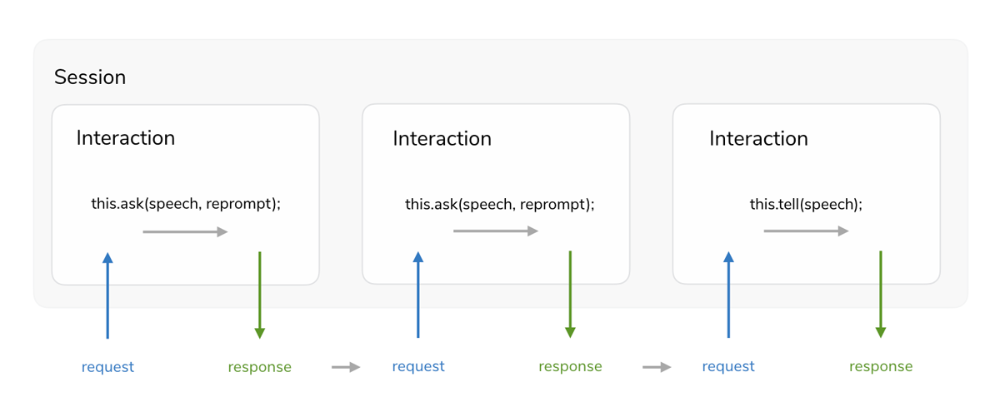

# Routing

In this section, you will learn more about how to use intents and states to route your users through your voice app.

* [Introduction to User Sessions](#introduction-to-user-sessions)
* [Handlers](#handlers)
  * [Separate Handlers](#separate-handlers)
  * [Platform Handlers](#platform-handlers) 
* [Intents](#intents)
* [States](#states)
* [Event Listeners](#event-listeners)
* [User Input](#user-input)
* [Session Attributes](#session-attributes)

## Introduction to User Sessions

A `session` is an uninterrupted interaction between a user and your application. It consists of at least one `request`, but can have a series of inputs and outputs. A session can end for the following reasons:

* The response includes `shouldEndSession`, which is true for `tell` and `endSession` method calls
* A user doesn't respond to an ask prompt and the session times out
* The user asks to end the session by saying "quit" or "exit"

Sessions that contain only a single request with a `tell` response could look like this:


For more conversational experiences that require back and forth between your app and user, you need to use the `ask` method. Here is what a session with two requests could look like:



To save user data in form of attributes across requests during a session, take a look at the [Session Attributes](#session-attributes) section below. The platforms don't offer the ability to store user data across sessions. For this, Jovo offers a [Persistence Layer](../../06_integrations/databases#filepersistence './databases#filepersistence').

## Handlers

The routing is done with `handlers`, which can be added with the `app.setHandler` method in the `app.js`:

```javascript
app.setHandler({
    
    // Add intents and states here

});
```

### Separate Handlers

You can add multiple handlers by passing more than one object to the `setHandler` method:

```javascript
app.setHandler(handler1, handler2, ..);
```

This allows you to have the handlers separated into different files (as modules), which can then be added to `setHandler` by using `require`:

```javascript
app.setHandler(
    require('./handlers/stateless'),

    // Option 1: Require full object
    require('./handlers/firstState'),

    // Option 2: Require inside state object
    {
        'SecondState': require('./handlers/secondState'),
    }
);
```

The `stateless.js` file could look like this:

```javascript
module.exports = {
    LAUNCH() {
        this.followUpState('FirstState')
            .ask('Do you want to get started?');
    },

    Unhandled() {
        this.toIntent('LAUNCH');
    },
};
```
A more general [introduction to states](#states) can be found below.

For a full example of separating handlers into different files, take a look at this GitHub repository: [jankoenig/jovo-separate-handlers](https://github.com/jankoenig/jovo-separate-handlers).

### Platform Handlers

For cases where the experience differs on Alexa and Google Assistant, you can use the methods `setAlexaHandler` and `setGoogleActionHandler` to overwrite the default handlers.

Here is an example that offers different output for the two platforms:

```javascript
const handlers = {
    LAUNCH() {
        this.toIntent('HelloWorldIntent');
    },
};

const alexaHandlers = {
    HelloWorldIntent() {
        this.tell('Hello Alexa User');
    },
};

const googleActionHandlers = {
    HelloWorldIntent() {
        this.tell('Hello Google User');
    },
};

app.setHandler(handlers);
app.setAlexaHandler(alexaHandlers);
app.setGoogleActionHandler(googleActionHandlers);
```

## Intents

If you're new to voice applications, you can learn more general info about principles like intents here: [Getting Started > Voice App Basics](../../01_getting-started/voice-app-basics.md './voice-app-basics').

Besides at least one of the the required [`'LAUNCH'`](#launch-intent) or [`'NEW_SESSION'`](#new-session-intent) intents, you can add more intents that you defined at the respective developer platforms (see how to create an intent for [Amazon Alexa](https://www.jovo.tech/blog/alexa-skill-tutorial-nodejs/#helloworldintent) and [Google Assistant](https://www.jovo.tech/blog/google-action-tutorial-nodejs/#helloworldintent) in our beginner tutorials) like this:

```javascript
app.setHandler({
    LAUNCH() {
        // Triggered when people open the voice app without a specific query
        this.tell('Hello World!');
    },

    YourFirstIntent() {
      // Do something here

    },

});
```

Whenever your application gets a request from one of the voice platforms, this will either be accompanied with an intent (which you need to add), or the signal to start or end the session.

For this, Jovo offers standard, built-in intents, `'LAUNCH'` and `'END'`, to make cross-platform intent handling easier:

```javascript
app.setHandler({

    LAUNCH() {
        // Triggered when people open the voice app without a specific query
        // Groups LaunchRequest (Alexa) and Default Welcome Intent (Dialogflow)
    },

    // Add more intents here

    END() {
        // Triggered when the session ends
        // Currently supporting AMAZON.StopIntent and reprompt timeouts
    }
});
```


## States

For simple voice apps, the structure to handle the logic is quite simple:

```javascript
app.setHandler({

    'LAUNCH' : function() {
        // Do something
    },

    'YesIntent' : function() {
        // Do something
    },

    'NoIntent' : function() {
        // Do something
    },

    'END' : function() {
        // Do something
    }
});
```

This means, no matter how deep into the conversation with your voice app the user is, they will always end up at a specific `'YesIntent'` or `'NoIntent'`. As a developer need to figure out yourself which question they just answered with "Yes."

This is where `states` can be helpful. For more complex voice apps that include multiple user flows, it is necessary to remember and route through some user states to understand at which position the conversation currently is. For example, especially "Yes" and "No" as answers might show up across your voice app for a various number of questions. For each question, a state would be very helpful to distinct between different Yes's and No's.

With Jovo, you can include states like this:

```javascript
app.setHandler({

    'LAUNCH' : function() {
        let speech = 'Do you want to order something?';
        let reprompt = 'Please answer with yes or no.';
        this.followUpState('OrderState')
            .ask(speech, reprompt);
    },
    
    // Example: Behave differently for a 'yes' or 'no' answer inside order state
    'OrderState' : {
        
        'YesIntent' : function() {
           // Do something
        },

        'NoIntent' : function() {
           // Do something
        },
    },
});
```

By routing a user to a state (by using [`followUpState`](#followupstate)), this means you can react specifically to this certain situation in the process.

When a user is in a certain state and calls an intent, Jovo will first look if that intent is available in the given state. If not, a fallback option needs to be provided outside any state:

```javascript
app.setHandler({

    'LAUNCH' : function() {
        // do something
    },
    
    // Example: behave differently for a 'yes' or 'no' answer inside order state
    'OrderState' : {
        
        'YesIntent' : function() {
           // do something
        },

        'NoIntent' : function() {
           // do something
        },

    },

    'YesIntent' : function() {
        // do something
    },

    'NoIntent' : function() {
        // do something
    },

    'END' : function() {
        // do something
    }

});
```

Alternatively, you can also use an [`Unhandled`](#unhandled-intent) intent as described in the section above:

```javascript
app.setHandler({

    'LAUNCH' : function() {
        // do something
    },
    
    // Example: behave differently for a 'yes' or 'no' answer inside order state
    'OrderState' : {
        
        'YesIntent' : function() {
           // do something
        },

        'NoIntent' : function() {
           // Do something
        },

    },

    'Unhandled' : function() {
        // Do something
    },

    'END' : function() {
        // Do something
    }

});
```

## Event Listeners

Event Listeners offer a way for you to react on certain events like `onRequest` and `onResponse`. Find out more about event listeners here: [App Logic > Routing > Event Listeners](./event-listeners.md './routing/event-listeners').

## User Input

To learn more about how to make use of user input (slots on Alexa and entities on Dialoflow), take a look at this section: [App Logic > Data](../02_data './data').

## Session Attributes

It might be helpful to save certain information across requests during a session (find out more about [session management in the introduction above](#introduction-to-session-management)). This can be done with Session Attributes.

The `setSessionAttribute` and `setSessionAttributes` methods can be used to store certain information that you can use later within the session. It's like a cookie that's alive until the session ends (usually after calling the `tell` function or when the user requests to stop).

```javascript
this.$session.$data.key = value;

// Set the current game score to 130 points
this.$session.$data.score = 130;

// Set the current game score to 130 points and number of games to 2
this.$session.$data = { score: 130, games: 2 };
```

You can either access all session attributes with `getSessionAttributes`, or call for a certain attribute with `getSessionAttribute(key)`.

```javascript
let attributes = this.getSessionAttributes();
let value = this.getSessionAttribute(key);

// Save current session's game score to variable
let score = this.getSessionAttribute('score');
```

Have a look at [App Logic > Data](../02_data './data') to learn more about how to persist data across sessions.


<!--[metadata]: { "description": "Learn how to route through your voice app logic with Jovo.",
		"route": "routing"
                }-->
