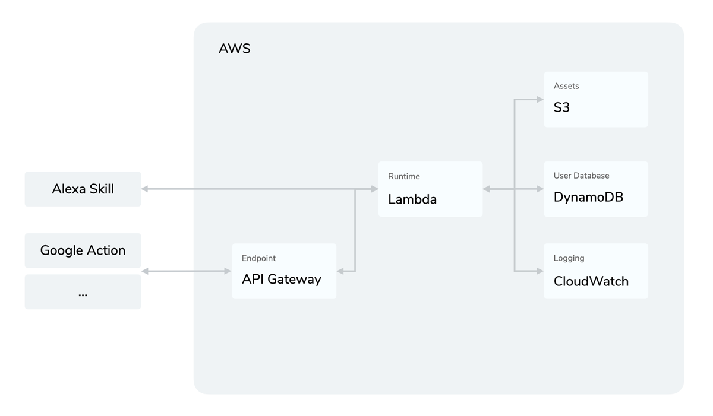

# AWS Lambda

> To view this page on the Jovo website, visit https://www.jovo.tech/docs/hosting/aws-lambda

[AWS Lambda](https://aws.amazon.com/lambda/) is a serverless hosting solution by Amazon Web Services. Find the [official documentation here](http://docs.aws.amazon.com/lambda/latest/dg/welcome.html).

- [Introduction](#introduction)
- [Lambda Configuration](#lambda-configuration)
- [Deployment](#deployment)
  - [Creating a Lambda Function](#creating-a-lambda-function)
  - [Uploading Code](#uploading-code)
- [Additional Services](#additional-services)
  - [DynamoDb](#dynamodb)
  - [API Gateway](#api-gateway)
- [Troubleshooting](#troubleshooting)

## Introduction

[AWS Lambda](https://aws.amazon.com/lambda/) allows you to host your Jovo app on a cloud-based service, without having to worry about scalability and availability. Apart from hosting your voice app, you can also enable further services to enhance your Lambda function.



- [API Gateway](https://aws.amazon.com/api-gateway/): Lets you create an API to proxy requests to your Lambda function. Learn more about the setup [here](#api-gateway).
- [CloudWatch](https://aws.amazon.com/cloudwatch/): Collects monitoring data in the form of logs and metrics.
- [DynamoDb](https://aws.amazon.com/dynamodb/): Database integration, allowing you to store user data in a NoSQL environment. Learn more about DynamoDb [here](https://www.jovo.tech/marketplace/jovo-db-dynamodb).
- [S3](https://aws.amazon.com/s3/): Storage service, allowing you to store any amount of data in buckets.

## Lambda Configuration

Here is how the part of `index.js`, which is used to run the app on AWS Lambda, looks like:

```javascript
// @language=javascript

// src/index.js

'use strict';

const { Lambda } = require('jovo-framework');
const { app } = require('./app/app.js');

exports.handler = async (event, context, callback) => {
	await app.handle(new Lambda(event, context, callback));
};

// @language=typescript

// src/index.ts

import { Lambda } from 'jovo-framework';
import { app } from './app';

exports.handler = async (event: any, context: any, callback: Function) => {
	await app.handle(new Lambda(event, context, callback));
};
```

## Deployment

### Creating a Lambda Function

While for Alexa, the process of hosting a Skill on Lambda is straightforward, for a Google Action there are additional steps that need to be taken to create an API Gateway. To learn more about how to run your voice app on Lambda, please take a look at our step-by-step tutorials:

- [Run your Alexa Skill on Lambda](https://www.jovo.tech/tutorials/alexa-skill-tutorial-nodejs/#aws-lambda)
- [Run your Google Action on Lambda with an API Gateway](https://www.jovo.tech/tutorials/host-google-action-on-lambda)

### Uploading Code

You can create a ready-to-deploy `bundle.zip` file with either of the following commands:

```sh
# Bundle files
$ jovo3 deploy --target zip

# Alternative
$ npm run bundle
```

This will copy the `src` files into a `bundle` folder, run a production-only npm install, and then zip it. You can then use this file and upload it to your Lambda function.

If you have a Lambda endpoint defined in your `project.js` file, the `jovo deploy` command will not only [deploy platform projects](../../workflows/project-lifecycle.md/#deploy-platform-projects '../project-lifecycle#deploy-platform-projects'), but also bundle and upload your source code to AWS Lambda:

```sh
# Deploy platform projects and source code
$ jovo3 deploy
```

## Additional Services

### DynamoDb

> Tutorial: [Add DynamoDB to Store User Data](https://www.jovo.tech/tutorials/add-dynamodb-database)

The [FileDb](../../integrations/databases/file-db.md '../databases/file-db') database integration does not work on AWS Lambda. It is encouraged to switch to [DynamoDB](../../integrations/databases/dynamodb.md '../databases/dynamodb') before uploading to Lambda.

### API Gateway

If you want to use your Jovo app outside of the AWS environment, you need to set up API Gateway to proxy your app's requests to your Lambda function. You can choose between two options for setup, either directly through your Lambda function, or through the [API Gateway console](console.aws.amazon.com/apigateway).

#### Setup through AWS Lambda

If you choose to create your API Gateway through your Lambda function, you need to add a new trigger in your function's designer. In the trigger configuration, choose to create an API and configure it as such:


Those are just the default settings, giving you the fastest setup, so you can test your API right away. However, we recommend you to further configure your API Gateway for security reasons.

If you now select "Add trigger", AWS will add API Gateway to your Lambda function. You can inspect it in your function's designer to get your API's endpoint.

#### Setup through API Gateway console

Creating API Gateway through it's console requires more setup, but gives you the option to fully customize your API according to your needs.

Go to console.aws.amazon.com/apigateway and create a new REST API to get started. Choose an appropriate API name and description and select "Create your API". This will bring you to your API's confiuration panel, where you can add resources, set up security and deploy your API.

Add a new POST method to your API and configure it to use your Lambda function as a Proxy Integration:


After saving your method, you can already deploy your API by selecting "Actions" > "Deploy API" to a new stage. This should take you to the stage editor, where you can also see your API's endpoint, which you can now use to invoke your Lambda function from a webserver, for example. Again, this is the most basic setup, and we recommend you to take further configuration for security reasons.

#### CORS

If you have problems reaching your API due to [CORS](https://developer.mozilla.org/en-US/docs/Web/HTTP/CORS), you need to make a few changes to your API's configuration. First, whether you created your API through Lambda or directly through the console, you'll need to recreate the POST method as described [here](#setup-through-api-gateway-console) and uncheck the "Use Lambda Proxy Integration" option. This enables you to set headers for your API's response, after the response has been sent from AWS Lambda.

Now, all you need to do is to enable CORS by going to "Actions" > "Enable CORS". This will create an additional `OPTIONS` method, which will be used by your webservice to determine allowed methods and headers. Additionally, AWS will set the required headers for CORS to work. If you want to restrict access to your endpoint, you can set specific rules for allowed request origins.

If you save this configuration, you need to deploy your API once again to save your changes and you're good to go!

<!--[metadata]: {"description": "Deploy your Alexa Skills and Google Actions on AWS Lambda with the Jovo Framework", "route": "hosting/aws-lambda"}-->
