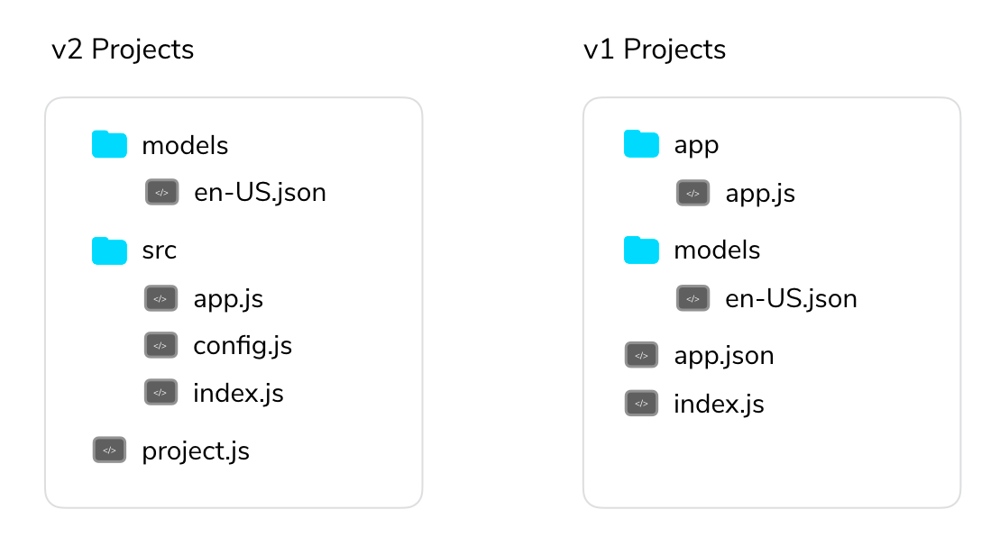

# Jovo v2 Migration Guide

We just released a huge update to the Jovo Framework: Version 2! Learn how to migrate from a Jovo v1 project to the new v2 of the Jovo Framework, or [check out our Quickstart guide](../README.md '../quickstart').

* [Getting Started with v2](#getting-started-with-v2)
    * [Installation](#installation)
    * [Project Structure](#project-structure)
* [Updated Concepts](#updated-concepts)
    * [Plugins](#plugins)
    * [Jovo Objects](#jovo-objects)
    * [Integrations](#integrations)
    * [Response Execution](#response-execution)
* [Breaking Changes](#breaking-changes)
    * [Inputs](#inputs)
    * [State Management](#state-management)
    * [Unit Testing](#unit-testing)
    * [Changes to the User Object](#changes-to-the-user-object)
    * [getEndReason](#getendreason)
* [Optional Changes](#optional-changes)
    * [Intent Syntax](#intent-syntax)
    * [Data Management](#data-management)
    * [Alexa Dialog Interface](#alexa-dialog-interface)
* [Examples](#examples)


[](https://www.youtube.com/watch?v=yP39wuZAwXo)

## Getting Started with v2

> New to Jovo? [Check out our Quickstart guide](../README.md '../quickstart').

With the update to `v2` we've have completely refactored the code base of both the Jovo Framework and the Jovo CLI to make it more modular and easier to extend.

The code base now has a plugin architecture, where each platform (e.g. Amazon Alexa, Google Assistant), integration (e.g. DynamoDb, Dashbot) and tool (e.g. Jovo Debugger) can be added and removed as a plugin.

Although most of these changes were under the hood and don't directly affect the usage of the framework, we used the chance to make quality of life changes to the project structure and increased the consistency of the framework's interfaces.

### Installation

To get started with the new Jovo `v2`, install the Jovo CLI:

```sh
$ npm install -g jovo-cli

# sudo may be required
$ sudo npm install -g jovo-cli

# If you run into problems, uninstall v1 versions first
$ sudo npm uninstall -g jovo-cli
```

Then, create a new Jovo project with:

```sh
$ jovo new <directory>
```


### Project Structure

New Jovo projects have an updated folder structure.



There are several changes that are important:
* [`project.js`](#projectjs) (previously `app.json`)
* `src` (including `index.js` and `app.js`)
* [`config.js`](#configjs)
* [Deployment](#deployment)

#### project.js

> [Find everything about `project.js` here](../../configuration/project-js.md '../project-js').

The `project.js` file is the equivalent to the `app.json` file with small tweaks here and there. It stores all project related configurations and is only used for the build and deploy processes. 

That means overriding certain parts of your app config using (like different databases for different stages) the `project.js` file won't be possible anymore. That's now done with the [`config.js`](#config.js).

Besides that, everything works the same as with `v1`.

```javascript
// ------------------------------------------------------------------
// JOVO PROJECT CONFIGURATION
// ------------------------------------------------------------------

module.exports = {
    alexaSkill: {
        nlu: 'alexa',
    },
    googleAction: {
        nlu: 'dialogflow',
    },
    endpoint: '${JOVO_WEBHOOK_URL}',
};
```

#### config.js

> [Find everything about `config.js` here](../../configuration/config-js.md '../config-js').

The `config.js` file is the equivalent to the configuration part at the top of the `app.js` file in the default project structure.

```javascript
// ------------------------------------------------------------------
// APP CONFIGURATION
// ------------------------------------------------------------------

module.exports = {
   logging: true,

   intentMap: {
      'AMAZON.StopIntent': 'END',
   },

   db: {
        FileDb: {
            pathToFile: '../db/db.json',
        }
    },
};
```

To override certain configurations in different stages we use individual config files for each stage: `config.dev.js`, `config.prod.js`, etc.

For example we could disable `logging` in our `prod` stage using the `config.prod.js` file:

```javascript
// config.prod.js file

module.exports = {
    logging: false,
}
```

#### Deployment

Since the project structure is different (the `index.js` is now in `src` as opposed to the root directory), there is a slight update to the deployment process.

Instead of zipping the complete project folder (which was quite large anyways), you can create an optimized `bundle.zip` file with either of the following commands:

```sh
# Bundle files
$ jovo deploy --target zip

# Alternative
$ npm run bundle
```

This will copy the `src` files into a `bundle` folder, run a production-only npm install, and then zip it.

You can then use this file and upload it to the hosting provider of your choice.

To be able to run this command, you need the following script in your `package.json`(default for fresh new projects):

```js
"scripts": {
    "bundle": "gulp --gulpfile node_modules/jovo-framework/gulpfile.js --cwd ./",
  },
```

## Updated Concepts

The Jovo architecture has a few new concepts:

* [Plugins](#plugins)
* [Jovo Objects](#jovo-variables)
* [Integrations](#integrations)
* [Response Execution](#response-execution)

### Plugins

> [Find everything about plugins here](../../advanced-concepts/plugins.md '../plugins').

With the new plugin architecture of the framework, the core `jovo-framework` npm package does not contain all the features anymore. Each platform, integration and tool has to be imported, configured and initialized individually.

Let's go over the process by integrating the `FileDb` plugin, which allows us to use a `JSON` file as a local database for development:

We first install the plugin:

```text
npm install --save jovo-db-filedb
```

After that we go our `app.js` file, which is now located in the `src` folder and import as well as initialize the plugin:

```javascript
// src/app.js file

const { App } = require('jovo-framework');
const { FileDb } = require('jovo-db-filedb');
// Other plugins

const app = new App();

app.use(
    // Other plugins
    new FileDb()
);

// Rest of the app.js file
```

The same procedure has to be done for each plugin. 

By default, a new `v2` project comes with the `Alexa`, `GoogleAssistant`, `FileDb`, and `JovoDebugger` plugins:

```javascript
// src/app.js

const { App } = require('jovo-framework');
const { Alexa } = require('jovo-platform-alexa');
const { GoogleAssistant } = require('jovo-platform-googleassistant');
const { FileDb } = require('jovo-plugin-filedb');
const { JovoDebugger } = require('jovo-plugin-debugger');

const app = new App();

app.use(
    new Alexa(),
    new GoogleAssistant(),
    new FileDb(),
    new JovoDebugger()
);
```

### Jovo Objects

For `v2` we've updated the way interfaces are called to make it easily distinguishable from actual method calls:

```javascript
// v1:
this.alexaSkill().audioPlayer().stop();

// v2:
this.$alexaSkill.$audioPlayer.stop();
```

Here's the list of changes:

`v1` | `v2`
:--- | :---
`request()` | `$request`
`response()` | `$response`
`user()` | `$user`
`user().data` | `$user.$data`
`getInputs()` | `$inputs`
`speech` | `$speech`
`reprompt` | `$reprompt`
`alexaSkill()` | `$alexaSkill`
`alexaSkill().audioPlayer()` | `$alexaSkill.$audioPlayer`
 `alexaSkill().dialogInterface()` | `$alexaSkill.$dialog`
`alexaSkill().gadgetController()` | `$alexaSkill.$gadgetController`
`alexaSkill().gameEngine()` | `$alexaSkill.$gameEngine`
`alexaSkill().inSkillPurchase()` | `$alexaSkill.$inSkillPurchase`
`googleAction()` | `$googleAction`
`googleAction().audioPlayer()` | `$googleAction.$audioPlayer`


### Integrations

We updated existing integration layers and added new interfaces. Take a look here to learn more about our:
* [Database Integrations](../../integrations/databases '../databases')
* [CMS Integrations](../../integrations/cms '../cms')
* [Analytics Integrations](../../integrations/analytics '../analytics')

### Response Execution

Intents run through and send out a response at the end automatically, which means `this.endSession()` is obsolete.

Besides that, you now have to handle asynchronous tasks appropriately, otherwise the response will be sent out, before you, for example, fetched the data from the API. The most convenient way is using [`async` functions](https://developer.mozilla.org/en-US/docs/Web/JavaScript/Reference/Statements/async_function).


## Breaking Changes

* [Inputs](#inputs)
* [State Management](#state-management)
* [Unit Testing](#unit-testing)
* [Changes to the User Object](#changes-to-the-user-object)


### Inputs

With `v2` you won't be able to access user inputs by adding them as parameters to your intent anymore. Inputs can now be accessed by using a new `$inputs` object:

```javascript
// Recommended
MyNameIsIntent() {
    this.tell('Hey ' + this.$inputs.name.value + ', nice to meet you!');
},

// Still works
MyNameIsIntent() {
    this.tell('Hey ' + this.getInput('name').value + ', nice to meet you!');
},

// Does not work anymore
MyNameIsIntent(name) {
    this.tell('Hey ' + name.value + ', nice to meet you!');
},
```

Also, you won't be able to pass additional data in redirects anymore. Here is our recommended (more consistent) way to pass interaction specific data:

```javascript
this.$data.moreData = 'someData';
return this.toIntent('PizzaIntent');


// Old: Go to PizzaIntent and pass more data
return this.toIntent('PizzaIntent', moreData);
```

### State Management

Previously, a state was saved in a session attribute called `STATE`. To make sure this does not interfere with the own data you save in sessions, we renamed it to `_JOVO_STATE_`.

```javascript
// Typical notation for saving a state into the session data
this.followUpState('OrderState');

// This does the same as followUpState above
this.$session.$data._JOVO_STATE_ = 'OrderState';
```

### Unit Testing

> [Learn more about unit testing here](../../workflows/unit-testing.md '../unit-testing').

In `v1`, Jovo used a combination of `mocha` and `chai` for unit testing. In `v2`, we switched to `Jest` and provide a cleaner experience that leverages `async` and `await`.

### Changes to the User Object

> [Learn more about the User Object here](../../basic-concepts/data/user.md '../data/user').

#### User Data

> [Learn more about Data Management here](../../basic-concepts/data '../data').

```javascript
// Old
this.user().data.key = value;

// New
this.$user.$data.key = value;
```

#### User ID

```javascript
// Old
this.user().isNewUser()

// New
this.$user.isNew()
```

#### Alexa User Methods

> [Learn more about Alexa specific features here](../../platforms/amazon-alexa '../amazon-alexa').

To keep platform specific user methods more organized, it is now necessary to use the platform's user object (`this.$alexaSkill.$user`) to call features from e.g. the [Alexa Settings API](../../platforms/amazon-alexa/settings.md '../amazon-alexa/settings'):

```javascript
// Old
this.user().getTimezone()

// New
this.$alexaSkill.$user.getTimezone()
```

Learn more by taking a look at the following docs:

* [Alexa Data](../../platforms/amazon-alexa/data.md '../amazon-alexa/data')
* [Alexa Lists](../../platforms/amazon-alexa/lists.md '../amazon-alexa/lists')
* [Alexa Settings](../../platforms/amazon-alexa/settings.md '../amazon-alexa/settings')
* [Alexa Reminders](../../platforms/amazon-alexa/reminders.md '../amazon-alexa/reminders')

### getEndReason

In the `END` handler (for `SessionEndedRequests`), the Alexa specific reason for the ended session could be retrieved.

As this is not a cross-platform feature, it is now moved to the `this.$alexaSkill` element:

```javascript
// Old
this.getEndReason()

// New (both work)
this.$alexaSkill.$request.request.reason;
this.$alexaSkill.getEndReason();
```


## Optional Changes

* [Intent Syntax](#intent-syntax) 
* [Data Management](#data-management) 
* [Alexa Dialog Interface](#alexa-dialog-interface)

### Intent Syntax

In `v2` we use the method syntax introduced with ES6:

```javascript
// old
app.setHandler({
    'LAUNCH': function() {

    },
    'HelloWorldState': {
        'HelloWorldIntent': function() {

        }
    },
    'AUDIOPLAYER': {
        'AudioPlayer.PlaybackStarted': function() {

        },
    }
});

// new
app.setHandler({
    LAUNCH() {

    },
    HelloWorldState: {
        HelloWorldIntent() {

        }
    },
    AUDIOPLAYER: {
        'AlexaSkill.PlaybackStarted'() {

        },
    }

})
```

### Data Management

> [Learn more about Data Management here](../../basic-concepts/data '../data').

We changed the naming of how you can access data to provide a more consistent experience:

```javascript
// Interaction Data: Only relevant for current interaction (request - response)
this.$data.key = value;

// Session Data: Only relevant for current session ("session attributes")
this.$session.$data.key = value; // recommended
this.setSessionAttribute(key, value); // still works

// User Data: Relevant across sessions (database integrations)
this.$user.$data.key = value;

// App Data: Special type of data, stored into app object on startup
this.$app.$data.key = value;
```


### Alexa Dialog Interface

To increase consistency, the dialog feature of Alexa has its own interface now, `this.$alexaSkill.$dialog`, instead of being directly accessibly through the `$alexaSkill` interface.

As a result, there were also method name changes:

`v1` | `v2`
:--- | :---
`dialogDelegate()` | `$dialog.delegate()`
`dialogElicitSlot()` | `$dialog.elicitSlot()`
`dialogConfirmSlot()` | `$dialog.confirmSlot()`
`dialogConfirmIntent()` | `$dialog.confirmIntent()`
`getDialogState()` | `$dialog.getState()`
`isDialogCompleted()` | `$dialog.isCompleted()`
`isDialogInProgress()` | `$dialog.isInProgress()`
`isDialogStarted()` | `$dialog.isStarted()`

While we recommend to use the new naming conventions, the old ones still work (deprecated).


## Examples

For more examples how all of these changes look in action, we've updated both the [`examples` folder](https://github.com/jovotech/jovo-framework/tree/master/examples) and the [templates repository](https://github.com/jovotech/jovo-templates).


<!--[metadata]: {"description": "Learn how to migrate from a Jovo v1 project to the new v2 of the Jovo Framework.", "route": "installation/v1-migration"}-->
