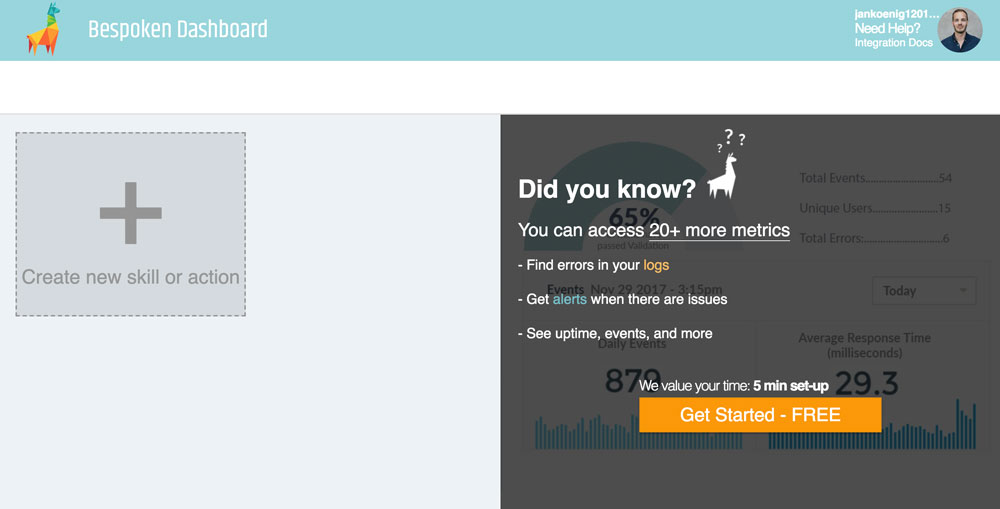
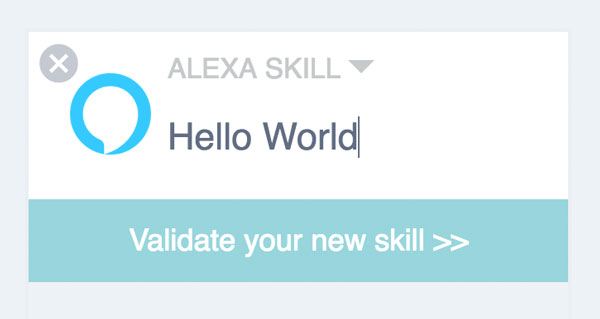
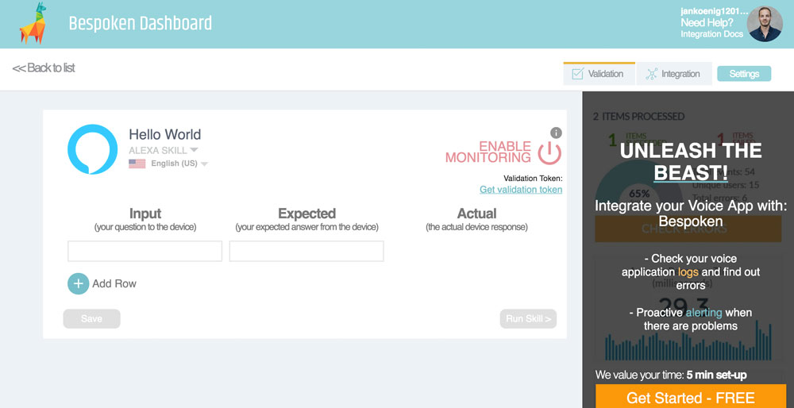

# Bespoken

Learn how to use Bespoken Analytics for your Alexa Skills and Google Actions built with Jovo.

* [About Bespoken](#about-bespoken)
* [Installation](#bespoken)
   * [Create a Bespoken Dashboard Account](#create-a-bespoken-dashboard-account)
   * [Enable Bespoken Analytics](#enable-bespoken-analytics)
   * [Test Bespoken](#test-bespoken)
   


## About Bespoken


[Bespoken](https://bespoken.io/) offers monitoring and testing tools for voice apps, including a command line interface, logging, and unit testing.

With the Bespoken Analytics integration for Jovo, you can get access to logging and monitoring features for your Alexa Skills and Google Actions.

## Installation

To use Bespoken Analytics for your voice app, you need to complete the following steps:

1. Create a Bespoken Dashboard account
2. Enable Bespoken Analytics in your Jovo voice app
3. Test your app

### Create a Bespoken Dashboard Account

1. Create a Bespoken account or log in at https://apps.bespoken.io/dashboard/.

2. Click the plus sign on the Home page:



3. Set the name for your app and click on "Validate your new skill"


4. Click on "Get Started" to the right


5. Copy the Secret Key as shown below


### Enable Bespoken Analytics

To add Bespoken Analytics to your voice app, do the following:

* Download the npm package
* Enable the plugin in `app.js`
* Add configurations in `config.js`

First, download the npm package:

```sh
$ npm install --save jovo-analytics-bespoken
```

Enable the plugin like this:

```javascript
// @language=javascript

// src/app.js

const { BespokenAlexa, BespokenGoogleAssistant } = require('jovo-analytics-bespoken');

app.use(
    new BespokenAlexa(),
    new BespokenGoogleAssistant()
);

// @language=typescript

// src/app.ts

import { BespokenAlexa, BespokenGoogleAssistant } from 'jovo-analytics-bespoken';

app.use(
    new BespokenAlexa(),
    new BespokenGoogleAssistant()
);
```

Add configurations like this:

```javascript
// @language=javascript

// src/config.js

module.exports = {
    
    analytics: {
        BespokenAlexa: {
            key: '<key>',
        },
        BespokenGoogleAssistant: {
            key: '<key>',
        },
    },

    // ...

};

// @language=typescript

// src/config.ts

const config = {
    
    analytics: {
        BespokenAlexa: {
            key: '<key>',
        },
        BespokenGoogleAssistant: {
            key: '<key>',
        },
    },

    // ...

};
```

### Test Bespoken

Test your voice app, after a bit your session should appear in the created skill.


<!--[metadata]: {"description": "Add Bespoken Analytics to your Alexa Skills and Google Actions with Jovo",
"route": "analytics/bespoken" }-->
