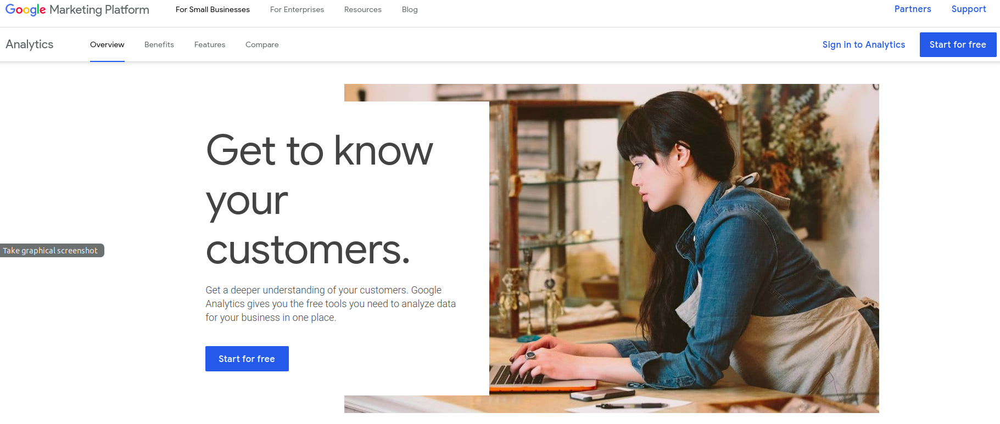
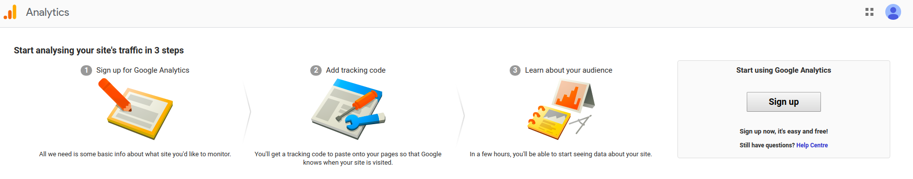
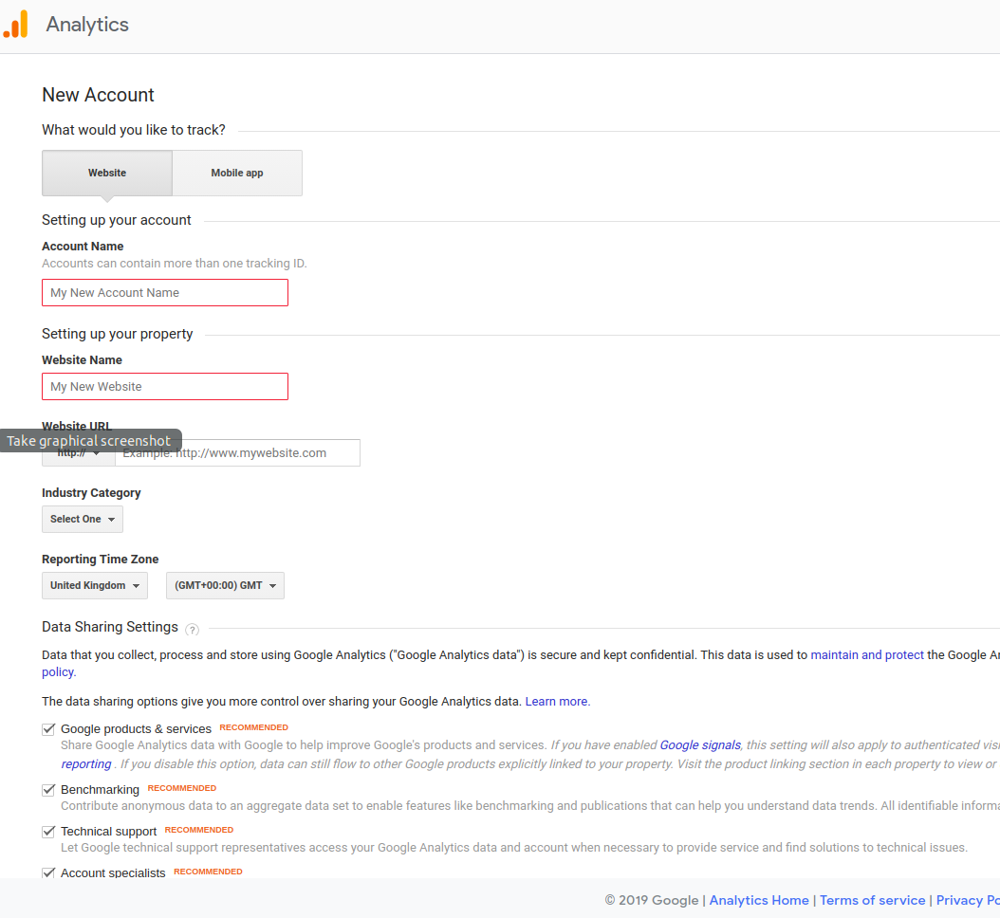
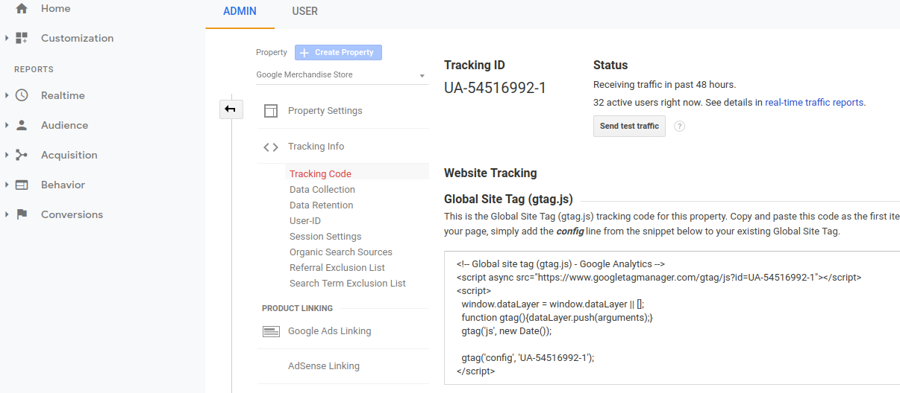

# Google Analytics

Learn how to use Google Analytics for your Alexa Skills and Google Actions built with Jovo.

* [About Google Analytics](#about-googleanalytics)
* [Installation](#bespoken)
   * [Create a Bespoken Dashboard Account](#create-a-bespoken-dashboard-account)
   * [Enable Bespoken Analytics](#enable-bespoken-analytics)
   * [Test Bespoken](#test-bespoken)
   


## About Google Analytics


[Google Analytics](https://analytics.google.com/analytics/web/) lets you measure your advertising ROI as well as track your Flash, video, and social networking sites and applications.

With the Google Analytics integration for Jovo, you can track the behaviour of you voice app and get insights about your users.

## Installation

To use Google Analytics for your voice app, you need to complete the following steps:

1. Create a Google Analytics account
2. Enable Google Analytics in your Jovo voice app
3. Test your app

### Create a Bespoken Dashboard Account

1. Login to Google Analytics with a google account at https://marketingplatform.google.com/intl/de/about/analytics/.

2. Click start for free:



3. Click sign up


4. Fill the formular like you want. Stay with "Website" and choose a random string for the URL. The plugin will do the tracking on its own. Finish by clicking "get tracking id". 


5. After confirming the terms of service you will arrive at the admin section of your Google Analytics Tracking Website. Copy the trackingId which you will need it to connect your voice app.



### Enable Google Analytics

To add Google Analytics to your voice app, do the following:

* Download the npm package
* Enable the plugin in `app.js`
* Add configurations in `config.js`

First, download the npm package:

```sh
$ npm install --save jovo-analytics-bespoken	//todo: change npm
```

Enable the plugin like this:

```javascript
// @language=javascript

// src/app.js

const { GoogleAnalyticsAlexa, GoogleAnalyticsAssistant } = require('jovo-analytics-bespoken'); //todo: change require

app.use(
    new GoogleAnalyticsAlexa(),
    new GoogleAnalyticsAssistant()

// @language=typescript

// src/app.ts

import { GoogleAnalyticsAlexa, GoogleAnalyticsAssistant } from 'jovo-analytics-bespoken'; //todo

app.use(
    new GoogleAnalyticsAlexa(),
    new GoogleAnalyticsAssistant()
);
```

Add configurations like this:

```javascript
// @language=javascript

// src/config.js

module.exports = {
    
    analytics: {
        GoogleAnalyticsAlexa: {
            trackingId: '<key>',
        },
        GoogleAnalyticsAssistant: {
            trackingId: '<key>',
        },
    },

    // ...

};

// @language=typescript

// src/config.ts

const config = {
    
    analytics: {
        GoogleAnalyticsAlexa: {
            trackingId: '<key>',
        },
        GoogleAnalyticsAssistant: {
            trackingId: '<key>',
        },
    },

    // ...

};
```

### Test Bespoken

Test your voice app, after a bit your session should appear in your tracking website.


<!--[metadata]: {"description": "Add Bespoken Analytics to your Alexa Skills and Google Actions with Jovo",
"route": "analytics/bespoken" }-->
