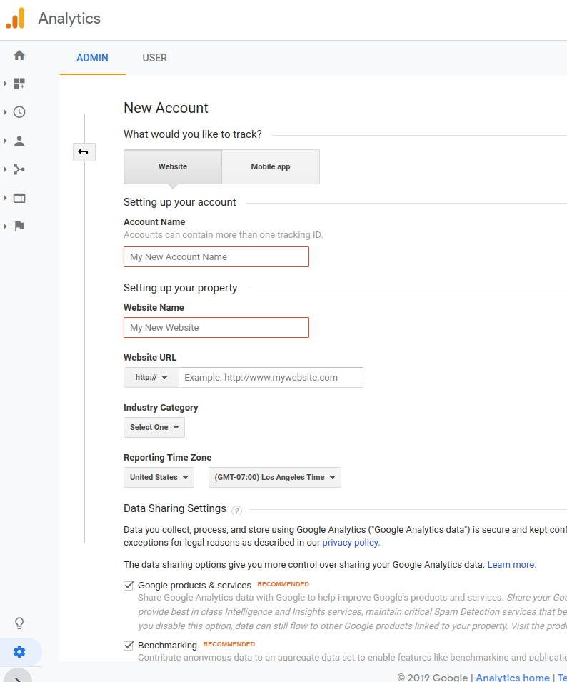

# Google Analytics

Learn how to use Google Analytics for your Alexa Skills and Google Actions built with Jovo.

* [About Google Analytics](#about-google-analytics)
* [Installation](#installation)
   * [Create a Google Analytics Account](#create-a-google-analytics-account)
   * [Enable Google Analytics](#enable-google-analytics)
   * [Test Google Analytics](#test-google-analytics)
* [Usage](#usage)
    * [Automatic intent tracking](#automatic-intent-tracking)
    * [Developer methods](#developer-methods)
    * [Customize standard behavior](#customize-standard-behavior)
   


## About Google Analytics


[Google Analytics](https://analytics.google.com/analytics/web/) let you measure your advertising ROI as well as track your Flash, video, and social networking sites and applications.

With the Google Analytics integration for Jovo, you can track the behavior of you voice app and get insights about your users. It offers [standard tracking](#automatic-intent-tracking) which will start immediately after activating and [developer methods](#developer-methods) for sending events and transactions from your voice app. Even thought you won't have to mess with creating users and adding appropriate data the plugin offers the possibility to [adjust and overwrite implemented tracking and helper methods](#customize-standard-behavior) (for example if you want to adjust the algorithm which generates the userId). 

## Installation

To use Google Analytics for your voice app, you need to complyedete the following steps:

1. Create a Google Analytics account
2. Enable Google Analytics in your Jovo voice app
3. Test your app

### Create a Google Analytics Account

1. Login to Google Analytics with a google account at https://marketingplatform.google.com/intl/en/about/analytics/.

2. Click Start for free:


3. Click sign up


4. Fill the form like you want. Stay with "Website" and choose a random string for the URL. The plugin will do the tracking on its own. Finish by clicking "get tracking id". 


5. After confirming the terms of service you will arrive at the admin section of your Google Analytics Tracking Website. Copy the trackingId which you will need it to connect your voice app.


### Enable Google Analytics

To add Google Analytics to your voice app, do the following:

* Download the npm package
* Enable the plugin in `app.js`
* Add configurations in `config.js`

First, download the npm package:

```sh
$ npm install --save jovo-analytics-googleanalytics	//todo: change npm
```

Enable the plugin like this:

```javascript
// @language=javascript

// src/app.js

const { GoogleAnalyticsAlexa, GoogleAnalyticsAssistant } = require('jovo-analytics-googleanalytics'); 

app.use(
    new GoogleAnalyticsAlexa(),
    new GoogleAnalyticsAssistant()

// @language=typescript

// src/app.ts

import { GoogleAnalyticsAlexa, GoogleAnalyticsAssistant } from 'jovo-analytics-googleanalytics';

app.use(
    new GoogleAnalyticsAlexa(),
    new GoogleAnalyticsAssistant()
);
```

Add configurations like this:

```javascript
// @language=javascript

// src/config.js

module.exports = {
    
    analytics: {
        GoogleAnalyticsAlexa: {
            trackingId: '<key>',
        },
        GoogleAnalyticsAssistant: {
            trackingId: '<key>',
        },
    },

    // ...

};

// @language=typescript

// src/config.ts

const config = {
    
    analytics: {
        GoogleAnalyticsAlexa: {
            trackingId: '<key>',
        },
        GoogleAnalyticsAssistant: {
            trackingId: '<key>',
        },
    },

    // ...

};
```

### Test Google Analytics

Test your voice app, after a bit your session should appear at your tracking website.

## Usage
Google Analytics for Jovo is designed to tie tracking data to users and intents (without having the developer to mess with it). It separates into the parts:
1. Automatic intent tracking
2. Developer methods
3. Customize standard behavior

#### Automatic intent tracking
After the plugin is enabled it automatically tracks intents by sending pageviews to google analytics. To see intent metrics navigate to "Behavior" -> "Overview" in your google analytics web panel. After some time the "Behavior Flow" will show intent paths users take within your skill.
Google Analytics for Jovo enhances all sent data with the information shown in the scheme bellow. The orange node objects are listing all data tracked in the different steps of the plugin processing. It will be explained in the section underneath. Have a look at our [templates](#templates) which will help you to analyse this data. 

 

##### User Id
The userID is a hash generated from the according platform response. Be careful when using Google Assistant because the userId will change sometimes if account linking is not activated.

Remark: Did you see that the graphic displays userId twice? This is because google analytics dimensions are organized by scopes and we need the userId at "hitLevel" for some custom reports (see [googleAnalyticsScopes](https://www.bounteous.com/insights/2016/11/30/understanding-scope-google-analytics-reporting/) for more details on scopes). The setup is explained [here](#custom-user-id).

##### Source
You can use the "data source" to split users into segments from Amazon Alexa and Google Assistant. The following graphic shows some test traffic for the "Audience Overview".
            

Segment templates can be added by clicking at [AlexaSegmentTemplate](https://analytics.google.com/analytics/web/template?uid=cnQV_g8eR5Of0eQngb2A7g) and [GoogleAssistantTemplate](https://analytics.google.com/analytics/web/template?uid=Wvd3HYvyQDKFfXClkrXCAw). Withing the opened dialog you can add them to any Google Analytics view you like. 
Afterwards click at the "AllUsers" segment in any report and activate them via the checkboxes. The graphic bellow highlights both points via red rectangles. Click the third rectangle "actions" to adjust them (for example by adding additional behavior filters).


##### Device & ScreenResolution
Device Info can be found in "Audience" -> "Technology" -> "Browser&OS". The browser field will display recognized device types. Within this report you have the possibility to switch to screen resolution.


##### Custom User Id
To enable a userId at hit level do the following:
* Go to "Admin"->"CustomDefinitions"->"CustomDimensions" 
* Click "New Custom Dimension"
* Give it a name like "clientId". Set "Scope" to "hit" and enable the "active" checkbox
Remark: Google Analytics is targeting custom dimensions via indices. Make sure that die clientId is at position 1.

Afterwards you can link metrics at hit scope like "gamesPlayed" with this newly created userId. 

##### Templates
Just click the link to add a template to you google analytics custom reports:
* [ErrorAndException](https://analytics.google.com/analytics/web/template?uid=1xkvI9b9Tq-O55HPz6963g): lists exceptions from your skill
* [Flow Error](https://analytics.google.com/analytics/web/template?uid=RbRGVYbeS_6slju5nhjYCQ): where (which state and intent) did your skill jump to unhandled? Why did it get there? Did the NLU not match spoken input to an intent (nluUnhandled) or was the matched intent not implemented/ reachable from the current state(skillUnhandled)? Also contains information about exceeded reprompts.
* [Flow Error per device](https://analytics.google.com/analytics/web/template?uid=zhSQr1wjStq_vBq9zULjtw): splits the report above per device
* [Intent Details](https://analytics.google.com/analytics/web/template?uid=V7hdC8gbSOeZaf_zP8Mr-w)


#### Developer Methods
The plugin offers developer methods for sending data (like events and transactions) from your skills code. Currently the following methods are supported:
* sendEvent(eventParameters)
* sendTransaction(transactionParams)
* sendItem(itemParams)
* sendUserEvent (eventCategory, eventElement)
* sendUserTransaction (transactionId)
* sendCustomMetric (index, value)  


They take care of creating a google analytics visitor with appropriate data (using the initUser method shown in the last section) and will afterwards trigger according methods from the [universal-analytics-plugin](https://github.com/peaksandpies/universal-analytics) which has a nice list of [acceptable params](https://github.com/peaksandpies/universal-analytics/blob/HEAD/AcceptableParams.md) for events, transactions and items. We also added "UserEvents" which combine an event-category and instance of this category (the event-element) with the users id (event-label). This makes it easy to analyse events per user without having to add custom dimensions (see above). 
Because the initVisitor method will return a universal analytics visitor you also have the possibility to access each method from this npm package. Be careful when using them, because they will only be reflected in your current call. So if you manipulate the visitor object this way the [Automatic Intent Tracking](#automatic-intent-tracking) will still be processed without added data. To change standard behavior you have to [overwrite standard methods](#customize-standard-behavior). 

You can call them via the this.$googleAnalytics object:
```javascript
{
    MyNameIsIntent() {
        const userName = this.$inputs.name.value;
        this.$googleAnalytics.sendUserEvent("userNames", userName);
        this.tell('Hey ' + userName + ', nice to meet you!');
    },
}

```


#### Customize Standard Behavior
Google Analytics integration for Jovo organizes changeable behavior in appropriate methods. This way developers can overwrite the parts they want to customize and the changes will take effect for [automatic intent tracking](#automatic-intent-tracking) and [developer methods](#developer-methods). The picture bellow shows the method chain with gray boxes. The orange notes above are showing which data is set in each part.


Let's take the use case of setting a specific medium and source as an example. 
Start with your extension of a plugin class and overwrite methods you want to adjust. Most often you will firstly call the inherited method from the plugin and afterwards add your custom data. The medium/source useCase wants to adjust visitor data and therefore overwrites the initVisitor method:
 

```js
// @language=javascript
const { GoogleAnalyticsAlexa} = require('jovo-analytics-googleanalytics');

class ext extends GoogleAnalyticsAlexa {
    initVisitor(jovo) {
        let visitor = super.initVisitor(jovo);
        visitor.set("campaignMedium", "referral");
        visitor.set("campaignSource", "googleAction");
        return visitor;
    }
}
exports.ext = ext;

// @language=typescript
import { GoogleAnalyticsAlexa } from 'jovo-analytics-googleanalytics';
import * as ua from 'universal-analytics';
import { Jovo } from "jovo-core";

export class CustomGAnalyticsAlexa extends GoogleAnalyticsAlexa  {
    initVisitor(jovo : Jovo) :ua.Visitor {
        let visitor = super.initVisitor(jovo); //setting standard parameters for visitor
        visitor.set("campaignMedium", "referral");
        visitor.set("campaignSource", "alexaSkill");
        return visitor;
    }
}
```
Instead of [enabling the GoogleAnalyticsAlexa base class](#enable-google-analytics
) you will have to replace "GoogleAnalyticsAlexa" with the name of your custom class.

#### Enable cross device tracking
The example above was used in a case where google analytics tracking was already running for a website and the customer wanted to add separated skill tracking. When the skill sends a link to the website (via email/sms) the current analytics session should continue. To enable tracking from skill to website you have to 
* Adjust the google analytics tracking code on the website
* Add a clientIdParamter to the link sent from the skill 

##### Adjust GA Tracking Code
Replace the tracking code in the head of your websites html file with the version bellow. Make sure to adjust the trackingId with your own one ("Admin"-> "Tracking Info"-> "Tracking Code").
```javascript
<!-- Global site tag (gtag.js) - Google Analytics -->
  <script async src="https://www.googletagmanager.com/gtag/js?id=UA-138062..."></script>
  <script>
    window.dataLayer = window.dataLayer || [];
    function gtag() { dataLayer.push(arguments); }
    gtag('js', new Date());

    const urlSearchParams = new URLSearchParams(window.location.search);


    if (!urlSearchParams.get("voiceClientID")) {
      gtag('config', 'UA-138062...');
    }

    else {
      gtag('config', 'UA-138062...', {
        'user_id': urlSearchParams.get("voiceClientID"),
        'client_id': urlSearchParams.get("voiceClientID"),
      });
    }
  </script>
  ```

  ##### Send clientId with link from skill
  The code above will try to extract the parameter "voiceClientID" from the url parameters. Add it to the link you send to users and the session will persist after they click on it. https://testPage.com/path?var1=test will get to https://testPage.com/path?var1=test&voiceClientID=2210018__. You can get the clientId by calling the getUserId method.


<!--[metadata]: {"description": "Add Google Analytics to your Alexa Skills and Google Actions with Jovo",
"route": "analytics/googleAnalytics" }-->
