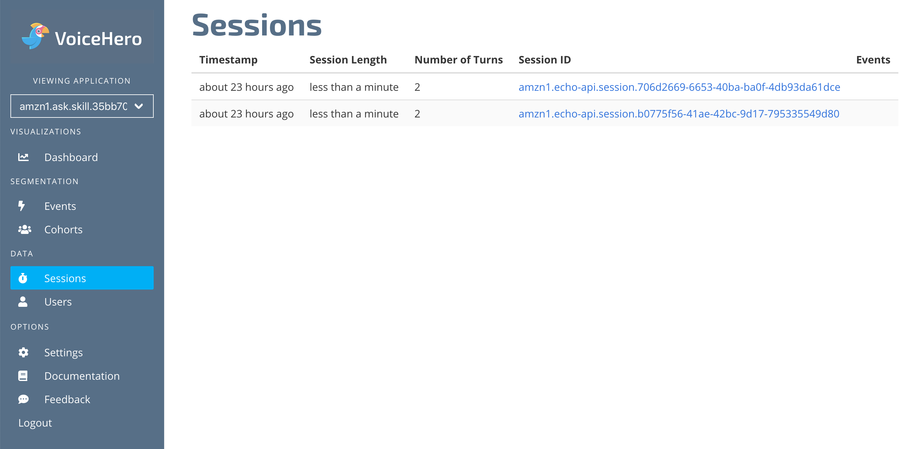

# VoiceHero

Learn how to use VoiceHero Analytics for your Alexa Skills built with Jovo.

* [About VoiceHero](#about-voicehero)
* [Installation](#installation)
   * [Get Started on VoiceHero](#get-started-on-voicehero)
   * [Enable VoiceHero in Jovo](#enable-voicehero-in-jovo)


## About VoiceHero


[VoiceHero](https://www.voicehero.ai/) empowers developers increase retention and performance of their voice app. Through powerful insights into user behaviour, VoiceHero points out actionable next steps to 10x your voice app.

VoiceHero is currently in closed beta. Head on over to [their main site](https://www.voicehero.ai/) to get started.

## Installation

To use VoiceHero for your voice app, you need to complete the following steps:

1. Get Started on VoiceHero
2. Enable VoiceHero Analytics in your Jovo voice app
3. Download the `voicehero-sdk` npm package
4. Test your app

### Get Started on VoiceHero

1. Create a VoiceHero account (Head on over to [their main site](https://www.voicehero.ai/) to get started).

2. Copy API Key from the [Dashboard](http://dashboard.voicehero.ai).

### Enable VoiceHero in Jovo

To add VoiceHero to your voice app, do the following:

* Download the npm package
* Enable the plugin in `app.js`
* Add configurations in `config.js`

First, download the npm package:

```sh
$ npm install --save jovo-analytics-voicehero
```

Enable the plugin like this:

```javascript
// @language=javascript

// src/app.js

const { VoiceHeroAlexa } = require('jovo-analytics-voicehero');

app.use(
    new VoiceHeroAlexa(),
);

// @language=typescript

// src/app.ts

import { VoiceHeroAlexa } from 'jovo-analytics-voicehero';

app.use(
    new VoiceHeroAlexa(),
);
```

Add configurations like this:

```javascript
// @language=javascript

// src/config.js

module.exports = {
    
    analytics: {
        VoiceHeroAlexa: {
            key: '<key>',
        },
    },

    // ...

};

// @language=typescript

// src/config.ts

const config = {
    
    analytics: {
        VoiceHeroAlexa: {
            key: '<key>',
        },
    },

    // ...

};
```

### Test VoiceHero

Test your voice app, and your session should appear in the Sessions tab.



<!--[metadata]: {"description": "Add Voicehero Analytics to your Alexa Skills and Google Actions with Jovo",
"route": "analytics/voicehero" }-->
