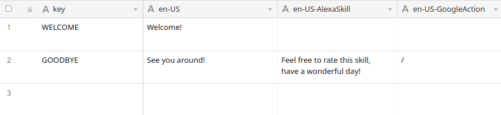

# Airtable CMS Integration

Learn how to use Airtable as CMS for your Alexa Skills and Google Actions.

* [Introduction](#introduction)
* [Configuration](#configuration)
* [Default Table Types](#default-table-types)
  * [Default](#default)
  * [Responses](#responses)
  * [KeyValue](#keyvalue)
  * [ObjectArray](#objectarray)

## Introduction

Airtable is a popular spreadsheet-meets-database product that is used for all sorts of use cases.

With this Jovo CMS integration, you can manage all the content of your Alexa Skills and Google Actions in Airtable. This makes collaboration easier and enables you update and add content faster.

Here's what a sample table could look like:


> [You can use this Airtable Base as a template to get started](https://airtable.com/universe/expxmfYnpMcqcGUx9/jovo-airtable-cms-integration-tutorial).

## Configuration

To get started, install the following package:

```sh
$ npm install --save jovo-cms-airtable
```

Add it to your `app.js` file and register it with the `use` command:

```javascript
// src/app.js

const { AirtableCMS } = require('jovo-cms-airtable');

app.use( new AirtableCMS());
```

Next, add the necessary configurations to your `config.js` file:

```javascript
// src/config.js

cms: {
    AirtableCMS: {
        apiKey: '<api-key>',
        baseId: '<base-id>',
        tables: [
            {
                name: '<name>',
                table: '<tableName>',
                type: '<TableType>',
                selectOptions: {
                    fields: ['UserId', 'Name', 'Location']
                    sort: [
                        {
                            field: "UserId",
                            direction: "desc"
                        }
                    ],
                }
            },
        ]
    }
}
```

Name | Description | Value | Required
:--- | :--- | :--- | :---
`apiKey` | Your Airtable api key | `string` | Yes
`baseId` | The id of your base | `string` | Yes
`tables` | Contains information about the tables of your base | `object[]` | Yes
`tables.name` | The name which you will use to access the table: `this.$cms.name` | `string` | Yes
`tables.table` | The name you've given the table in your base | `string` | Yes
`tables.type` | The table type you want to use. Default: `default` | `string` - either `default`, `responses`, `keyvalue` or `objectarray` | Nos
`tables.selectOptions` | Allows you to specify how the data should be retrieved from your table | `object` | No
`tables.selectOptions.fields` | Specify the fields (columns) that should be retrieved. If you decide to not retrieve the primary column of your table, keep in mind that in that case the last column of your table will be put in the first place of the array | `string[]` | No
`tables.selectOptions.filterByFormula` | A [formula](https://support.airtable.com/hc/en-us/articles/203255215-Formula-Field-Reference) used to filter records. The formula will be evaluated for each record, and if the result is not `0`, `false`, `""`, `NaN`, `[]`, or `#Error!` the record will be included in the response | `string` | No
`tables.selectOptions.maxRecords` | The maximum total number of records that will be retrieved | `number` | No
`tables.selectOptions.sort` | An array of sort objects that specifies how the records will be ordered. Each sort object must have a field key specifying the name of the field to sort on, and an optional direction key that is either "asc" or "desc". The default direction is "asc". | `object[]` | No


## Default Table Types

Table types specify how the data will be transformed and saved.

* [Default](#default)
* [Responses](#responses)
* [KeyValue](#keyvalue)
* [ObjectArray](#objectarray)

### Default

If you don't define a table type in the `config.js`, you receive an array of arrays that can be accessed like this:

```javascript
this.$cms.name
```

### Responses

If you define the table type as `Responses`, the integration expects a spreadsheet of at least two columns:
* a `key`
* a locale, e.g. `en`, `en-US`, or `de-DE`

For this locale, you can then access the responses like this:

```javascript
// i18n notation
this.t('key')

// Alternative
this.$cms.t('key')
```

You can add as many locales as you want by adding additional columns for each key.


### KeyValue

If you define the table type as `KeyValue`, the integration expects a spreadsheet of at least two columns:
* a `key`
* a `value`

For every key, this will return the value as a string:

```javascript
this.$cms.name.key
```

### ObjectArray

If you define the table type as `ObjectArray`, you will receive an array of objects where each row is converted to an object with the first row of the spreadsheet specifying the keys

Here's an example sheet:

Name | Location | Date
:--- | :--- | :---
Voice Summit | Newark, New Jersey, USA | 7/22/2019
SuperBot | San Francisco, California, USA | 4/2/2019

And here's the array of objects you will receive:

```javascript
[ 
    { 
        name: 'Voice Summit',
        location: 'Newark, New Jersey, USA',
        date: '7/22/2019' 
    },
    {
        name: 'SuperBot',
        location: 'San Francisco, California, USA',
        date: '4/2/2019' 
    }
]
```

Access the array using:

```javascript
this.$cms.name
```

## Advanced Sheet Features

### CMS-Caching

Since Jovo `v2.1.4` we support CMS-Caching, an easy way to allow for faster development with CMS. You can choose between disabling caching for all sheets, or just specific ones in your `config.js` file. All sheets will be cached per default.

```javascript
// config.js file
cms: {
    AirtableCMS: {
        apiKey: '<api-key>',
        baseId: '<base-id>',
        tables: [
            {
                name: '<name>',
                table: '<tableName>',
                type: '<TableType>',
                selectOptions: {
                    // ...
                },
                caching: false          // disable caching for this sheet
            },
        ],
        caching: false                  // disable caching for all sheets
    }
}
```

### Platform-specific Responses

Since Jovo `v2.1.4` we support platform-specific responses for i18n, as well as for CMS. This allows you to have isolated output for a specified platform, without altering the default one.



In this example, the value for `GOODBYE` will be overwritten, whenever a response is triggered by an Alexa-Skill. `WELCOME` remains the same for all platforms.
If you don't want any output for a specific platform, use `/`.

<!--[metadata]: {"description": "Learn how to use Airtable as CMS for your Alexa Skills and Google Actions.",
"route": "cms/airtable" }-->
