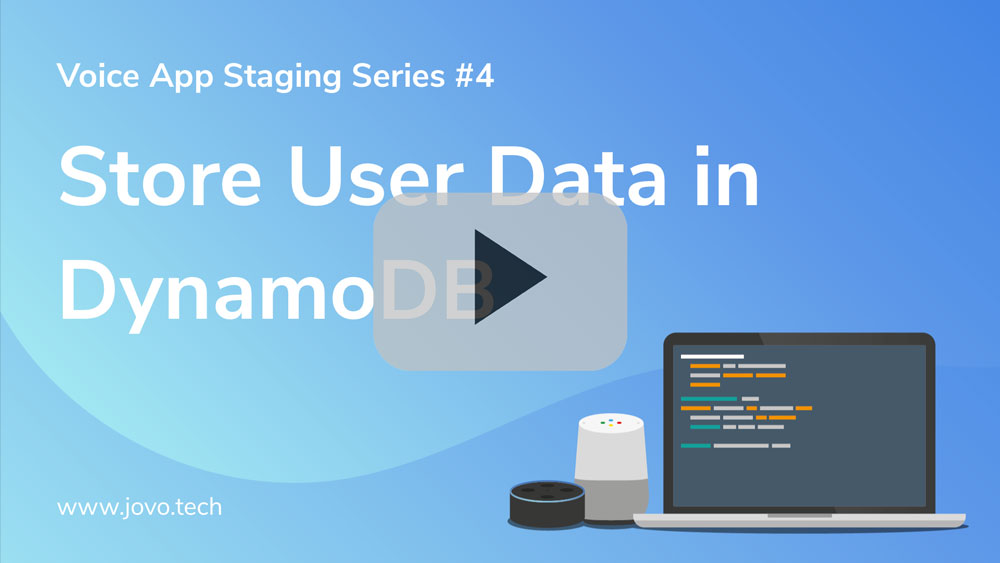
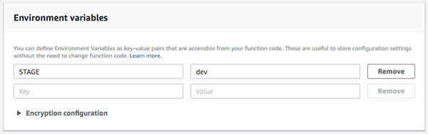

# Add DynamoDB to Store User Data

Learn how to use DynamoDB for certain development environments to store user data for your Alexa Skills and Google Actions with Jovo.

* [Introduction](#introduction)
* [Add DynamoDB as Database](#add-dynamodb-as-database)
* [Additional Steps](#additional-steps)
   * [Specify Stage on AWS Lambda](#specify-stage-on-aws-lambda)
   * [Add Permissions to Lambda Role](#add-permissions-to-lambda-role)
   * [Test on Lambda](#test-on-lambda)

Watch the video here:

[](https://www.youtube.com/watch?v=AevYJhAVQzg)

## Introduction

Jovo offers a [database layer](../06_integrations/databases '../databases') that allows you to persist user specific data. For additional information, take a look at [App Logic > User Class](../04_app-logic/02_data/user.md '../data/user').

For local development, it is recommended to use the [Jovo File Persistence](../06_integrations/databases#filepersistence '../databases#filepersistence') that stores data in a `db/db.json` file for easy debugging. For hosting on AWS Lambda, most people use [DynamoDB](../06_integrations/databases#dynamodb '../databases#dynamodb').

Switching between these different database types for local development and deployment to Lambda can be tedious. In this guide, you will learn how to use the Jovo [Config Overrides in app.json](../03_app-configuration/app-json.md#config-overrides '../app-json#config-overrides') to use different databases or tables for different stages.

## Add DynamoDB as Database

To add DynamoDB as a database, you have several options.

For example, you could add it to the config file in your `app.js`:

```javascript
const config = {
    db: {
        type: 'dynamodb',
        tableName: '<your-table-name>',
    },
    // Other configurations
};
```

However, this will add DynamoDB to the app no matter which stage it is currently in, disabling the FilePersistence database. This is why we recommend to use the `app.json` to override the config for a certain stage as explained here: [app.json > Config Overrides](../03_app-configuration/app-json.md#config-overrides '../app-json#config-overrides').

```javascript
"stages": {
        "config": {
                "db": {
                        "type": "dynamodb",
                        "tableName": "<your-table-name>"
                }
        }
}
```

## Additional Steps

After you have added the content to the `app.json`, you can upload your code to AWS Lambda (see our guide on [how to deploy to Lambda](./deploy-lambda-cli.md './deploy-lambda-cli') for more information). 

In case you haven't done so yet, there are a few more steps to do to make it work:

* [Specify Stage on AWS Lambda](#specify-stage-on-aws-lambda)
* [Add Permissions to Lambda Role](#add-permissions-to-lambda-role)
* [Test on Lambda](#test-on-lambda)


### Specify Stage on AWS Lambda

As described in [Advanced > Staging](../07_advanced#staging '../advanced#staging'), you need to let your code know which stage it is currently in.

You can do so by adding `STAGE` to the environment variables on AWS Lambda:



This will override the `defaultStage` element in your `app.json`, in case you've set it.

### Add Permissions to Lambda Role

To make your Lambda function able to create database tables, and edit their content, you need to give the IAM role that's associated with it the right permissions. You can find out more in the official documentation by Amazon: [AWS Lambda Permissions Model](http://docs.aws.amazon.com/lambda/latest/dg/intro-permission-model.html). 

The easiest way to go is to give your role full permission by attaching the `AmazonDynamoDBFullAcess` policy:


However, if you prefer to only give it the permissions needed, you can also create a new policy. Jovo needs the following permissions to be able to use the DynamoDB database integration:

* Read
   * GetItem
* Write
   * CreateTable
   * PutItem

Here is a policy summary you can use for it:

```
{
    "Version": "2012-10-17",
    "Statement": [
        {
            "Effect": "Allow",
            "Action": [
                "dynamodb:CreateTable",
                "dynamodb:PutItem",
                "dynamodb:GetItem"
            ],
            "Resource": "arn:aws:dynamodb:*:*:table/*"
        }
    ]
}
```

After attaching this policy to your role, you should be good to go.


### Test on Lambda

After you have uploaded your code to Lambda, given your role the right permissions, you can test the function.

The initial test should create a fresh new DynamoDB table.


<!--[metadata]: {"title": "Add DynamoDB to Store User Data", 
                "description": "Learn how to use DynamoDB to store user data for your Alexa Skills and Google Actions with Jovo.",
                "activeSections": ["kb"],
                "expandedSections": "kb",
                "inSections": "kb",
                "breadCrumbs": {"Docs": "docs",
				"Knowledge Base": "docs/kb"
                                },
		"commentsID": "framework/docs/kb/add-dynamodb-database",
		"route": "docs/kb/add-dynamodb-database"
                }-->
