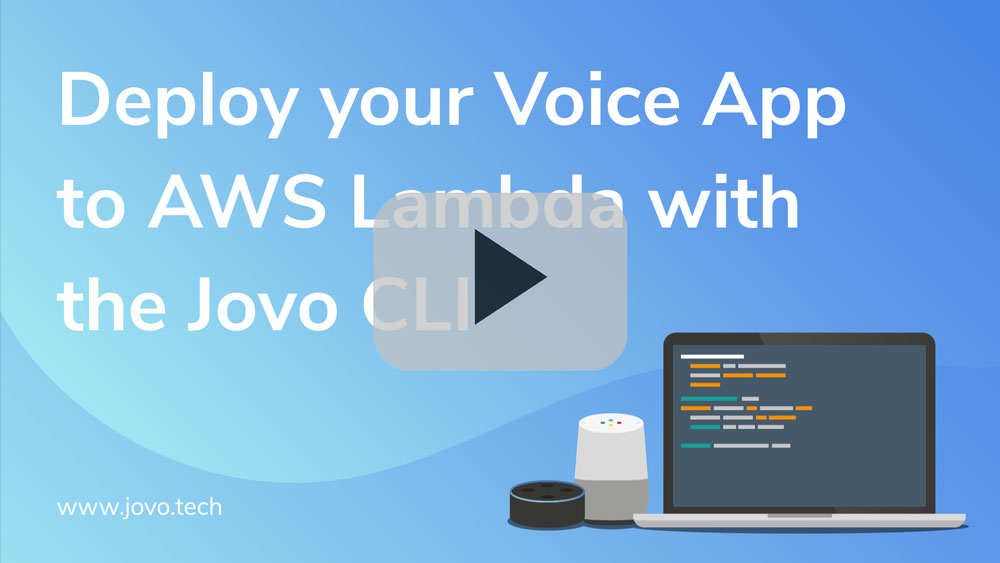
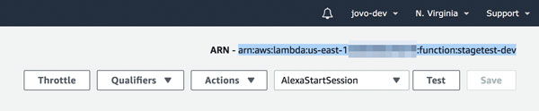

# Deploy your Voice App to AWS Lambda with the Jovo CLI

Learn how to use the Jovo CLI to deploy your Alexa Skill and Google Action to AWS Lambda from the command line.

* [Introduction](#introduction)
* [Add Lambda ARN as Endpoint](#add-lambda-arn-as-endpoint)
* [Set up Credentials with ASK CLI](#set-up-credentials-with-ask-cli)
* [jovo deploy](#jovo-deploy)

Watch the video here:

[](https://www.youtube.com/watch?v=Q5T2II8XIbg)

## Introduction

The majority of Alexa Skills is hosted on AWS Lambda, and Jovo allows you to host your Google Actions there as well. Debugging your Lambda functions can be quite tedious and time consuming though, if you're always uploading and saving your code manually. Fortunately, the [Jovo CLI](../02_cli '../cli') offers integrations to ASK CLI and AWS to deploy your code to Lambda right from the command line.

You can upload your voice app to AWS Lambda by using the command `jovo deploy`, but first, you need to create the Lambda function, add it as an endpoint to your `app.json`, and make sure you have the right AWS credentials to programmatically deploy it there.


## Add Lambda ARN as Endpoint

This article assumes you already have a Lambda function or know how to create one. If you need help with that, take a look here: [Alexa Skill Tutorial: Host your Code on AWS Lambda](https://www.jovo.tech/blog/alexa-skill-tutorial-nodejs/#aws-lambda).

After creating your AWS Lambda function, you can find its resource number (the `ARN`) in the upper right corner of the console:



Now copy this and add it as an endpoint to your `app.json` file:

```
{
        "endpoint": "<your-lambda-arn>
}
```

One likely setup could be to have a `local` stage with the Jovo Webhook for local development, and a `dev` stage shared with the team hosted on AWS Lambda:

```
{
        "stages": {
                "local": {
                        "endpoint": "${JOVO_WEBHOOK_URL}"
                },
                "dev": {
                        "endpoint": "<your-lambda-arn>"
                }
        }
}
```

Learn more about everything that can go into the `app.json` file here: [app.json - Project Configuration](../03_app-configuration/app-json.md '../app-json').


## Set up Credentials with ASK CLI

Jovo currently uses ASK CLI to fetch the AWS credentials associated with an ASK profile. To install ASK CLI, take a look at this quickstart guide: [Amazon Docs: Install and Initialize ASK CLI](https://developer.amazon.com/docs/smapi/quick-start-alexa-skills-kit-command-line-interface.html#step-3-install-and-initialize-ask-cli).


Each ASK profile can be mapped to an AWS profile. There are several commands you can use:

```sh
# Initialize and update profiles
$ ask init

# Just initialize AWS credentials
$ ask init --aws-setup
```

You can also directly edit the credentials by taking a look at the `.aws` folder in your home directory. This contains a `credentials` file that stores your AWS credentials and is structured like this (`default` profile as an example):

```
[default]
aws_access_key_id=<your-key-id>
aws_secret_access_key=<your-secret-key>
```

Learn more in the official [Amazon Docs: Set Up Credentials for an Amazon Web Services (AWS) Account](https://developer.amazon.com/docs/smapi/set-up-credentials-for-an-amazon-web-services-account.html).


## jovo deploy

After you have everything ready, you can use the `jovo deploy` command to automatically upload the code to AWS Lambda:

```sh
# Deploy all
$ jovo deploy

# Deploy only to Lambda
$ jovo deploy --target lambda

# To specific profile, example: default
$ jovo deploy --ask-profile default

# With stages, example: dev
$ jovo build --stage dev
$ jovo deploy --stage dev
```

You can learn more about the `jovo deploy` command here: [Jovo CLI > jovo deploy](../02_cli#jovo-deploy '../cli#jovo-deploy').

<!--[metadata]: {"title": "Deploy your Voice App to AWS Lambda with the Jovo CLI", 
                "description": "Learn how to deploy your Alexa Skill and Google Action to AWS Lambda by using the Jovo CLI.",
                "activeSections": ["kb"],
                "expandedSections": "kb",
                "inSections": "kb",
                "breadCrumbs": {"Docs": "docs",
				"Knowledge Base": "docs/kb"
                                },
		"commentsID": "framework/docs/kb/deploy-lambda-cli",
		"route": "docs/kb/deploy-lambda-cli"
                }-->
