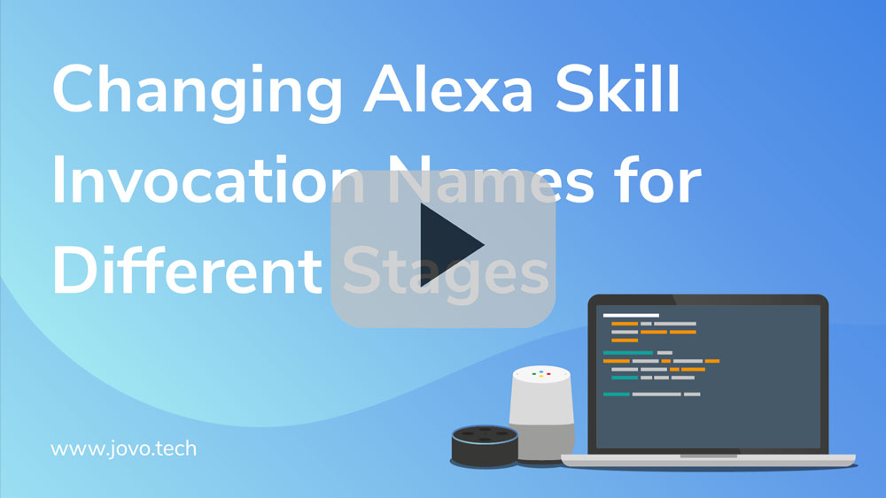

# Staging: Change Invocation Names for Different Environments

This page offers a selection of examples to learn how to deploy your Alexa Skill and Google Action to different environments. 

* [Introduction](#introduction)
* [Override the Invocation Name](#override-the-invocation-name)
* [Build and Deploy to Alexa](#build-and-deploy-to-alexa)
* [Additional Options](#additional-options)

Watch the video here:

[](https://www.youtube.com/watch?v=H1T9-H2RZWk)

## Introduction

Jovo allows you to deploy your Alexa Skills and Google Actions to different environments, for example `local` (for local development), `dev`, and `prod` (both hosted on AWS Lambda). To learn more about the essentials of different stages, take a look at [App Configuration > app.json](../03_app-configuration/app-json.md '../app-json'), [Advanced Features > Staging](../07_advanced#staging '../advanced#staging'), and the [Staging Examples](./staging-examples.md './staging-examples') in the Jovo Knowledge Base.

If you have different stages, it's sometimes difficult to figure out which version of your voice app you're currently talking to. This is why Jovo offers a way for you to override the invocation name of your Alexa Skills (unfortunately, Dialogflow does not offer this functionality yet).


## Override the Invocation Name

You can change the invocation name by adding the following to any of your stages:

```javascript
"languageModel": {
          "en-US": {
            "invocation": "my test app dev"
          }
        }
```
In the below example, we change the invocation name for both the `local` and `dev` stage and keep it how it is defined in the `en-US.json` for the `prod` stage:

```javascript
{
	// Other configurations

  "stages": {
    "local": {
      "endpoint": "${JOVO_WEBHOOK_URL}"
      "languageModel": {
          "en-US": {
            "invocation": "my test app local"
          }
        }
    },
    "dev": {
      {
        "endpoint": "<your-lambda-dev-arn>"
        "languageModel": {
          "en-US": {
            "invocation": "my test app dev"
          }
        }
      }
    },
    "prod": {
      "endpoint": "<your-lambda-prod-arn>"
    }
  }
}
```

## Build and Deploy to Alexa

Before you're deploying the Skill with the new invocation name, you need to build the platform specific files in the `platforms` folder to change the Alexa Interaction Model there.

For example, this builds the `dev` stage platform files:

```sh
# Build files for all platforms
$ jovo build --stage dev

# Only build Alexa files
$ jovo build --platform alexaSkill --stage dev
```

After building the platform files, you can deploy them like this:

```sh
# Deploy to all platforms
$ jovo deploy --stage dev

# Only deploy Alexa files
$ jovo deploy -p alexaSkill --stage dev
```

*NOTE*: You don't necessarily need to specify `stage` in `jovo deploy`, if you don't use specific deployment information in your `app.json` (like a specific `askProfile` or a different `skillID`). But as you probably do, we recommend specifying the stage parameter.

You can also use the following shortcut for both:

```sh
# Build and deploy to all platforms
$ jovo build --stage dev --deploy

# Only build and deploy Alexa files
$ jovo build -p alexaSkill --stage dev --deploy
```

## Additional Options

You can find additional options to add to the language model in [App Configuration > app.json](../03_app-configuration/app-json.md '../app-json').

For example, you can also add specific intents for certain stages:

```javascript
"stages": {
	"dev": {
		"languageModel": {
			"en-US": {
				"intents": [
          {
            "name": "WhatEnvIntent",
            "samples": [
              "what is the stage",
              "what is the environment"
            ]
          }
        ]
			}
		}
	}
},
```


<!--[metadata]: {"title": "Staging: Change Invocation Names for Different Environments", 
                "description": "Learn how to change the invocation name of your Alexa Skill in different environments.",
                "activeSections": ["kb"],
                "expandedSections": "kb",
                "inSections": "kb",
                "breadCrumbs": {"Docs": "docs",
				"Knowledge Base": "docs/kb"
                                },
		"commentsID": "framework/docs/kb/staging-invocation-names",
		"route": "docs/kb/staging-invocation-names"
                }-->
