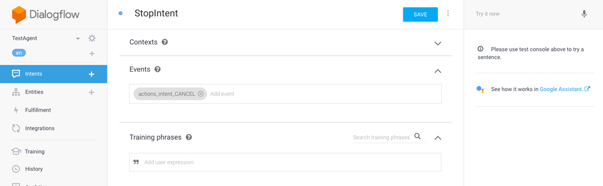

# Create a StopIntent for Google Assistant with Dialogflow

By default, Google Assistant immediately exits the app when a user says things like "exit", "cancel", or "stop". If you want to return a last response, you need to override this default behavior. Read on to learn how it works.

* [Introduction](#introduction)
* [Create a StopIntent or CancelIntent](#create-a-stopintent-or-cancelintent)
   * [Add it manually in Dialogflow](#add-it-manually-in-dialogflow)
   * [Add it to the Jovo Language Model](#add-it-to-the-jovo-language-model)

## Introduction

Jovo comes with a default `'END'` handler that lets you clean up some data and send a final response after a person wants to exit your voice app. For Alexa Skills, the `AMAZON.StopIntent` and `SessionEnded` requests are mapped to `END` by default. Learn more here: [Routing > 'END' Intent](../04_app-logic/01_routing#end-intent '../routing#end-intent')).

Google Assistant, however, doesn't offer this behavior by default, but rather exits the conversation by just playing an earcon. Read more here: [Actions on Google Documentation > Conversation Exits](https://developers.google.com/actions/assistant/conversation-exits).


## Create a StopIntent or CancelIntent

Alexa already comes with a required `AMAZON.StopIntent` that is triggered when a user wants to stop the conversation. For Google Assistant, we need to add a new intent with a specific event `actions_intent_CANCEL` to our Dialogflow Agent. Any incoming request with this event will then be mapped to the `'END'` intent in your Jovo app.

You can call it whatever you want, for example `StopIntent` or `CancelIntent` (notice that there is no difference on Google Assistant between "stop" and "cancel" in comparison to `AMAZON.StopIntent` or `AMAZON.CancelIntent`).

There are two alternatives to add the intent:
* [Add it manually in Dialogflow](#add-it-manually-in-dialogflow)
* [Add it to the Jovo Language Model](#add-it-to-the-jovo-language-model)

### Add it manually in Dialogflow

You can add it by going to the [Dialogflow Console](https://console.dialogflow.com) and creating a new intent. Select "Events" and type in `actions_intent_CANCEL`. No need to add any training phrases.



Don't forget to scroll all the way down and enable webhook fulfillment:


You can now save the intent and train the agent.

### Add it to the Jovo Language Model

If you want to maintain your language model in your code base (recommended), you can choose different strategies.

For example, you can add the intent to the `dialogflow` specific block in your language model file:

```javascript
{
  "dialogflow": {
    {
      "name": "StopIntent",
      "webhookUsed": true,
      "events": [
        {
          "name": "actions_intent_CANCEL"
        }
      ]
    }
  }
}
```

Alternatively, you can add an intent to the general Jovo intents with specific blocks for both `alexa` and `dialogflow`:

```javascript
{
  "intents": [
    {
      "name": "StopIntent",
      "alexa": {
        "name": "AMAZON.StopIntent"
      },
      "dialogflow": {
        "webhookUsed": true,
        "events": [
          {
            "name": "actions_intent_CANCEL"
          }
        ]
      }
    }
  ]
}
```

Learn more about how to deploy your Dialogflow Agent here: [Deploy a Dialogflow Agent with the Jovo CLI](./deploy-dialogflow-agent.md './deploy-dialogflow-agent').

<!--[metadata]: {"title": "Create a StopIntent for Google Assistant with Dialogflow", 
                "description": "Learn how to respond to exit requests like StopIntent or CancelIntent with Google Assistant and Dialogflow.",
                "activeSections": ["kb"],
                "expandedSections": "kb",
                "inSections": "kb",
                "breadCrumbs": {"Docs": "docs",
				"Knowledge Base": "docs/kb"
                                },
		"commentsID": "framework/docs/kb/stopintent-dialogflow",
		"route": "docs/kb/stopintent-dialogflow"
                }-->
