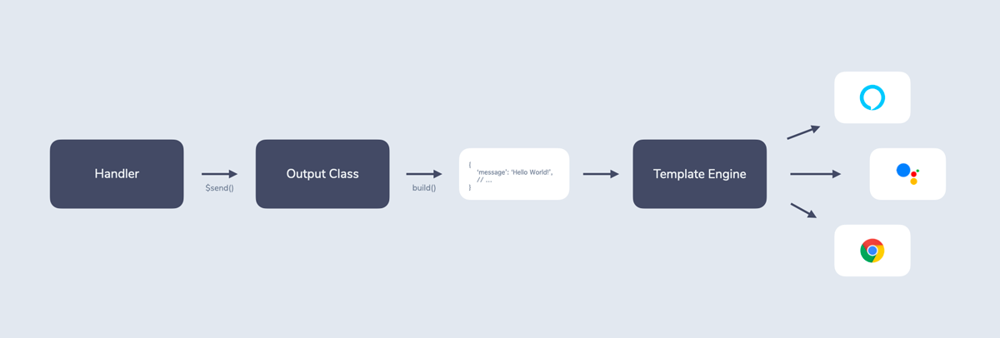

# Output

- [Introduction](#introduction)
- [Output Class](#output-class)
  - [Build Method](#build-method)
  - [Output Options](#output-options)
  - [Helper Methods](#helper-methods)
  - [Constructor](#constructor)
- [Output Template](#output-template)
  - [Default Output Elements](#default-output-elements)
  - [Platform Specific Output Elements](#platform-specific-output-elements)
  - [Multiple Responses](#multiple-responses)

## Introduction



A big part of building a Jovo app is returnig output to the user. This output could include all sorts of things, speech (for voice interfaces) or text (for visual interfaces) messages being the most prominent.

Jovo has its own multimodal template engine that takes structured output and translates it into a native platform response. The output is managed in [output classes](#output-class) that are returned by [handlers](./handlers.md) using the `$send` method.

Here is an example how this works with an output class called `YourOutput`:

```typescript
import { YourOutput } from './output/YourOutput';

// ...

someHandler() {

  // ...

  return this.$send(YourOutput);
}
```

The most important part of an output class is an [output template](#output-template) that is returned by a [`build` method](#build-method). This object is then translated into the appropriate platform response.

```typescript
build() {
  return {
    message: 'Hello World!',
  };
}
```

One of the benefits of using these classes is that there is a clear separation between handler logic and output content. The convention is that the handler collects all the necessary data (for example by doing API calls) and then passes it to the output class as [options](#output-options).

Here is an example how this could look like for a restaurant system that wants to list its menu categories. It does an API call to retrieve `categories` and then passes them to the `ShowCategoriesOutput` class:

```typescript
import { ShowCategoriesOutput } from './output/YourOutput';
import { getCategories } from './services/MenuApi';

// ...

async showMenuCategories() {

  const categories = await getCategories();
  return this.$send(ShowCategoriesOutput, { categories });
}
```

The `ShowCategoriesOutput` class then can then list the categories. You can even add [helper methods](#helper-methods) like `listCategories()` to keep the actual `build` method clean:

```typescript
build() {
  return {
    message: `Here are our categories: ${this.listCategories(this.options.categories)}`,
  };
}

listCategories(categories) {
  // ...
}
```

## Output Class

Output classes are stored in a component's `output` folder. As a convention, the files are usually named like the class, for example `MenuOutput.ts`.

Each output class contains:

- A [`build` method](#build-method) that returns an [output template](#output-template)
- [`options`](#output-options) that can be passed using `$send`
- Optionally [helper methods](#helper-methods) that can be used to build the output object

Here is an example of a `HelloWorldOutput` class:

```typescript
import { BaseOutput } from '@jovotech/framework';

export class HelloWorldOutput extends BaseOutput {

  build() {
    return {
      message: 'Hello World!',
    };
  }
}
```


### Build Method

The `build` method is responsible for returning the output object:

```typescript
build() {
  return {
    message: 'Hello World!',
  };
}
```

Usually, you don't do more inside `build` than modifying the output object directly.

There are several ways how you could add further modifications. For example, you can add [helper methods](#helper-methods) like this:

```typescript
build() {
  return {
    message: 'Hello World!',
    carousel: this.getCarousel(),
  };
}

getCarousel() {
  // ...
}
```

There's also the possibility that there is completely distinct output depending on a few factors. For example, output could differ for voice and text based interfaces. You could modify `build` in a way that it returns different output objects:

```typescript
build() {
  if(/* some condition */) {
    return {
      message: 'Output A',
    };
  } else {
    return {
      message: 'Output B',
    };
  }
}
```


### Output Options

As a convention, an output template should only be responsible for organizing the output, not collecting any data. To achieve this, the handler should first collect all necessary information and the pass it to the output class as `options`:

```typescript
return this.$send(YourOutput, { /* options */ });
```

These options can then be referenced inside the output class using `this.options`.

For example, here we're passing a user's `name`: 

```typescript
return this.$send(YourOutput, { name: 'Sam' });
```

We can then greet them by their name using `this.options.name`:

```typescript
build() {
  return {
    message: `Hey ${this.options.name}!`,
  };
}
```

#### Option Types

Extend `OutputOptions` to create an interface for your output option types:

```typescript
import { BaseOutput, OutputOptions } from '@jovotech/framework';

// ...

export interface YourOutputOptions extends OutputOptions {
  name: string;
}

export class YourOutput extends BaseOutput<YourOutputOptions> {
  // ...
}
```

The above code example creates `YourOutputOptions` that are then passed to `BaseOutput` as generics with `BaseOutput<YourOutputOptions>`.

#### getDefaultOptions

If you want to set default options, you can implement the following method:

```typescript
getDefaultOptions() {
  return { /* default options */ };
}
```

Using TypeScript, you can also add the types:

```typescript
import { BaseOutput, OutputOptions } from '@jovotech/framework';

// ...

export interface YourOutputOptions extends OutputOptions {
  name: string;
}

export class YourOutput extends BaseOutput<YourOutputOptions> {

  build() {
    return {
      message: `Hey ${this.options.name}!`,
    };
  }

  getDefaultOptions(): YourOutputOptions {
    return { 
      name: 'there',
     };
  }
}
```

### Helper Methods

You can add helper methods to the output class and reference them with `this.helperMethodName()`.

```typescript
build() {
  return {
    message: `Here are our categories: ${this.listCategories(this.options.categories)}`,
  };
}

listCategories(categories) {
  // ...
}
```

### Constructor

By default, your class does not need a custom constructor.

However, if you wish to add one, you can do the following:

```typescript
import { BaseOutput, OutputOptions } from '@jovotech/framework';

// ...

export interface YourOutputOptions extends OutputOptions {
  // ...
}

export class YourOutput extends BaseOutput<YourOutputOptions> {
  // ...

  constructor(jovo: Jovo, options: DeepPartial<YourOutputOptions>) {
    super(jovo, options);
    // Do something
  }
}
```

## Output Template

The output template is the output object that is returned by the [`build` method](#build-method). It is then translated into a native platform response.

```typescript
build() {
  return {
    message: 'Hello world!',
  };
}
```

You can add [default output elements](#default-output-elements) that are used for all platforms as well as [platform specific elements](#platform-specific-output-elements).

### Default Output Elements

Jovo output templates come with a selection of default elements that are supported by most platforms, including:

* `message`
* `reprompt`
* `carousel`
* `card`
* `quickReplies`
* `listen`

Not all platforms support all of these elements. For example, Alexa doesn't have carousels. In such a case, the platform just ignores that element and still successfully builds the rest of the output template.

#### Message

The `message` is usually either what you hear (speech output) or what see you see in the form of a chat bubble.

```typescript
build() {
  return {
    message: 'Hello world!',
  };
}
```

A `message` can either be a `string` or have the following properties:

```typescript
build() {
  return {
    message: {
      text: 'Hello world!', // Default message
      displayText: 'Hello screen!', // For platforms that support display text
    },
  };
}
```

#### Reprompt

The `reprompt` is typically only relevant for voice interfaces. It represents the output that is presented to the user if they haven't responded to a previous question.

```typescript
build() {
  return {
    message: `Hello world! What's your name?`,
    reprompt: 'Could you tell me your name?',
  };
}
```

A `reprompt` can have the same values (`text`, `displayText`) as a [`message`](#message).


#### Card

Cards are often used to display content in a visual and structured way.

```typescript
build() {
  return {
    card: {
      title: 'Hello world!',
      content: 'Welcome to this new app built with Jovo.'
    },
  };
}
```

A `card` consists of the following properties:

* `title`: required
* `key`
* `subtitle`
* `content`
* `imageUrl`
* `imageAlt`

#### Carousel

A carousel is a (usually horizontally scrollable) collection of at least 2 [cards](#card).

```typescript
build() {
  return {
    carousel: {
      items: [
        {
          title: 'Element 1',
          content: 'To my right, you will see element 2.'
        },
        {
          title: 'Element 2',
          content: 'Hi there!'
        }
      ]
    },
  };
}
```

A `carousel` consists of the following properties:

* `title`
* `items`: required

#### Quick Replies

Quick replies (sometimes called *suggestion chips*) are little buttons that provide suggestions for the user to tap instead of having to type out a response to a question.

```typescript
build() {
  return {
    quickReplies: [
      'Berlin',
      'NYC'
    ],
  };
}
```

#### Listen

Especially for voice platforms, it is important to indicate that you are expecting the user to answer. You can do this by setting `listen` to `true`. The platform will then leave the microphone open.

```typescript
build() {
  return {
    message: `Hello world! What's your name?`,
    listen: true,
  };
}
```


### Platform Specific Output Elements

Each output object can contain a `platforms` element for platform specific content:

```typescript
build() {
  return {
    message: 'Hello world!',
    platforms: {
      // ...
    },
  };
}
```

You can reference each platform by using their name (the one you're importing in your `app.ts`), for example `Alexa`:

```typescript
build() {
  return {
    message: 'Hello world!',
    platforms: {
      Alexa: {
        // ...
      },
    },
  };
}
```

There are two ways how this can be used:
* Add content types that are only available on one platform (for example an account linking card on Alexa)
* Override [default output elements](#default-output-elements) for specific platforms

For example, the `message` can be overridden for Alexa users:

```typescript
build() {
  return {
    message: 'Hello world!',
    platforms: {
      Alexa: {
        message: 'Hello Alexa!',
      },
    },
  };
}
```

#### nativeResponse

For each platform, you can add a `nativeResponse` object that is directly transplated into the native platform JSON.

```typescript
build() {
  return {
    message: 'Hello world!',
    platforms: {
      Alexa: {
        nativeResponse: {
          // Add elements in the same way they show up in the response JSON
        }
      },
    },
  };
}
```

### Multiple Responses

You can also return an array of output objects:

```typescript
build() {
  return [
    {
      message: 'Hello world!',
    },
    {
      message: 'This is a second chat bubble.',
    }
  ];
}
```

Platforms that support multiple responses will display the example above in 2 chat bubbles.