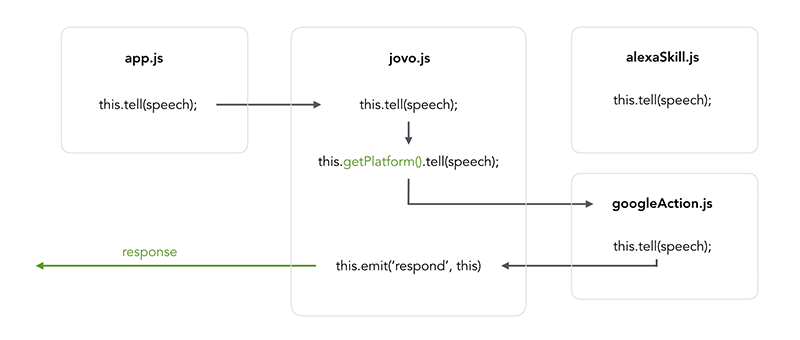

# Platforms

> To view this page on the Jovo website, visit https://v3.jovo.tech/docs/platforms

Jovo is not only about the common denominator. In this section, you will learn more about how to access features that are specific to the platforms Amazon Alexa and Google Assistant.

- [Introduction to Platform Specific Features](#introduction-to-platform-specific-features)
  - [Get Platform Type](#get-platform-type)
- [Amazon Alexa](#amazon-alexa)
- [Google Assistant](#google-assistant)

## Introduction to Platform Specific Features

To learn more about how to make most out of the platform-specific features, it's helpful to understand how the Jovo cross-platform architecture works.



The Jovo app object (`this` inside `app.js`) figures out which platform the user is conversing with, and then uses this information to either call the functions of the `alexaSkill` or `googleAction` object.

As Amazon Alexa and Google Assistant both have platform specific features, you can access them directly by calling the `alexaSkill` or `googleAction` objects. By using those classes, keep in mind that, in the end, there needs to be a function call where an emit happens for the platforms you're using. For example, in the [tell](../04_app-logic/03_output#tell './output#tell'), [ask](../04_app-logic/03_output#ask './output#ask'), [endSession](../04_app-logic/03_output#no-speech-output './output#no-speech-output'), and raw [JSON response calls](../04_app-logic/03_output#raw-json-responses './output#raw-json-responses').

These emit methods can also be accessed directly with the platform specific objects, so you don't have to use `this.tell` when developing only for one platform:

```javascript
// Example
let alexa = this.$alexaSkill;
alexa.tell('Hello World!');
```

### Get Platform Type

Want to see which platform your user is currently interacting with? With `getType`, you can get exactly this.

```javascript
this.getType();
```

This is going to return a type that looks like this:

```javascript
// For Amazon Alexa
AlexaSkill;

// For Google Assistant
GoogleAction;
```

You can also use the following method calls:

```javascript
// Returns true for Alexa Skills
this.isAlexaSkill();

// Returns true for Google Actions
this.isGoogleAction();
```

## Amazon Alexa

> Find an introduction to how Amazon Alexa works here: [Getting Started > Voice App Basics > Amazon Alexa](../01_getting-started/voice-app-basics.md/#amazon-alexa './voice-app-basics#amazon-alexa').

You can access the `alexaSkill` object like this:

```javascript
// @language=javascript

let alexa = this.$alexaSkill;

// @language=typescript

let alexa = this.$alexaSkill!;
```

You can find the following Alexa specific features on the page [Platform Specifics > Amazon Alexa](../05_platform-specifics/amazon-alexa './amazon-alexa'):

- Alexa Audioplayer Skills
- Dialog Mode
- Render Templates for Echo Show
- Shopping and To Do Lists
- Account Linking
- User location
- Contact information

## Google Assistant

> Find an introduction to how Google Assistant works here: [Getting Started > Voice App Basics > Google Assistant](../01_getting-started/voice-app-basics.md/#google-assistant './voice-app-basics#google-assistant').

You can access the `googleAction` object like this:

```javascript
// @language=javascript

let google = this.$googleAction;

// @language=typescript

let google = this.$googleAction!;
```

You can find the following Google Assistant specific features on the page [Platform Specifics > Google Assistant](../05_platform-specifics/google-assistant './google-assistant'):

- Visual Output (Google Assistant Cards)
- Suggestion Chips
- User location
- Account Linking

<!--[metadata]: {"description": "Learn how to access platform specific features for Amazon Alexa and Google Assistant",
		"route": "platforms"}-->
