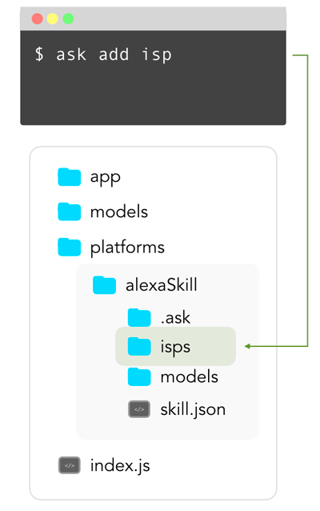

# In-Skill Purchases

Learn more about how to let your users do In-Skill Purchases (ISP) with your Alexa Skill. You can also use the following template to get started: [Jovo Template for Alexa ISP](https://github.com/jovotech/jovo-templates/tree/master/alexa/isp).

* [Introduction to In-Skill Purchases](#introduction-to-in-skill-purchases)
* [Manage Products with ASK CLI](#manage-products-with-ask-cli)
* [Update the Language Model](#update-the-language-model)
* [Implement Purchasing with Jovo](#implement-purchasing-with-jovo)
	* [Upsell](#upsell)
	* [Purchase Request](#purchase-request)
	* [Refund](#refund)
	* [ON_PURCHASE](#onpurchase)

## Introduction to In-Skill Purchases

In May 2018, Amazon [introduced](https://developer.amazon.com/blogs/alexa/post/5d852c9c-8cdf-45c1-9b68-e2f02af26c89/make-money-with-alexa-skills) the ability for Skill developers to make money through in-skill purchasing. It allows you to sell items either through one-time purchases or subscriptions. Take a look at the [official reference by Amazon: In-Skill Purchasing Overview](https://developer.amazon.com/docs/in-skill-purchase/isp-overview.html). 


There are three things that need to be done to successfully implement in-skill purchasing for your Alexa Skill with Jovo:

* [Manage Products with ASK CLI](#manage-products-with-ask-cli)
* [Update the Language Model](#update-the-language-model)
* [Implement Purchasing with Jovo](#implement-purchasing-with-jovo)


## Manage Products with ASK CLI



Purchasable products can be added and managed with ASK CLI, the command line interface for the Alexa Skills Kit.

If you're using the common Jovo project structure, go into your `platforms/alexaSkill` folder and then tell the ASK ClI to `add isp`. After going through the process, it will add a new folder `isps` to your project files.

```sh
# Go into alexaSkill folder
$ cd platforms/alexaSkill

$ ask add isp

? List of in-skill product types you can choose (Use arrow keys)
❯ Entitlement 
  Subscription 

? List of in-skill product templates you can choose (Use arrow keys)
> Entitlement_Template

? Please type in your new in-skill product name:
 frozen_sword
In-skill product frozen_sword.json is saved to ./isps/entitlement/frozen_sword.json
```

After that, there should be a `frozen_sword.json` file in your `alexaSkill/isps` folder. The content of that `json` file is used to define the price, release date, description as well as the prompts Alexa will use when she handles the transaction and much much more. You can find examples and a small description for each field [here](https://developer.amazon.com/docs/smapi/isp-schemas.html).

Here's how our product's file looks like:

```javascript
{
  "version": "1.0",
  "type": "ENTITLEMENT",
  "referenceName": "frozen_sword",
  "publishingInformation": {
    "locales": {
      "en-US": {
        "name": "Frozen Sword",
        "smallIconUri": "https://s3.amazonaws.com/jovocards/logo108.png",
        "largeIconUri": "https://s3.amazonaws.com/jovocards/logo512.png",
        "summary": "A sword once used by Arthas.",
        "description": "Use the overpowered Frozen Sword",
        "examplePhrases": [
          "Alexa, buy the frozen sword"
        ],
        "keywords": [
          "frozen sword",
          "sword",
          "frozen"
        ],
        "customProductPrompts": {
          "purchasePromptDescription": "Do you want to buy the Frozen Sword?",
          "boughtCardDescription": "Congrats. You successfully purchased the Frozen Sword!"
        }
      }
    },
    "distributionCountries": [
      "US"
    ],
    "pricing": {
      "amazon.com": {
        "releaseDate": "2018-05-14",
        "defaultPriceListing": {
          "price": 0.99,
          "currency": "USD"
        }
      }
    },
    "taxInformation": {
      "category": "SOFTWARE"
    }
  },
  "privacyAndCompliance": {
    "locales": {
      "en-US": {
        "privacyPolicyUrl": "https://www.yourcompany.com/privacy-policy"
      }
    }
  },
  "testingInstructions": "This is an example product.",
  "purchasableState": "PURCHASABLE"
}
```

## Update the Language Model

Here is an example language model you can for purchasing and refunding products. It is recommended to use the reference name as an `ID` when creating the input/slot values:

```javascript
"intents": [
		{
			"name": "BuySkillItemIntent",
			"phrases": [
				"buy",
				"shop",
				"buy {ProductName}",
				"purchase {ProductName}",
				"want {ProductName}",
				"would like {ProductName}"
			],
			"inputs": [
				{
					"name": "ProductName",
					"type": "LIST_OF_PRODUCT_NAMES"
				}
			]
		},
		{
			"name": "RefundSkillItemIntent",
			"phrases": [
				"return {ProductName}",
				"refund {ProductName}",
				"want a refund for {ProductName}",
				"would like to return {ProductName}"
			],
			"inputs": [
				{
					"name": "ProductName",
					"type": "LIST_OF_PRODUCT_NAMES"
				}
			]
		}
	],
	"inputTypes": [
		{
			"name": "LIST_OF_PRODUCT_NAMES",
			"values": [
				{
					"value": "Frozen Sword",
					"id": "frozen_sword"
				}
			]
		}
	],
```

## Implement Purchasing with Jovo

In general, you can access the in-skill purchasing interface like this:

```javascript
// @language=javascript

this.$alexaSkill.$inSkillPurchase

// @language=typescript

this.$alexaSkill!.$inSkillPurchase
```

Before you start any kind of transaction or refund process, always retrieve the product first:

```javascript
// @language=javascript

let productReferenceName = 'frozen_sword'; 
this.$alexaSkill
    .$inSkillPurchase
    .getProductByReferenceName(productReferenceName, (error, product) => {

    });

// @language=typescript

let productReferenceName = 'frozen_sword'; 
this.$alexaSkill!
    .$inSkillPurchase
    .getProductByReferenceName(productReferenceName, (error: Error, product: any) => {

    });
```

The data you get looks like this:

```javascript
{ productId: 'amzn1.adg.product.994e8ec0-2f73-4130-837a-0bb06abe1ded',
  referenceName: 'frozen_sword',
  type: 'ENTITLEMENT',
  name: 'Frozen Sword',
  summary: 'A sword once used by Arthas.',
  entitled: 'NOT_ENTITLED',
  entitlementReason: 'NOT_PURCHASED',
  purchasable: 'PURCHASABLE',
  activeEntitlementCount: 0,
  purchaseMode: 'TEST' 
}
```

Using that data we can check if the user already owns the product:

```javascript
// @language=javascript

this.$alexaSkill
    .$inSkillPurchase
    .getProductByReferenceName(productReferenceName, (error, product) => {
        if (error) {
            console.log(error);
        }
        if (product.entitled === 'ENTITLED') {
            // user already owns it
        } else {
            // user does not own it
        }
    });

// @language=typescript

this.$alexaSkill!
    .$inSkillPurchase
    .getProductByReferenceName(productReferenceName, (error: Error, product: any) => {
        if (error) {
            console.log(error);
        }
        if (product.entitled === 'ENTITLED') {
            // user already owns it
        } else {
            // user does not own it
        }
    });
```

### Upsell

The `upsell()` method is used to proactively offer the user your products. To send out the request, you need three things:

Name | Description | Value | Required
:--- | :--- | :--- | :--- | :---
`productId` | ID used to determine the correct product | `String` | Yes
`prompt` | Prompt Alexa will read to ask the user whether they are interested | `String` | Yes
`token` | Token you use to help you resume the Skill after the transaction finished | `String` | Yes

```javascript
// @language=javascript

UpsellIntent() {
    let productReferenceName = 'frozen_sword';
    this.$alexaSkill
    .$inSkillPurchase
    .getProductByReferenceName(productReferenceName, (error, product) => {
        if (error) {
            console.log(error);
        }
        if (product.entitled === 'ENTITLED') {
            this.tell('You have already bought this item.');
            return;
        } else {
            let prompt = 'The frozen sword will help you on your journey. Are you interested?';
            let token = 'testToken';
            this.$alexaSkill.$inSkillPurchase.upsell(product.productId, prompt, token);
        }
    });
},

// @language=typescript

UpsellIntent() {
    let productReferenceName = 'frozen_sword';
    this.$alexaSkill!
    .$inSkillPurchase
    .getProductByReferenceName(productReferenceName, (error: Error, product: any) => {
        if (error) {
            console.log(error);
        }
        if (product.entitled === 'ENTITLED') {
            this.tell('You have already bought this item.');
            return;
        } else {
            let prompt = 'The frozen sword will help you on your journey. Are you interested?';
            let token = 'testToken';
            this.$alexaSkill!.$inSkillPurchase.upsell(product.productId, prompt, token);
        }
    });
},
```

### Purchase Request

The `buy()` method is used to start the transaction after the user requested the purchase.

Name | Description | Value | Required
:--- | :--- | :--- | :--- | :---
`productId` | ID used to determine the correct product | `String` | Yes
`token` | Token you use to help you resume the Skill after the transaction finished | `String` | Yes

```javascript
// @language=javascript

BuySkillItemIntent() {
    let productReferenceName = this.$inputs.productName.id;
    this.$alexaSkill
        .$inSkillPurchase
        .getProductByReferenceName(productReferenceName, (error, product) => {
            if (error) {
                console.log(error);
            }
            if (product.entitled === 'ENTITLED') {
                this.tell('You have already bought this item.');
                return;
            }
            let token = 'testToken';
            this.$alexaSkill.$inSkillPurchase.buy(product.productId, token);
        });
},

// @language=typescript

BuySkillItemIntent() {
    let productReferenceName = this.$inputs.productName.id;
    this.$alexaSkill!
        .$inSkillPurchase
        .getProductByReferenceName(productReferenceName, (error: Error, product: any) => {
            if (error) {
                console.log(error);
            }
            if (product.entitled === 'ENTITLED') {
                this.tell('You have already bought this item.');
                return;
            }
            let token = 'testToken';
            this.$alexaSkill!.$inSkillPurchase.buy(product.productId, token);
        });
},
```


### Refund

The `cancel()` method is used to start the refund process after the user asked for it.

Name | Description | Value | Required
:--- | :--- | :--- | :--- | :---
`productId` | ID used to determine the correct product | `String` | Yes
`token` | Token you use to help you resume the Skill after the transaction finished | `String` | Yes

```javascript
// @language=javascript

RefundSkillItemIntent() {
    let productReferenceName = this.$inputs.productName.id;
    this.$alexaSkill
        .$inSkillPurchase
        .getProductByReferenceName(productReferenceName, (error, product) => {
            if (error) {
                console.log(error);
                // Continue, where you left off
            }
            if (product.entitled !== 'ENTITLED') {
                this.tell('You have not bought this item yet.');
            }
            let token = 'testToken';
            this.$alexaSkill.$inSkillPurchase.cancel(product.productId, token);
        });
},

// @language=typescript

RefundSkillItemIntent() {
    let productReferenceName = this.$inputs.productName.id;
    this.$alexaSkill!
        .$inSkillPurchase
        .getProductByReferenceName(productReferenceName, (error: Error, product: any) => {
            if (error) {
                console.log(error);
                // Continue, where you left off
            }
            if (product.entitled !== 'ENTITLED') {
                this.tell('You have not bought this item yet.');
            }
            let token = 'testToken';
            this.$alexaSkill!.$inSkillPurchase.cancel(product.productId, token);
        });
},
```

### ON_PURCHASE

After successfully going through the process of purchasing or refunding a product, your Skill will receive a request notifying you about the result:

```javascript
{
    "type": "Connections.Response",
    "requestId": "string",
    "timestamp": "string",
    "name": "Upsell",
    "status": {
        "code": "string",
        "message": "string"  
    },
    "payload": {
        "purchaseResult":"ACCEPTED",    
        "productId":"string",   
        "message":"optional additional message"
    },
    "token": "string"
}
```

The important parts of that request are:

Name | Description
:--- | :---
`name` | Either `Upsell`, `Buy` or `Cancel`. Used to determine which kind of transaction took place
`payload.purchaseResult` | Either `ACCEPTED`, `DECLINED`, `ALREADY_PURCHASED` or `ERROR`. Used to determine the outcome of the transaction
`payload.productId` | The product in question
`token` | The token used to resume the skill where it left off

That request will be mapped to the built-in `ON_PURCHASE` intent:

```javascript
// @language=javascript

ON_PURCHASE() {
    const name = this.$request.name;
    const productId = this.$alexaSkill.$inSkillPurchase.getProductId();
    const purchaseResult = this.$alexaSkill.$inSkillPurchase.getPurchaseResult();
    const token = this.$request.token;

    if (purchaseResult === 'ACCEPTED') {
        this.tell('Great! Let\'s use your new item');
    } else {
        this.tell('Okay. Let\'s continue where you left off.');
    }
},

// @language=typescript

ON_PURCHASE() {
    const name = this.$request.name;
    const productId = this.$alexaSkill!.$inSkillPurchase.getProductId();
    const purchaseResult = this.$alexaSkill!.$inSkillPurchase.getPurchaseResult();
    const token = this.$request.token;

    if (purchaseResult === 'ACCEPTED') {
        this.tell('Great! Let\'s use your new item');
    } else {
        this.tell('Okay. Let\'s continue where you left off.');
    }
},
```

<!--[metadata]: {"description": "Learn more about how to let your users do In-Skill Purchases (ISP) with your Alexa Skill.",
"route": "amazon-alexa/in-skill-purchases" }-->
