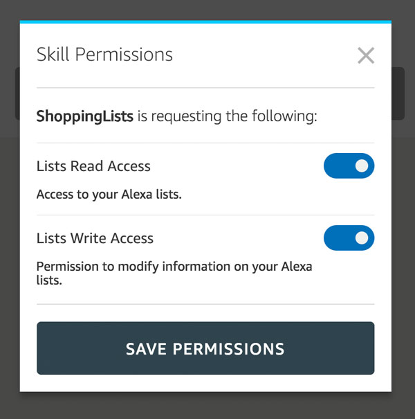

# Alexa Lists
This section shows how to access shopping lists and to-do lists when building Alexa Skills with the Jovo Framework.

* [Introduction to Lists](#introduction-to-lists)
   * [List Permissions](#list-permissions)
   * [List Permission Card](#list-permission-card)
* [Shopping List](#shopping-list)
* [To-Do List](#to---do-list)

## Introduction to Lists

Amazon Alexa offers the ability to its users to add items to a shopping list and a to-do list. Custom Skills can get the permission to access these lists for read and write operations. For a general overview, read the [official list reference by Amazon](https://developer.amazon.com/docs/custom-skills/access-the-alexa-shopping-and-to-do-lists.html).


### List Permissions

Users need to grant your Alexa Skill permission for `read` and/or `write` access to their lists. To enable your Alexa Skill to ask for list permissions, you can do either of the following:
* Configure permissions in the Amazon Developer Portal
* Update the `skill.json`
* Update the Jovo `project.js`

In the Amazon Developer Portal, you can do this by checking the following permissions:


The same result is achieved by adding the following to the `manifest` in your `skill.json`:

```javascript
"permissions": [
      {
        "name": "alexa::household:lists:read"
      },
      {
        "name": "alexa::household:lists:write"
      }
]
```

If you're using the [Jovo Language Model](../../basic-concepts/model '../model') and don't want to make the changes to the Amazon Developer Portal, you can also add this to the `alexaSkill` object in the `project.js` of your Jovo project. This way, these permissions are written into the `skill.json` with the `jovo build` command.

This is how an example `project.js` could look like:

```javascript
// project.js

alexaSkill: {
    nlu: 'alexa',
    manifest: {
        permissions: [
            {
                name: 'alexa::household:lists:read',
            },
            {
                name: 'alexa::household:lists:write',
            }
        ]
    }
},
```


### List Permission Card

If your users haven't granted your Skill the permission access lists yet (for example because they did not enabled it with their voice, not in the Alexa app), you can use a [`List Permission Card`](./visual.md#permission-card './visual-output#permission-card') to ask for the required permission.

This is mostly used after the error code `'NO_USER_PERMISSION'` is returned. Here is an example:

```javascript
// @language=javascript

async GetShoppingListIntent() {
    try {
        const list = await this.$alexaSkill.$user.getShoppingList();

    } catch(error) {
        if (error.code === 'NO_USER_PERMISSION') {
            this.$alexaSkill.showAskForListPermissionCard(['read'])
                .tell('Please grant the permission to access your lists.');
        } else {
            console.error(error);
        }
    }
},

// @language=typescript

async GetShoppingListIntent() {
    try {
        const list = await this.$alexaSkill!.$user.getShoppingList();

    } catch(error: Error) {
        if (error.code === 'NO_USER_PERMISSION') {
            this.$alexaSkill!.showAskForListPermissionCard(['read'])
                .tell('Please grant the permission to access your lists.');
        } else {
            console.error(error);
        }
    }
},
```

You can ask for both `read` and `write` access with the Permission Card:

```javascript
// @language=javascript

this.$alexaSkill.showAskforListPermissionCard(['read', 'write'])
    .tell('Please grant the permission to access your lists.');

// @language=typescript

this.$alexaSkill!.showAskforListPermissionCard(['read', 'write'])
    .tell('Please grant the permission to access your lists.');
```

This is what it looks like in the Alexa app:


Users can then update the permissions in the Skill's settings:




## Shopping List

Get the user's shopping list:

```javascript
// @language=javascript

await this.$alexaSkill.$user.getShoppingList();

// Example
async GetShoppingListIntent() {
    try {
        const list = await this.$alexaSkill.$user.getShoppingList();

        console.log(list);

    } catch(error) {
        // Do something
    }
},

// @language=typescript

await this.$alexaSkill!.$user.getShoppingList();

// Example
async GetShoppingListIntent() {
    try {
        const list = await this.$alexaSkill!.$user.getShoppingList();

        console.log(list);

    } catch(error: Error) {
        // Do something
    }
},
```

Add an item to the shopping list:

```javascript
// @language=javascript

await this.$alexaSkill.$user.addToShoppingList(value);

// Example
async AddItemToShoppingListIntent() {
    try {
        const result = await this.$alexaSkill.$user.addToShoppingList('Milk')

        console.log(result);

    } catch(error) {
        // Do something
    }
},

// @language=typescript

await this.$alexaSkill!.$user.addToShoppingList(value);

// Example
async AddItemToShoppingListIntent() {
    try {
        const result = await this.$alexaSkill!.$user.addToShoppingList('Milk')

        console.log(result);

    } catch(error: Error) {
        // Do something
    }
},
```

Update the shopping list:

```javascript
// @language=javascript

await this.$alexaSkill.$user.updateShoppingListItem(oldValue, newValue);

// Example
async UpdateShoppingListItemIntent() {
    try {
        const result = await this.alexaSkill.$user.updateShoppingListItem('Milk', 'Almond Milk');

        console.log(result);

    } catch(error) {
        if (error.code === 'NO_USER_PERMISSION') {
            this.$alexaSkill.showAskForListPermissionCard(['read', 'write'])
                .tell('Please grant the permission.');
        }
        if (error.code === 'ITEM_NOT_FOUND') {
            this.tell('Item not found.');
        }
    }
},

// @language=typescript

await this.$alexaSkill!.$user.updateShoppingListItem(oldValue, newValue);

// Example
async UpdateShoppingListItemIntent() {
    try {
        const result = await this.alexaSkill!.$user.updateShoppingListItem('Milk', 'Almond Milk');

        console.log(result);

    } catch(error: Error) {
        if (error.code === 'NO_USER_PERMISSION') {
            this.$alexaSkill!.showAskForListPermissionCard(['read', 'write'])
                .tell('Please grant the permission.');
        }
        if (error.code === 'ITEM_NOT_FOUND') {
            this.tell('Item not found.');
        }
    }
},
```

Delete an item:

```javascript
// @language=javascript

await this.$alexaSkill.$user.deleteShoppingListItem(oldValue, newValue);

// Example
async DeleteShoppingListItemIntent() {
    try {
        const data = await this.$alexaSkill.$user.deleteShoppingListItem('Milk');
        console.log('item deleted');
        console.log(data);

    } catch(error) {
        // Do something
    }
},

// @language=typescript

await this.$alexaSkill!.$user.deleteShoppingListItem(oldValue, newValue);

// Example
async DeleteShoppingListItemIntent() {
    try {
        const data = await this.$alexaSkill!.$user.deleteShoppingListItem('Milk');
        console.log('item deleted');
        console.log(data);

    } catch(error: Error) {
        // Do something
    }
},
```

## To-Do List

Get the user's to-do list:

```javascript
// @language=javascript

await this.$alexaSkill.$user.getToDoList();

// Example
async GetTodoListIntent() {
    try {
        const list = await this.alexaSkill.$user.getToDoList();

        console.log(list);

    } catch(error) {
        // Do something
    }
},

// @language=typescript

await this.$alexaSkill!.$user.getToDoList();

// Example
async GetTodoListIntent() {
    try {
        const list = await this.alexaSkill!.$user.getToDoList();

        console.log(list);

    } catch(error: Error) {
        // Do something
    }
},
```

Add an item to the to-do list:

```javascript
// @language=javascript

await this.$alexaSkill.$user.addToToDoList(value)

// Example
async AddItemToToDoListIntent() {
    try {
        const result = await this.$alexaSkill.$user.addToToDoList('Do Laundry');

        console.log(result);

    } catch(error) {
        // Do something
    }
},

// @language=typescript

await this.$alexaSkill!.$user.addToToDoList(value)

// Example
async AddItemToToDoListIntent() {
    try {
        const result = await this.$alexaSkill!.$user.addToToDoList('Do Laundry');

        console.log(result);

    } catch(error: Error) {
        // Do something
    }
},
```

Update the to-do list:

```javascript
// @language=javascript

await this.$alexaSkill.$user.updateToDoListItem(oldValue, newValue)

// Example
async UpdateToDoListItemIntent() {
    try {
        const result = await this.$alexaSkill.$user.updateToDoListItem('Do Laundry', 'Buy Clothes');

        console.log(result);

    } catch(error) {
        // Do something
    }
},

// @language=typescript

await this.$alexaSkill!.$user.updateToDoListItem(oldValue, newValue)

// Example
async UpdateToDoListItemIntent() {
    try {
        const result = await this.$alexaSkill!.$user.updateToDoListItem('Do Laundry', 'Buy Clothes');

        console.log(result);

    } catch(error: Error) {
        // Do something
    }
},
```

Delete an item from the to-do list:

```javascript
// @language=javascript

await this.$alexaSkill.$user.deleteToDoListItem(value)

// Example
async DeleteToDoListItemIntent() {
    try {
        const result = await this.$alexaSkill.$user.deleteToDoListItem('Buy clothes');

        console.log(result);

    } catch(error) {
        // Do something
    }
},

// @language=typescript

await this.$alexaSkill!.$user.deleteToDoListItem(value)

// Example
async DeleteToDoListItemIntent() {
    try {
        const result = await this.$alexaSkill!.$user.deleteToDoListItem('Buy clothes');

        console.log(result);

    } catch(error: Error) {
        // Do something
    }
},
```

<!--[metadata]: {"description": "Learn how to build Amazon Alexa Skills that use Lists with the Jovo Framework",
"route": "amazon-alexa/lists" }-->
