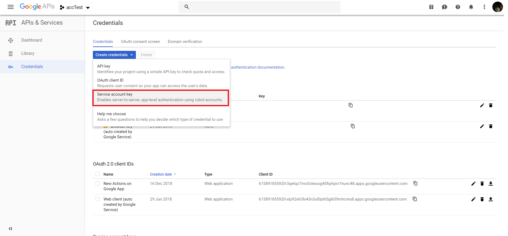

# Push Notifications

Learn more about how to send push notifications to your users.

* [Introduction](#introduction)
* [Configuration](#configuration)
* [User Permission](#user-permission)
* [Notification Object](#notification-object)
* [Notification Module](#notification-module)
* [Access Token](#access-token)
* [Send the Notification](#send-the-notification)

## Introduction

The Push Notifications feature allows you to send user's notifications, which if tapped, triggers a predefined intent of your Google Action. 

Before being able to send out notifications to your user, you have to first have them opt-in to receive notifications for a specific intent. Only then, can you send out notifications for that specific intent to be triggered.

The process to send out notifications has the following four steps:

1. Configure your Google Action to support notifications
2. Ask the user to opt in
3. Prepare the notification you want to send
4. Get the access token needed to send out notifications
5. Send out the actual notification.

## Configuration

First of all, you have to make the necessary configurations to send out notifications.

You have to specify the intents, which support notifications, by first adding them to the set of intents, which can be triggered by implicit invocations inside your Dialogflow Agent:


After you've done that, you can find the intent as one of your `Actions` on your Google Actions `Actions` tab:


Select the intent and at the bottom of the tab you will find the `User engagement` section, where you can enable the push notifications as well as set a content title:


After you've done that, you have to get a service account key for your Google Action as you will need it later on to get the access token needed to send out notifications.

For that, you have to first go the following url (replace the `<your-project-id>` part with your project's id) and enable the `Actions API`: https://console.developers.google.com/apis/api/actions.googleapis.com/overview?project=<your-project-id> 


Now, go over to https://console.developers.google.com/apis/credentials?project=<your-project-id>, again replace the `your-project-id` part, and create a new service account key:



Select `Project Owner` as the role and `JSON` as the key type:


Now that you got your service account key as well, all the preperation is done

## User Permission

To ask the user if they want to opt-in to get push notifications for the specified intent, you use the following:

```javascript
this.$googleAction.askForNotification(intent);
```

The response to the question will be mapped to the Jovo built-in `ON_PERMISSION` intent, where you can check wether the permission was granted using `this.$googleAction.isPermissionGranted()`:

```javascript
ON_PERMISSION() {
    if (this.$googleAction.isPermissionGranted()) {
        // save user and the intent to db
    } else {
        this.tell('Alright, I won\'t send you notifications');
    }
}
```

## Notification Object

The notification object contains the data you want to send to your user and has to have the following format:

```javascript
{
    "customPushMessage": {
        "userNotification": {
            "title": "<title>",
        },
        "target": {
            "userId": "<userId>",
            "intent": "<intent>",
            "locale": "<locale>"
        },
    }
}
```

Name | Description | Value | Required
:--- | :--- | :--- | :---
`title` | Specifies the title of the notification | `string` | Yes
`userId` | Specifies the user who will receive the notification | `string` | Yes
`intent` | Specifies the intent which will be executed after the user tapped on the notification | `string` | Yes
`locale` | Specifies the locale | `string` | Yes

## Notification Module

To access the `$notification` module, which contains the methods needed to send out push notifications you have to first install the `googleapis` package as a dependency:

```sh
$ npm install --save googleapis
```

The module itself is also not added automatically to the `google-platform-googleassistant` plugin, you have to add it manually in your `app.js` file:

```javascript
// src/app.js

// ------------------------------------------------------------------
// APP INITIALIZATION
// ------------------------------------------------------------------

const { App } = require('jovo-framework');
const { GoogleAssistant, NotificationPlugin } = require('jovo-platform-googleassistant');

const app = new App();

const googleAssistant = new GoogleAssistant();

googleAssistant.use(new NotificationPlugin());

app.use(
    googleAssistant
);
```

After you have done both, you can access the `$notification` module using `this.$googleAction.$notification`.

## Access Token

To get the access token needed to send the notification, you need the service account key you downloaded earlier. Using key's `client_email` and `private_key` attributes you can use `sendAuthRequest(clientEmail, privateKey)`, which will return you an object containing the access token, or you use `getAccessToken(clientEmail, privateKey)` to get only the access token:

```javascript
// get credentials object
const credentials = await this.$googleAction.$notification.sendAuthRequest(clientEmail, privateKey);
const accessToken = credentials.access_token;

// get access token directly
const accessToken = await this.$googleAction.$notification.getAccessToken(clientEmail, privateKey);
```

## Send the Notification

Using the access token and the notification object you can send the push notification:

```javascript
const result = await this.$googleAction.$notification.sendNotification(notification, accessToken);
```

<!--[metadata]: {"description": "Learn more about how to send out push notifications with the Google Assistant",
"route": "google-assistant/notifications" }-->
