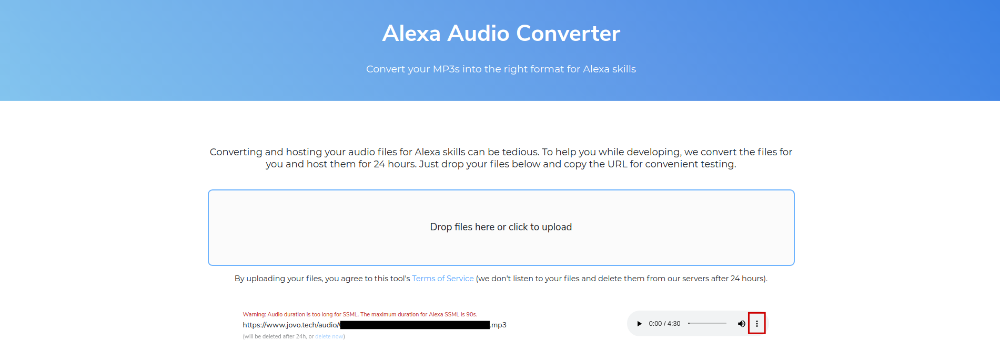

# Jovo Audio Converter

> To view this page on the Jovo website, visit https://v3.jovo.tech/docs/audio-converter

The Jovo Audio Converter converts your MP3s into the right format for Alexa Skills and Google Actions.

The audio file is also hosted for 24 hours on our servers for fast prototyping.

To download the converted file simply press the three buttons next to the audio player.

<!--[metadata]: {"description": "Learn how to use the Audio Converter to get the right format for Alexa Skills",
"route": "audio-converter" }-->
