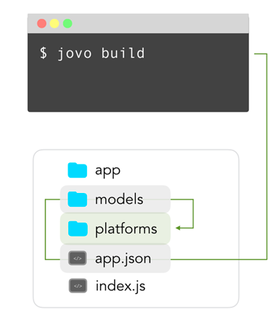
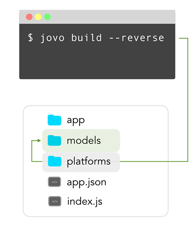

# jovo build

Learn more about how to translate your Jovo Language Model into an Alexa Skill Interaction Model or a Dialogflow Agent with the `jovo build` CLI command.

* [Introduction](#introduction)
* [Workflow](#workflow)
* [Options](#options)


## Introduction



`jovo build` is the command to create and update the platform specific interaction models using the Jovo model. Using the files in the `/models` folder and converting them into files in the `/platforms` folder.

```sh
$ jovo build
```

> To learn more about Jovo Language Model, take a look at [Basic Concepts > Model](../../basic-concepts/model '../model').

## Workflow

The `jovo build` command uses two elements of a Jovo project to create platform specific files:

* The platforms that are defined in the `project.js` file (e.g. `alexaSkill` and `googleAction`)
* The Jovo Language Model files that can be found in the `models` folder (e.g. `en-US.json`)


```sh
# Default
$ jovo build

# Options
$ jovo build [-p | --platform <platform>] [-r | --reverse] [-l | --locale <locale>] [-d | --deploy]
  [-t | --target <target>] [-s | --src <src>] [--stage <stage>] [--endpoint <endpoint>] [--ask-profile <profileName>] [--overwrite]
```

### Reverse Build



In this reverse process, you can create a [Jovo Language Model](../../basic-concepts/model '../model') from an existing `/platforms` folder, e.g. after you fetched the files with [`jovo get`](./get.md './get').

```sh
# Alexa Skill
$ jovo build -p alexaSkill --reverse

# Google Action
$ jovo build -p googleAction --reverse
```

This will prompt you if you want to overwrite the existing files or rather create a backup first. You can also skip this step and overwrite the files right away by using the `--overwrite` option:

```sh
# Alexa Skill with overwrite
$ jovo build -p alexaSkill --reverse --overwrite

# Google Action with overwrite
$ jovo build -p googleAction --reverse --overwrite
```


## Options

`--platform`, `-p`: If you want to update all your platforms, you can leave it out and it will update the ones listed in `project.js`. If you want to update a specific platform folder you can pass the platform name as an argument: `alexaSkill` or `googleAction`.

`--locale`, `-l`: Specify the locale, which should be created/updated. Arguments: `en-US`, `de-DE`, et cetera. Default: All files in the `models` folder.

`--deploy`, `-d`: This is a shortcut to the [`jovo deploy`](./deploy.md './deploy') command. Deploy the platform files to their respective developer console.

`--target`, `-t`: Used in combination with `--deploy` to specify target of deployment. Arguments: `info` (Skill Information), `model` (Interaction Model), `all`. Default: `all`.

`--src`, `-s`: Used in combination with `--deploy`. Path to source files. Default: `src`. 

`--stage`: Specify the stage where the configuration will be taken from.

`--ask-profile`: Used in combination with `--deploy`. Specifies which profile set up in [ASK CLI](https://developer.amazon.com/docs/smapi/quick-start-alexa-skills-kit-command-line-interface.html) should be used to deploy. Default: `default`.

`--reverse`, `-r`: In this reverse process, you can create a [Jovo Language Model](../../basic-concepts/model '../model') from an existing `/platforms` folder, e.g. after you fetched the files with [`jovo get`](./get.md './get').

`--overwrite`: Can be used together with the `--reverse` command. This ignores the question if the existing files should really be overwritten.


<!--[metadata]: {"description": "Learn more about how to translate your Jovo Language Model into an Alexa Skill Interaction Model or a Dialogflow Agent with the jovo build CLI command.",
                "route": "cli/build"}-->
