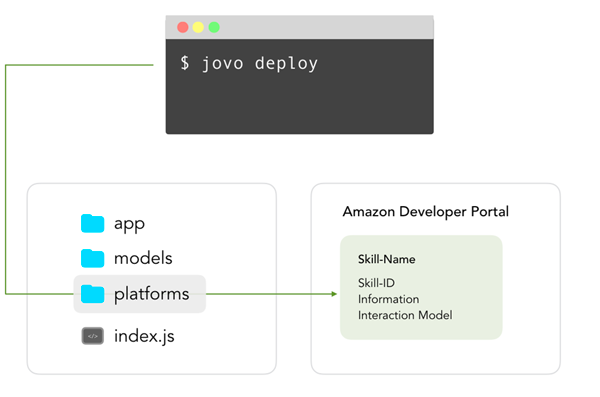

# jovo deploy

Learn how to deploy your Alexa Skills and Google Actions with the `jovo deploy` CLI command.

* [Introduction](#introduction)
* [Deploy Platform Projects](#deploy-platform-projects)
   * [Amazon Alexa Deployment](#amazon-alexa-deployment)
   * [Google Assistant Deployment](#google-assistant-deployment)
* [Deploy Source Code](#deploy-source-code)
   * [AWS Lambda](#aws-lambda)
* [Options](#options)


## Introduction



`jovo deploy` is used for two things:
* Upload the platform folders to their respective developer consoles (Amazon Alexa Developer Console, Dialogflow Console)
* Upload the source code to a cloud provider (AWS Lambda)

```sh
# Default
$ jovo deploy

# Options
$ jovo deploy --platform <platform> [--project-id <project ID>] [-l | --locale <locale>] [-t | --target <target>] [--stage <stage>] [-s | --src <src>] [--endpoint <endpoint>] [--ask-profile <profileName>]
```


## Deploy Platform Projects

Learn more about how to deploy the information that

* [Amazon Alexa Deployment](#amazon-alexa-deployment)
* [Google Assistant Deployment](#google-assistant-deployment)

### Amazon Alexa Deployment

To deploy to the Amazon developer console, you have to set up [ASK CLI](https://developer.amazon.com/docs/smapi/quick-start-alexa-skills-kit-command-line-interface.html) first.

```sh
# Install ASK CLI
$ npm install -g ask-cli

# Initialize a profile
$ ask init
```

For more information on how to set up the ASK CLI, see the [official ASK CLI reference from Amazon](https://developer.amazon.com/docs/smapi/quick-start-alexa-skills-kit-command-line-interface.html).

You can then deploy your Alexa Skill project with the Jovo CLI:

```sh
# Deploy to all platforms in project.js
$ jovo deploy

# Deploy only to Alexa
$ jovo deploy --platform alexaSkill

# Deploy to specific ASK Profile
$ jovo deploy --ask-profile <profileName>
```


### Google Assistant Deployment

> Tutorial: [Deploy a Dialogflow Agent with the Jovo CLI](https://www.jovo.tech/tutorials/deploy-dialogflow-agent)

To deploy a Dialogflow agent you have 2 options:
* Import the dialogflow_agent.zip file into your Dialogflow agent (we recommend using the option RESTORE)
* If you're using the Dialogflow v2 API (default since April 17, 2018), you can also deploy the agent directly to the platform. For this, [read more in our Dialogflow deployment tutorial](https://www.jovo.tech/tutorials/deploy-dialogflow-agent).

```sh
# Deploy to all platforms in project.js
$ jovo deploy

# Deploy only to Dialogflow/Google Assistant
$ jovo deploy --platform googleAction
```


### Deploy Source Code

> [Learn more about hosting here](../../configuration/hosting '../hosting').

For testing and running your app in production, you need to deploy the code to various [hosting providers](../../configuration/hosting '../hosting') Jovo offers integrations for.

You can create a ready-to-deploy `bundle.zip` file with either of the following commands:

```sh
# Bundle files
$ jovo deploy --target zip

# Alternative
$ npm run bundle
```

This will copy the `src` files into a `bundle` folder, run a production-only npm install, and then zip it.


### AWS Lambda

> Tutorial: [Deploy your Voice App to AWS Lambda with the Jovo CLI](https://www.jovo.tech/tutorials/deploy-lambda-cli).


If you have a Lambda endpoint defined in your `project.js` file, the `jovo deploy` command will not only [deploy platform projects](#deploy-platform-projects), but also bundle and upload your source code to AWS Lambda:

```sh
# Deploy platform projects and source code
$ jovo deploy
```

## Options

`--platform`, `-p`: Specify the platform that should be deployed. Arguments: `googleAction` or `alexaSkill` Default: Every platform found in the `/platforms` folder.

`--project-id`: Determine, which project to deploy to.

`--locale`, `-l`: Specify the locale that should be deployed. Default: Every locale found for each platform.

`--target`, `-t`: Specify, what type of information to deploy. Arguments: `info` (for Skill or Agent information), `model` (for language models), `zip` (creates `bundle.zip` file for deployment), `lambda` (for AWS Lambda deployment), `all`. Default: all.

`--stage`: Specify the stage where the configuration will be taken from.

`--src`, `-s`: Path to source files. Default: project directory.

`--endpoint`: Type of endpoint. Arguments: `jovo-webhook`, `bst-proxy`, `ngrok` or `none`. Default: `jovo-webhook`.

`--ask-profile`: Specifies which profile set up in [ASK CLI](https://developer.amazon.com/docs/smapi/quick-start-alexa-skills-kit-command-line-interface.html) should be used to deploy. Default: `default`.

<!--[metadata]: {"description": "Learn how to deploy your Alexa Skills and Google Actions with the jovo deploy CLI command.",
                "route": "cli/deploy"}-->
