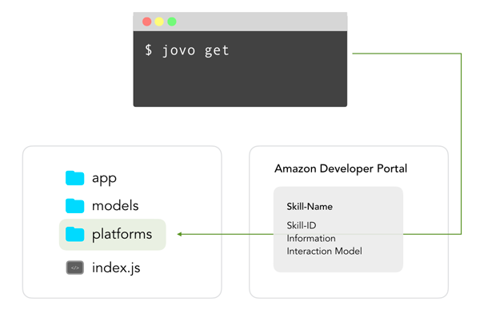

# jovo get

Learn how to import an existing Alexa Skill or Google Action into Jovo with the `jovo get` CLI command.

* [Introduction](#introduction)
* [Workflow](#workflow)
* [Options](#options)


## Introduction



`jovo get` will import an existing Alexa Skill (Skill Information and Interaction Model) or Dialogflow agent (work in progress) into the `/platforms` folder. 

```sh
$ jovo get <platform>
```

## Workflow

To get the Skill from the Amazon developer console, you have to set up [ASK CLI](https://developer.amazon.com/docs/smapi/quick-start-alexa-skills-kit-command-line-interface.html) first.

```sh
# Choose from list of Skills
$ jovo get <alexaSkill|googleAction>

# Get specific Alexa Skill using the Skill ID
$ jovo get alexaSkill --skill-id <skill ID>

# Get specific Dialogflow agent using the Project ID
# Coming soon
$ jovo get googleAction --project-id <project ID>

# Options
$ jovo get alexaSkill [-s | --skill-id <skill ID>] [--project-id <project ID>] [-l | --locale] [--list-skills] [--ask-profile] [-t | --target <target>] [--stage <stage>] [-r | --reverse] [-b | --build] [--overwrite]
```

## Options

`--skill-id`, `-s`: Get specific Alexa Skill using the Skill ID.

`--project-id`: Get a specific Dialogflow agent using the Project ID.

`--locale`, `-l`: Specify the locale, which should be created/updated. Default: all languages available for the Skill.

`--list-skills`: Shows a list of all available Skill projects for the specific ASK Profile.

`--ask-profile`: Specifies which profile set up in [ASK CLI](https://developer.amazon.com/docs/smapi/quick-start-alexa-skills-kit-command-line-interface.html) should be used to get the information. Default: `default`.

`--target`, `-t`: Specifies which information should be fetched from the Skill. Arguments: `info` (Skill Information), `model` (Interaction Model), `all`. Default: `all`.

`--stage`: Specify the stage where the configuration will be taken from.

`--reverse`, `-r`: Builds the Jovo language model out of the platform's language model.

`--build`, `-b`: Only works in combination with `--reverse`. Will run `jovo build` after reversing the platform's language model.

`--overwrite`: Forces existing files to be overwritten.


<!--[metadata]: {"description": "Learn how to import an existing Alexa Skill or Google Action into Jovo with the jovo get CLI command.",
                "route": "cli/get"}-->
