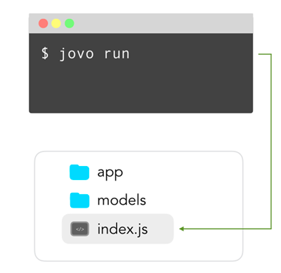

# jovo run

Learn how to use the `jovo run` command of the Jovo CLI to test your code locally.

* [Introduction](#introduction)
* [Options](#options)
* [Integrations](#integrations)
   * [nodemon](#nodemon)

## Introduction



You can use the `jovo run` command to start the development server in your `index.js` file (default is port `3000`), and then point the Jovo Webhook to it.

```sh
# Default
$ jovo run

# Options
$ jovo run [-b | --bst-proxy] [-w | --watch] [-p, --port <port>] [--inspect] [--stage <stage>] [--webhook-only]
  [--disable-jovo-debugger] [--model-test] [--timeout <timeout>] [-r | --record <name>]
```

You can also specify the file you want to run:

```sh
$ jovo run <file>

# Example
$ jovo run src/index.js

# Alternative
$ node src/index.js --webhook --cwd ./src
```


## Options

`--port`, `-p`: Defines the port that will be used to run the local development server. Default: `3000`.

`--inspect`: Run debugging mode.

`--stage`: Specify the stage where the configuration will be taken from.

`--webhook-only`: Starts the Jovo webhook proxy without executing the code.

`--disable-jovo-debugger`: Disables the Jovo debugger.

`--model-test`: Activates the language model test.

`--timeout`: Sets timeout in milliseconds.

`--record`, `-r`: Can be used to record requests and responses of your Jovo app for testing purposes.


`--cwd`: Changes the current working directory of the source code. Typically, it would be `./src`.


## Integrations

> If you want to see another integration, please feel free to [submit an issue](https://github.com/jovotech/jovo-cli/issues). Thanks!

Here is a list of integrations that work with `jovo run`:

Command | Description 
------------ | ------------- 
[`--watch`](#watch) | Uses `nodemon` to monitor changes and automatically restart the server

### nodemons

With this integration, you don't have to manually restart your server with every change you make to the application:

```sh
$ jovo run --watch
```

For this, we're using [`nodemon`](https://github.com/remy/nodemon), a neat package that monitors your app files and automatically restarts the server.


<!--[metadata]: {"description": "Learn how to use the jovo run command of the Jovo CLI to test your code locally.",
                "route": "cli/run"}-->
