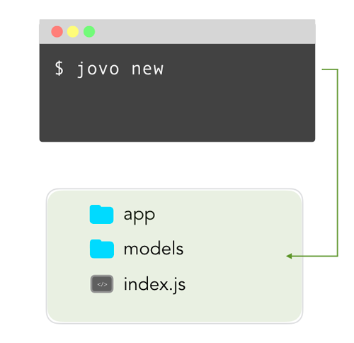

# jovo new

Learn how to create a new Jovo Project with the `jovo new` command of the Jovo CLI.

* [Introduction](#introduction)
* [Options](#options)

## Introduction



You can create a Jovo project into a new directory with the following command:

```sh
## Default
$ jovo new <directory>

## Options
$ jovo new <directory> [-t | --template <template-name>] [-l | --locale <locale>] [--invocation <name>]
  [-i | --init <platform>] [-b | --build] [-d | --deploy] [--ff <platform>] [--skip-npminstall]
  [--ask-profile <profileName>] [--endpoint <endpoint>]
```

## Options

`--template`, `-t`: Used to specify which template should be used. Get a list of all the templates below, or on GitHub: [jovotech/jovo-templates](https://github.com/jovotech/jovo-templates). Default: `helloworld`.

`--locale`, `-l`: Choose the language of the interaction models in the `/models` folder. Arguments: `en-US`, `de-DE`, et cetera. Default: `en-US`.

`--invocation`: Set's the invocation name for the Alexa Skill.

`--init`, `-i`: This is a shortcut to the [`jovo init`](#jovo-init) command. Speed up the creation of your voice application by creating the `app.json` file right at the beginning. Arguments: `alexaSkill` or `googleAction`.

`--build`, `-b`: This is a shortcut to the [`jovo build`](#jovo-build) command. Speed up the creation of your voice application by building the platform specific files into the `/platforms` folder right at the beginning. Requires `--init` before.

`--deploy`, `-d`: This is a shortcut to the [`jovo deploy`](#jovo-deploy) command. Deploy the platform files to their respective developer console. It will deploy to the platform you specified with the `--init` and `--build` options.

`--ff`: Used to fast forward run `--init <platform> --build --deploy`.

`--skip-npminstall`: Skips installation of the npm packages.

`--ask-profile`: Choose the ask profile to use for the deployment. Default: the profile set as default in your ASK-CLI settings.

`--endpoint`: Choose the type of endpoint for `--init`: `jovo-webhook`, `bst-proxy`, `ngrok` or `none`. Default: `jovo-webhook`


**Templates**

Below is a list of templates that can currently be used with the `jovo new` command.

You can find the complete repository on GitHub: [jovotech/jovo-templates](https://github.com/jovotech/jovo-templates).

Name | Description 
:--- | :---
[`helloworld`](https://github.com/jovotech/jovo-templates/tree/master/01_helloworld) | `Default`. Jovo Sample Voice App with a simple "Hello World!" + asking for the user's name 
[`trivia-game`](https://github.com/jovotech/jovo-templates/tree/master/02_trivia-game) | Trivia game voice app that makes use of states, helper functions, and i18n
[`unit-testing`](https://github.com/jovotech/jovo-templates/tree/master/03_unit-testing) | Template for the Jovo built-in unit testing feature.
[`alexa/audioplayer`](https://github.com/jovotech/jovo-templates/tree/master/alexa/audioplayer) | Sample Alexa Audioplayer Skill that plays a longform audio file with the Audioplayer directive
[`alexa/dialoginterface`](https://github.com/jovotech/jovo-templates/tree/master/alexa/dialoginterface) | Sample implementation of the Alexa Dialog Interface
[`alexa/skillevents`](https://github.com/jovotech/jovo-templates/tree/master/alexa/skillevents) | Sample implementation of the Alexa Skill Events.
[`alexa/isp`](https://github.com/jovotech/jovo-templates/tree/master/alexa/isp) | Sample implementation of the Alexa in-skill purchases feature.
[`google/mediaresponse`](https://github.com/jovotech/jovo-templates/tree/master/google/mediaresponse) | Sample Google Action media response app that plays longform audio file


<!--[metadata]: {"description": "Learn how to create a new Jovo Project with the jovo new command of the Jovo CLI.",
                "route": "cli/new"}-->
