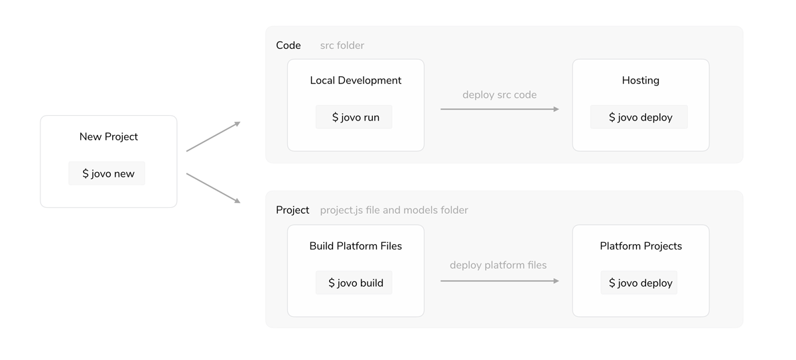
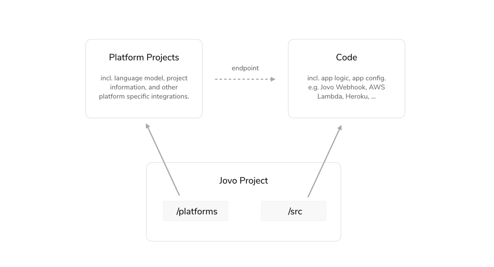
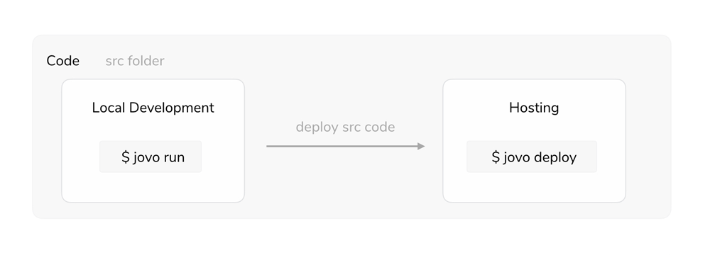
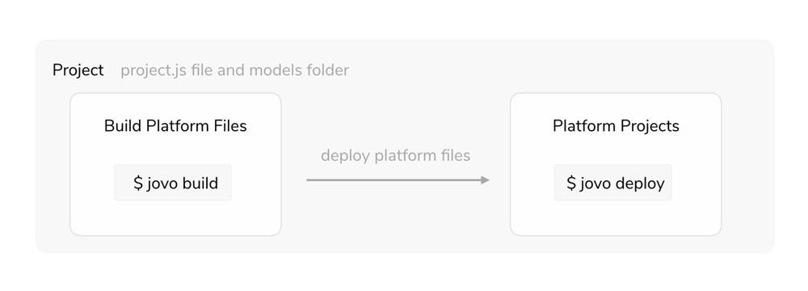

# Project Lifecycle

> To view this page on the Jovo website, visit https://v3.jovo.tech/docs/project-lifecycle

Learn more about the different steps of a Jovo project.

- [Introduction](#introduction)
- [Creating a Jovo Project](#creating-a-jovo-project)
- [Code](#code)
  - [Local Development](#local-development)
  - [Hosting](#hosting)
- [Platform Projects](#platform-projects)
  - [Build Platform Files](#build-platform-files)
  - [Deploy Platform Projects](#deploy-platform-projects)

## Introduction



There are two main elements of a Jovo project:

- `src` folder: The actual code of your app that is later hosted somewhere
- Platform project related files, including `project.js`, `models` and `platforms` folders

The two elements are connected by an `endpoint` that is used by the platform to send requests and receive responses ([learn more about Requests and Responses here](../basic-concepts/requests-responses './requests-responses')). This endpoint is where your app logic is executed with code.



Learn more about the different elements of a Jovo project in the following sections:

- [Creating a Jovo Project](#creating-a-jovo-project)
- [Code](#code)
  - [Local Development](#local-development)
  - [Hosting](#hosting)
- [Platform Projects](#platform-projects)
  - [Build Platform Files](#build-platform-files)
  - [Deploy Platform Projects](#deploy-platform-projects)

## Creating a Jovo Project

> [Learn more in our Quickstart Guide](../getting-started './quickstart').

You can create a new Jovo project by using the Jovo CLI:

```sh
# Install Jovo CLI
$ npm install -g jovo-cli

# Create new Jovo Project
$ jovo3 new <directory>
$ cd <directory>
```

For alternatives, see our [Installation Guide](../getting-started/installation './installation').

## Code



The source code in the `src` folder is where your app logic is run. The folder typically includes the following files:

- `app.js`: [App Instantiation and Logic](../configuration/app-js.md './app-js')
- `config.js`: [App Configuration](../configuration/config-js.md './config-js')
- `index.js`: [Host Configuration](../configuration/hosting './hosting')

For faster debugging and development, Jovo comes with [Local Development](#local-development) capabilities by using the `jovo run` command. After local debugging, the code can then be deployed to various [Hosting](#hosting) providers.

### Local Development

Jovo offers a development server based on ExpressJS for local testing and debugging.

You can use either of the following commands to run the server locally:

```sh
# Using the Jovo CLI and Jovo Webhook
$ jovo3 run

# Alternative
$ npm run start
```

Make sure that, with every file update, you terminate the server with `ctrl+c` and run it again. You can also use the `nodemon` Jovo CLI integration.

> [Find more information on the `jovo run` command here](../tools/cli/run.md './cli/run').

`$ jovo3 run` should return this:

```sh
Local development server listening on port 3000.
This is your webhook url: https://webhook.jovo.cloud/[your-id]
```

As you can see, a [Jovo Webhook](#jovo-webhook) URL is automatically created, which serves as a link to your local webhook and can be added as a HTTPS endpoint to the voice platforms.

Here are all the services that can point to your local development server:

- [Jovo Webhook](#jovo-webhook) (default)
- [Alternatives](#alternatives)
  - [ngrok](#ngrok)

#### Jovo Webhook

> [Learn more about the Jovo Webhook here](./jovo-webhook.md './jovo-webhook').

The Jovo Webhook is a free service that creates a link to your local webserver. This way, you can prototype locally without having to deal with servers or Lambda uploads all the time.

By using the [`jovo run`](../tools/cli/run './cli/run'), a unique, anonymized link is created that looks like this:

```sh
https://webhook.jovo.cloud/[your-id]
```

This link simply makes it easier for you to prototype locally by being able to see the logs in your command line, and to make fast changes without uploading your code to AWS Lambda.

You can either use this link and paste it into the respective developer platform consoles, or use the [`jovo deploy`](../tools/cli/deploy './cli/deploy') command to upload it from the command line. Your Jovo Webhook URL is the default `endpoint` in your [`project.js`](../configuration/project-js.md './project-js') file.

#### Alternatives

##### ngrok

[Ngrok](https://ngrok.com/) is a tunneling service that makes your localhost accessible to outside APIs.

You can download ngrok like so:

```sh
# Open a new tab in your command line tool, then:
$ npm install ngrok -g

# Point ngrok to your localhost:3000
$ ngrok http 3000
```

### Hosting

> [Learn more about hosting here](../configuration/hosting './hosting').

For testing and running your app in production, you need to deploy the code to various [hosting providers](../configuration/hosting './hosting') Jovo offers integrations for.

You can create a ready-to-deploy `bundle.zip` file with either of the following commands:

```sh
# Bundle files
$ jovo3 deploy --target zip

# Alternative
$ npm run bundle
```

This will copy the `src` files into a `bundle` folder, run a production-only npm install, and then zip it.

If you have a Lambda endpoint defined in your `project.js` file, the `jovo deploy` command will not only [deploy platform projects](#deploy-platform-projects), but also bundle and upload your source code to AWS Lambda:

```sh
# Deploy platform projects and source code
$ jovo3 deploy
```

## Platform Projects



Besides the code in the `src` folder, there is also a number of project-related configurations and files that are mostly used to create and manage platform specific projects.

The following files are used:

- `project.js`: [Project Configuration](../configuration/project-js.md './project-js')
- `models` folder: [Jovo Language Model](../basic-concepts/model './model') files
- `platforms` folder: Platform specific files

### Build Platform Files

> [Learn more about the project.js configuration here](../configuration/project-js.md './project-js').

To create platform projects for e.g. Amazon Alexa or Google Assistant (Dialogflow), we first need to create platform specific files that are later deployed to each platform.

For this, the Jovo CLI uses the information in the `project.js` file and the `models` folder to create platform specific language models:

```sh
# Build platforms folder files based on project.js config
$ jovo3 build
```

These files can then be deployed to the platforms.

### Deploy Platform Projects

> [Learn more about the jovo deploy command here](./cli/deploy './cli/deploy').

This command will deploy the files in the `platforms` folder to the platforms, for example Amazon Alexa or Dialogflow:

```sh
# Deploy platform projects
$ jovo3 deploy
```

<!--[metadata]: {"description": "Learn more about the different steps of a Jovo project.", "route": "project-lifecycle"}-->
