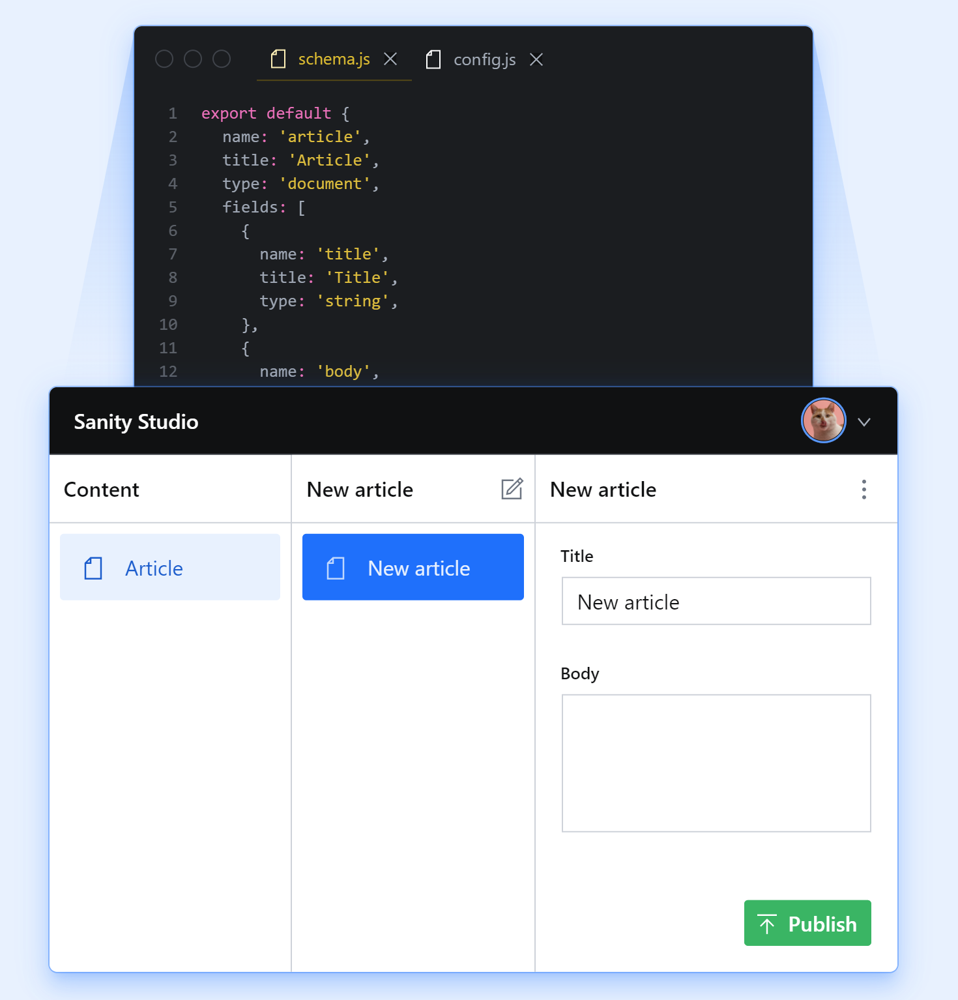
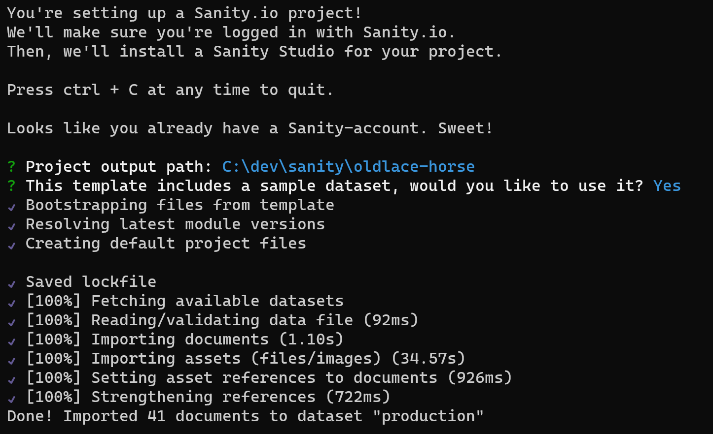
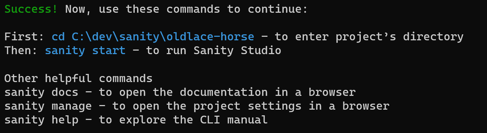

# Sanity CMS Integration

This [CMS integration](https://www.jovo.tech/docs/cms) lets you manage your content in Sanity.

## Introduction

With [Sanity](https://www.sanity.io), you can manage all the content of your Jovo app in the Sanity CMS. This makes collaboration easier and enables you to update and add content faster.

Here is a screenshot from Sanity Studio which you use to define schema for different data types, add data for those types, and query to access the data:



Learn more about setting up Sanity with Jovo in the [installation](#installation) and [configuration](#configuration) sections.

It's possible to define your own types (like Article in the example above). Using [GROQ (Graph-Relational Object Queries)](https://www.sanity.io/docs/groq) create a query to return an array of objects or a single object. GROQ itself allows you to include multiple data types in a single response or change the structure of the resulting JSON. 

Use query transformers to change the structure of a query result before it is saved in the `$cms` property in Jovo. Learn more in the [query transformers](#query-transformers) section.

## Installation

### Sanity
To get started, create a schema and data in Sanity by visiting the [Sanity Studio](https://www.sanity.io/studio) page and clicking the **"Get started"** button.

At the end, you will have a project stored in Sanity and a command to generate an admin website to manage the data:

```
npm install -g @sanity/cli && sanity init --template getting-started-pets --project xxxxxxxx --dataset production --provider google
```
Executing the command in the terminal will set up a web project:



Then, to launch Sanity Studio, execute `sanity start`:



### Jovo Project
In your Jovo project, install the plugin like this:

```sh
$ npm install @jovotech/cms-sanity
```

Add it as a plugin to your [app configuration](https://www.jovo.tech/docs/app-config), for example `app.ts`:

```typescript
import { SanityCms, KeyObjectQueryTransformer, TranslationsQueryTransformer } from '@jovotech/cms-sanity';
// ...

const app = new App({
  plugins: [
    new SanityCms({
      client: {
        projectId: '<YOUR-PROJECT-ID>',
        dataset: '<YOUR-DATASET>',
      },
      queries: {
        articles: "*[_type == 'article' && !(_id in path('drafts.**'))]",
        siteSettings: "*[_type == 'siteSettings' && !(_id in path('drafts.**'))][0]",
        products: new KeyObjectQueryTransformer({
          key: '_id',
          query: "*[_type == 'product' && !(_id in path('drafts.**'))]",
        }),
        translations: new TranslationsQueryTransformer({
          query: "*[_type == 'translation' && !(_id in path('drafts.**'))]",
        })    
      },
      // ...
    }),
    // ...
  ],
});
```

You need the `projectId` and `dataset` from your Sanity project which can be found in the command line above or going to your Sanity [dashboard](https://manage.sanity.io) and selecting your project. You will also need at least one query which consists of a key and a GROQ statement. All configuration options can be found in the [configuration section](#configuration).

## Configuration

The following configurations can be added:

```typescript
new SanityCms({
  client: {
    projectId: '<YOUR-PROJECT-ID>',
    dataset: '<YOUR-DATASET>',
    token: '<YOUR-TOKEN>',
    apiVersion: '2021-03-25',
    useCdn: true,
  },
  queries: {
    articles: "*[_type == 'article' && !(_id in path('drafts.**'))]",
    siteSettings: "*[_type == 'siteSettings' && !(_id in path('drafts.**'))][0]",
    products: new KeyObjectQueryTransformer({
      key: '_id',
      query: "*[_type == 'product' && !(_id in path('drafts.**'))]",
    }),
    translations: new TranslationsQueryTransformer({
      query: "*[_type == 'translation' && !(_id in path('drafts.**'))]",
    })    
  },
}),
```

- [`client.projectId`](#projectId): Your Sanity project ID.
- [`client.dataset`](#dataset): Your Sanity dataset.
- [`client.token`](#token): Optional token if you want authenticated access to your data. The default is empty string for unauthenticated access.
- [`client.apiVersion`](#apiversion): The version of the API. Uses the current date as default.
- [`client.useCdn`](#usecdn): Determines whether to used the Sanity cached API CDN for faster response times. The default is `true`.
- [`queries`](#queries): Define this list of GROQ queries to execute and the key under `$cms` to store the resulting JSON.

The `client` values are used with the [Sanity client library](https://www.sanity.io/docs/js-client#api).

### projectId

Identifies your Sanity project. 

In a configured studio, you find the project ID in the `sanity.json` file at the root of your project. Otherwise, you can always find it by locating your project on https://manage.sanity.io or running `sanity debug` in the terminal in your studio folder.

### dataset

Identifies the data store within your project. Can be used for `development` or `production`.

In a configured studio, you find the dataset in the `sanity.json` file at the root of your project. Otherwise, you can always find it by locating your project on https://manage.sanity.io or running `sanity debug` in the terminal in your studio folder.

### token

A token to secure API calls. Empty string means public access.

Use https://manage.sanity.io to create an API token. Empty string by default.


### apiVersion

Specifies the version of the API. Read [API Versioning](https://www.sanity.io/docs/api-versioning) for more details. By default, uses the current date: `new Date().toISOString().split('T')[0]`

### useCdn

Flag to determine if the direct API or the API CDN will be used. Setting this to `false` will directly access the most recent values in the Sanity Content Lake. A `true` value will call the [API CDN](https://www.sanity.io/docs/api-cdn) endpoint to more quickly access cached content.

### queries

Query your Sanity content using [GROQ (Graph-Relational Object Queries)](https://www.sanity.io/docs/groq). In this section, define one or more queries and the key that will be used to access the result using Jovo `this.$cms`:

```json
{
  // ...
  queries: {
    articles: "*[_type == 'article' && !(_id in path('drafts.**'))]",
    siteSettings: "*[_type == 'siteSettings' && !(_id in path('drafts.**'))][0]",
    products: new KeyObjectQueryTransformer({
      key: '_id',
      query: "*[_type == 'product' && !(_id in path('drafts.**'))]",
    }),
    translations: new TranslationsQueryTransformer({
      query: "*[_type == 'translation' && !(_id in path('drafts.**'))]",
    })
}
```

In this example:
- articles - an array of all published items of type `article` can be accessed with `this.$cms.articles`. For all published and draft articles, use `"*[_type == 'article']"`
- siteSettings - a object for the single `siteSettings` type. Access with `this.$cms.siteSettings`.
- products - an array of all published projects that is then transformed by `KeyObjectQueryTransformer` into an object where each item has a key set to the value of `_id` and the value is the object that was the array item. Access with `this.$cms.products`.
- translations - an array of all published translations that is then transformed by `TranslationsQueryTransformer`. The result can be access by `this.$cms.translations` but that is not how it will typically be used. These translations are available to the i18n integration with `this.$t('welcome');`.

Information on query transformers can be found in the [query transformers section](#query-transformers).


## Query Transformers

The Jovo Sanity integration comes with the following query transformers:

- [TranslationsQueryTransformer](#translationsquerytransformer)
- [KeyObjectQueryTransformer](#keyobjectquerytransformer)

You can also learn more about creating your own [custom query transformers](#custom-query-transformers).

### TranslationsQueryTransformer

This query transformer type makes use of the Jovo [i18n](https://www.jovo.tech/docs/i18n) and allows you to store translation strings in Sanity.

```typescript
import { SanityCms, TranslationsQueryTransformer } from '@jovotech/cms-sanity';
// ...

new SanityCms({
  queries: {
    translations: new TranslationsQueryTransformer({
      // ...
    }),
  },
  // ...
}),
```

If you use the `TranslationsQueryTransformer` the integration expects the schema in your Sanity Studio project to include both a [translation.js](./sanity-studio/translation.js) and [translationEntry.js](./sanity-studio/translationEntry.js) file.

This will give you the following screens in Sanity Studio to enter translations:


Each translation entry has:
- Key (required) - ex: `welcome` or `bye`. You can also use dot notation such as `a.b`.
- Locale (required) - such as `en` or `en-US`. Add more locales in Additional Translations.
- Text (required) - the translated text.
- Platform (optional) - used for [platform specific translations](https://www.jovo.tech/docs/i18n#platform-specific-translations) such as `alexa` or `googleAssistant`.

By using this query transformer type, you can access translation strings like this:

```typescript
this.$t('welcome');
```

Jovo automatically returns the right string depending on the current platform. If a platform specific key is empty, the key from its locale (in the example `en`) is used as a fallback.

Here is a sample of how `TranslationsQueryTransformer` transforms the array of `translation` types into an i18n resource:

```json
{
  "en": {
    "translation": {
      "welcome": [
        "Hello World!",
        "Hi!"
      ],
      "bye": "Goodbye!",
      "a": {
        "b": [
          "my value",
          "another"
        ]
      }
    },
    "alexa": {
      "translation": {
        "welcome": "Welcome Alexa user!"
      }
    }
  }
}
```


### KeyObjectQueryTransformer

This query transformer takes an array result from a GROQ query and transforms it into an object using the value of the `key` property as the key on the object.

```ts
import { SanityCms, KeyObjectQueryTransformer } from '@jovotech/cms-sanity';
// ...

new SanityCms({
  // ...
  queries: {
    products: new KeyObjectQueryTransformer({
      key: '_id',
      query: "*[_type == 'product' && !(_id in path('drafts.**'))]",
    })
  },
}),

```

Here's an example GROQ array result:

```json
[
  {
    "_id": "1990fada-c3c9-4f21-8b02-1618df195900",
    "_type": "product",
    "name": "Sharpie",
    // ...
  },
  {
    "_id": "416c5e3a-194a-404e-81c5-44b8ed1f7aad",
    "_type": "product",
    "name": "Cherries",
    // ...
  }
]
```

Here's an example of the result after it is transformed by the `KeyObjectQueryTransformer` when the `key` property is set to `"_id"`:

```json
{
  "1990fada-c3c9-4f21-8b02-1618df195900": {
    "_id": "1990fada-c3c9-4f21-8b02-1618df195900",
    "_type": "product",
    "name": "Sharpie",
    // ...
  },

  "416c5e3a-194a-404e-81c5-44b8ed1f7aad": {
    "_id": "416c5e3a-194a-404e-81c5-44b8ed1f7aad",
    "_type": "product",
    "name": "Cherries",
    // ...
  }
}
```


Access the data using:

```ts
this.$cms.product['1990fada-c3c9-4f21-8b02-1618df195900'];

// or, the pattern:
this.$cms.property.key;

```


### Custom Query Transformers

If you want to customize how the Sanity integration handles your data, you can build your own query transformer type and use it inside your app configuration.

```typescript
// src/transformers/SampleQueryTransformer.ts

import { Jovo } from '@jovotech/framework';
import { BaseSanityQueryTransformer, SanityQueryTransformerConfig } from '@jovotech/cms-sanity';

export class SampleQueryTransformer extends BaseSanityQueryTransformer {

  getDefaultConfig(): SanityQueryTransformerConfig {
      return {
          query: '',
      };
  }

  execute(values: unknown | unknown[], jovo: Jovo): unknown | unknown[] {
      // Transform input (values) into output (array or object)

      return {};
      // return [];
  }
}
```

The plugin consists of two functions:

- `getDefaultConfig()`: Returns an initial config with default values, which will be merged with the config you pass into the constructor.
- `execute()`: Accepts a JSON array or JSON object, which is the result of a GROQ query, and can return any data you'd like (array or object), which you can then access in your handler with `this.$cms`. The Sanity Integration also passes the Jovo object to use as needed.

You can also extend the base transformer config:

```ts
// src/transformers/SampleQueryTransformer.ts

export interface SampleTransformerConfig extends SanityQueryTransformerConfig {
    myKey: string;
}

export class SampleQueryTransformer extends BaseSanityQueryTransformer<SampleTransformerConfig> {

  getDefaultConfig(): SampleTransformerConfig {
      return {
          query: '',
          myKey: ''
      };
  }
  // ...
}

```
