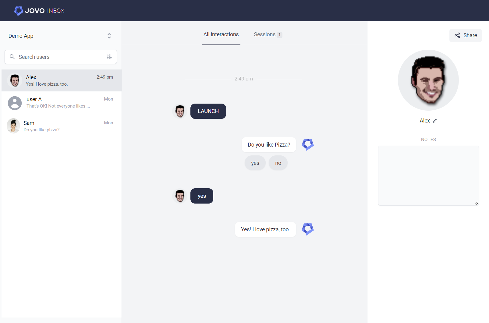

# Jovo Inbox Plugin

Access and analyze your Jovo app's conversations using Jovo Inbox. This plugin is used to communicate with the Inbox API.

## Introduction



Jovo Inbox allows you to learn from the conversations your users have with your voice and chat apps, across Alexa, Google's Business Messages, the web, and all other [platforms supported by Jovo](https://www.jovo.tech/marketplace).

This can be used for:
- Monitoring and analyzing live conversations
- Coordinated QA testing with your team and beta testers

Jovo Inbox can be hosted on your own servers. You have full control, no user data is sent to Jovo servers.

Learn more about connecting your Jovo app to Jovo Inbox in the following sections:

- [Installation](#installation)
- [Configuration](#configuration)
- [Features](#features)


## Installation

To connect your Jovo app to the Inbox, you need to install the Jovo Inbox plugin. If it is not already added to the project, you can install the plugin like this:

```sh
$ npm install @jovotech/plugin-inbox
```

You can then add the plugin to the [app configuration](https://www.jovo.tech/docs/app-config). This plugin is usually used in specific [stages](https://www.jovo.tech/docs/staging) like `app.prod.ts`:

```typescript
// src/app.prod.ts

import { JovoInbox } from '@jovotech/plugin-inbox';
// ...

app.configure({
  plugins: [
    new JovoInbox({
      projectId: '<PROJECT_ID>',
    }),
    // ...
  ],
});
```

For the plugin to work, at least the `projectId` config needs to be set. Learn more about all [configuration](#configuration) options below.


## Configuration

You can configure the Jovo Inbox plugin in the [app configuration](https://www.jovo.tech/docs/app-config). It includes everything that is needed from the app side to communicate with the Inbox API.

You can find all configuration options (including default values) below:

```typescript
import { JovoInbox } from '@jovotech/plugin-inbox';
// ...

app.configure({
  plugins: [
    new JovoInbox({
      projectId: '<PROJECT_ID>',
      fallbackLocale: 'en',
      server: {
        url: 'http://localhost:4000',
        path: '/api/logs',
      },
      skip: {
        userIds: [],
        platforms: [],
        locales: [],
      },
      storedElements: {
        request: true,
        response: true,
        // ...
      },
    }),
    // ...
  ],
});
```

The configuration includes the following properties:

- `projectId`: The ID that is used as a reference in the Jovo Inbox.
- `fallbackLocale`: The locale that is used if the request doesn't contain one.
- [`server`](#server): Where the Inbox API can be reached. Includes a `url` and a `path`.
- [`skip`](#skip): It's possible to skip the API call for certain requests. Includes `userIds`, `platforms`, and `locales`.
- [`storedElements`](#storedelements): All elements that can be sent to the Jovo Inbox, which will then be displayed in the detail view next to the conversation.

### server

The server property defines how the Inbox API can be reached:

```typescript
new JovoInbox({
  server: {
    url: 'http://localhost:4000',
    path: '/api/logs',
  },
  // ...
}),
```

### skip

The `skip` property allows you to set certain `userIds`, `platforms`, or `locales`, where the data shouldn't be sent to the Jovo Inbox.

Each property is an array of strings, for example:

```typescript
new JovoInbox({
  skip: {
    userIds: [ '1234', '5678' ],
    platforms: [ 'alexa' ],
    locales: [ 'de' ],
  },
  // ...
}),
```

### storedElements

By default, `request` and `response` are stored in the Jovo Inbox. The following elements (and [Jovo properties](https://www.jovo.tech/docs/jovo-properties)) can be stored as well by setting their values to `true`:

```typescript
new JovoInbox({
  storedElements: {
    request: true,
    response: true,
    state: true,
    input: true,
    output: true,
    nlu: true,
    user: true,
    session: true,
  },
  // ...
}),
```

- `request`: Stores the [request JSON](https://www.jovo.tech/docs/jovo-properties#request). This element is necessary to display the user's request in the Jovo Inbox.
- `response`: Stores the [response JSON](https://www.jovo.tech/docs/response). This element is necessary to display the app's response in the Jovo Inbox.
- `state`: Stores the [`$state` stack](https://www.jovo.tech/docs/state-stack).
- `input`: Stores the [`$input` property](https://www.jovo.tech/docs/input). This is helpful to double check input interpretation (e.g. NLU results) in the Jovo Inbox.
- `nlu`: Stores the [NLU](https://www.jovo.tech/docs/nlu) data, which is part of the `$input` property.
- `output`: Stores the [`$output` array](https://www.jovo.tech/docs/output).
- `user`: Stores the persisted [user data](https://www.jovo.tech/docs/user#user-data).
- `session`: Stores the [session data](https://www.jovo.tech/docs/data#session-data).

The `request` is sent to the Inbox in the `after.request.end` [middleware](https://www.jovo.tech/docs/middlewares#ridr-middlewares), all other elements are sent in `after.response.end`.


## Features

In addition to the automated tracking of all [`storedElements`](#storedelements), you can also use the `$inbox` property to send additional events:

- [Send Custom Events](#send-custom-events)
- [Send Error Logs](#send-error-logs)

### Send Custom Events

Events of the type `custom` can be sent to the Inbox API using the `send()` method:

```typescript
this.$inbox.send(payload);

// Example
this.$inbox.send({
  key: 'value',
  // ...
});
```

### Send Error Logs

You can also manually send errors to the Inbox API:

```typescript
this.$inbox.sendError(error, printStackTrace?); // printStackTrace default: false
```
