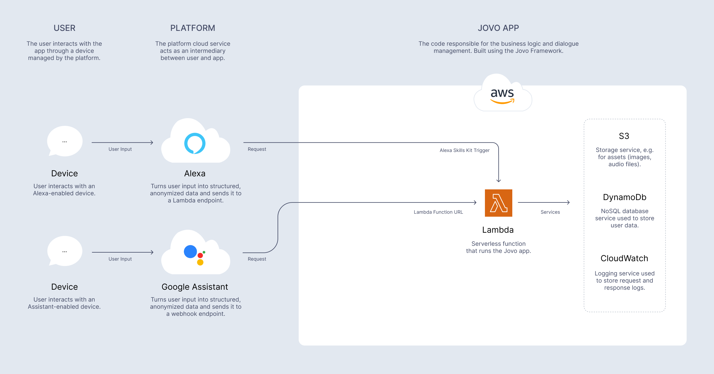

# AWS Lambda Integration

Host Jovo apps on AWS Lambda serverless functions.

## Introduction



This [server integration](https://www.jovo.tech/docs/server) allows you to host yor Jovo apps on [AWS Lambda](https://aws.amazon.com/lambda/), a serverless hosting solution by Amazon Web Services. [Find the official documentation here](http://docs.aws.amazon.com/lambda/latest/dg/welcome.html).

While the [Jovo Webhook](https://www.jovo.tech/docs/webhook) is usually called for local development, many teams use AWS Lambda to host their Jovo apps for testing and production stages. [Learn more about staging here](https://www.jovo.tech/docs/staging). The [installation section](#installation) explains how to create a new stage that can be used for Lambda deployment.

The diagram above shows how a Lambda function can be reached for different types of Jovo [platform integrations](https://www.jovo.tech/docs/platforms). While [Alexa Skills](https://www.jovo.tech/marketplace/platform-alexa) can directly point to a Lambda's resource name, other platforms like [Google Assistant](https://www.jovo.tech/marketplace/platform-googleassistant) need to access the function through an endpoint provided by an [API Gateway](#api-gateway).

Lambda functions can be connected to various AWS services, for example [DynamoDB](#dynamodb) for storing user data. Learn more about setting up these integrations in the [configuration section](#configuration).

The [deployment section](#deployment) offers more information about loading up your source code to AWS Lambda.

There is also a [troubleshooting](#troubleshooting) section for common issues with AWS Lambda.

## Installation

Create a new stage using the `jovo new:stage` command as explained in the [app config documentation](https://www.jovo.tech/docs/app-config#staging), for example:

```sh
$ jovo new:stage prod
```

When it prompts you to select a server integration, choose Lambda. This will add a [`server.lambda.ts` file](https://github.com/jovotech/jovo-framework/blob/v4/latest/integrations/server-lambda/boilerplate/server.lambda.ts) to your project's `src` folder, and reference it in your newly created [app stage config](https://www.jovo.tech/docs/app-config#staging) (in this example `app.prod.ts`):

```typescript
export * from './server.lambda';
```

## Configuration

Learn more about setting up the following services and configurations:

- [API Gateway](#api-gateway)
- [DynamoDB](#dynamodb)

### API Gateway

AWS Lambda functions are only accessible inside the AWS ecosystem via their [Amazon Resource Name (ARN)](https://docs.aws.amazon.com/general/latest/gr/aws-arns-and-namespaces.html).

If you want to use your Jovo app outside of the AWS environment (for example as an endpoint used by a platform or client), you need to set up an API Gateway to proxy your app's requests to your Lambda function. [Learn more in the official API Gateway docs](https://aws.amazon.com/api-gateway/).

Learn more about the setup in the sections below:

- [Setup using AWS Lambda](#setup-using-aws-lambda)
- [Setup using API Gateway Console](#setup-using-api-gateway-console)
- [CORS](#cors)

#### Setup using AWS Lambda

If you choose to create your API Gateway through your Lambda function, you need to add a new trigger in your function's designer. In the trigger configuration, choose to create an API and configure it as such:


Those are just the default settings, giving you the fastest setup, so you can test your API right away. However, we recommend you to further configure your API Gateway for security reasons.

If you now select "Add trigger", AWS will add the API Gateway to your Lambda function. You can inspect it in your function's designer to get your API's endpoint.

#### Setup using API Gateway Console

Creating an API Gateway through its console requires more setup, but gives you the option to fully customize your API according to your needs.

Go to the [API Gateway console](console.aws.amazon.com/apigateway) and create a new REST API to get started. Choose an appropriate API name and description and select "Create your API". This will bring you to your API's configuration panel, where you can add resources, set up security, and deploy your API.

Add a new POST method to your API and configure it to use your Lambda function as a proxy integration:


After saving your method, you can already deploy your API by selecting "Actions" > "Deploy API" to a new stage. This should take you to the stage editor, where you can also see your API's endpoint, which you can now use to invoke your Lambda function from a webserver, for example. This is the most basic setup, and we recommend you to take further configuration for security reasons.

#### CORS

If you have problems reaching your API due to [CORS](https://developer.mozilla.org/en-US/docs/Web/HTTP/CORS), you need to make a few changes to your API's configuration. First, make sure that the `POST` method and does not use the "Use Lambda Proxy Integration" option. This enables you to set headers for your API's response after the response has been sent from AWS Lambda.

Now, all you need to do is to enable CORS by going to "Actions" > "Enable CORS". This will create an additional `OPTIONS` method, which will be used by your web service to determine allowed methods and headers. Additionally, AWS will set the required headers for CORS to work. If you want to restrict access to your endpoint, you can set specific rules for allowed request origins.

Save this configuration, then deploy your API once again for the changes to be taken into effect.

### DynamoDB

The [FileDb](https://www.jovo.tech/marketplace/db-filedb) that is used as database for local development can't be used on AWS Lambda. To make your app work with all [data types](https://www.jovo.tech/docs/data), setting up a [database integration](https://www.jovo.tech/docs/databases) is necessary.

DynamoDB is the recommended database for Jovo apps hosted on AWS Lambda. [Learn more in the DynamoDB integration docs](https://www.jovo.tech/marketplace/db-dynamodb).

## Deployment

You can deploy your Jovo app to AWS Lambda in two ways:

- Create a bundle zip file using `npm run bundle:<stage>` and upload it manually in the AWS Lambda console.
- Use a CLI integration like [Serverless](https://www.jovo.tech/marketplace/target-serverless) to handle the deployment with the [`deploy:code` command](https://www.jovo.tech/docs/deploy-command#deploy-code).

## Troubleshooting

If your Lambda function keeps timing out, the reason might be that Lambda waits for all events in the event loop to be finished before returning a response. Some integrations like databases might still be open, potentially causing timeouts.

To counteract this issue, you can set `callbackWaitsForEmptyEventLoop` to `false` in your `server.lambda.ts` file like this:

```typescript
export const handler = async (event: any, context: any, callback: Function) => {
  context.callbackWaitsForEmptyEventLoop = false;
  await app.initialize();
  await app.handle(new Lambda(event, context, callback));
};
```

This way, Lambda returns a response as soon as possible, without waiting for the event loop to be finished.
