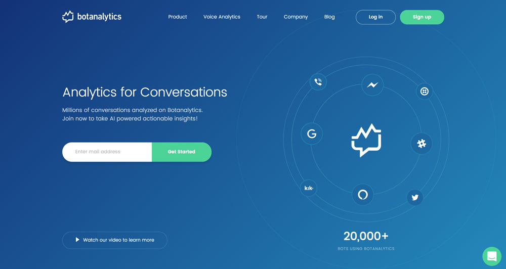
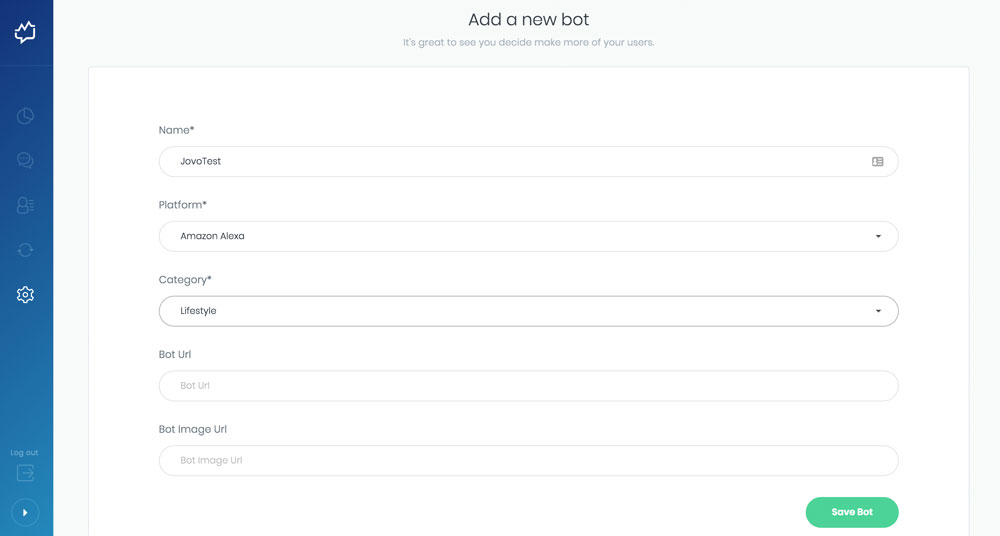

# Botanalytics Integration

> To view this page on the Jovo website, visit https://v3.jovo.tech/marketplace/jovo-analytics-botanalytics

Learn how to use Botanalytics for your Alexa Skills and Google Actions built with Jovo.

* [About Botanalytics](#about-botanalytics)
* [Installation](#installation)
   * [Add a New Bot](#add-a-new-bot)
   * [Enable Botanalytics in Jovo](#enable-botanalytics-in-jovo)
   * [Check Your App](#check-your-app)

## About Botanalytics



[Botanalytics](https://botanalytics.co/) is a conversational analytics platform that supports a variety of channels, like Facebook Messenger, Slack, Kik, Twitter, Telegram, and more.

[Botanalytics Voice Analytics](https://botanalytics.co/voice-analytics) offering allows you to see live transcripts, track performance across channels, and do intent analysis for your voice apps on Amazon Alexa and Google Assistant. 

## Installation

To use Botanalytics for your voice app, you need to complete the following steps:

1. Add a New Bot
2. Enable Bot in Your Voice App
3. Download the 'botanalytics' npm Package
4. Check Your App

### Add a New Bot

1. Create a Botanalytics account or log in at https://www.botanalytics.co.

2. Click "Add a New Bot" and fill in the information:



3. Scroll down and copy the API Key


### Enable Botanalytics in Jovo

To add Botanalytics to your voice app, do the following:

* Download the npm package
* Enable the plugin in `app.js`
* Add configurations in `config.js`

First, download the npm package:

```sh
$ npm install --save jovo-analytics-botanalytics
```

Enable the plugin like this:

```javascript
// @language=javascript

// src/app.js

const { BotanalyticsAlexa, BotanalyticsAssistant } = require('jovo-analytics-botanalytics');

app.use(
    new BotanalyticsAlexa(),
    new BotanalyticsGoogleAssistant()
);

// @language=typescript

// src/app.ts

import { BotanalyticsAlexa, BotanalyticsAssistant } from 'jovo-analytics-botanalytics';

app.use(
    new BotanalyticsAlexa(),
    new BotanalyticsGoogleAssistant()
);
```

Add configurations like this:

```javascript
// @language=javascript

// src/config.js

module.exports = {
    
    analytics: {
        BotanalyticsAlexa: {
            key: '<key>',
        },
        BotanalyticsGoogleAssistant: {
            key: '<key>',
        },
    },

    // ...

};

// @language=typescript

// src/config.ts

const config = {
    
    analytics: {
        BotanalyticsAlexa: {
            key: '<key>',
        },
        BotanalyticsGoogleAssistant: {
            key: '<key>',
        },
    },

    // ...

};
```

### Check Your App

Test your voice app, after sending couple of messages, click the 'Check connection' button

