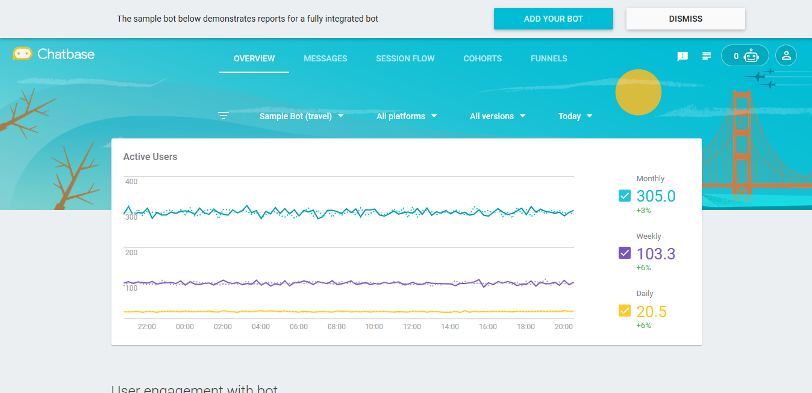
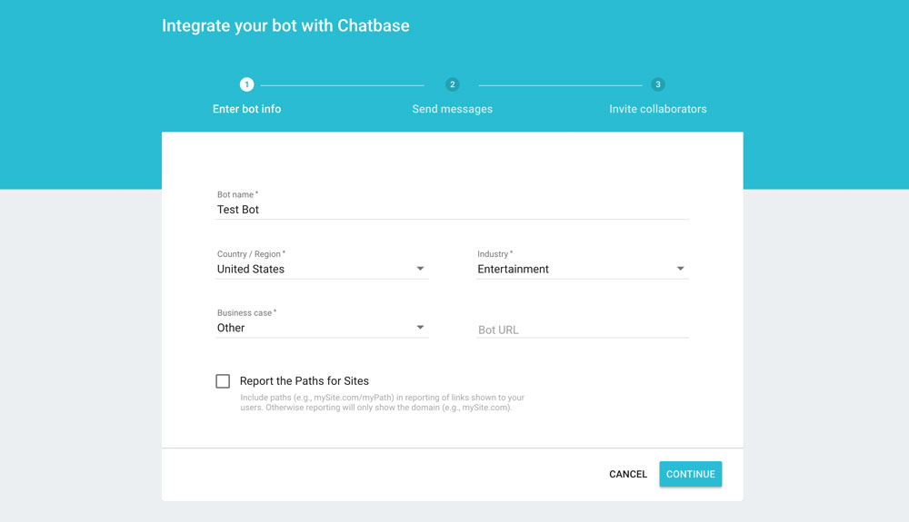
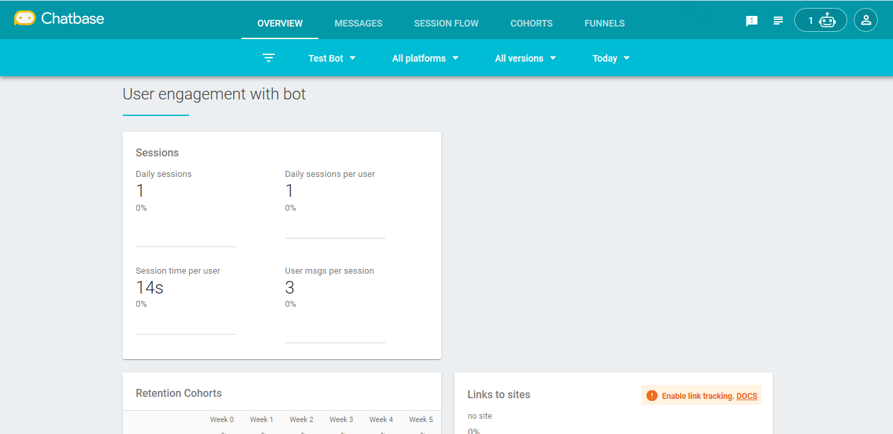

# Chatbase Analytics Integration

> To view this page on the Jovo website, visit https://v3.jovo.tech/marketplace/jovo-analytics-chatbase

Learn how to use Chatbase Analytics for your Alexa Skills and Google Actions built with Jovo.

* [About Chatbase](#about-chatbase)
* [Installation](#installation)
   * [Create a Chatbase Account](#create-a-chatbase-account)
   * [Enable Chatbase Analytics in Jovo](#enable-chatbase-analytics-in-jovo)
   * [Test Chatbase](#test-chatbase)

## About Chatbase


[Chatbase](https://chatbase.com/) is an analytics offerin   g for conversational products that is built by Area 120, an incubator by Google.

With Chatbase Analytics, you can measure bot metrics, analyze user behavior, and optimize the experience with transcripts and suggested intents.

## Installation

To use Chatbase Analytics for your voice app, you need to complete the following steps:

1. Create a Chatbase Bot
2. Enable Chatbase Analytics in your voice app
3. Test your app

### Create a Chatbase Account

1. Create a Chatbase account or log in at https://chatbase.com/

2. Create a new bot by clicking the "add your bot" button



3. Fill in information like your bot's name, industry, and region



4. Copy API Key


### Enable Chatbase Analytics in Jovo

To add Chatbase Analytics to your voice app, do the following:

* Download the npm package
* Enable the plugin in `app.js`
* Add configurations in `config.js`

First, download the npm package:

```sh
$ npm install --save jovo-analytics-chatbase
```

Enable the plugin like this:

```javascript
// @language=javascript

// src/app.js

const { ChatbaseAlexa, ChatbaseGoogleAssistant } = require('jovo-analytics-chatbase');

app.use(
    new ChatbaseAlexa(),
    new ChatbaseGoogleAssistant()
);

// @language=typescript

// src/app.ts

import { ChatbaseAlexa, ChatbaseGoogleAssistant } from 'jovo-analytics-chatbase';

app.use(
    new ChatbaseAlexa(),
    new ChatbaseGoogleAssistant()
);
```

Add configurations like this:

```javascript
// @language=javascript

// src/config.js

module.exports = {
    
    analytics: {
        ChatbaseAlexa: {
            key: '<key>',
            appVersion: '<version>', // Optional
        },
        ChatbaseGoogleAssistant: {
            key: '<key>',
            appVersion: '<version>', // Optional
        },
    },

    // ...

};

// @language=typescript

// src/config.ts

const config = {
    
    analytics: {
        ChatbaseAlexa: {
            key: '<key>',
            appVersion: '<version>', // Optional
        },
        ChatbaseGoogleAssistant: {
            key: '<key>',
            appVersion: '<version>', // Optional
        },
    },

    // ...

};
```

### Test Chatbase

Test you voice app. It can take up to 6 hours until all the data can be seen in the Chatbase dashboard:

