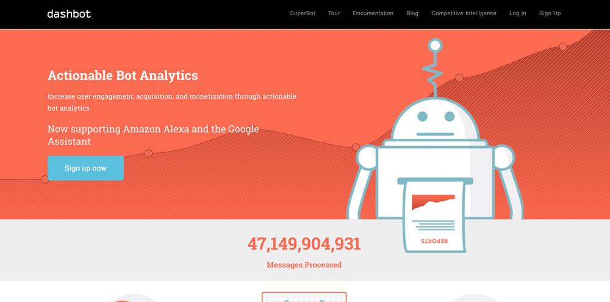
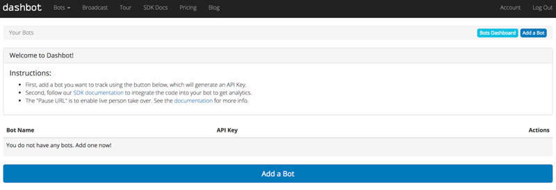
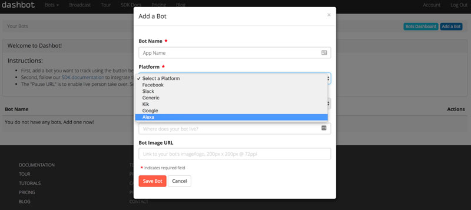
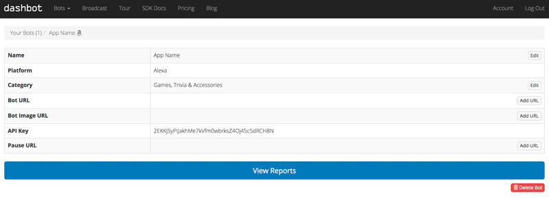
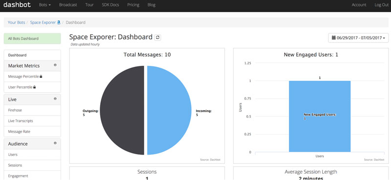

# Dashbot Analytics Integration

> To view this page on the Jovo website, visit https://www.jovo.tech/marketplace/jovo-analytics-dashbot

Learn how to use Dashbot Analytics for your Alexa Skills and Google Actions built with Jovo.

* [About Dashbot](#about-dashbot)
* [Installation](#installation)
   * [Create a Dashbot Bot](#create-a-dashbot-bot)
   * [Enable Dashbot in Jovo](#enable-dashbot-in-jovo)


## About Dashbot



[Dashbot](https://www.dashbot.io/) is an analytics tool for both text-based bots (Facebook Messenger, Slack, Kik, Twitter) and voice apps (Amazon Alexa, Google Assistant).

The [Dashbot Voice Analytics](https://www.dashbot.io/voice) offering enables voice app developers to compare usage across Alexa Skills and Google Actions and see interaction flows and live transcripts.

## Installation

To use Dashbot Analytics for your voice app, you need to complete the following steps:

1. Create a Dashbot Bot
2. Enable Dashbot Analytics in your Jovo voice app
3. Download the dashbot npm package
4. Test your app

### Create a Dashbot Bot

1. Create a Dashbot account or log in at https://www.dashbot.io.

2. Click "Add a Bot" in the Admin panel:




3. Select the right Platform: Alexa for Alexa Skills, or Google for Google Actions (if you are developing for both Amazon Alexa and Google Assistant, please create 2 distinct Dashbot Bots):



4. Copy API Key



### Enable Dashbot in Jovo

To add Dashbot Analytics to your voice app, do the following:

* Download the npm package
* Enable the plugin in `app.js`
* Add configurations in `config.js`

First, download the npm package:

```sh
$ npm install --save jovo-analytics-dashbot
```

Enable the plugin like this:

```javascript
// @language=javascript

// src/app.js

const { DashbotAlexa, DashbotGoogleAssistant } = require('jovo-analytics-dashbot');

app.use(
    new DashbotAlexa(),
    new DashbotGoogleAssistant()
);

// @language=typescript

// src/app.ts

import { DashbotAlexa, DashbotGoogleAssistant } from 'jovo-analytics-dashbot';

app.use(
    new DashbotAlexa(),
    new DashbotGoogleAssistant()
);
```

Add configurations like this:

```javascript
// @language=javascript

// src/config.js

module.exports = {
    
    analytics: {
        DashbotAlexa: {
            key: '<key>',
        },
        DashbotGoogleAssistant: {
            key: '<key>',
        },
    },

    // ...

};

// @language=typescript

// src/config.ts

const config = {
    
    analytics: {
        DashbotAlexa: {
            key: '<key>',
        },
        DashbotGoogleAssistant: {
            key: '<key>',
        },
    },

    // ...

};
```

### Test Dashbot

Test your voice app, after a bit your session should appear in the Report section (data is updated hourly):

