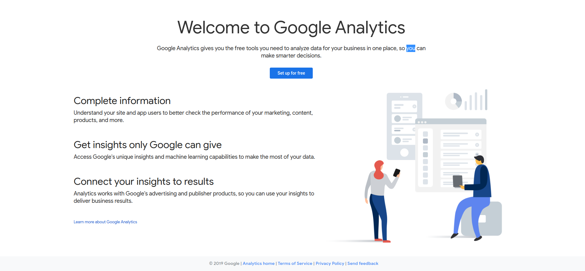
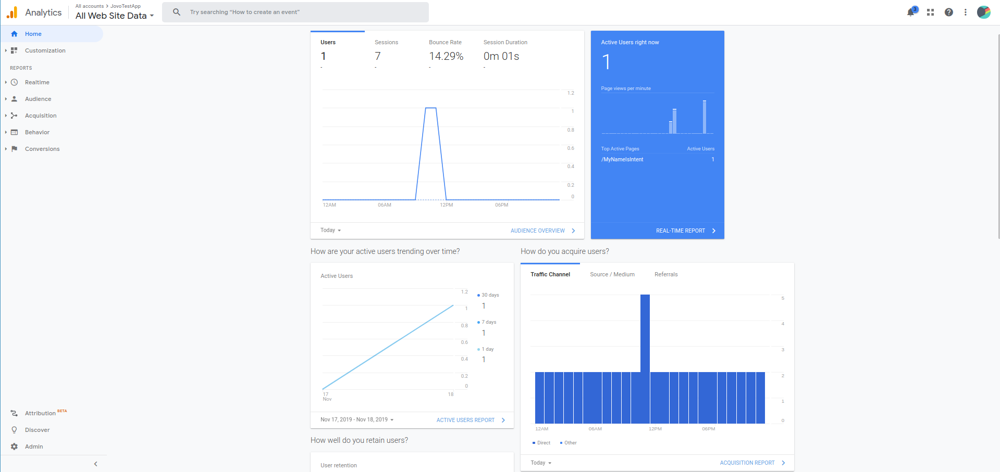
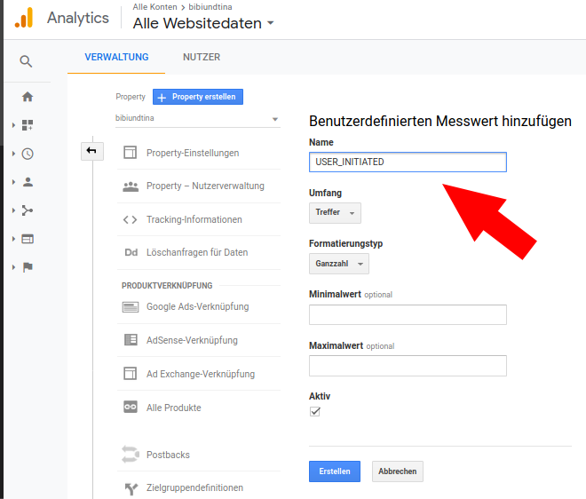
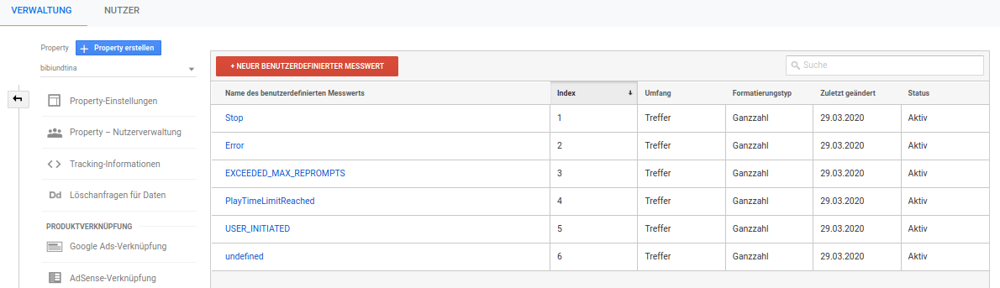

# Google Analytics for Voice Apps

Learn how to use Google Analytics in your Jovo application.

- [Google Analytics for Voice Apps](#google-analytics-for-voice-apps)
  - [About Google Analytics](#about-google-analytics)
  - [Installation](#installation)
    - [Create a Google Analytics Account](#create-a-google-analytics-account)
    - [Enable Google Analytics in your Jovo app](#enable-google-analytics-in-your-jovo-app)
    - [Check Your App](#check-your-app)
  - [Usage](#usage)
    - [Intent Data Tracking](#intent-data-tracking)
    - [User Id](#user-id)
    - [Data Source](#data-source)
    - [Device Info and Screen Resolution](#device-info-and-screen-resolution)
    - [Custom Dimensions and Custom Metrics](#custom-dimensions-and-custom-metrics)
      - [Custom Dimensions](#custom-dimensions)
      - [Custom Metrics](#custom-metrics)
    - [Custom Reports](#custom-reports)
    - [Optimize Experiments](#optimize-experiments)
    - [Developer Methods](#developer-methods)
      - [sendEvent()](#sendevent)
      - [sendTransaction()](#sendtransaction)
      - [sendItem()](#senditem)
      - [sendUserEvent()](#senduserevent)
      - [setCustomMetric()](#setcustommetric)
      - [setParameter](#setparameter)
      - [setOptimizeExperiment](#setoptimizeexperiment)
      - [Setup endReason metrics in the gooogle analytics console](#setup-endreason-metrics-in-the-gooogle-analytics-console)

## About Google Analytics


[Google Analytics](https://analytics.google.com/) is a free web and conversational analytics service that tracks and reports service traffic and provides statistics for such. With the Jovo Google Analytics Plugin, you can track the behavior of you voice app and get insights about your users. It offers [standard tracking](#intent-data-tracking) and [developer methods](#developer-methods) for sending custom events and transactions from your voice app.

## Installation

To use Google Analytics for your voice app, you need to complete the following steps:

1. Create a Google Analytics Account
2. Enable Google Analytics in your Jovo app
3. Check Your App

### Create a Google Analytics Account

1. Login to Google Analytics with a google account at https://analytics.google.com/.

2. Click "Set up for free" and fill in the form depending on your needs for your account. Select "Web" on your type of measurement. For property details, you can use the Jovo application name as the Website Name, and a placeholder for the Website URL.



3. After clicking "Create" and confirming the terms of service, you will arrive at the admin section of your Google Analytics Account. Copy the Tracking ID which you will need to connect your Jovo app.


### Enable Google Analytics in your Jovo app

To add Google Analytics to your Jovo app, do the following:

* Download the npm package
* Enable the plugin in `app.js`
* Add configurations in `config.js`

First, download the npm package:

```sh
$ npm install jovo-analytics-googleanalytics -s
```

Enable the plugin like this:

```javascript
// @language=javascript

// src/app.js

const { GoogleAnalytics } = require('jovo-analytics-googleanalytics');

app.use(
    new GoogleAnalytics()
);

// @language=typescript

// src/app.ts

import { GoogleAnalytics } from 'jovo-analytics-googleanalytics';

app.use(
    new GoogleAnalytics()
);
```

If you want to use platform-specific tracking, you can use the respective plugin version:

```javascript
// @language=javascript

// src/app.js

const { GoogleAnalyticsAlexa, GoogleAnalyticsGoogleAssistant } = require('jovo-analytics-googleanalytics');

app.use(
    new GoogleAnalyticsAlexa(),
    new GoogleAnalyticsGoogleAssistant()
);

// @language=typescript

// src/app.ts

import { GoogleAnalyticsAlexa, GoogleAnalyticsGoogleAssistant } from 'jovo-analytics-googleanalytics';

app.use(
    new GoogleAnalyticsAlexa(),
    new GoogleAnalyticsGoogleAssistant()
);
```

It is important to enable metadata tracking in your config to allow google analytics to recognize timeouts. Otherwise alexa screen devices will send session ended requests days after this session ended. This would pollute your data by counting additional sessions.
For the plugin configurations, all you need is the Tracking ID of your Google Analytics Account. Optionally, you can choose whether you want to track directives, that are not triggered by a user, such as AlexaSkill.AudioPlayer directives. Per default, only user-invocated interactions will be tracked. By setting enableAutomaticEvents you can disable sending events like unhandled and slot values. Additionally you can adjust the googleAnalytics session timeout of the skill to match the timeout specified in the google analytics dashboard (5 minutes is a good value for speech applications). By default users with disabled voice match are ignored in Google Analytics because each of their sessions will be counted as separate user. You can enable tracking them by setting "skipUnverifiedUser" to false.

```javascript
// @language=javascript

// src/config.js

module.exports = {

    user: {
      metaData: true,
    },
    
    analytics: {
        // Configuration for generic tracking plugin
        GoogleAnalytics: {
            trackingId: '',
            trackDirectives: true,   // Optional
            enableAutomaticEvents: true, // Optional - set to false to disable
            trackEndReasons: false, // Optional - when set to true the custom metrics 1-6 are used to track endReasons
            sessionTimeoutInMinutes: 5, // Optional - default is 5
            skipUnverifiedUser: true, // Optional - default is true
        },
        // Configurations for platform-specific plugins
        GoogleAnalyticsAlexa: {
            trackingId: ''
        },
        GoogleAnalyticsGoogleAssistant: {
            trackingId: ''
        }
    }

    // ...

};

// @language=typescript

// src/config.ts

module.exports = {
    
    analytics: {
        // Configuration for generic tracking plugin
        GoogleAnalytics: {
            trackingId: ''
        },
        // Configurations for platform-specific plugins
        GoogleAnalyticsAlexa: {
            trackingId: ''
        },
        GoogleAnalyticsGoogleAssistant: {
            trackingId: ''
        }
    }

    // ...

};
```

### Check Your App

Test your voice app, after a bit your session should appear on your "Home" tab.



## Usage

The Google Analytics plugin for Jovo is designed to track intent and user data without having the developer to mess with it. 

### Intent Data Tracking

After the plugin is enabled, it automatically tracks intent data by sending pageview directives to Google Analytics. If you navigate to "Behavior" > "Overview", you can see intent metrics for every request of your Jovo app. These include the current session path ("Page"), the mapped intent name or the request type ("Page Title") and respective inputs ("Behavior" > "Events" > "Overview" > "Inputs"). Here, "Event Label" describes the input name, while "Event Action" describes the respective input key.

### User Id

All data is stored under a hashed user id generated from the according platform response. Be careful when using Google Assistant, because in some cases the userId will change with every request, if either Account Linking is not activated or your user operates a GSuite Account. You can see user specific metrics under the side tab "Audience".

### Data Source

The data source describes the platform your users operate on. To display data for this metric, you need to create a [Custom Report](#custom-reports).

### Device Info and Screen Resolution

Device Info and Screen Resolution can be found under "Audience" > "Technology" > "Browser&OS".

### Custom Dimensions and Custom Metrics

In Google Analytics, all data is captured under certain dimensions and metrics. You can think of dimensions as data attributes, for example the userId or the intent name. Metrics on the other hand are values that can be measured, for example the total number of sessions a user had. Custom dimensions and custom metrics work the same way. You can use them to capture data that otherwise wouldn't be captured. To create either, go to "Admin" > "Custom Definitions".


#### Custom Dimensions

If you want to create a custom dimension, you need to set some properties first. The name of your dimension is up to you, whatever suits you best. The scope determines how the analytics data will be associated with a particular custom-dimension value . There are four levels of scope: product, hit, session, and user:

* Hit - Data is applied only for the current request. You will most likely use this one most of the time.
* Session - Data is applied to all requests in a single session.
* User – Data is applied to all requests in current and future sessions, until the data changes or the custom dimension is made inactive.
* Product - Data is tracked in association with the product for which it has been set (Enhanced Ecommerce only).

Last but not least you can decide whether you want to have your custom dimension be activated or not. You can change this later, if you want to deactivate it.

####  Custom Metrics

Defining custom metrics requires a little more effort. Again, you can assign a custom name and a specific scope to it. Depending on your needs, you need to select a specific Formatting Type. Keep in mind that the type Time will only accept data values in seconds. You can also define minimum/maximum values.

Keep in mind, that both custom dimensions and custom metrics are managed on indexes. The specific index will show up once you created them. If you want to track data for a specific dimension/metric, you have to include it in the tracking request. More on this [here](#setcustommetric()).

You can enable tracking custom metrics for endReasons by setting trackEndReasons to true. More info upon the setup process is described [here](#setup-endreason-metrics-in-the-gooogle-analytics-console).


### Custom Reports

Not every dimension/metric has a report out of the box. For example, [Exceptions]() need a custom report, before being displayed in Google Analytics. The same goes for custom dimensions/metrics. To create a custom report, go to "Customization" > "Custom Reports". There, you can add a new custom reports with your own attributes, such as the title, the dimensions/metrics you want to track and the report type.

### Optimize Experiments

You can setup A/B testing using Google Optimize and Google Analytics. A detailed guide on creating a server-side experiment can be found [here](https://developers.google.com/optimize/devguides/experiments). 

### Developer Methods

The Google Analytics plugin offers developer methods for sending data (like Events and Transactions) from your skills code. Currently the following methods are supported:

* sendEvent(eventParameters)
* sendTransaction(transactionParams)
* sendItem(itemParams)
* sendUserEvent (eventCategory, eventElement)
* sendUserTransaction (transactionId)
* setCustomMetric (index, value)
* setCustomDimension (index, value)
* setParameter (parameter, value)
* setOptimizeExperiment (experimentId, variation)

All these methods are available on the Jovo object in your code and accessible by calling `this.$googleAnalytics.sendEvent(eventParameters)` in your code's handler, for example.

#### sendEvent()

Events are user interactions with data describing such events. Events can be computed properties, triggered interaction paths or just plain data you want to specifically track. The `$googleAnalytics` object allows you to send such an event, providing the `sendEvent()` function, which accepts an object of type Event with the following properties:

* eventCategory - Category for event, e.g. Inputs, Error, UserData, ...
* eventAction - Value for the event to track.
* eventLabel - Optional. Gives the event a label/flag under which to track it, e.g. userId, ...
* eventValue - Optional. Accepts a number and serves as a metric for the current event.
* documentPath - Optional. Describes the path portion of the current conversational flow.

```javascript
// @language=javascript

// app.js

async LAUNCH() {
    await this.$googleAnalytics.sendEvent({
        eventCategory: 'ItemPrice',
        eventAction: 'Teddy Bear',
        eventLabel: this.$user.getId(),
        eventValue: 8,
        documentPath: this.getRoute().path
    });
}

// @language=typescript

// app.js

async LAUNCH() {
    await this.$googleAnalytics.sendEvent({
        eventCategory: 'ItemPrice',
        eventAction: 'Teddy Bear',
        eventLabel: this.$user.getId(),
        eventValue: 8,
        documentPath: this.getRoute().path
    });
}
```

#### sendTransaction()

Transactions are self-explanatory. They track transactions made in your app, which can come in handy for [Alexa ISP](https://v3.jovo.tech/docs/amazon-alexa/in-skill-purchases), for example. `sendTransaction()` accepts an object with the following properties: 

* transactionId - Unique id for transaction and corresponding transaction items.
* transactionRevenue - Optional. Total revenue for the current transaction.
* transactionShipping - Optional. Shipping cost.
* transactionTax - Optional. Total tax cost.
* transactionAffiliation - Optional. Affiliation for the transaction, e.g. app name.

Furthermore, you can attach your own properties to the object.

```javascript
// @language=javascript

// app.js

async LAUNCH() {
    await this.$googleAnalytics.sendTransaction({
        transactionId: '1234',
        transactionRevenue: 100,
        transactionShipping: 10,
        transactionTax: 5,
        transactionAffiliation: 'Jovo Test App',
        userId: this.$user.getId()
    });
}

// @language=typescript

// app.js

async LAUNCH() {
    await this.$googleAnalytics.sendTransaction({
        transactionId: '1234',
        transactionRevenue: 100,
        transactionShipping: 10,
        transactionTax: 5,
        transactionAffiliation: 'Jovo Test App',
        userId: this.$user.getId()
    });
}
```

#### sendItem() 

Transactions consist of one or more items. `sendItem()` allows you to send such an item and accepts an object with the following properties: 

* transactionId - Unique id for transaction and corresponding transaction items.
* itemName - Name for the current item.
* itemPrice - Optional. Price for a single item.
* itemQuantity - Optional. Number of items purchased.
* itemCode - Optional. Item code/SKU.
* itemCategory - Optional. Category the item belongs to.

Furthermore, you can attach your own properties to the object.

```javascript
// @language=javascript

// app.js

async LAUNCH() {
    await this.$googleAnalytics.sendItem({
        transactionId: '1234',
        itemName: 'Premium Subscription',
        itemPrice: 30,
        itemQuantity: 1,
        itemCode: '0123',
        itemCategory: 'ISP',
        userId: this.$user.getId()
    });
}

// @language=typescript

// app.js

async LAUNCH() {
    await this.$googleAnalytics.sendItem({
        transactionId: '1234',
        itemName: 'Premium Subscription',
        itemPrice: 30,
        itemQuantity: 1,
        itemCode: '0123',
        itemCategory: 'ISP',
        userId: this.$user.getId()
    });
}
```

#### sendUserEvent()

`sendUserEvent()` works almost the same as `sendEvent()` except that the only parameters that you have to provide are `eventCategory` and `eventAction`. An additional difference is that the enqueued event is not sent immediately but with the next "send" method call. If send is not called manually all events and pageview are sent together before the response middleware.
The plugin sets the values for `eventLabel` and `documentPath` automatically to your users id and the current session path.

```javascript
// @language=javascript

// app.js

LAUNCH() {
    this.$googleAnalytics.sendUserEvent('ItemPrice', 'Teddy Bear');
}

// @language=typescript

// app.js

LAUNCH() {
    this.$googleAnalytics.sendUserEvent('ItemPrice', 'Teddy Bear');
}
```

#### setCustomMetric()

If you want to set a custom metric and want to include that in the tracking request, you have to create a metric in your Admin console. That will give you an index for your metric, which you have to provide to `setCustomMetric()`, together with the metric value you want to track.

```javascript
// @language=javascript

// app.js

LAUNCH() {
    this.$googleAnalytics.setCustomMetric(1, 100);
}

// @language=typescript

// app.js

LAUNCH() {
    this.$googleAnalytics.setCustomMetric(1, 100);
}
``` 


#### setParameter

If you want to set a specific parameter in the page view events, like overriding your user's geographical location, you can set it with the `setParameter` method. You can find details on all available parameters [here](https://developers.google.com/analytics/devguides/collection/protocol/v1/parameters)

```javascript
// @language=javascript

// app.js

app.hook("before.response", (error, host, jovo) => {
  jovo.$googleAnalytics.setParameter("geoid", "1017527");
});

// @language=typescript

// app.js

app.hook("before.response", (error: Error, host: Host, jovo: Jovo) => {
  jovo.$googleAnalytics.setParameter("geoid", "1017527");
});
``` 


#### setOptimizeExperiment

`setOptimizeExperiment()` allows you to run A/B testing using Google Optimize. First setup a server-side experiment in Optimize, randomly assign your users to a group, then use `setOptimizeExperiment()` to provide the data. More details on setting up your experiment can be found [here](https://developers.google.com/optimize/devguides/experiments)

```javascript
// @language=javascript

// app.js

app.hook("before.response", (error, host, jovo) => {
  const variationId = jovo.$user.$data.variationId;
  jovo.$googleAnalytics.setOptimizeExperiment("16iQisXuS1qwXDixwB-EWgQ", variationId);
});

// @language=typescript

// app.js

app.hook("before.response", (error: Error, host: Host, jovo: Jovo) => {
  const variationId = jovo.$user.$data.variationId;
  jovo.$googleAnalytics.setOptimizeExperiment("16iQisXuS1qwXDixwB-EWgQ", variationId);
});
``` 

#### Setup endReason metrics in the gooogle analytics console
for tracking end reasons create custom metrics in this order:
Stop, Error, EXCEEDED_MAX_REPROMPTS, PlayTimeLimitReached, USER_INITIATED, undefined

...example creating custom metric:



...finally it should look like this:

