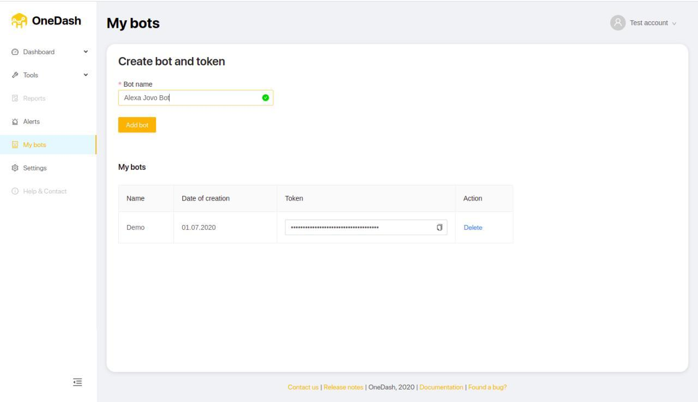
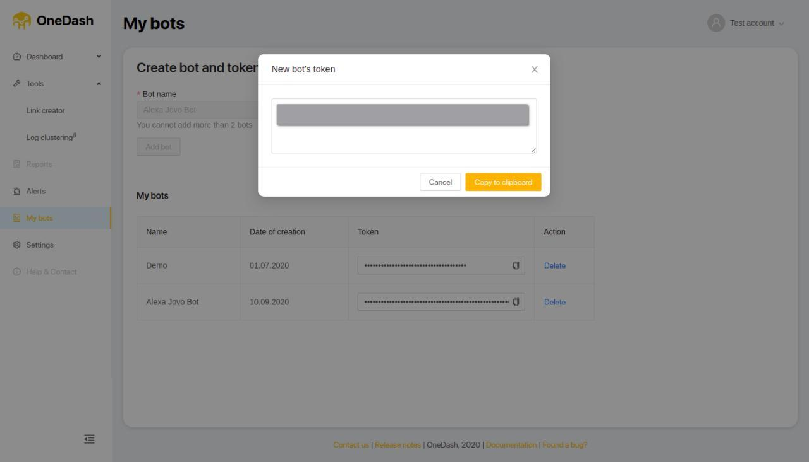
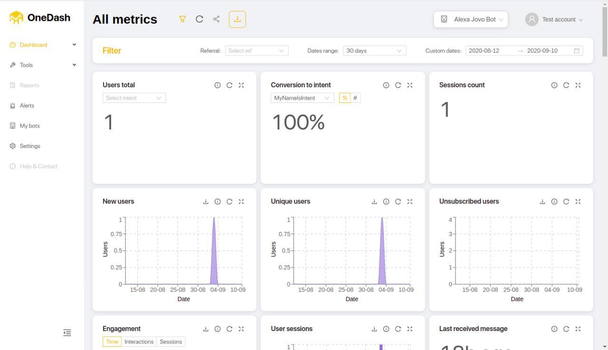

# OneDash Analytics Integration

Learn how to use OneDash Analytics for your Alexa Skills built with Jovo.

* [About OneDash](#about-onedash)
* [Installation](#installation)
   * [Create a OneDash Bot](#create-a-onedash-bot)
   * [Enable OneDash in Jovo](#enable-onedash-in-jovo)


## About OneDash


[OneDash](https://app.onedash.cc/) is an AI-powered chat-bot analytics service with deep analysis of dialogues, search for insights and easy sharing with stakeholders.

## Installation

To use OneDash for your voice app, you need to complete the following steps:

1. Create a OneDash Bot
2. Enable OneDash Analytics in your Jovo voice app
3. Download the onedash npm package
4. Test your app

### Create a OneDash Bot

1. Create a OneDash account or log in at https://app.onedash.cc/#/auth/login.

2. Click "Add a Bot" in the Admin panel:




3. Copy API Key



### Enable OneDash in Jovo

To add OneDash to your voice app, do the following:

* Download the npm package
* Enable the plugin in `app.js`
* Add configurations in `config.js`

First, download the npm package:

```sh
$ npm install --save jovo-analytics-onedash
```

Enable the plugin like this:

```javascript
// @language=javascript

// src/app.js

const { OneDashAlexa } = require('jovo-analytics-onedash');

app.use(
    new OneDashAlexa()
);

// @language=typescript

// src/app.ts

import { OneDashAlexa } from 'jovo-analytics-onedash';

app.use(
    new OneDashAlexa()
);
```

Add configurations like this:

```javascript
// @language=javascript

// src/config.js

module.exports = {
    
    analytics: {
        OneDashAlexa: {
            key: '<key>',
        },
    },

    // ...

};

// @language=typescript

// src/config.ts

const config = {
    
    analytics: {
        OneDashAlexa: {
            key: '<key>',
        },
    },

    // ...

};

```

### Test OneDash

Test your voice app

