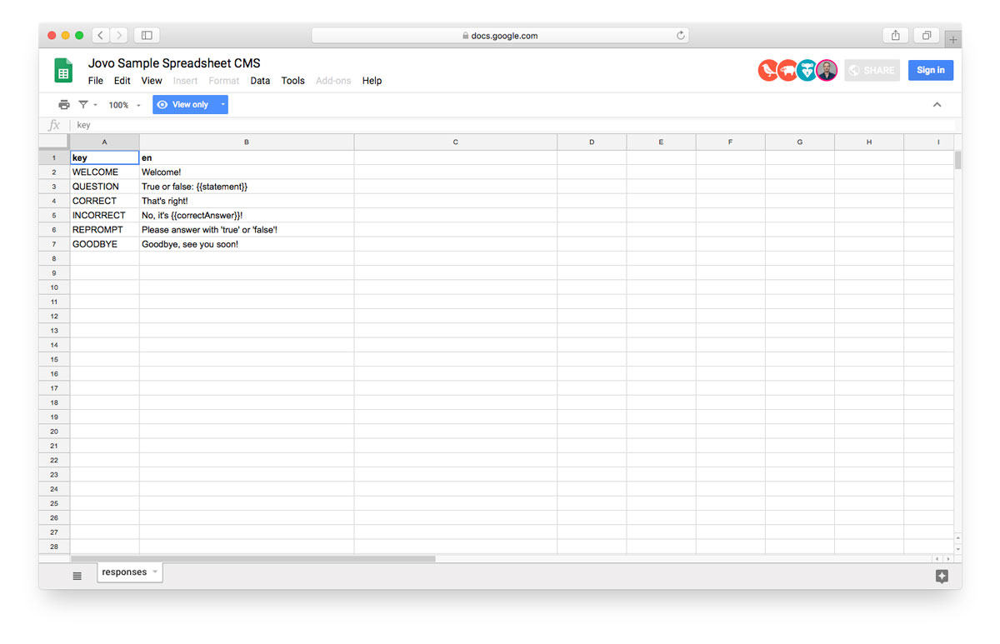
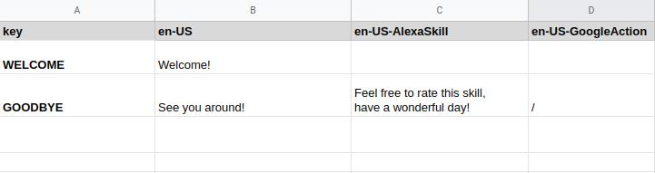

# Google Sheets CMS Integration

> To view this page on the Jovo website, visit https://www.jovo.tech/marketplace/jovo-cms-googlesheets

Learn how to use Google Sheets as CMS for your Alexa Skills and Google Actions.

* [Introduction](#introduction)
* [Configuration](#configuration)
* [Default Sheet Types](#default-sheet-types)
  * [Default](#default)
  * [Responses](#responses)
  * [KeyValue](#keyvalue)
  * [ObjectArray](#objectarray)
  * [KeyObject](#keyobject)
* [Defining your own Sheet Type](#defining-your-own-sheet-type)
* [Advanced Features](#advanced-features)
  * [Caching](#caching)
  * [Platform-specific Responses](#platform-specific-responses)


## Introduction

With this Jovo CMS integration, you can manage all the content of your Alexa Skills and Google Actions in a Google Spreadsheet. This makes collaboration easier and enables you update and add content faster.

Here is what a sample spreadsheet could look like:


> [You can use this Spreadsheet as a starter template](https://docs.google.com/spreadsheets/d/1vgz5oZca1J7a37qV_nkwWK2ryYSCyh8008SsjLf5-Sk/).

## Configuration

To get started, install the following package:

```sh
$ npm install --save jovo-cms-googlesheets
```

Add it to your `app.js` file and register it with the `use` command:

```javascript
// @language=javascript

// src/app.js

const { GoogleSheetsCMS } = require('jovo-cms-googlesheets');

app.use(new GoogleSheetsCMS());

// @language=typescript

// src/app.ts

import { GoogleSheetsCMS } from 'jovo-cms-googlesheets';

app.use(new GoogleSheetsCMS());
```

Next, add configurations like the `spreadsheetId` to your `config.js` file:

```javascript
// @language=javascript

// src/config.js

module.exports = {
    
    cms: {
        GoogleSheetsCMS: {
            spreadsheetId: '<YourSpreadsheetId>',
            credentialsFile: './path/to/credentials.json',
            sheets: [
                {
                    name: '<sheetName>',
                    type: '<SheetType>',
                },
            ]
        }
    },

    // ...

};

// @language=typescript

// src/config.ts

const config = {
    
    cms: {
        GoogleSheetsCMS: {
            spreadsheetId: '<YourSpreadsheetId>',
            credentialsFile: './path/to/credentials.json',
            sheets: [
                {
                    name: '<sheetName>',
                    type: '<SheetType>',
                },
            ]
        }
    },

    // ...

};
```

Each sheet can be added as an object that includes both a `name` and a `type`. [Learn more about Sheet Types below](#default-sheet-types).

To make spreadsheets work, you need to create a service account and security credentials. These can be downloaded as a JSON file and then referenced in the `credentialsFile` element (default is `./credentials.json`).

> [Tutorial: Use Google Spreadsheets as a CMS](https://www.jovo.tech/tutorials/google-spreadsheet-private-cms)

## Default Sheet Types

Google Sheets offers flexible ways to structure data. This is why the Jovo CMS integration supports several sheet types that are already built in:

* [Default](#default)
* [Responses](#responses)
* [KeyValue](#keyvalue)
* [ObjectArray](#objectarray)

### Default

If you don't define a sheet type in the `config.js`, you receive an array of arrays that can be accessed like this:

```javascript
this.$cms.sheetName
```

### Responses

If you define the sheet type as `Responses`, the integration expects a spreadsheet of at least two columns:
* a `key`
* a locale, e.g. `en`, `en-US`, or `de-DE`

For this locale, you can then access the responses like this:

```javascript
// i18n notation
this.t('key')

// Alternative
this.$cms.t('key')
```

You can add as many locales as you want by adding additional columns for each key.


### KeyValue

If you define the sheet type as `KeyValue`, the integration expects a spreadsheet of at least two columns:
* a `key`
* a `value`

For every key, this will return the value as a string:

```javascript
this.$cms.sheetName.key
```

### ObjectArray

If you define the sheet type as `ObjectArray`, you will receive an array of objects where each row is converted to an object with the first row of the spreadsheet specifying the keys.

You can define the range (which columns to access) in your config:

```javascript
// @language=javascript

// src/config.js

module.exports = {
    
    cms: {
        GoogleSheetsCMS: {
            
            // ...
            
            sheets: [
                {
                    name: '<YourSheetName>',
                    type: 'ObjectArray',
                    range: 'A:C',
                },
            ]
        }
    },

    // ...

};

// @language=typescript

// src/config.ts

const config = {
    
    cms: {
        GoogleSheetsCMS: {
            
            // ...
            
            sheets: [
                {
                    name: '<YourSheetName>',
                    type: 'ObjectArray',
                    range: 'A:C',
                },
            ]
        }
    },

    // ...

};
```

Here's an example sheet:

Name | Location | Date
:--- | :--- | :---
Voice Summit | Newark, New Jersey, USA | 7/22/2019
SuperBot | San Francisco, California, USA | 4/2/2019

And here's the array of objects you will receive:

```javascript
[ 
    { 
        name: 'Voice Summit',
        location: 'Newark, New Jersey, USA',
        date: '7/22/2019' 
    },
    {
        name: 'SuperBot',
        location: 'San Francisco, California, USA',
        date: '4/2/2019' 
    }
]
```

Access the array using:

```javascript
this.$cms.sheetName
```

### KeyObject

The sheet type `KeyObject` is an extension of the [KeyValue](#keyvalue) type where rather than assigning a single value to each key, an object is assigned.
For each row in the spreadsheet, the first cell is used as key, and the remaining cells in the row are converted to values of the nested object with the first row of the spreadsheet specifying the keys.

You can define the range (which columns to access) in your config, default is 'A:C':

```javascript
// @language=javascript

// src/config.js

module.exports = {
	cms: {
		GoogleSheetsCMS: {
			// ...

			sheets: [
				{
					name: '<YourSheetName>',
					type: 'KeyObject',
					range: 'A:D'
				}
			]
		}
	}

	// ...
};

// @language=typescript

// src/config.ts

const config = {
	cms: {
		GoogleSheetsCMS: {
			// ...

			sheets: [
				{
					name: '<YourSheetName>',
					type: 'KeyObject',
					range: 'A:D'
				}
			]
		}
	}

	// ...
};
```

Here's an example sheet:

| Key    | Symbol | Price   | Volume   |
| :----- | :----- | :------ | :------- |
| apple  | AAPL   | 263.19  | 26032213 |
| google | GOOG   | 1303.02 | 15893292 |

And here's the object you will receive:

```javascript
{
    apple: {
        symbol: 'AAPL',
        price: '263.19',
        volume: '26032213',
    },
    google: {
        symbol: 'GOOG',
        price: '1303.02',
        volume: '15893292',
    },
}
```

Access the object using:

```javascript
this.$cms.sheetName.key;
```

and the nested object using:

```javascript
this.$cms.sheetName.key.second_key;

// e.g. this.$cms.sheetName.apple.price
```

**Please Note:** When a cell in the spreadsheet is empty it will be converted to an `undefined` value:

Here's an example sheet with empty cells:

| Key   | Name  | Surname | Address                 |
| :---- | :---- | :------ | :---------------------- |
| alice | Alice | White   |                         |
| bob   | Bob   | Smith   | Newark, New Jersey, USA |

here's the object you will receive:

```javascript
{
    alice: {
        name: 'Alice',
        surname: 'White',
        address: undefined,
    },
    bob: {
        name: 'Bob',
        surname: 'Smith',
        address: 'Newark, New Jersey, USA',
    },
}
```

## Defining your own Sheet Type

You can extend the [`Default` sheet](#default) and pass it to the `SpreadsheetCMS` object like this:

```javascript
const { GoogleSheetsCMS } = require('jovo-cms-googlesheets');
const { YourSheetType } = require('./path/to/module');

app.use(
    new GoogleSheetsCMS().use(new YourSheetType())
);
```
You can then reference the sheet type by its name in the `config.js` file:

```javascript
// @language=javascript

// src/config.js

module.exports = {
    
    cms: {
        GoogleSheetsCMS: {
            spreadsheetId: '<YourSpreadsheetId>',
            sheets: [
                {
                    name: '<sheetName>',
                    type: 'YourSheetType',
                },
            ]
        }
    },

    // ...

};

// @language=typescript

// src/config.ts

const config = {
    
    cms: {
        GoogleSheetsCMS: {
            spreadsheetId: '<YourSpreadsheetId>',
            sheets: [
                {
                    name: '<sheetName>',
                    type: 'YourSheetType',
                },
            ]
        }
    },

    // ...

};
```

## Advanced Features

* [Caching](#caching)
* [Platform-specific Responses](#platform-specific-responses)

### Caching

The content of all sheets is cached into the Jovo `app` object by default, which allows for faster response times. For some use cases (like testing), however, it might make sense to retrieve the data for some (or all) sheets with every request. Since Jovo `v2.1.4`, we support these instant updates by setting the `caching` option to `false`.

You can choose between disabling caching for all sheets, or just specific ones in your `config.js` file:

```javascript
// @language=javascript

// src/config.js

module.exports = {
    
    cms: {
        GoogleSheetsCMS: {
            spreadsheetId: '<YourSpreadsheetId>',
            sheets: [
                {
                    name: '<sheetName>',
                    type: 'YourSheetType',
                },
                caching: false,             // disable caching for this sheet
            ],
            caching: false,                 // disable caching for all sheets
        }
    },

    // ...

};

// @language=typescript

// src/config.ts

const config = {
    
    cms: {
        GoogleSheetsCMS: {
            spreadsheetId: '<YourSpreadsheetId>',
            sheets: [
                {
                    name: '<sheetName>',
                    type: 'YourSheetType',
                },
                caching: false,             // disable caching for this sheet
            ],
            caching: false,                 // disable caching for all sheets
        }
    },

    // ...

};
```

### Platform-specific Responses

Since Jovo `v2.1.4` we support platform-specific responses for i18n, as well as for CMS. This allows you to have isolated output for a specified platform, without altering the default one.



In this example, the value for `GOODBYE` will be overwritten, whenever a response is triggered by an Alexa-Skill. `WELCOME` remains the same for all platforms.
If you don't want any output for a specific platform, use `/`.