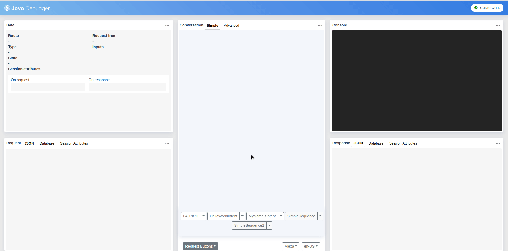
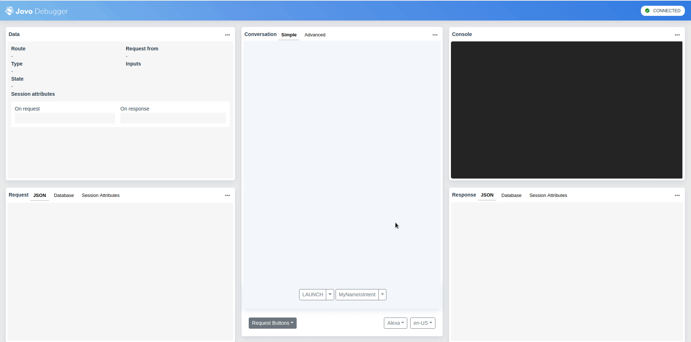
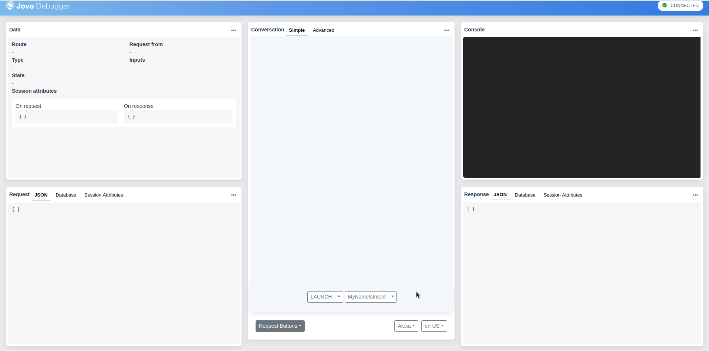

# Jovo Debugger Plugin

> To view this page on the Jovo website, visit https://v3.jovo.tech/marketplace/jovo-plugin-debugger

Learn how to use the Jovo Debugger for simple testing and debugging of Alexa Skills and Google Actions.

* [Introduction](#introduction)
* [Getting Started](#getting-started)
* [Features](#features)
  * [Data](#data)
  * [Request and Response](#request-and-response)
  * [Console](#console)
  * [Request Builder](#request-builder)
    * [Custom Sequences](#custom-sequences)
    * [Locales](#locales)
    * [Platforms](#platforms)

## Introduction

The Jovo Debugger allows you to debug and quickly test your Jovo app by by displaying the most important information about each interaction in one place. That includes the current state of your app (e.g. route, state, inputs, etc.), the request & response and a console window for your logs.

To use the debugger you simply have to send requests to your Jovo Webhook endpoint. These can be sent from platforms like Alexa or Google Assistant as well as from the built-in request builder for quick prototyping.


## Getting Started

To be able to use the debugger, it has to be included as a plugin in your project:

```javascript
// @language=javascript

// src/app.js

const { JovoDebugger } = require('jovo-plugin-debugger');

app.use(new JovoDebugger());

// @language=typescript

// src/app.ts

import { JovoDebugger } from 'jovo-plugin-debugger';

app.use(new JovoDebugger());
```

After that, use the `jovo run` command to start your development server get the link to your Jovo Webhook endpoint:

```sh
$ jovo3 run
```

Now, simply press the `.` key on your keyboard to open up the Debugger web page.

If you ever need to know in your app whether the current request comes from the Jovo Debugger, you can use the following helper:

```js
this.isJovoDebuggerRequest();
```

## Features

### Data

The **Data** window contains all the important information of the interaction. That includes the:

* determined route e.g. `TestState.MyNameIsIntent`
* origin of the request
* type of the request (e.g. INTENT, LAUNCH, END, etc.)
* inputs
* state
* session attributes

### Request and Response

The request and response windows have each three sub pages.

First, the **JSON** tab that simply shows the raw request and response JSON.

Second, the **Database** tab where you can see the database entry for the user at the time of the request and response. That allows you to see how the interaction changed the database entry.

Third, the **Session Attributes** which gives the same functionality as the **Database** tab just for the session attributes.

### Console

The **Console** windows displays all of your logs.

### Request Builder

The request builder allows you to build custom requests to send to your Jovo Webhook endpoint for quick prototyping. You can customize the intent, the inputs as well as the utterance that should be used.


#### Custom Sequences

Testing an intent that depends on a handful of interactions before that can be quite tedious. Either you run through the interaction every time you want to test that intent, or you set up the correct environment for the intent to function correctly. Either way it's quite some work.

The Jovo Debugger allows you to define sequences of intents (and their inputs) that can be automatically run by pressing the respective button. Here's a example:



And here's the `debugger.json` file for the previous example:

```js
{
  "requestBuilder": {
    "selected": ["LAUNCH", "HelloWorldIntent", "SimpleSequence", "SimpleSequence2"],
    "buttons": [
      {
        "name": "SimpleSequence",
        "sequence": [
          "LAUNCH",
          "MyNameIsIntent name='Joe' age=33 city=''",
          "END"
        ]
      },
      {
        "name": "SimpleSequence2",
        "sequence": [
          "LAUNCH",
          "END"
        ]
      }
    ]
  }
}
```

The JSON file has the following structure:

Name | Description | Value
:--- | :--- | :---
`requestBuilder` | Configuration of the request builder. | object
`requestBuilder.selected` | Array of strings specifying the request buttons you want to have selected by default. | string[]
`requestBuilder.buttons` | Array of custom buttons. | object[]
`requestBuilder.buttons[].button` | A custom button object. | object
`requestBuilder.buttons[].button.name` | The name of the custom button. | string
`requestBuilder.buttons[].button.sequence` | An array of strings representing the sequence of intents. Each string has the following format: `<intent-name> [<slot-name>=<slot-value>]`. You can define as many slots as you want. | string

#### Locales

The Jovo Debugger also allows you to switch between multiple locales. These are determined by the language model files found in your project, e.g. for `de-DE` to appear in the debugger, you need to have a `de-DE.json` file in your `models/` folder.

If you switch the locale, you will receive utterances from the respective language model and the incoming request will have the same locale.



#### Platforms

You can switch between Google Action and Alexa Skill request as well as choose different devices types:

