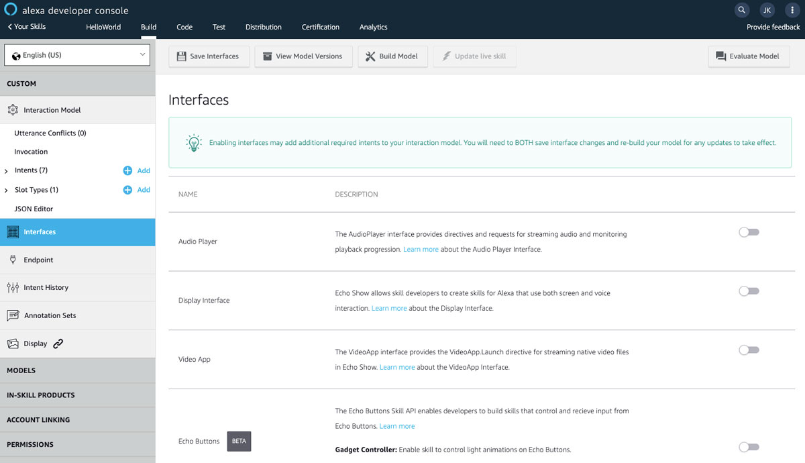

# Alexa Skill Interfaces

> To view this page on the Jovo website, visit https://v3.jovo.tech/marketplace/jovo-platform-alexa/interfaces

Learn more about the different types of interfaces that can be used when developing an Alexa Skill with the Jovo Framework.

* [Introduction](#introduction)
* [Interfaces](#interfaces)

## Introduction

For different specializations of custom skills, the Alexa platform offers different types of interfaces that make it possible to access certain features, like playing long-form audio files.

You can find the interfaces in the Alexa Developer Console:

## Interfaces

Find all Alexa Skill interfaces here:

* [Audio Player](https://v3.jovo.tech/marketplace/jovo-platform-alexa/interfaces/audio-player)
* [Dialog](https://v3.jovo.tech/marketplace/jovo-platform-alexa/interfaces/dialog)
* [Game Engine & Gadget Controller](https://v3.jovo.tech/marketplace/jovo-platform-alexa/interfaces/game-engine-gadget-controller)
* [Proactive Events](https://v3.jovo.tech/marketplace/jovo-platform-alexa/interfaces/proactive-events)
* [Visual Output](https://v3.jovo.tech/marketplace/jovo-platform-alexa/interfaces/visual-output)