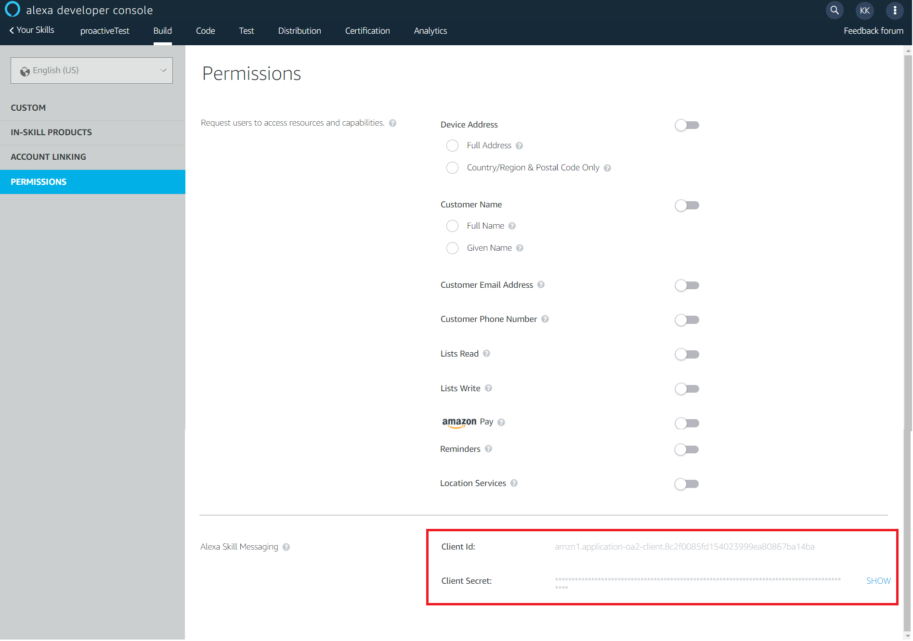

# Proactive Events

> To view this page on the Jovo website, visit https://www.jovo.tech/marketplace/jovo-platform-alexa/interfaces/proactive-events

The Proactive Events API allows you to send out events to your user, which work as notifications.

There are four steps to send out events:

1. You have to first add the Proactive Events API and other necessary settings to your Skill.
2. You have to request an access token from Amazon, which you get after authorizing to be able to send out the events.
3. You have to prepare the event object containing the data, that will be sent.
4. You have to send out the event object.

* [Skill Permissions and Publications](#skill-permissions-and-publications)
* [Proactive Event Object](#proactive-event-object)
 * [Event](#event)
   * [AMAZON.WeatherAlert.Activated](#amazonweatheralertactivated)
   * [AMAZON.SportsEvent.Updated](#amazonsportseventupdated)
   * [AMAZON.MessageAlert.Activated](#amazonmessagealertactivated)
   * [AMAZON.OrderStatus.Updated](#amazonorderstatusupdated)
   * [AMAZON.Occasion.Updated](#amazonoccasionupdated)
   * [AMAZON.TrashCollectionAlert.Activated](#amazontrashcollectionalertactivated)
   * [AMAZON.MediaContent.Available](#amazonmediacontentavailable)
   * [AMAZON.SocialGameInvite.Available](#amazonsocialgameinviteavailable)
 * [Localized Attributes](#localized-attributes)
* [Send the Proactive Event](#send-the-proactive-event)
* [Skill Event - ProactiveSubscriptionChanged](#skill-event---proactivesubscriptionchanged)

## Skill Permissions and Publications

To use the Proactive Events API you have to add it to your skill's permissions as well as specify the [event schemas](#event) that you are going to use. For that add the following to your `project.js` file:

```javascript
// project.js

module.exports = {
    alexaSkill: {
        nlu: 'alexa',
        manifest: {
            permissions: [
                {
                    name: 'alexa::devices:all:notifications:write'
                }
            ],
            events: {
                publications: [
                    {
                        eventName: 'AMAZON.WeatherAlert.Activated'
                    },
                    {
                        eventName: 'AMAZON.SportsEvent.Updated'
                    },
                    {
                        eventName: 'AMAZON.MessageAlert.Activated'
                    },
                    {
                        eventName: 'AMAZON.OrderStatus.Updated'
                    },
                    {
                        eventName: 'AMAZON.Occasion.Updated'
                    },
                    {
                        eventName: 'AMAZON.TrashCollectionAlert.Activated'
                    },
                    {
                        eventName: 'AMAZON.MediaContent.Available'
                    },
                    {
                        eventName: 'AMAZON.SocialGameInvite.Available'
                    }
                ],
            }
        }
    },

    // ...
};
```

After that build and deploy the files:

```text
$ jovo3 build -p alexaSkill --deploy --target info
```

After the deployment finished, you can find the `clientId` and `clientSecret` on the `PERMISSIONS` tab of your Skill on the Alexa Developer Console, which you will need later on:




## Proactive Event Object

The Proactive Event object contains the data you want to send your users.

```javascript
{
    "timestamp": "2019-02-13T14:00:00.00Z",
    "referenceId": "test-0001",
    "expiryTime": "2019-02-14T13:00:00.00Z",
    "event": {
        "name": "AMAZON.WeatherAlert.Activated",
        "payload": {
            "weatherAlert": {
                "source": "localizedattribute:source",
                "alertType": "TORNADO"
            }
        }
    },
    "localizedAttributes": [
        {
            "locale": "en-US",
            "source": "English Weather Channel"
        }
    ],
    "relevantAudience": {
        "type": "Unicast",
        "payload": {
            "user": "<user-id>"
        }
    }
}
```

Name | Description | Value | Required
:--- | :--- | :--- | :---
`timestamp` | The time of the event's creation | `string` - ISO 8601 | Yes
`referenceId` | Unique id which identifies the event. You may use the same id for different customers, but each customer can only have received a single event associated with that id | `string` - Must be alphanumeric values, including `~`. Max 100 characters | Yes
`expiryTime` | Timestamp at which the notification will be deleted automatically. | `string` - ISO 8601. Must be 5 minutes after and 24 hours before the `timestamp` value | Yes
`event` | The event data, which will be sent to the customer. Check [Event](#Event) for more info | `object` | Yes
`localizedAttributes` | An array containing localized event attributes. Check [Localized Attributes](#Localized-Attributes) for more info | `object[]` | Yes
`relevantAudience.type` | Who to send the event to. Either every user (`Multicast`) or a specific user `Unicast` | `enum` - either `Multicast` or `Unicast` | Yes
`relevantAudience.payload` | If `type` is `Multicast`, `payload` has to be an empty object. If it's `Unicast`, the `payload` object will contain the `user`, to which the event will be sent | `object` | Yes
`relevantAudience.payload.user` | User ID representing the user, who shall receive the event | `string` | Yes, if `relevantAudience.type` is `Unicast`

### Event

The event object contains the information, which will be sent to the user, by implementing one of the many schemas Amazon provides. You are not able to create your own event scheme, but have to use one of the available ones. Saying that, Amazon offers a wide variety of schemas, which will be expanded in the future.

For each event scheme you provide attributes, which will be added to a predefined utterance.

#### AMAZON.WeatherAlert.Activated

Utterance: `There is a <weatherAlert> alert for your area. Provided by <Source>.`

```javascript
{
    "name": "AMAZON.WeatherAlert.Activated",
    "payload": {
        "weatherAlert": {
            "source": "localizedattribute:source",
            "alertType": "TORNADO"
        }
    }
}
```

Name | Description | Value | Localization Supported | Required
:--- | :--- | :--- | :--- | :---
`weatherAlert` | Contains information about the weather alert the event is about | `object` | No | Yes
`weatherAlert.source` | The source of the weather alert, i.e. who the information is from | `string` | Yes | Yes
`weatherAlert.alertType` | What kind of extreme weather situation is the alert about | `enum` - either `TORNADO`, `HURRICANE`, `SNOW_STORM` or `THUNDER_STORM` | No | Yes

#### AMAZON.SportsEvent.Updated

Utterance: `<eventLeagueName> match update, <updateTeamName> scored! <homeTeamName> <homeTeamScore>, <awayTeamName> <awayTeamScore>`

```javascript
{
    "name": "AMAZON.SportsEvent.Updated",
    "payload": {
        "update": {
            "scoreEarned": 1,
            "teamName": "Apples"
        },
        "sportsEvent": {
            "eventLeague": {
                "name": "localizedattribute:eventLeagueName"
            },
            "homeTeamStatistic": {
                "team": {
                    "name": "Oranges"
                },
                "score": 1
            },
            "awayTeamStatistic": {
                "team": {
                    "name": "Apples"
                },
                "score": 2
            }
        }
    }
}
```

Name | Description | Value | Localization Supported | Required
:--- | :--- | :--- | :--- | :---
`update` | Contains information about changes to the current sports event | `object` | No | No
`update.scoreEarned` | For how much did the score change | `integer` | No | Yes 
`update.teamName` | Which team did score | `string` | No | Yes
`sportsEvent` | Contains information about the sports event the update is about | `object` | No | Yes
`sportsEvent.eventLeague` | Contains information about the league the event is from | `object` | No | Yes
`sportsEvent.eventLeague.name` | The name of the league | `string` | Yes | Yes
`sportsEvent.homeTeamStatistic` | Contains information about the home team for this specific event | No | Yes
`sportsEvent.homeTeamStatistic.team` | Contains information about the home team | No | Yes
`sportsEvent.homeTeamStatistic.team.name` | The name of the home team | `string` | No | Yes
`sportsEvent.homeTeamStatistic.score` | The current score of the home team | `integer` | No | Yes
`sportsEvent.awayTeamStatistic` | Contains information about the away team for this specific event | No | Yes
`sportsEvent.awayTeamStatistic.team` | Contains information about the away team | No | Yes
`sportsEvent.awayTeamStatistic.team.name` | The name of the away team | `string` | No | Yes
`sportsEvent.awayTeamStatistic.score` | The current score of the away team | `integer` | No | Yes

#### AMAZON.MessageAlert.Activated

Utterance: `You have <messageCount> <messageFreshness> <messageStatus> <urgency> <message/messages> from <sender>`

```javascript
{
    "name": "AMAZON.MessageAlert.Activated",
    "payload": {
        "state": {
            "status": "UNREAD",
            "freshness": "NEW"
        },
        "messageGroup": {
            "creator": {
                "name": "Andy"
            },
            "count": 5,
            "urgency": "URGENT"
        }
    }
}
```

Name | Description | Value | Localization Supported | Required
:--- | :--- | :--- | :--- | :---
`state` | Contains information about the state of the message | `object` | No | Yes
`state.status` | The status of the message | `enum` - either `UNREAD` or `FLAGGED` | No | Yes
`state.freshness` | Specifies how recent the message is | `enum` - either `NEW` or `OVERDUE` | No | No
`messageGroup` | Contains information about the message itself | `object` | No | Yes
`messageGroup.creator` | Contains information about the creator of the message | `object` | No | Yes
`messageGroup.creator.name` | The name of the creator | `string` | No | Yes
`messageGroup.count` | The number of messages | `integer` | No | Yes
`messageGroup.urgency` | The urgency of the messages | `enum` - Only `URGENT` | No | No 

#### AMAZON.OrderStatus.Updated

Multiple possible utterances depending on `state.status`.

Utterances: `Your preorder from <company> has been received`, `Your order from <company> was delivered <date>`

```javascript
{
    "name": "AMAZON.OrderStatus.Updated",
    "payload": {
        "state": {
            "status": "ORDER_SHIPPED",
            "deliveryDetails": {
                "expectedArrival": "2018-12-14T23:32:00.463Z"
            }
        },
        "order": {
            "seller": {
                "name": "localizedattribute:sellerName"
            }
        }
    }
}
```

```javascript
{
    "name": "AMAZON.OrderStatus.Updated",
    "payload": {
        "state": {
            "status": "ORDER_DELIVERED",
            "enterTimestamp": "2018-09-16T03:00:00.463Z"
        },
        "order": {
            "seller": {
                "name": "localizedattribute:sellerName"
            }
        }
    }
}
```

Name | Description | Value | Localization Supported | Required
:--- | :--- | :--- | :--- | :---
`state` | Contains information about the state of the order | `object` | No | Yes
`state.status` | Specifies the status of the order | `enum` - either `PREORDER_RECEIVED`, `ORDER_RECEIVED`, `ORDER_PREPARING`, `ORDER_SHIPPED`, `ORDER_OUT_FOR_DELIVERY`, `ORDER_OUT_FOR_DELIVERY` or `ORDER_DELIVERED` | No | Yes
`state.enterTimeStamp` | Specifies the timestamp of the event | `string` - ISO 8601 | No | No
`state.deliveryDetails` | Contains information about the delivery | `object` | No | No
`state.deliveryDetails.expectedArrival` | Specifies the expected arrival time | `string` - ISO 8601 | No | No
`order` | Contains information about the order | `object` | No | Yes
`order.seller` | Contains information about the seller | `object` | No | Yes
`order.seller.name` | Specifies the name of the seller | `string` | Yes | Yes

#### AMAZON.Occasion.Updated

Utterance: `Your <occasionType> at <providerName> for <subject> on <bookingTime> has been <confirmationStatus>`

```javascript
{
    "name": "AMAZON.Occasion.Updated",
    "payload": {
        "state": {
            "confirmationStatus": "CONFIRMED"
        },
        "occasion": {
            "occasionType": "APPOINTMENT",
            "subject": "localizedattribute:subject",
            "provider": {
                "name": "localizedattribute:providerName"
            },
            "bookingTime": "2018-11-20T19:16:31Z",
            "broker": {
                "name": "localizedattribute:brokerName"
            }
        }
    }
}
```

Name | Description | Value | Localization Supported | Required
:--- | :--- | :--- | :--- | :---
`state` | Contains information about the state of the occasion | `object` | No | Yes
`state.confirmationStatus` | Specifies the status of the occasion | `string` - either `CONFIRMED`, `CANCELED`, `RESCHEDULED`, `REQUESTED`, `CREATED` or `UPDATED` | No | Yes
`occasion` | Contains information about the occasion | `object` | No | Yes
`occasion.occasionType` | Specifies the type of the occasion | `string` - either `RESERVATION_REQUEST`, `RESERVATION`, `APPOINTMENT_REQUEST` or`APPOINTMENT`| No | Yes
`occasion.subject` | Specifies the subject of the occasion | `string` | Yes | Yes
`occasion.provider` | Contains information about the provider of the occasion | `object` | No | Yes
`occasion.provider.name` | Specifies the name of the provider | `string` | Yes | Yes
`occasion.bookingTime` | Specifies the time of the occasion | `string` - ISO 8601 | No | Yes
`occasion.broker` | Contains information about broker | `object` | No | No
`occasion.broker.name` | Specifies the name of the broker | `string` | Yes | Yes

#### AMAZON.TrashCollectionAlert.Activated

Utterance: `The coming <dayOfTheWeek> is <garbageType> garbage collection day`

```javascript
{
    "name": "AMAZON.TrashCollectionAlert.Activated",
    "payload": {
        "alert": {
            "garbageTypes": [
                "COMPOSTABLE",
                "RECYCLABLE_PLASTICS"
            ],
            "collectionDayOfWeek": "TUESDAY"
        }
    }
}
```

Name | Description | Value | Localization Supported | Required
:--- | :--- | :--- | :--- | :---
`alert` | Contains information about the alert | `object` | No | Yes
`alert.garbageTypes` | Specifies the garbage types which are scheduled for collection | `enum[]` - possible values: `BOTTLES`, `BULKY`, `BURNABLE`, `CANS`, `CLOTHING`, `COMPOSTABLE`, `CRUSHABLE`, `GARDEN_WASTE`, `GLASS`, `HAZARDOUS`, `HOME_APPLIANCES`, `KITCHEN_WASTE`, `LANDFILL`, `PET_BOTTLES`, `RECYCLABLE_PLASTICS`, `WASTE_PAPER`. Max 5 items | No | Yes
`alert.collectionDayOfWeek` | Specifies the day of the week at which the garbage types will be collected | `enum` - either `MONDAY`, `TUESDAY`, `WEDNESDAY`, `THURSDAY`, `FRIDAY`, `SATURDAY` or `SUNDAY` | No | Yes

#### AMAZON.MediaContent.Available

Utterance: `<contentName> will <method> on <startTime> on <providerName>`

```javascript
{
    "name": "AMAZON.MediaContent.Available",
    "payload": {
        "availability": {
            "startTime": "2018-11-20T21:00:00Z",
            "provider": {
                "name": "localizedattribute:providerName"
            },
            "method":"AIR"
        },
        "content": {
            "name": "localizedattribute:contentName",
            "contentType":"BOOK"
        }
    }
}
```

Name | Description | Value | Localization Supported | Required
:--- | :--- | :--- | :--- | :---
`availability` | Contains information about the availability of the media content | `object` | No | Yes
`availability.startTime` | Specifies the time at which the content will be available | `string` - ISO 8601 | No | Yes
`availability.provider` | Contains information about the provider | `object` | No | No
`availability.provider.name` | Specifies the name of the provder | `string` | Yes | Yes
`availability.method` | Specifies the distribution method of the content | `enum` - either `STREAM`, `AIR`, `RELEASE`, `PREMIERE` or `DROP` | No | Yes
`content` | Contains information about the content | `object` | No | Yes
`content.name` | Specifies the name of the content | `string` | Yes | Yes
`content.contentType` | Specifies the media type | `enum` - either `BOOK`, `EPISODE`, `ALBUM`, `SINGLE`, `MOVIE` or `GAME` | No | Yes

#### AMAZON.SocialGameInvite.Available

Utterance: `Your <relationshipToInvitee> <inviterName> has <inviteType> you to a <gameOffer> of <gameName>`

```javascript
{
    "name": "AMAZON.SocialGameInvite.Available",
    "payload": {
        "invite": {
            "inviter": {
                "name": "Max",
                "relationshipToInvitee": "FRIEND"
            },
            "inviteType": "CHALLENGE"
        },
        "game": {
            "offer": "MATCH",
            "name": "localizedattribute:gameName"
        }
    }
}
```

Name | Description | Value | Localization Supported | Required
:--- | :--- | :--- | :--- | :---
`invite` | Contains information about the invite | `object` | No | Yes
`invite.inviter` | Contains information about the inviter | `object` | No | Yes
`invite.inviter.name` | Specifies the name of the inviter | `string` | No | Yes
`invite.inviter.relationshipToInvitee` | Specifies the relationship of the inviter to the invitee | `enum` - either `FRIEND` or `CONTACT` | No | Yes
`invite.inviteType` | Specifies the type of the invite | `enum` - either `CHALLENGE` or `INVITE` | No | Yes
`game` | Contains information about the game | `object` | No | Yes
`game.offer` | Specifies the offer type | `enum` - either `MATCH`, `REMATCH` or `GAME` | No | Yes
`game.name` | Specifies the name of the game | `string` | Yes | Yes

### Localized Attributes

The `localizedAttributes` array is used specify the attributes and their values for each locale. You set the value of the attribute, which should be localized, to `localizedattribute:key` and use the key to specify the value for that attribute inside the array.

For example, here's the `AMAZON.MediaContent.Available` event with two localized attributes, `providerName` and `contentName`:

```javascript
{
    "name": "AMAZON.MediaContent.Available",
    "payload": {
        "availability": {
            "startTime": "2018-11-20T21:00:00Z",
            "provider": {
                "name": "localizedattribute:providerName"
            },
            "method":"AIR"
        },
        "content": {
            "name": "localizedattribute:contentName",
            "contentType":"BOOK"
        }
    }
}
```

The `localizedAttribute` array for this particular event would look like this:

```javascript
"localizedAttributes": [
    {
        "locale": "en-US",
        "providerName": "English Provider Name",
        "contentName": "English Content Name"
    },
    {
        "locale": "de-DE",
        "providerName": "German Provider Name",
        "contentName": "German Content Name"
    }
    // ...
],
```

## Send the Proactive Event

To be able to send out events, you have to first authorize yourself with Amazon to receive an access token.

For authorization, you send a request to one of Amazon APIs, which will return you the following object containing your access token:

```javascript
{
    "access_token":"<access_token>",
    "expires_in":3600,
    "scope":"alexa::proactive_events",
    "token_type":"Bearer"
}
```

Name | Description | Value
:--- | :--- | :--- 
`access_token` | An access token used to send out events | `string`
`expires_in` | The number of seconds the token is valid for | `integer`
`scope` | The scope the access token is valid for | `string`
`status` | The token type | `string`

To authorize yourself you can either call the `sendAuthRequest()` method, which will return you the whole response object, or the `getAccessToken()`, which will return you only the access token. Both methods need your Alexa Skill's `clientId` and `clientSecret` as parameters:

```javascript
// @language=javascript

// Get the whole response object
const result = this.$alexaSkill.$proactiveEvent.sendAuthRequest(clientId, clientSecret);

// Get only the access token
const accessToken = this.$alexaSkill.$proactiveEvent.getAccessToken(clientId, clientSecret);

// @language=typescript

// Get the whole response object
const result = this.$alexaSkill!.$proactiveEvent.sendAuthRequest(clientId, clientSecret);

// Get only the access token
const accessToken = this.$alexaSkill!.$proactiveEvent.getAccessToken(clientId, clientSecret);
```

After you got your token, you can send the event to your users:

```javascript
// @language=javascript

const result = await this.$alexaSkill.$proactiveEvent.sendProactiveEvent(proactiveEvent, accessToken);

// @language=typescript

const result = await this.$alexaSkill!.$proactiveEvent.sendProactiveEvent(proactiveEvent, accessToken);
```

## Skill Event - ProactiveSubscriptionChanged

With the Proactive Events API there was also a new Skill Event added. The `ProactiveSubscriptionChanged` event notifies you, if an user subscribes or unsubscribes from an event.

```javascript
{
    "version": "string",
    "context": {
        "System": {
            "application": {
                "applicationId": "string"
            },
            "user": {
                "userId": "string"
            },
            "apiEndpoint": 'https://api.amazonalexa.com'
        }
    },
    "request": {
        "type": "AlexaSkillEvent.ProactiveSubscriptionChanged",
        "requestId": "string",
        "timestamp": "string",
        "body": {
            "subscriptions": [{
                "eventName": "string"
            }]
        }
    }
}
```

The request will contain a `subscriptions` array, which will contain the events to which the user is currently subscribed to. That means, if an user unsubscribes you will have to compare the past subscribed events with the new array to find out, which one the user unsubscribed from. Also keep in mind, that these requests can arrive out of order, which is why you should always use the `timestamp` sent with the request to ensure, that you use the latest changes.

> Learn how to enable Skill Events [here](#skill-events)