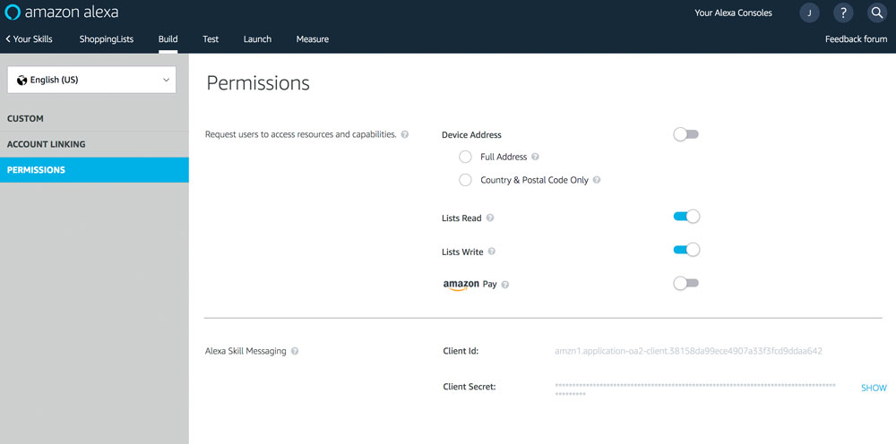
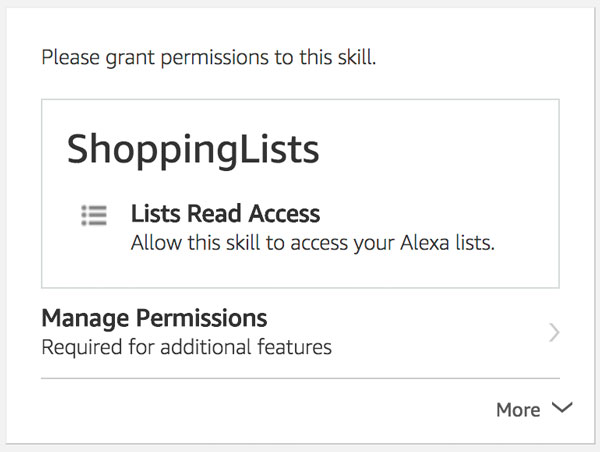

# User Data and Permissions

> To view this page on the Jovo website, visit https://v3.jovo.tech/marketplace/jovo-platform-alexa/permissions-data

Learn more about how to get access to Alexa Skill user information, permissions, and other data.

* [Location](#location)
   * [Geolocation](#geolocation)
* [Contact Information](#contact-information)
* [Lists](#lists)
   * [List Permissions](#list-permissions)
   * [Shopping List](#shopping-list)
   * [To-Do List](#to-do-list)
* [Reminders](#reminders)
   * [Add Reminder](#add-reminder)
   * [Update Reminder](#update-reminder)
   * [Delete Reminder](#delete-reminder)
   * [Get Reminder](#get-reminder)
* [Settings](#settings)
   * [Timezone](#timezone)
   * [Temperature Measurement Unit](#temperature-measurement-unit)
* [Skill Events](#skill-events)
   * [Skill Event Requirements](#skill-event-requirements)
   * [Events](#events)

## Location

You can use the user's address data to provide location specific features, but you have to obtain their permission first.

First add it to your skill's permission. You can do that in your `project.js` file:

```javascript
// project.js

module.exports = {
  alexaSkill: {
    nlu: 'alexa',
    manifest: {
      permissions: [
        {
          name: 'read::alexa:device:all:address' // only needed if you want to access the address
        },
        {
          name: 'read::alexa:device:all:address:country_and_postal_code' // needed if you want to access the country and postal code
        }
      ]
    }
  }

  // ...
};
```
After that you have to send the user a `permission card` for them to grant you access to the data:

```javascript
// @language=javascript

// Country and Postal Code
this.$alexaSkill.showAskForCountryAndPostalCodeCard();

// Device Address
this.$alexaSkill.showAskForAddressCard();

// @language=typescript

// Country and Postal Code
this.$alexaSkill!.showAskForCountryAndPostalCodeCard();

// Device Address
this.$alexaSkill!.showAskForAddressCard();
```

Get the country and postal code:

```javascript
// @language=javascript

await this.$alexaSkill.$user.getCountryAndPostalCode();

// Example
async GetCountryAndPostalCodeIntent() {
    try {
        const countryAndPostalCode = await this.$alexaSkill.$user.getCountryAndPostalCode();

        this.tell(`${countryAndPostalCode.postalCode} in ${countryAndPostalCode.countryCode}`);

    } catch(error) {
        if (error.code === 'NO_USER_PERMISSION') {
            this.$alexaSkill.showAskForCountryAndPostalCodeCard()
                .tell(`Please grant access to your address in the Alexa app.`);
        } else {
            // Do something
        }
    }
},

// @language=typescript

await this.$alexaSkill!.$user.getCountryAndPostalCode();

// Example
async GetCountryAndPostalCodeIntent() {
    try {
        const countryAndPostalCode = await this.$alexaSkill!.$user.getCountryAndPostalCode();

        this.tell(`${countryAndPostalCode.postalCode} in ${countryAndPostalCode.countryCode}`);

    } catch(error: Error) {
        if (error.code === 'NO_USER_PERMISSION') {
            this.$alexaSkill!.showAskForCountryAndPostalCodeCard()
                .tell(`Please grant access to your address in the Alexa app.`);
        } else {
            // Do something
        }
    }
},
```

Get the address:

```javascript
// @language=javascript

await this.$alexaSkill.$user.getDeviceAddress()

// Example
async GetFullAddressIntent() {
    try {
        const address = await this.$alexaSkill.$user.getDeviceAddress();

        console.log(address);

    } catch(error) {
        if (error.code === 'NO_USER_PERMISSION') {
            this.$alexaSkill.showAskForAddressCard()
                .tell(`Please grant access to your address in the Alexa app.`);
        }
    }
},

// @language=typescript

await this.$alexaSkill!.$user.getDeviceAddress()

// Example
async GetFullAddressIntent() {
    try {
        const address = await this.$alexaSkill!.$user.getDeviceAddress();

        console.log(address);

    } catch(error: Error) {
        if (error.code === 'NO_USER_PERMISSION') {
            this.$alexaSkill!.showAskForAddressCard()
                .tell(`Please grant access to your address in the Alexa app.`);
        }
    }
},
```

Learn more in the [official documentation by Amazon](https://developer.amazon.com/docs/custom-skills/device-address-api.html).

### Geolocation

The geolocation allows you to access your user's real time location, which the system gets from the alexa enabled mobile device, e.g. their phone.

#### Geolocation Permission

To access the user's geolocation, you have to first add it to your skill's permission. You can do that in your `project.js` file:

```javascript
// project.js

module.exports = {
  alexaSkill: {
    nlu: 'alexa',
    manifest: {
      permissions: [
        {
          name: 'alexa::devices:all:geolocation:read'
        }
      ]
    }
  }

  // ...
};
```

After you've added it to your skill's permissions, your users can grant or deny you permission to access their geolocation data at any time. You can check the current status the following ways:

```javascript
// @language=javascript

this.$alexaSkill.getGeoLocationPermissionStatus(); // Either `GRANTED` or `DENIED`

this.$alexaSkill.isGeoLocationPermissionGranted(); // true or false

this.$alexaSkill.isGeoLocationPermissionDenied(); // true or false

// @language=typescript

this.$alexaSkill!.getGeoLocationPermissionStatus(); // Either `GRANTED` or `DENIED`

this.$alexaSkill!.isGeoLocationPermissionGranted(); // true or false

this.$alexaSkill!.isGeoLocationPermissionDenied(); // true or false
```

If the permission was denied you can send your user a permission card to ask them to turn it back on:

```javascript
// @language=javascript

this.$alexaSkill.showAskForGeoLocationCard();

// @language=typescript

this.$alexaSkill!.showAskForGeoLocationCard();
```

#### Geolocation Interface

After your user has given their consent the incoming requests may contain a `Geolocation` object, as it depends on the device and its settings.

To see whether a device supports the geolocation interface or not, you can use the following method:

```javascript
// @language=javascript

this.$alexaSkill.hasGeoLocationInterface() // true or false

// @language=typescript

this.$alexaSkill!.hasGeoLocationInterface() // true or false
```

#### Geolocation Object

The incoming `Geolocation` object has the following structure:

```javascript
"Geolocation":{
    "locationServices": {
        "access": "ENABLED",
        "status": "RUNNING",
    },
    "timestamp": "2018-03-25T00:00:00Z+00:00",
    "coordinate": {
        "latitudeInDegrees": 38.2,
        "longitudeInDegrees": 28.3,
        "accuracyInMeters": 12.1
    },
    "altitude": {
        "altitudeInMeters": 120.1,
        "accuracyInMeters": 30.1
    },
    "heading": {
        "directionInDegrees": 180.0,
        "accuracyInDegrees": 5.0
    },
    "speed": {
        "speedInMetersPerSecond": 10.0,
        "accuracyInMetresPerSecond": 1.1
    }
}
```

| Name                              | Description                                                        | Value                                   | Optional                   |
| :-------------------------------- | :----------------------------------------------------------------- | :-------------------------------------- | :------------------------- |
| `locationServices`                | Contains information whether location sharing is turned on          | `object`                                | Yes                        |
| `locationServices.access`         | Specifies whether location sharing is enabled or disabled           | `enum` - either `ENABLED` or `DISABLED` | No                         |
| `locationServices.status`         | Specifies whether location sharing is running or not                | `enum` - either `RUNNING` or `STOPPED`  | No                         |
| `timestamp`                       | Timestamp specifying when the location data was retrieved          | `string` - ISO 8601                     | No                         |
| `coordinate`                      | Contains information about the coordinates                         | `object`                                | No                         |
| `coordinate.latitudeInDegrees`    | Specifies the latitude in degrees                                  | `number` - [-90.0, 90.0]                | No                         |
| `coordinate.longitudeInDegrees`   | Specifies the longitude in degrees                                 | `number` - [-180.0, 180]                | No                         |
| `coordinate.accuracyInMeters`     | Specifies the uncertainty in the latitude and longitude in meters  | `number` - [0, MAX_INTEGER]             | No                         |
| `altitude`                        | Contains information about the altitude                            | `object`                                | Yes                        |
| `altitude.altitudeInMeters`       | Specifies the altitude in meters                                   | `number` - [-6350, 18000]               | Yes                        |
| `altitude.accuracyInMeters`       | The uncertainty in the altitude in meters                          | `number` - [0, MAX_INTEGER]             | Yes                        |
| `heading`                         | Contains information about the direction the device is heading     | `object`                                | Yes                        |
| `heading.directionInDegrees`      | The degrees from true north                                        | `number` - (0.0, 360.0]                 | Yes                        |
| `heading.accuracyInDegrees`       | The accuracy of the direction                                      | `number` - [0, MAX_INTEGER]             | Yes                        |
| `speed`                           | Contains information about the speed at which the device is moving | `object`                                | Yes                        |
| `speed.speedInMetersPerSecond`    | The meters per second within GPS limits                            | `number` - [0, 1900]                    | Yes, except for automotive |
| `speed.accuracyInMetersPerSecond` | The accuracy of the speed                                          | `number` - [0, MAX_INTEGER]             | Yes                        |

Each of these values can be `undefined`, but either the `locationServices` or `coordinate` object will be defined at all times.

You can access them the following way:

```javascript
// @language=javascript

// geolocation
this.$alexaSkill.getGeoLocationObject() // whole geolocation object

// locationServices
this.$alexaSkill.getLocationServicesObject() // whole object
this.$alexaSkill.getLocationServicesAccess()
this.$alexaSkill.getLocationServicesStatus()

// timestamp
this.$alexaSkill.getGeoLocationTimestamp()

// coordinate
this.$alexaSkill.getCoordinateObject() // whole object
this.$alexaSkill.getCoordinateLatitude()
this.$alexaSkill.getCoordinateLongitude()
this.$alexaSkill.getCoordinateAccuracy()

// altitude
this.$alexaSkill.getAltitudeObject() // whole object
this.$alexaSkill.getAltitude()
this.$alexaSkill.getAltitudeAccuracy()

// heading
this.$alexaSkill.getHeadingObject() // whole object
this.$alexaSkill.getHeadingDirection()
this.$alexaSkill.getHeadingAccuracy()

// speed
this.$alexaSkill.getSpeedObject() // whole object
this.$alexaSkill.getSpeed()
this.$alexaSkill.getSpeedAccuracy()

// @language=typescript

// geolocation
this.$alexaSkill!.getGeoLocationObject() // whole geolocation object

// locationServices
this.$alexaSkill!.getLocationServicesObject() // whole object
this.$alexaSkill!.getLocationServicesAccess()
this.$alexaSkill!.getLocationServicesStatus()

// timestamp
this.$alexaSkill!.getGeoLocationTimestamp()

// coordinate
this.$alexaSkill!.getCoordinateObject() // whole object
this.$alexaSkill!.getCoordinateLatitude()
this.$alexaSkill!.getCoordinateLongitude()
this.$alexaSkill!.getCoordinateAccuracy()

// altitude
this.$alexaSkill!.getAltitudeObject() // whole object
this.$alexaSkill!.getAltitude()
this.$alexaSkill!.getAltitudeAccuracy()

// heading
this.$alexaSkill!.getHeadingObject() // whole object
this.$alexaSkill!.getHeadingDirection()
this.$alexaSkill!.getHeadingAccuracy()

// speed
this.$alexaSkill!.getSpeedObject() // whole object
this.$alexaSkill!.getSpeed()
this.$alexaSkill!.getSpeedAccuracy()
```

## Contact Information

You can use contact information (name, email address, mobile number) to provide more personalized experiences for the user. To get access to the contact information, ask for permissions first. You can do this by using the `contact permission card`.

```javascript
// @language=javascript

// Full name
this.$alexaSkill.showAskForContactPermissionCard('name');

// Given name
this.$alexaSkill.showAskForContactPermissionCard('given-name');

// E-Mail
this.$alexaSkill.showAskForContactPermissionCard('email');

// Mobile number
this.$alexaSkill.showAskForContactPermissionCard('mobile_number');

// @language=typescript

// Full name
this.$alexaSkill!.showAskForContactPermissionCard('name');

// Given name
this.$alexaSkill!.showAskForContactPermissionCard('given-name');

// E-Mail
this.$alexaSkill!.showAskForContactPermissionCard('email');

// Mobile number
this.$alexaSkill!.showAskForContactPermissionCard('mobile_number');
```

Get the full name:

```javascript
// @language=javascript

await this.$alexaSkill.$user.getName()

// Example
async GetFullNameIntent() {
    try {
        const name = await this.$alexaSkill.$user.getName();
        this.tell(`Hello ${name}.`);

    } catch(error) {
        if (error.code === 'NO_USER_PERMISSION') {
            this.$alexaSkill.showAskForContactPermissionCard('name')
                .tell(`Please grant access to your full name.`);
        }
    }
},

// @language=typescript

await this.$alexaSkill!.$user.getName()

// Example
async GetFullNameIntent() {
    try {
        const name = await this.$alexaSkill!.$user.getName();
        this.tell(`Hello ${name}.`);

    } catch(error: Error) {
        if (error.code === 'NO_USER_PERMISSION') {
            this.$alexaSkill!.showAskForContactPermissionCard('name')
                .tell(`Please grant access to your full name.`);
        }
    }
},
```

Get the given name:

```javascript
// @language=javascript

await this.$alexaSkill.$user.getGivenName()

// Example
async GetGivenNameIntent() {
    try {
        const givenName = await this.$alexaSkill.$user.getGivenName();
        this.tell(`Hello ${givenName}.`);

    } catch(error) {
        if (error.code === 'NO_USER_PERMISSION') {
            this.$alexaSkill.showAskForContactPermissionCard('given_name')
                .tell(`Please grant access to your given name.`);
        }
    }
},

// @language=typescript

await this.$alexaSkill!.$user.getGivenName()

// Example
async GetGivenNameIntent() {
    try {
        const givenName = await this.$alexaSkill!.$user.getGivenName();
        this.tell(`Hello ${givenName}.`);

    } catch(error: Error) {
        if (error.code === 'NO_USER_PERMISSION') {
            this.$alexaSkill!.showAskForContactPermissionCard('given_name')
                .tell(`Please grant access to your given name.`);
        }
    }
},
```

Get the email address:

```javascript
// @language=javascript

await this.$alexaSkill.$user.getEmail()

// Example
async GetEmailIntent() {
    try {
        const email = await this.$alexaSkill.$user.getEmail();
        this.tell(`Your email address is ${email}`);

    } catch(error) {
        if (error.code === 'NO_USER_PERMISSION') {
            this.$alexaSkill.showAskForContactPermissionCard('email')
                .tell(`Please grant access to your email address.`);
        }
    }
},

// @language=typescript

await this.$alexaSkill!.$user.getEmail()

// Example
async GetEmailIntent() {
    try {
        const email = await this.$alexaSkill!.$user.getEmail();
        this.tell(`Your email address is ${email}`);

    } catch(error: Error) {
        if (error.code === 'NO_USER_PERMISSION') {
            this.$alexaSkill!.showAskForContactPermissionCard('email')
                .tell(`Please grant access to your email address.`);
        }
    }
},
```

Get the mobile number:

```javascript
// @language=javascript

await this.$alexaSkill.$user.getMobileNumber()

// Example
async getMobileNumberIntent() {
    try {
        const mobileNumber = await this.$alexaSkill.$user.getMobileNumber();
        this.tell(`Your number is ${mobileNumber.countryCode} ${mobileNumber.phoneNumber}`);

    } catch(error) {
        if (error.code === 'NO_USER_PERMISSION') {
            this.$alexaSkill.showAskForContactPermissionCard('mobile_number')
                .tell(`Please grant access to your mobile number.`);
        }
    }
},

// @language=typescript

await this.$alexaSkill!.$user.getMobileNumber()

// Example
async getMobileNumberIntent() {
    try {
        const mobileNumber = await this.$alexaSkill!.$user.getMobileNumber();
        this.tell(`Your number is ${mobileNumber.countryCode} ${mobileNumber.phoneNumber}`);

    } catch(error: Error) {
        if (error.code === 'NO_USER_PERMISSION') {
            this.$alexaSkill!.showAskForContactPermissionCard('mobile_number')
                .tell(`Please grant access to your mobile number.`);
        }
    }
},
```


## Lists

Amazon Alexa offers the ability to its users to add items to a shopping list and a to-do list. Custom Skills can get the permission to access these lists for read and write operations. For a general overview, read the [official list reference by Amazon](https://developer.amazon.com/docs/custom-skills/access-the-alexa-shopping-and-to-do-lists.html).

Learn more in the following sections:
* [List Permissions](#list-permissions)
* [Shopping List](#shopping-list)
* [To-do List](#to-do-list)

### List Permissions

Users need to grant your Alexa Skill permission for `read` and/or `write` access to their lists.

In the Amazon Developer Portal, you can do this by checking the following permissions:



The same result is achieved by adding the following to the `manifest` in your `skill.json` via the `project.js` file:

```javascript
// project.js

alexaSkill: {
    nlu: 'alexa',
    manifest: {
        permissions: [
            {
                name: 'alexa::household:lists:read',
            },
            {
                name: 'alexa::household:lists:write',
            }
        ]
    }
},
```

If your users haven't granted your Skill the permission to access lists yet, you can use a `List Permission Card` to ask for the required permission.

This is mostly used after the error code `'NO_USER_PERMISSION'` is returned. Here is an example:

```javascript
// @language=javascript

async GetShoppingListIntent() {
    try {
        const list = await this.$alexaSkill.$user.getShoppingList();

    } catch(error) {
        if (error.code === 'NO_USER_PERMISSION') {
            this.$alexaSkill.showAskForListPermissionCard(['read'])
                .tell('Please grant the permission to access your lists.');
        } else {
            console.error(error);
        }
    }
},

// @language=typescript

async GetShoppingListIntent() {
    try {
        const list = await this.$alexaSkill!.$user.getShoppingList();

    } catch(error: Error) {
        if (error.code === 'NO_USER_PERMISSION') {
            this.$alexaSkill!.showAskForListPermissionCard(['read'])
                .tell('Please grant the permission to access your lists.');
        } else {
            console.error(error);
        }
    }
},
```

You can ask for both `read` and `write` access with the Permission Card:

```javascript
// @language=javascript

this.$alexaSkill.showAskforListPermissionCard(['read', 'write'])
    .tell('Please grant the permission to access your lists.');

// @language=typescript

this.$alexaSkill!.showAskforListPermissionCard(['read', 'write'])
    .tell('Please grant the permission to access your lists.');
```

This is what it looks like in the Alexa app:



Users can then update the permissions in the Skill's settings:


### Shopping List

Get the user's shopping list:

```javascript
// @language=javascript

await this.$alexaSkill.$user.getShoppingList();

// Example
async GetShoppingListIntent() {
    try {
        const list = await this.$alexaSkill.$user.getShoppingList();

        console.log(list);

    } catch(error) {
        // Do something
    }
},

// @language=typescript

await this.$alexaSkill!.$user.getShoppingList();

// Example
async GetShoppingListIntent() {
    try {
        const list = await this.$alexaSkill!.$user.getShoppingList();

        console.log(list);

    } catch(error: Error) {
        // Do something
    }
},
```

Add an item to the shopping list:

```javascript
// @language=javascript

await this.$alexaSkill.$user.addToShoppingList(value);

// Example
async AddItemToShoppingListIntent() {
    try {
        const result = await this.$alexaSkill.$user.addToShoppingList('Milk')

        console.log(result);

    } catch(error) {
        // Do something
    }
},

// @language=typescript

await this.$alexaSkill!.$user.addToShoppingList(value);

// Example
async AddItemToShoppingListIntent() {
    try {
        const result = await this.$alexaSkill!.$user.addToShoppingList('Milk')

        console.log(result);

    } catch(error: Error) {
        // Do something
    }
},
```

Update the shopping list:

```javascript
// @language=javascript

await this.$alexaSkill.$user.updateShoppingListItem(oldValue, newValue);

// Example
async UpdateShoppingListItemIntent() {
    try {
        const result = await this.alexaSkill.$user.updateShoppingListItem('Milk', 'Almond Milk');

        console.log(result);

    } catch(error) {
        if (error.code === 'NO_USER_PERMISSION') {
            this.$alexaSkill.showAskForListPermissionCard(['read', 'write'])
                .tell('Please grant the permission.');
        }
        if (error.code === 'ITEM_NOT_FOUND') {
            this.tell('Item not found.');
        }
    }
},

// @language=typescript

await this.$alexaSkill!.$user.updateShoppingListItem(oldValue, newValue);

// Example
async UpdateShoppingListItemIntent() {
    try {
        const result = await this.alexaSkill!.$user.updateShoppingListItem('Milk', 'Almond Milk');

        console.log(result);

    } catch(error: Error) {
        if (error.code === 'NO_USER_PERMISSION') {
            this.$alexaSkill!.showAskForListPermissionCard(['read', 'write'])
                .tell('Please grant the permission.');
        }
        if (error.code === 'ITEM_NOT_FOUND') {
            this.tell('Item not found.');
        }
    }
},
```

Delete an item:

```javascript
// @language=javascript

await this.$alexaSkill.$user.deleteShoppingListItem(oldValue, newValue);

// Example
async DeleteShoppingListItemIntent() {
    try {
        const data = await this.$alexaSkill.$user.deleteShoppingListItem('Milk');
        console.log('item deleted');
        console.log(data);

    } catch(error) {
        // Do something
    }
},

// @language=typescript

await this.$alexaSkill!.$user.deleteShoppingListItem(oldValue, newValue);

// Example
async DeleteShoppingListItemIntent() {
    try {
        const data = await this.$alexaSkill!.$user.deleteShoppingListItem('Milk');
        console.log('item deleted');
        console.log(data);

    } catch(error: Error) {
        // Do something
    }
},
```

### To-Do List

Get the user's to-do list:

```javascript
// @language=javascript

await this.$alexaSkill.$user.getToDoList();

// Example
async GetTodoListIntent() {
    try {
        const list = await this.alexaSkill.$user.getToDoList();

        console.log(list);

    } catch(error) {
        // Do something
    }
},

// @language=typescript

await this.$alexaSkill!.$user.getToDoList();

// Example
async GetTodoListIntent() {
    try {
        const list = await this.alexaSkill!.$user.getToDoList();

        console.log(list);

    } catch(error: Error) {
        // Do something
    }
},
```

Add an item to the to-do list:

```javascript
// @language=javascript

await this.$alexaSkill.$user.addToToDoList(value)

// Example
async AddItemToToDoListIntent() {
    try {
        const result = await this.$alexaSkill.$user.addToToDoList('Do Laundry');

        console.log(result);

    } catch(error) {
        // Do something
    }
},

// @language=typescript

await this.$alexaSkill!.$user.addToToDoList(value)

// Example
async AddItemToToDoListIntent() {
    try {
        const result = await this.$alexaSkill!.$user.addToToDoList('Do Laundry');

        console.log(result);

    } catch(error: Error) {
        // Do something
    }
},
```

Update the to-do list:

```javascript
// @language=javascript

await this.$alexaSkill.$user.updateToDoListItem(oldValue, newValue)

// Example
async UpdateToDoListItemIntent() {
    try {
        const result = await this.$alexaSkill.$user.updateToDoListItem('Do Laundry', 'Buy Clothes');

        console.log(result);

    } catch(error) {
        // Do something
    }
},

// @language=typescript

await this.$alexaSkill!.$user.updateToDoListItem(oldValue, newValue)

// Example
async UpdateToDoListItemIntent() {
    try {
        const result = await this.$alexaSkill!.$user.updateToDoListItem('Do Laundry', 'Buy Clothes');

        console.log(result);

    } catch(error: Error) {
        // Do something
    }
},
```

Delete an item from the to-do list:

```javascript
// @language=javascript

await this.$alexaSkill.$user.deleteToDoListItem(value)

// Example
async DeleteToDoListItemIntent() {
    try {
        const result = await this.$alexaSkill.$user.deleteToDoListItem('Buy clothes');

        console.log(result);

    } catch(error) {
        // Do something
    }
},

// @language=typescript

await this.$alexaSkill!.$user.deleteToDoListItem(value)

// Example
async DeleteToDoListItemIntent() {
    try {
        const result = await this.$alexaSkill!.$user.deleteToDoListItem('Buy clothes');

        console.log(result);

    } catch(error: Error) {
        // Do something
    }
},
```


## Reminders


To create a reminder, send a `JSON` object to Amazon's API endpoint. You can find out what that these `JSON` objects look like [here](https://developer.amazon.com/docs/smapi/alexa-reminders-api-reference.html#reminder-object)

### Add Reminder

To add a reminder you use the `setReminder()` method, which takes in the `JSON` object as a parameter:

```javascript
// @language=javascript

await this.$alexaSkill.$user.setReminder(reminder);

// Example
async AddReminderIntent() {
    const reminder = {
        // Your reminder
    };

    try {
        const result = await this.$alexaSkill.$user.setReminder(reminder);

        this.tell('Reminder has been set.');

    } catch(error) {
        if (error.code === 'NO_USER_PERMISSION') {
            this.tell('Please grant the permission to set reminders.');
        } else {
            console.error(error);
            // Do something
        }
    }
},

// @language=typescript

await this.$alexaSkill!.$user.setReminder(reminder: AbsoluteReminder | RelativeReminder);

// Example
async AddReminderIntent() {
    const reminder = {
        // Your reminder
    };

    try {
        const result = await this.$alexaSkill!.$user.setReminder(reminder);

        this.tell('Reminder has been set.');

    } catch(error: Error) {
        if (error.code === 'NO_USER_PERMISSION') {
            this.tell('Please grant the permission to set reminders.');
        } else {
            console.error(error);
            // Do something
        }
    }
},
```

As a response to the API call you will receive an object containing the following data:

```javascript
{
  "alertToken": "string",
  "createdTime": "2018-08-14T15:40:55.002Z",
  "updatedTime": "2018-08-14T15:40:55.002Z",
  "status": "ON",
  "version": "string",
  "href": "string"
}
```

Name | Description | Value
:--- | :--- | :--- 
`alertToken` | Unique ID of the reminder | `String`
`createdTime` | Created time of the reminder (ISO 8601) | `String`
`updatedTime` | Last updated time of the reminder (ISO 8601) | `String`
`status` | Either **ON** or **COMPLETED** | `Enum`
`version` | Version of the reminder | `String`
`href` | URI to retrieve the alert | `String`

### Update Reminder

To update a reminder you need the `JSON` object to update with as well as the `alertToken` to define which one you want to update and the `updateReminder()` method:

```javascript
// @language=javascript

await this.$alexaSkill.$user.updateReminder(alertToken, updatedReminder);

// Example
async UpdateReminderIntent() {
    const alertToken = '<REMINDER TOKEN>';
    const updatedReminder = {
        // Your reminder
    };

    try {
        const result = await this.$alexaSkill.$user.updateReminder(alertToken, updatedAbsoluteReminder);

        this.tell('Reminder has been updated.');

    } catch(error) {
        if (error.code === 'NO_USER_PERMISSION') {
                this.tell('Please grant the permission to set reminders.');
        } else {
            console.error(error);
            // Do something
        }
    }
},

// @language=typescript

await this.$alexaSkill!.$user.updateReminder(alertToken: string, updatedReminder: AbsoluteReminder | RelativeReminder);

// Example
async UpdateReminderIntent() {
    const alertToken = '<REMINDER TOKEN>';
    const updatedReminder = {
        // Your reminder
    };

    try {
        const result = await this.$alexaSkill!.$user.updateReminder(alertToken, updatedAbsoluteReminder);

        this.tell('Reminder has been updated.');

    } catch(error: Error) {
        if (error.code === 'NO_USER_PERMISSION') {
                this.tell('Please grant the permission to set reminders.');
        } else {
            console.error(error);
            // Do something
        }
    }
},
```

You will receive the same response you receive after adding a new reminder.

### Delete Reminder

To delete an active reminder you need the `deleteReminder()` method which takes in the `alertToken` as a parameter:

```javascript
// @language=javascript

await this.$alexaSkill.$user.deleteReminder(alertToken);

async DeleteReminderIntent() {
    try {
        const alertToken = '<REMINDER TOKEN>';
        const result = await this.$alexaSkill.$user.deleteReminder(alertToken);
        this.tell('Reminder has been deleted.');

    } catch(error) {
        if (error.code === 'NO_USER_PERMISSION') {
            this.tell(`Please grant the permission to set reminders.`);
        } else {
            console.error(error);
            // Do something
        }
    }
},

// @language=typescript

await this.$alexaSkill!.$user.deleteReminder(alertToken: string);

async DeleteReminderIntent() {
    try {
        const alertToken = '<REMINDER TOKEN>';
        const result = await this.$alexaSkill!.$user.deleteReminder(alertToken);
        this.tell('Reminder has been deleted.');

    } catch(error: Error) {
        if (error.code === 'NO_USER_PERMISSION') {
            this.tell(`Please grant the permission to set reminders.`);
        } else {
            console.error(error);
            // Do something
        }
    }
},
```

### Get Reminder

You can also send out a request to get a reminder using its `alertToken`:

```javascript
// @language=javascript

await this.$alexaSkill.$user.getReminder(alertToken)

// Example
async GetReminderIntent() {
    const alertToken = '<REMINDER TOKEN>';

    try {
        const result = await this.$alexaSkill.$user.getReminder(alertToken);

    } catch(error) {
        console.error(error);
    }
},

// @language=typescript

await this.$alexaSkill!.$user.getReminder(alertToken: string)

// Example
async GetReminderIntent() {
    const alertToken = '<REMINDER TOKEN>';

    try {
        const result = await this.$alexaSkill!.$user.getReminder(alertToken);

    } catch(error: Error) {
        console.error(error);
    }
},
```

There is also the possibility to get all your reminders at once:

```javascript
// @language=javascript

await this.$alexaSkill.$user.getAllReminders()

// Example
async GetAllRemindersIntent() {
    const alertToken = '<REMINDER TOKEN>';

    try {
        const result = await this.$alexaSkill.$user.getAllReminders();

    } catch(error) {
        console.error(error);
    }
},

// @language=typescript

await this.$alexaSkill!.$user.getAllReminders()

// Example
async GetAllRemindersIntent() {
    const alertToken = '<REMINDER TOKEN>';

    try {
        const result = await this.$alexaSkill!.$user.getAllReminders();

    } catch(error: Error) {
        console.error(error);
    }
},
```

## Settings


The Alexa Settings API allows you to access the time zone, distance measurement unit and temperature measurement unit of your user.

### Timezone

Here is an example how you can get the user's timezone in a `GetTimezoneIntent`:

```javascript
// @language=javascript

await this.$alexaSkill.$user.getTimezone()

// Example
async GetTimezoneIntent() {
    try {
        const timezone = await this.$alexaSkill.$user.getTimezone();
        return this.tell(`Your timezone is ${timezone}`);
    } catch(error) {
        // Do something
    }
},

// @language=typescript

await this.$alexaSkill!.$user.getTimezone()

// Example
async GetTimezoneIntent() {
    try {
        const timezone = await this.$alexaSkill!.$user.getTimezone();
        return this.tell(`Your timezone is ${timezone}`);
    } catch(error: Error) {
        // Do something
    }
},
```

You can use this information to get the local time of the user. For example, you can use the [moment-timezone](https://momentjs.com/timezone/) package:

```javascript
// @language=javascript

// Initialization
const moment = require('moment-timezone');

// Inside Handler
async GetLocalTimeIntent() {
    try {
        const timezone = await this.$alexaSkill.$user.getTimezone();

        const now = moment.utc();
        const localTime = now.tz(timezone).format('ddd, MMM D, YYYY [at] h:mma');

        return this.tell(`Your local time is ${localTime}`);
    } catch(error) {
        // Do something
    }
},

// @language=typescript

// Initialization
const moment = require('moment-timezone');

// Inside Handler
async GetLocalTimeIntent() {
    try {
        const timezone = await this.$alexaSkill!.$user.getTimezone();

        const now = moment.utc();
        const localTime = now.tz(timezone).format('ddd, MMM D, YYYY [at] h:mma');

        return this.tell(`Your local time is ${localTime}`);
    } catch(error: Error) {
        // Do something
    }
},
```

## Distance Measurement Unit

Here is an example how you can get the user's distance measurement unit in a `GetDistanceUnitIntent`:

```javascript
// @language=javascript

await this.$alexaSkill.$user.getDistanceUnit()

// Example
async GetDistanceUnitIntent() {
    try {
        const distanceUnit = await this.$alexaSkill.$user.getDistanceUnit();
        this.tell(`Your distance measurement unit is ${distanceUnit}`);
    } catch(error) {
        // Do something
    }
},

// @language=typescript

await this.$alexaSkill!.$user.getDistanceUnit()

// Example
async GetDistanceUnitIntent() {
    try {
        const distanceUnit = await this.$alexaSkill!.$user.getDistanceUnit();
        this.tell(`Your distance measurement unit is ${distanceUnit}`);
    } catch(error: Error) {
        // Do something
    }
},
```

## Temperature Measurement Unit

Here is an example how you can get the user's temperature measurement unit in a `GetDistanceUnitIntent`:

```javascript
// @language=javascript

await this.$alexaSkill.$user.getTemperatureUnit()

// Example
async GetTemperatureUnitIntent() {
    try {
        const temperatureUnit = await this.$alexaSkill.$user.getTemperatureUnit();
        this.tell(`Your temperature unit is ${temperatureUnit}`);
    } catch(error) {
        // Do something
    }
},

// @language=typescript

await this.$alexaSkill!.$user.getTemperatureUnit()

// Example
async GetTemperatureUnitIntent() {
    try {
        const temperatureUnit = await this.$alexaSkill!.$user.getTemperatureUnit();
        this.tell(`Your temperature unit is ${temperatureUnit}`);
    } catch(error: Error) {
        // Do something
    }
},
```


## Skill Events


Skill Events can be used to notify you if a certain event occurs, which range from the customer disabling your Skill to them linking their account using the Alexa app. The notification comes in form of a request to your Skill. 

[Official Documentation from Amazon](https://developer.amazon.com/docs/smapi/skill-events-in-alexa-skills.html).

### Skill Event Requirements

To enable the Skill Events you have to make changes to the `skill.json` file (`/platforms/alexaSkill/`), which you can do by updating the `project.js` file in your Jovo project. 

Add the following to your `alexaSkill` object in the `project.js` file:

```javascript
// project.js

alexaSkill: {
	manifest: {
		events: {
			endpoint: {
				uri: '<your-endpoint-for-events>', // Can be Lambda, your https endpoint or ${JOVO_WEBHOOK_URL}
			},
			subscriptions: [
				{
					eventName: 'SKILL_ENABLED',
				},
				{
					eventName: 'SKILL_DISABLED',
				},
				{
					eventName: 'SKILL_PERMISSION_ACCEPTED',
				},
				{
					eventName: 'SKILL_PERMISSION_CHANGED',
				},
				{
					eventName: 'SKILL_ACCOUNT_LINKED',
				},
				{
					eventName: 'SKILL_PROACTIVE_SUBSCRIPTION_CHANGED'
				}
			],
		},
	},
},
```

### Events

As described earlier, your Skill gets notified in form of request. To map that request to one of your handlers you have to add the following `state`:

```javascript
// @language=javascript

// src/app.js

app.setHandler({
	
	// ...

	ON_EVENT: {

	}
});

// @language=typescript

// src/app.ts

app.setHandler({
	
	// ...

	ON_EVENT: {

	}
});
```

Inside that state you can define the intents, which will be mapped to one of the events. Here's an example:

```javascript
ON_EVENT: {
    'AlexaSkillEvent.SkillEnabled'() {
		console.log('AlexaSkillEvent.SkillEnabled');		
    },
}
```

#### Skill Enabled

This Skill Event gets triggered the moment your Skill gets enabled by the user.

Enable that event by adding the following to your `subscription` array inside your `events` object in your `project.js`:

```javascript
{
  eventName: 'SKILL_ENABLED',
},
```

And adding the `AlexaSkillEvent.SkillEnabled` inside your `ON_EVENT` state:

```javascript
ON_EVENT: {
    'AlexaSkillEvent.SkillEnabled'() {
		console.log('AlexaSkillEvent.SkillEnabled');
		console.log(`UserId: ${this.$user.getId()}`);		
    },
}
```

[Official Documentation by Amazon](https://developer.amazon.com/docs/smapi/skill-events-in-alexa-skills.html#skill-enabled-event).


#### Skill Disabled

This Skill Event gets triggered the moment your Skill gets disabled by the user. If you are using Database Integrations to store user specific data, then you should delete the user data. Otherwise you will have orphaned records in your database. The userId will not be re-used if the user re-enables the skill later: they will get a new userId.

Enable that event by adding the following to your `subscription` array inside your `events` object in your `project.js`:

```javascript
{
  eventName: 'SKILL_DISABLED',
},
```

And adding the `AlexaSkillEvent.SkillDisabled` inside your `ON_EVENT` state:

```javascript
ON_EVENT: {
    'AlexaSkillEvent.SkillDisabled'() {
        console.log('AlexaSkillEvent.SkillDisabled');
				console.log(`UserId: ${this.$user.getId()}`);
				
				// Remove user from the database when the skill is disabled
				// if the user re-enables the skill, they will have a new userId anyway
				this.$user.delete();
    },
}
```

[Official Documentation by Amazon](https://developer.amazon.com/docs/smapi/skill-events-in-alexa-skills.html#skill-disabled-event).


#### Account Linked

This Skill Event gets triggered, if the user links their account using the companion app/website. The incoming request will also contain the access token, which you can access using `this.getAccessToken()`.

Enable that event by adding the following to your `subscription` array inside your `events` object in your `project.js`:

```javascript
{
  eventName: 'SKILL_ACCOUNT_LINKED',
},
```

And adding the `AlexaSkillEvent.SkillAccountLinked` inside your `ON_EVENT` state:

```javascript
ON_EVENT: {
    'AlexaSkillEvent.SkillAccountLinked'() {
        console.log('AlexaSkillEvent.SkillAccountLinked');
				console.log(`UserId: ${this.$user.getId()}`);		
    },
}
```

[Official Documentation by Amazon](https://developer.amazon.com/docs/smapi/skill-events-in-alexa-skills.html#account-linked-event).


#### Skill Permission Accepted

This Skill Event gets triggered, if your user grants permissions for the first time or if they grant them after they were revoked. The request will include the most recently accepted permissions. You can access the body of the request using the `this.$alexaSkill.getSkillEventBody()` method, which will contain an array with the permissions. Check out the sample requests in the [official documentation](https://developer.amazon.com/docs/smapi/skill-events-in-alexa-skills.html#skill-permission-accepted-event) to get a feeling for the JSON structure.

Enable that event by adding the following to your `subscription` array inside your `events` object in your `project.js`:

```javascript
{
  eventName: 'SKILL_PERMISSION_ACCEPTED',
},
```

And adding the `AlexaSkillEvent.SkillPermissionAccepted` inside your `ON_EVENT` state:

```javascript
// @language=javascript

ON_EVENT: {
    'AlexaSkillEvent.SkillPermissionAccepted'() {
        console.log('AlexaSkillEvent.SkillPermissionAccepted');
				console.log(`UserId: ${this.$user.getId()}`);		
				console.log(`Permissions: ${JSON.stringify(this.$alexaSkill.getSkillEventBody().acceptedPermissions)}`);	
	},
}

// @language=typescript

ON_EVENT: {
    'AlexaSkillEvent.SkillPermissionAccepted'() {
        console.log('AlexaSkillEvent.SkillPermissionAccepted');
				console.log(`UserId: ${this.$user.getId()}`);		
				console.log(`Permissions: ${JSON.stringify(this.$alexaSkill!.getSkillEventBody().acceptedPermissions)}`);	
	},
}
```

[Official Documentation by Amazon](https://developer.amazon.com/docs/smapi/skill-events-in-alexa-skills.html#skill-permission-accepted-event).


#### Skill Permission Changed

This Skill Event gets triggered, if your user grants your Skill additional permission or revokes existing ones. The request will include the most recently accepted permissions. You can access the body of the request using the `this.$alexaSkill.getSkillEventBody()` method, which will contain an array with the permissions. Check out the sample requests in the [official documentation](https://developer.amazon.com/docs/smapi/skill-events-in-alexa-skills.html#skill-permission-changed-event) to get a feeling for the JSON structure.

Enable that event by adding the following to your `subscription` array inside your `events` object in your `project.js`:
```javascript
{
  eventName: 'SKILL_PERMISSION_CHANGED',
},
```

And adding the `AlexaSkillEvent.SkillPermissionChanged` inside your `ON_EVENT` state:
```javascript
// @language=javascript

ON_EVENT: {
    'AlexaSkillEvent.SkillPermissionChanged'() {
        console.log('AlexaSkillEvent.SkillPermissionChanged');
				console.log(`UserId: ${this.$user.Id()}`);		
				console.log(`Permissions: ${JSON.stringify(this.$alexaSkill.getSkillEventBody().acceptedPermissions)}`);	
    },
}

// @language=typescript

ON_EVENT: {
    'AlexaSkillEvent.SkillPermissionChanged'() {
        console.log('AlexaSkillEvent.SkillPermissionChanged');
				console.log(`UserId: ${this.$user.Id()}`);		
				console.log(`Permissions: ${JSON.stringify(this.$alexaSkill!.getSkillEventBody().acceptedPermissions)}`);	
    },
}
```

[Official Documentation by Amazon](https://developer.amazon.com/docs/smapi/skill-events-in-alexa-skills.html#skill-permission-changed-event).


#### Proactive Subscription Changed

Find a detailed description of the `Proactive Subscription Changed` event [here](https://v3.jovo.tech/marketplace/jovo-platform-alexa#skill-event---proactivesubscriptionchanged).
