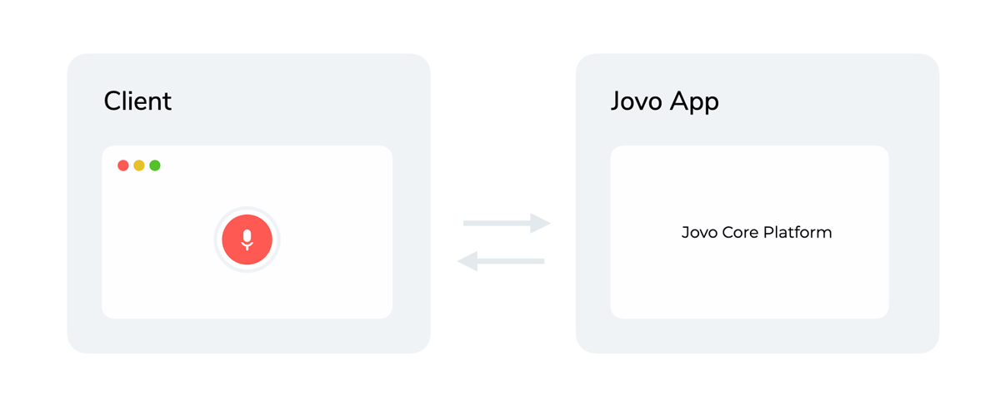

# Jovo Web Platform

> To view this page on the Jovo website, visit https://www.jovo.tech/marketplace/jovo-platform-web

Learn more about the Jovo Web Platform, which can be used to build fully customized voice and chat experiences that work in the browser.

- [Introduction](#introduction)
  - [How it works](#how-it-works)
  - [Installation](#installation)
- [Usage](#usage)
  - [Requests and Responses](#requests-and-responses)
  - [Adding Integrations](#adding-integrations)
  - [Responding with Actions](#responding-with-actions)
  - [Using the ActionBuilder](#using-the-actionbuilder)
  - [Showing Quick Replies](#showing-quick-replies)

## Introduction

Besides integrations with major platforms like [Alexa](https://www.jovo.tech/marketplace/jovo-platform-alexa), [Google Assistant](https://www.jovo.tech/marketplace/jovo-platform-googleassistant), or [Facebook Messenger](https://www.jovo.tech/marketplace/jovo-platform-facebookmessenger), Jovo also enables you to connect your own clients to build fully custom conversational experiences for both voice and chat.

The Jovo Web Platform helps you connect your Jovo app to various web frontends. You can check out one of these starter templates to get a first impression how it looks like:
* [Standalone Voice Experience](https://github.com/jovotech/jovo-starter-web-standalone)
* [Voice Overlay](https://github.com/jovotech/jovo-starter-web-overlay)
* [Chat Widget](https://github.com/jovotech/jovo-starter-web-chatwidget)
* [Embedded Chat](https://github.com/jovotech/jovo-starter-web-embeddedchat)


### How it works



The Jovo Web Platform can be connected to any web client (the "frontend" that records speech or text input and passes it to the Jovo app). You can either implement your own client or use existing [Jovo Clients](https://www.jovo.tech/marketplace/tag/clients).

The client sends a request to the Jovo app that may contain audio, text, or other input. The Jovo Core Platform then deals with this information and returns a response back to the client. [Learn more about the Core Platform request and response structures below](#requests-and-responses).

Depending on the client, it may be necessary to add integrations to the platform to convert the input to structured data:

* [Automatic Speech Recognition (ASR)](https://www.jovo.tech/marketplace/tag/asr) to turn spoken audio into transcribed text
* [Natural Language Understanding (NLU)](https://www.jovo.tech/marketplace/tag/nlu) to turn raw text into meaning

After these integrations are added, building a Jovo app for custom clients is similar to building for platforms like Alexa and Google Assistant. [Take a look at the Jovo Docs to learn more](https://www.jovo.tech/docs).


### Installation

Install the integration into your project directory:

```sh
$ npm install --save jovo-platform-web
```

Import the installed module, initialize and add it to the `app` object.

```javascript
// @language=javascript

// src/app.js

const { WebPlatform } = require('jovo-platform-web');

const webPlatform = new WebPlatform();

app.use(webPlatform);

// @language=typescript

// src/app.ts

import { WebPlatform } from 'jovo-platform-web';

const webPlatform = new WebPlatform();

app.use(webPlatform);
```


## Usage

You can access the `webApp` object like this:

```javascript
// @language=javascript
this.$webApp

// @language=typescript
this.$webApp!
```

The returned object will be an instance of `WebApp` if the current request is compatible with the Web Platform. Otherwise `undefined` will be returned.

### Requests and Responses

In a Jovo app, each interaction goes through a [request & response cycle](https://www.jovo.tech/docs/requests-responses), where the Jovo app receives the request from the client in a JSON format, [routes](https://www.jovo.tech/docs/routing) through the logic, and then assembles a response that is sent back to the client.

The request usually contains data like an audio file or raw text ([find all sample request JSONs here](https://github.com/jovotech/jovo-framework/tree/master/jovo-platforms/jovo-platform-web/sample-request-json/v1)):

```js
{
  "request": {
    "locale": "en-US",
    "timestamp": "2019-07-01T08:23:06.441Z"
  },
  "session": {
    "data": {
    },
    "id": "92dd969e-024a-4bd1-9aee-29d39daaa61f",
    "new": false
  },
  "user": {
    "id": "2f416861-94aa-424b-b9f2-ac5f83a36fa0",
    "data": {
    }
  },
  "$version": "1.0.0",
  "text": "my name is Max"
}
```

The response contains all the information that is needed by the client to display content ([find all sample response JSONs here](https://github.com/jovotech/jovo-framework/tree/master/jovo-platforms/jovo-platform-web/sample-response-json/v1)):

```js
{
   "version": "3.2.0",
   "actions": [
      {
         "plain": "Alright!",
         "ssml": "Alright!",
         "type": "SPEECH"
      }
   ],
   "reprompts": [],
   "user": {
      "data": {}
   },
   "session": {
      "data": {},
      "end": true
   },
   "context": {
      "request": {
         "nlu": {
            "intent": {
               "name": "None"
            }
         }
      }
   }
}
```


### Adding Integrations

Depending on how the client sends the data (e.g. just a raw audio file, or written text), it may be necessary to add [Automatic Speech Recognition (ASR)](https://www.jovo.tech/marketplace/tag/asr) or [Natural Language Understanding (NLU)](https://www.jovo.tech/marketplace/tag/nlu) integrations to the Jovo Web Platform.

Integrations can be added with the `use` method:

```javascript
const webPlatform = new webPlatform();

webPlatform.use(
	// Add integrations here
);

app.use(webPlatform);
```

The example below uses the [Jovo NLU integration for NLPjs](https://www.jovo.tech/marketplace/jovo-nlu-nlpjs) to turn raw text into structured meaning:

```javascript
// @language=javascript

// src/app.js
const { WebPlatform } = require('jovo-platform-web');
const { NlpjsNlu } = require('jovo-nlu-nlpjs');

const webPlatform = new WebPlatform();
webPlatform.use(new NlpjsNlu());

app.use(webPlatform);

// @language=typescript

// src/app.ts
import { WebPlatform } from 'jovo-platform-web';
import { NlpjsNlu } from 'jovo-nlu-nlpjs';

const webPlatform = new WebPlatform();
webPlatform.use(new NlpjsNlu());

app.use(webPlatform);
```


### Responding with Actions

The `output` object in the JSON response can contain both `speech` output and `actions`:

```javascript
"output": {
	"speech": {
		"text": "Sample response text"
	},
	"actions": [
		{
			"key": "name.set",
			"value": "Chris"
		}
	]
},
```

Actions are additional ways (beyond speech output) how the client can respond to the user. You can add or set Actions like this:

```javascript
// @language=javascript

// Add Actions and RepromptActions (multiple calls possible)
this.$webApp.addActions(this.$webApp.$actions);
this.$webApp.addRepromptActions(this.$webApp.$repromptActions);

// Set Actions and RepromptActions (overrides existing Actions)
this.$webApp.setActions(this.$webApp.$actions);
this.$webApp.setRepromptActions(this.$webApp.$repromptActions);

// @language=typescript

// Add Actions and RepromptActions (multiple calls possible)
this.$webApp?.addActions(this.$webApp?.$actions);
this.$webApp?.addRepromptActions(this.$webApp?.$repromptActions);

// Set Actions and RepromptActions (overrides existing Actions)
this.$webApp?.setActions(this.$webApp?.$actions);
this.$webApp?.setRepromptActions(this.$webApp?.$repromptActions);
```

> **INFO** The actions generated for the speech of `tell` and `ask` will NOT be overwritten.


There are several action types available:

* [SpeechAction](#speechaction)
* [AudioAction](#audioaction)
* [VisualAction](#visualaction)
* [ProcessingAction](#processingaction)
* [CustomAction](#customaction)

There are also containers that can be used to nest actions:

* [SequenceContainerAction](#sequencecontaineraction)
* [ParallelContainerAction](#parallelcontaineraction)


#### SpeechAction

The SpeechAction can be used to display text and synthesize text.

#### AudioAction

The AudioAction can be used to play an audio file.

#### VisualAction

The VisualAction can be used for visual output like cards.

#### ProcessingAction

The ProcessingAction can be used to display processing information.

#### CustomAction

The CustomAction can be used to send a custom payload that can be handled by the client.

#### SequenceContainerAction

The SequenceContainer can be used to nest actions. All actions inside this container will be processed after another.

#### ParallelContainerAction

The ParallelContainer can be used to nest actions. All actions inside this container will be processed simultaneously.


### Using the ActionBuilder

`WebApp` has the properties `$actions` and `$repromptActions`, which are instances of `ActionBuilder`.
The `ActionBuilder` is the recommended way of filling the output for the Web Platform.

Example Usage:

```javascript
// @language=javascript

this.$webApp.$actions.addSpeech({
	plain: 'text',
	ssml: '<s>text</s>'
});

// @language=typescript

this.$webApp?.$actions.addSpeech({
	plain: 'text',
	ssml: '<s>text</s>'
});
```

### Showing Quick Replies

```javascript
// @language=javascript

this.$webApp.showQuickReplies(['quickReply1', 'quickReply2']);

// @language=typescript

this.$webApp?.showQuickReplies(['quickReply1', 'quickReply2']);
```
