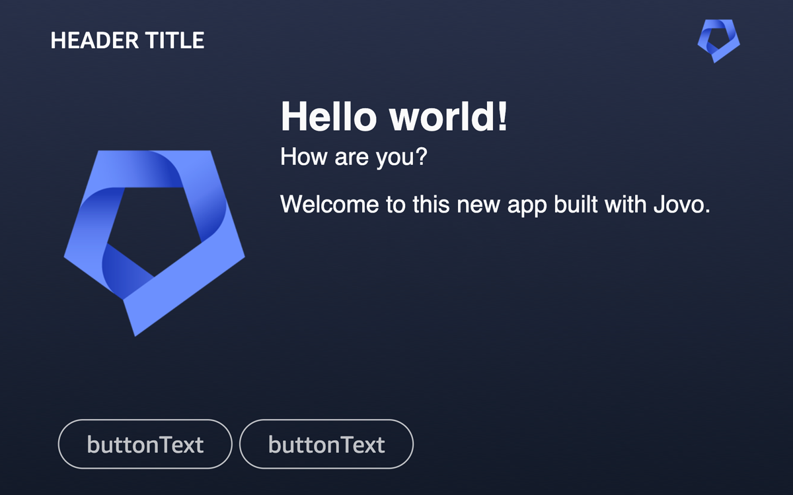
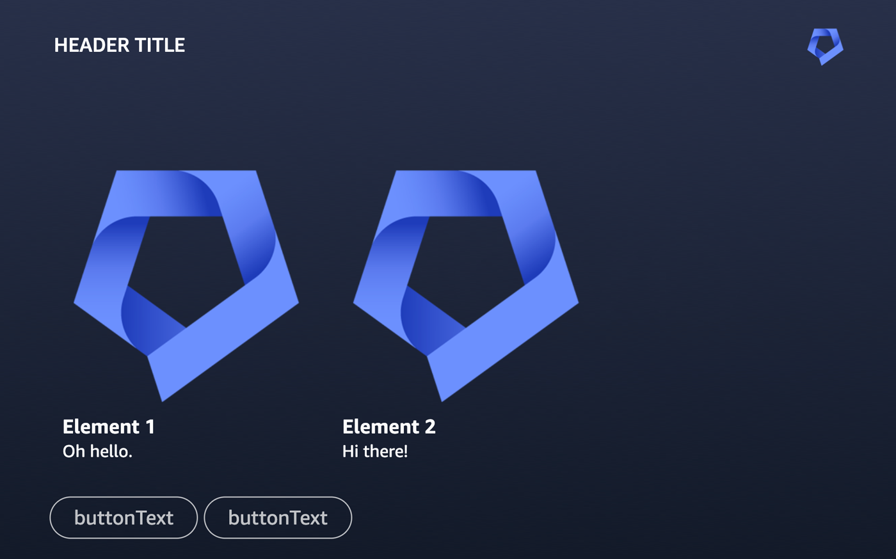

# Alexa Output

Learn more about output templates for [Alexa](https://www.jovo.tech/marketplace/platform-alexa).

## Introduction

Jovo offers the ability to [create structured output](https://www.jovo.tech/docs/output) that is then translated into native platform responses.

This structured output is called [output template](https://www.jovo.tech/docs/output-templates). Its root properties are generic output elements that work across platforms. [Learn more about how generic output is translated into an Alexa response below](#generic-output-elements).

```typescript
{
  message: `Hello world! What's your name?`,
  reprompt: 'Could you tell me your name?',
  listen: true,
}
```

You can also add platform-specific output to an output template. [Learn more about Alexa output below](#alexa-output-elements).

```typescript
{
  // ...
  platforms: {
    alexa: {
      // ...
    }
  }
}
```

## Generic Output Elements

Generic output elements are in the root of the output template and work across platforms. [Learn more in the Jovo Output docs](https://www.jovo.tech/docs/output-templates).

Below, you can find a list of generic output elements that work with Alexa:

- [`message`](#message)
- [`reprompt`](#reprompt)
- [`listen`](#listen)
- [`quickReplies`](#quickreplies)
- [`card`](#card)
- [`carousel`](#carousel)

### message

The [generic `message` element](https://www.jovo.tech/docs/output-templates#message) is what Alexa is saying to the user:

```typescript
{
  message: 'Hello world!',
}
```

Under the hood, Jovo translates the `message` into an `outputSpeech` object ([see the official Alexa docs](https://developer.amazon.com/en-US/docs/alexa/custom-skills/request-and-response-json-reference.html#outputspeech-object)):

```json
{
  "outputSpeech": {
    "type": "SSML",
    "ssml": "<speak>Hello world!</speak>"
  }
}
```

The `outputSpeech` response format is [limited to 8,000 characters](https://developer.amazon.com/docs/alexa/custom-skills/request-and-response-json-reference.html#response-format). By default, Jovo output trims the content of the `message` property to that length. Learn more in the [output sanitization documentation](https://www.jovo.tech/docs/output-config#sanitization).

### reprompt

The [generic `reprompt` element](https://www.jovo.tech/docs/output-templates#message) is used to ask again if the user does not respond to a prompt after a few seconds:

```typescript
{
  message: `Hello world! What's your name?`,
  reprompt: 'Could you tell me your name?',
}
```

Under the hood, Jovo translates the `reprompt` into an `outputSpeech` object ([see the official Alexa docs](https://developer.amazon.com/en-US/docs/alexa/custom-skills/request-and-response-json-reference.html#outputspeech-object)) inside `reprompt`:

```json
{
  "reprompt": {
    "outputSpeech": {
      "type": "SSML",
      "ssml": "<speak>Could you tell me your name?</speak>"
    }
  }
}
```

### listen

The [`listen` element](https://www.jovo.tech/docs/output-templates#listen) determines if Alexa should keep the microphone open and wait for a user's response.

By default (if you don't specify it otherwise in the template), `listen` is set to `true`. If you want to close a session after a response, you need to set it to `false`:

```typescript
{
  message: `Goodbye!`,
  listen: false,
}
```

Under the hood, Jovo translates `listen: false` to `"shouldEndSession": true` in the JSON response.

The `listen` element can also be used to add dynamic entities for Alexa. [Learn more in the `$entities` documentation](https://www.jovo.tech/docs/entities#dynamic-entities).

### quickReplies

Alexa does not natively support quick replies. However, when used together with a [`card`](#card) or [`carousel`](#carousel), Jovo automatically turns the [generic `quickReplies` element](https://www.jovo.tech/docs/output-templates#quickreplies) into buttons for APL:

```typescript
{
  // ...
  quickReplies: [
    {
      text: 'Button A',
      intent: 'ButtonAIntent',
    },
  ];
}
```

For this to work, you need to [enable APL](#apl-configuration) for your Alexa Skill project. Also, `genericOutputToApl` needs to be enabled in the [Alexa output configuration](#alexa-output-configuration), which is the default.

If a user taps on a button, a request of the type `Alexa.Presentation.APL.UserEvent` is sent to your app. You can learn more in the [official Alexa docs](https://developer.amazon.com/docs/alexa/alexa-presentation-language/apl-interface.html#userevent-request). To map this type of request to an intent (and optionally an [entity](https://www.jovo.tech/docs/entities)), you need to add the following to each quick reply item:

```typescript
{
  // ...
  quickReplies: [
    {
      text: 'Button A',
      intent: 'ButtonIntent',
      entities: {
        button: {
          value: 'a',
        },
      },
    },
  ];
}
```

This will add the `intent` and `entities` properties to the APL document as `arguments`.

```json
"arguments": [
  {
    "type": "QuickReply",
	  "intent": "ButtonIntent",
	  "entities": {
      "button": {
        "value": "a"
      }
    }
  }
]
```

These are then mapped correctly and added to the [`$input` object](https://www.jovo.tech/docs/input) when the user taps a button.

In your [handler](https://www.jovo.tech/docs/handlers), you can then access the entities like this:

```typescript
@Intents(['ButtonIntent'])
showSelectedButton() {
  const button = this.$entities.button.value;

  // ...
}
```

### card

Jovo automatically turns the [generic `card` element](https://www.jovo.tech/docs/output-templates#card) into a detail screen for [APL](#apl).



For example, the image above (screenshot from the testing tab in the Alexa Developer Console) is created by the following output template:

```typescript
{
  // ...
  card: {
    title: 'Hello world!',
    subtitle: 'How are you?',
    content: 'Welcome to this new app built with Jovo.',
    imageUrl: 'https://jovo-assets.s3.amazonaws.com/jovo-icon.png',

    // Alexa properties
    backgroundImageUrl: 'https://jovo-assets.s3.amazonaws.com/jovo-bg.png',
    header: {
      logo: 'https://jovo-assets.s3.amazonaws.com/jovo-icon.png',
      title: 'Header title',
    },
  },
}
```

Besides the [generic `card` properties](https://www.jovo.tech/docs/output-templates#card), you can add the following optional elements for Alexa:

- `backgroundImageUrl`: A link to a background image. This is used as `backgroundImageSource` for the [`AlexaBackground` APL property](https://developer.amazon.com/docs/alexa/alexa-presentation-language/apl-alexa-background-layout.html).
- `header`: Contains a `logo` image URL and a `title` to be displayed at the top bar of the APL screen. These are used as `headerAttributionImage` and `headerTitle` for the [`AlexaHeader` APL property](https://developer.amazon.com/docs/alexa/alexa-presentation-language/apl-alexa-header-layout.html).

You can also add buttons by using the [`quickReplies` property](#quickreplies).

For cards to work, you need to [enable APL](#apl-configuration) for your Alexa Skill project. Also, `genericOutputToApl` needs to be enabled in the [Alexa output configuration](#alexa-output-configuration), which is the default. You can also override the default APL template used for `card`:

```typescript
const app = new App({
  // ...

  plugins: [
    new AlexaPlatform({
      output: {
        aplTemplates: {
          card: CARD_APL, // Add imported document here
        },
      },
    }),
  ],
});
```

**Note**: If you want to send a home card to the Alexa mobile app instead, we recommend using the [`nativeResponse` property](#native-response).

### carousel

Alexa does not natively support carousels. However, Jovo automatically turns the [generic `carousel` element](https://www.jovo.tech/docs/output-templates#carousel) into a card slider for [APL](#apl).



For example, the image above (screenshot from the testing tab in the Alexa Developer Console) is created by the following output template:

```typescript
{
  // ...
  carousel: {
    items: [
      {
        title: 'Element 1',
        content: 'Oh hello.',
        imageUrl: 'https://jovo-assets.s3.amazonaws.com/jovo-icon.png',
      },
      {
        title: 'Element 2',
        content: 'Hi there!',
        imageUrl: 'https://jovo-assets.s3.amazonaws.com/jovo-icon.png',
      },
    ],

    // Alexa properties
    backgroundImageUrl: 'https://jovo-assets.s3.amazonaws.com/jovo-bg.png',
    header: {
      logo: 'https://jovo-assets.s3.amazonaws.com/jovo-icon.png',
      title: 'Header title',
    },
  },
}
```

Besides the [generic `carousel` properties](https://www.jovo.tech/docs/output-templates#carousel), you can add the following optional elements for Alexa:

- `backgroundImageUrl`: A link to a background image. This is used as `backgroundImageSource` for the [`AlexaBackground` APL property](https://developer.amazon.com/docs/alexa/alexa-presentation-language/apl-alexa-background-layout.html).
- `header`: Contains a `logo` image URL and a `title` to be displayed at the top bar of the APL screen. These are used as `headerAttributionImage` and `headerTitle` for the [`AlexaHeader` APL property](https://developer.amazon.com/docs/alexa/alexa-presentation-language/apl-alexa-header-layout.html).

You can also add buttons by using the [`quickReplies` property](#quickreplies).

For the `carousel` to work, you need to [enable APL](#apl-configuration) for your Alexa Skill project. Also, `genericOutputToApl` needs to be enabled in the [Alexa output configuration](#alexa-output-configuration), which is the default. You can also override the default APL template used for `carousel`:

```typescript
const app = new App({
  // ...

  plugins: [
    new AlexaPlatform({
      output: {
        aplTemplates: {
          carousel: CAROUSEL_APL, // Add imported document here
        },
      },
    }),
  ],
});
```

You can make the carousel clickable by adding a `selection` object. Once an element is selected by the user, a request of the type `Alexa.Presentation.APL.UserEvent` is sent to your app. You can learn more in the [official Alexa docs](https://developer.amazon.com/docs/alexa/alexa-presentation-language/apl-interface.html#userevent-request). To map this type of request to an intent (and optionally an [entity](https://www.jovo.tech/docs/entities)), you need to add the following to each carousel item:

```typescript
{
  // ...
  carousel: {
    items: [
      {
        title: 'Element A',
        content: 'To my right, you will see element B.',
        selection: {
          intent: 'ElementIntent',
          entities: {
            element: {
              value: 'A',
            },
          },
        },
      },
      {
        title: 'Element B',
        content: 'Hi there!',
        selection: {
          intent: 'ElementIntent',
          entities: {
            element: {
              value: 'B',
            },
          },
        },
      }
    ]
  },
}
```

This will add the `intent` and `entities` properties to the APL document as `arguments`.

```json
"arguments": [
  {
    "type": "Selection",
	  "intent": "ElementIntent",
	  "entities": {
      "element": {
        "value": "A"
      }
    }
  }
]
```

These are then mapped correctly and added to the [`$input` object](https://www.jovo.tech/docs/input) when the user taps a button. In the example above, a tap on an element triggers the `ElementIntent` and contains an entity of the name `element`.

In your [handler](https://www.jovo.tech/docs/handlers), you can then access the entities like this:

```typescript
@Intents(['ElementIntent'])
showSelectedElement() {
  const element = this.$entities.element.value;

  // ...
}
```

## Alexa Output Elements

It is possible to add platform-specific output elements to an output template. [Learn more in the Jovo output documentation](https://www.jovo.tech/docs/output-templates#platform-specific-output-elements).

For Alexa, you can add output elements inside an `alexa` object:

```typescript
{
  // ...
  platforms: {
    alexa: {
      // ...
    }
  }
}
```

### Native Response

The [`nativeResponse` property](https://www.jovo.tech/docs/output-templates#native-response) allows you to add native elements exactly how they would be added to the Alexa JSON response.

```typescript
{
  // ...
  platforms: {
    alexa: {
      nativeResponse: {
        // ...
      }
    }
  }
}
```

For example, an [APL](#apl) RenderDocument directive ([see official Alexa docs](https://developer.amazon.com/en-US/docs/alexa/alexa-presentation-language/apl-interface.html#renderdocument-directive)) could be added like this:

```typescript
{
  // ...
  platforms: {
    alexa: {
      nativeResponse: {
        response: {
          directives: [
            {
              type: 'Alexa.Presentation.APL.RenderDocument',
              token: '<some-token>',
              document: {
                /* ... */
              },
              datasources: {
                /* ... */
              },
            },
          ];
        }
      }
    }
  }
}
```

Learn more about the [response format in the official Alexa documentation](https://developer.amazon.com/en-US/docs/alexa/custom-skills/request-and-response-json-reference.html#response-format).

### APL

The Alexa Presentation Language (APL) allows you to add visual content and audio (using APLA) to your Alexa Skill. Learn more in the [official Alexa docs](https://developer.amazon.com/docs/alexa/alexa-presentation-language/add-visuals-and-audio-to-your-skill.html).

You can add an APL RenderDocument directive ([see official Alexa docs](https://developer.amazon.com/en-US/docs/alexa/alexa-presentation-language/apl-interface.html#renderdocument-directive)) to your response by using the [`nativeResponse` property](#native-response), for example:

```typescript
{
  // ...
  platforms: {
    alexa: {
      nativeResponse: {
        response: {
          directives: [
            {
              type: 'Alexa.Presentation.APL.RenderDocument',
              token: '<some-token>',
              document: {
                /* ... */
              },
              datasources: {
                /* ... */
              },
            },
          ];
        }
      }
    }
  }
}
```

Learn more about APL in the following sections:

- [APL Configuration](#apl-configuration): How to enable APL for your Alexa Skill
- [APL User Events](#apl-user-events): How to respond to APL touch input

Jovo also supports the ability to turn output elements into APL templates. Learn more in the sections above:

- [`card`](#card) is turned into a detail page
- [`carousel`](#carousel) is turned into a card slider

#### APL Configuration

To support APL, you need to enable the `ALEXA_PRESENTATION_APL` interface for your Alexa Skill. You can do so in the Alexa Developer Console, however, we recommend using the Jovo CLI and adding the interface to your the [Alexa project configuration](./project-config.md) using the [`files` property](project-config.md#files):

```js
new AlexaCli({
  files: {
    'skill-package/skill.json': {
      manifest: {
        apis: {
          custom: {
            interfaces: [
              {
                type: 'ALEXA_PRESENTATION_APL',
                supportedViewports: [
                  {
                    mode: 'HUB',
                    shape: 'RECTANGLE',
                    minHeight: 600,
                    maxHeight: 1279,
                    minWidth: 1280,
                    maxWidth: 1920,
                  },
                  // ...
                ],
              },
            ],
          },
        },
      },
    },
  },
  // ...
});
```

You can find all [supported APL viewports in the official Alexa docs](https://developer.amazon.com/docs/alexa/alexa-presentation-language/apl-select-the-viewport-profiles-your-skill-supports.html#configure-the-supported-viewports-with-the-ask-cli-or-smapi).

This adds the interface to your `skill.json` manifest during the build process. To update your Skill project, you can follow these steps:

```sh
# Build Alexa project files
$ jovo build:platform alexa

# Deploy the files to the Alexa Developer Console
$ jovo deploy:platform alexa
```

[Learn more about Alexa CLI commands here](./cli-commands.md).

#### APL User Events

APL also supports touch input for buttons or list selections. If a user taps on an element like this, a request of the type `Alexa.Presentation.APL.UserEvent` is sent to your app. You can learn more in the [official Alexa docs](https://developer.amazon.com/docs/alexa/alexa-presentation-language/apl-interface.html#userevent-request).

Similar to how it works with [quick replies](#quickreplies) and [carousel items](#carousel), you can add the following as `arguments` to your APL document:

- `type`: Can be `Selection` or `QuickReply`. Required.
- `intent`: The intent name the user input should get mapped to. Required.
- `entities`: The [entities](https://www.jovo.tech/docs/entities) (slots) that should be added to the user input. Optional.

```json
"arguments": [
  {
    "type": "Selection",
	  "intent": "ElementIntent",
	  "entities": {
      "element": {
        "value": "A"
      }
    }
  }
]
```

When a user selects that element, the `intent` and `entities` get added to the [`$input` object](https://www.jovo.tech/docs/input). This way, you can deal with APL user events in your handlers the same way as with typical intent requests.

In your [handler](https://www.jovo.tech/docs/handlers), you can then access the entities like this:

```typescript
@Intents(['ElementIntent'])
showSelectedElement() {
  const element = this.$entities.element.value;

  // ...
}
```

## Alexa Output Configuration

This is the default output configuration for Alexa:

```typescript
const app = new App({
  // ...

  plugins: [
    new AlexaPlatform({
      output: {
        genericOutputToApl: true,
        aplTemplates: {
          carousel: CAROUSEL_APL
          card: CARD_APL
        },
      },
    }),
  ],
});
```

It includes the following properties:

- `genericOutputToApl`: Determines if generic output like [`quickReplies`](#quickreplies), [`card`](#card), and [`carousel`](#carousel) should automatically be converted into an APL directive.
- `aplTemplates`: Allows the app to override the default APL templates used for [`carousel`](#carousel) and [`card`](#card).

## Alexa Output Classes

The Alexa integration also offers a variety of convenience [output classes](https://www.jovo.tech/docs/output-classes) that help you return use case specific responses, for example to request permissions from the user. [You can find all output classes here](https://github.com/jovotech/jovo-framework/tree/v4/latest/platforms/platform-alexa/src/output/templates).

You can import any of the classes and then use them with the `$send()` method, for example:

```typescript
import { AskForPermissionOutput } from '@jovotech/platform-alexa';
// ...

someHandler() {
  // ...

  return this.$send(AskForPermissionOutput, { /* options */ });
}
```

### Progressive Responses

Alexa offers the ability to send [progressive responses](https://developer.amazon.com/docs/alexa/custom-skills/send-the-user-a-progressive-response.html), which means you can send an initial response while preparing the final response. This is helpful in cases where you have data intensive tasks (like API calls) and want to give the user a heads up.

To send a progressive response, you can use a convenience output class called [`ProgressiveResponseOutput`](https://github.com/jovotech/jovo-framework/tree/v4/latest/platforms/platform-alexa/src/output/templates/ProgressiveResponseOutput.ts):

```typescript
import { ProgressiveResponseOutput } from '@jovotech/platform-alexa';
// ...

async yourHandler() {
  await this.$send(ProgressiveResponseOutput, { speech: 'Alright, one second.' });

  // ...

  return this.$send('Done');
}
```
