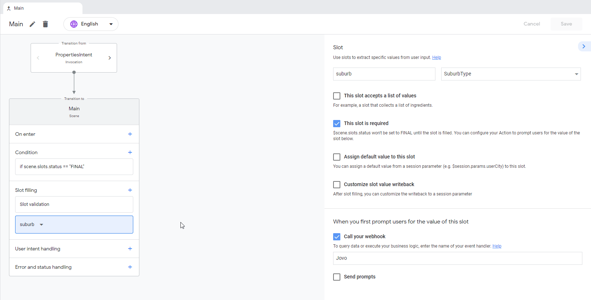

# Google Assistant Platform Integration

## Platform-Specific Features

### Output

#### Carousel

Jovo automatically turns the `carousel` object into a [Collection](https://developers.google.com/assistant/conversational/prompts-selection#collection).
For this to work, `selection` as well as its properties `entityType` and `intent` have to be set in the carousel:

```typescript
const obj = {
  // ...
  carousel: {
    items: [
      {
        title: 'Element 1',
        content: 'To my right, you will see element 2.',
      },
      {
        title: 'Element 2',
        content: 'Hi there!',
      },
    ],
    selection: {
      intent: 'IntentToMatchOnSelection',
      entityType: 'SomeEntityType',
    },
  },
};
```

Additionally, a scene with slot filling has to be created. Here is an example how such a scene could look like:




> In this example any global intent transitions to the Main-scene.

It is important that `selection.entityType` is the same value as declared in the slot of the scene, which is `SuburbType` in this example.
